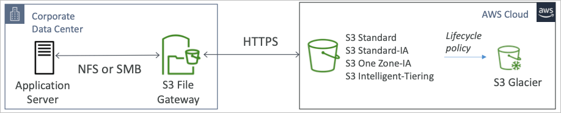

# Advanced Storage

## AWS Snow Family

- AWS 내외부로의 마이그레이션을 위한 데이터 수집 및 프로세싱 능력을 가진 높은 보안성을 지닌 이동형 디바이스

### 데이터 마이그레이션

- Snowcone
- Snowball Edge
- Snow Mobile

### 엣지 컴퓨팅

- Snowcone
- Snowball Edge

## Snow Family를 이용한 데이터 마이그레이션

- 데이터 마이그레이션의 난점 (데이터 용량이 거대하면 할수록)
  - 제한된 접속시간
  - 제한된 대역폭
  - 네트워크에 소진되는 비용
  - 대역폭을 공유하기 때문에 최대의 효율을 낼 수 없음
  - 접속 안정성이 의문
- 스노우 패밀리는 오프라인 디바이스를 직접 보내주기 때문에, 직접 접속형태의 네트워크를 이용할 수 있음

## 다이어그램

### 일반적인 구성

### 스노우 패밀리

## Snowball Edge (data transfer)

- 물리적 데이터 이동 수단
  - TB, PB단위의 데이터를 AWS 내외부로 이동할 때 사용
- 네트워크를 통한 이동 시 비용 문제를 해결하기 위해 사용
- 과금 단위는 이 데이터 저장소를 이동하고 작업하는데 드는 비용단위로 처리됨
- 블록 스토리지로 S3과 호환되는 오브젝트 스토리지로 이루어져 있음
- Snowball Edge Storage 최적화 모델
  - 80TB의 HDD 용량으로 S3과 호환됨
- Snowball Edge Compute 최적화 모델
  - 42TB의 HDD 용량으로 S3과 호환됨
- 사용 사례
  - 대규모 데이터 마이그레이션, DR 등

## Snowcone

- 보다 작은 컴퓨팅 지원 모바일 장치
- 가벼움 (2.1kg)
- 엣지컴퓨팅, 데이터 마이그레이션 용도
- 8TB의 스토리지 지원
- 스노우볼을 운반하기 어려운 상황에 사용될 수 있음 (크기 문제)
- 배터리와 케이블을 직접 연결할 수 있음
- AWS로 오프라인 배송을 해도 되고, 직접 인터넷 연결을 하여 AWS DataSync로 동기화도 가능

## Snowmobile

- 엑사바이트 단위의 데이터 이동 수단 (1EB = 1000PB = 1000000TB)
- 하나의 스노우모빌이 100PB의 용량을 가지고 있음 (동시에 여러대도 연결 가능)
- 보안성
  - 온도 조절
  - GPS
  - 24/7 보안감시 카메라 등
- 10PB 이상의 데이터를 이동하려면 스노우볼보다는 스노우모빌이 더 좋은 선택지가 될 수 있음

## 스노우 패밀리 정리

## 스노우볼 이용 순서

1. 스노우볼 요청 (AWS 콘솔)
2. 스노우볼이 배송되면 스노우볼 클라이언트를 설치
3. 클라이언트를 이용해서 서버에서 데이터 수집
4. AWS로 스노우볼 반송
5. S3 버킷에 데이터가 저장됨
6. 스노우볼에 저장되어 있던 컨텐츠 영구삭제

## 엣지 컴퓨팅이란?

- 엣지 로케이션에서의 데이터 처리에 대한 전반적인 사항들
  - 길가에 트럭이나 해상 선박, 광산 채굴처 등이 엣지 로케이션

- 이러한 장소에서는
  - 인터넷 엑세스 불가능
  - 컴퓨팅 자원에 접근이 힘듬
- 그러한 곳에 스노우볼 엣지 스노우콘등을 이용하여 엣지 컴퓨팅을 실현 가능
- 사용 사례
  - 데이터 선처리
  - 머신 러닝
  - 미디어 스트림의 변환
- 결국 이러한 처리된 데이터는 AWS로 반환되어 보존될 필요가 있음

## 스노우 패밀리 엣지 컴퓨팅

- 스노우콘
  - 2 CPU, 4GB memory
  - 유무선 대응
  - USB-C 파워 공급
- 스노우볼 엣지 (컴퓨팅 최적화)
  - 52 vCPU, 208 GiB 메모리
  - GPU 옵션 (비디오 처리나 머신 러닝)
  - 42TB 가용 용량
- 스노우볼 엣지 (스토리지 최적화)
  - 40 vCPU, 80GiB 메모리
  - 오브젝트 스토리지 클러스터링
- EC2 인스턴스 기동 가능 AWS 람다 함수 실행 가능 (AWS IoT Greengrass)
- 장기 임대 가능 (1~3년 할인 모델)

## OpsHub

- 이전에는 스노우볼을 조작하기 위해 CLI가 제공되었음
- 최근에는 OpsHub를 지원하는데, 이는 노트북 등에 설치해서 스노우 패밀리와 연결하여 GUI 환경에서 AWS를 조작하듯 스노우 패밀리를 컨트롤 할 수 있는 대시보드를 제공하는 것
- 장치 모니터링
- EC2 등의 설치나 NFS 관리 등 다양한 컨트롤러 제공

## 스노우볼 to S3 글래시어

- 스노우볼에 담은 데이터는 글래시어로 바로 import 할 수 없음
- S3을 거쳐서 lifecycle policy를 통해 글래시어로 전환해야 함

## Amazon FSx 개요

- 서드파티 고성능 파일 시스템을 AWS에서 구현
- 완전 관리형 서비스

## FSx for Windows (File Server)

- 윈도우용 FSx는 완전 관리형 윈도우 파일 공유 서비스
- SMB와 윈도우 NTFS를 제공
- Microsoft Active Directory와 연계되며, ACL과 유저 quota 관리 가능
- 리눅스 EC2 인스턴스에도 마운트 가능
- Microsoft 분산 파일 시스템 (DFS) 네임스페이스를 지원 (다수의 FS를 하나의 파일서버로 묶는 것)
- 몇십 GB/s로 자동 스케일, 수백만 IOPS, PB단위의 데이터까지 증가
- 스토리지 옵션
  - SSD 지연속도에 민감한 워크로드 (데이터베이스, 미디어 프로세싱, 데이터 분석 등)
  - HDD 저렴한 사용요금을 목표로 한 일반적인 워크로드 (홈 디렉토리, CMS 등)
- 온프레미스 인프라에서도 VPN이나 다이렉트 커넥트를 통해 접근 가능
- Multi-AZ 구성 가능
- S3에 데일리 백업 지원

## FSx for Lustre

- 러스터는 대규모 스케일 컴퓨팅을 위한 병렬 파일 시스템
- 러스터의 명칭은 Linux Cluster의 약어
- 사용 사례
  - 머신 러닝 (HPC) High Performance Computing
  - 비디오 처리, 파이낸셜 모델링, 전기 디자인 자동화
- 100s GB/s, 백만 IOPS, 수밀리초 지연속도
- 스토리지 옵션
  - SSD 저지연 IOPS 민감 워크로드, 랜덤 파일 쓰기 작업
  - HDD 처리량에 민감한 워크로드 큰 파일, 순차 파일 쓰기 작업
- S3과 유연하게 연동
  - S3을 파일 시스템으로 읽어들일 수 있음
  - S3에 파일 쓰기 가능
- 온프레미스에서 VPN이나 다이렉트 커넥트를 이용하여 접속 가능

## FSx Lustre 파일시스템 배포 옵션

- 스크래치 파일 시스템
  - 임시 스토리지
  - 데이터가 복제되지 않음 (서버 실패시 복구 불가)
  - 고성능 (6x faster 200Mbps per TB)
  - 짧은 처리, 비용 최적화
- 영속적 파일 시스템
  - 장기 보존 스토리지
  - 데이터는 같은 AZ에서 복제됨
  - 실패시 파일 바로 교체 (1분 이내)
  - 장기적 처리 프로세스, 민감한 데이터 (복구가능)

## FSx for NetApp ONTAP

- NetApp ONTAP을 AWS에서 구현
- NFS SMB iSCSI 프로토콜을 지원 (거의 모두)
- ONTAP 또는 NAS를 AWS환경으로 이전 가능
- 호환성
  - Linux
  - Windows
  - MacOS
  - VMWare Cloud
  - Amazon Workspace & App Stream 2.0
  - Amazon EC2, ECS and EKS
- 스토리지는 프로비전형이 아닌 자동으로 스케일됨
- 스냅샷, 복제, 저비용, 압축 및 중복제거 기능
- 특정 시간에 있던 파일들을 클론 가능 (테스트 환경 구축 등에 유용)

## FSx for OpenZFS

- 관리형 OpenZFS 시스템을 AWS에서 구현
- NFS의 다양한 프로토콜과 호환 가능
- 호환성
  - Linux
  - Windows
  - MacOS
  - VMWare Cloud
  - Amazon Workspace & AppStream 2.0
  - Amazon EC2, ECS and EKS
- 0.5ms 안에 백만 IOPS까지 스케일링
- 스냅샷, 압축 및 저비용
- 특정 시간에 있던 파일들 클론 기능 (테스트 환경 구축 등)

## Hybrid Cloud for Storage

- AWS는 하이브리드 클라우드를 밀고 있음
  - 클라우드에 존재하는 일부 인프라
  - 온프레미스에 존재하는 일부 인프라
  - 서로간의 결합
- 이러한 이유로서
  - 장기간의 클라우드로의 마이그레이션
  - 보안 요구사항
  - 컴플라이언스 요구사항
  - IT 전략 등이 있을 수 있음
- S3은 스토리지로서 훌륭한 대체제가 되지만 이를 어떻게 온프레미스상에 노출시킬 수 있을까
  - AWS Storage Gateway

## Storage Cloud Native Options

## AWS Storage Gateway

- 온프레미스 데이터와 클라우드 데이터 간의 다리역할
- 사용 사례
  - DR (장애복구)
  - 백업과 복원
  - 계층 스토리지 (온프레미스는 핫데이터, 클라우드는 콜드데이터)
  - 온프레미스 데이터의 캐시, 저지연 파일 엑세스
- 스토리지 게이트웨이 타입
  - S3 File Gateway
  - FSx File Gateway
  - Volume Gateway
  - Tape Gateway

## S3 File Gateway

- S3 버킷을 NFS 혹은 SMB 프로토콜로 접속 할 수 있게 지원
- 최근에 이용한 데이터가 파일 게이트웨이에 캐시로서 남음
- S3 스탠다드, IA, One Zone IA, Intelligent Tiering을 지원
- S3 글래시어로의 이관은 lifecycle policy를 이용하여 도입 가능
- 각각의 파일 게이트웨이마다 IAM 역할을 통한 권한제어 가능
- SMB 프로토콜은 AD와 연계하여 유저 인증 가능

## FSx File Gateway

- FSx 윈도우 파일 서버와의 네이티브 엑세스를 제공
- 이미 FSx 파일 서버에는 온프레미스에서 접속 가능
  - 자주 사용하는 파일들을 로컬 캐시로 사용하여 퍼포먼스 상승 효과
- 윈도우 네이티브 호환성 (SMB, NTFS, AD 등)
- 그룹 파일 공유와 홈 디렉토리 등으로 활용하기에 좋음

## Volume Gateway

- iSCSI 프로토콜을 사용하는 블록 스토리지로, 백엔드가 S3로 구성됨
- EBS 스냅샷으로 블록이 백업되며 온프레미스 볼륨으로 복원 가능
- 캐시 볼륨
  - 볼륨을 캐시로 사용하여 빠르게 엑세스 할 수 있도록 함
- 저장 볼륨
  - 모든 데이터셋을 온프레미스에 두고 S3을 백업으로 둠

## Tape Gateway

- 테이프에 저장하는 백업 프로세스를 가진 회사의 경우
- 테이프 게이트웨이를 이용하면 기존 방식 그대로 하면서 S3에 백업을 둘 수 있음 (테이프 머신과 연동)
- Virtual Tape Library(VTL)이 백엔드로 S3과 글래시어에서 제공되기 때문임
- 기존 테이프 벤더들과의 호환성

## Storage Gateway 지원 하드웨어

- 스토리지 게이트웨이를 이용하기 위한 온프레미스 하드웨어가 필요
- 지원되는 벤더의 모델이 있다면 사용해도 되고, 필요하다면 아마존에서 구입도 가능
- 파일 게이트웨이, 볼륨 게이트웨이, 테이프 게이트웨이와 연계됨
- 게이트웨이 작업을 수행하기에 필요한 CPU, 메모리, 기타 사양들이 갖추어져 있음
- 작은 양의 NFS 백업 정도는 자체 지원도 가능

## Storage Gateway 정리

## AWS Transfer Family

- 완전 관리형 서비스로 S3나 EFS에 FTP 프로토콜로 접속하여 이용할 수 있게 해줌
- 지원되는 프로토콜
  - FTP
  - FTPS
  - SFTP
- 관리형 인프라로 확장, 안정성, 고가용성 (Multi-AZ)
- 엔드포인트에 접속된 프로비전 시간당 과금 + 데이터 전송 GB당 과금
- 유저의 크레덴셜을 서비스 내에서 관리할 수 있음
- 다른 인증 서비스들과의 연계 또한 지원 (AD, LDAP, Okta, Cognito 등)
- 사용 사례
  - 파일 공유
  - 퍼블릭 데이터셋
  - CRM, ERP 등

## AWS DataSync

- 대량의 데이터를
  - 온프레미스 / 다른 클라우드에서 AWS로 이동 (NFS, SMB, HDFS, S3 API 등) → 에이전트 필요
  - AWS에서 다른 AWS 스토리지 타입으로 → 에이전트 불필요
- 동기화 가능
  - S3 (스토리지 클래스별 - 글래시어 포함)
  - EFS
  - FSx (Windows, Lustre, NetApp, OpenZFS 등)
- 복제 작업은 범위 시간당, 일당, 주당으로 설정 가능
- 파일 퍼미션과 메타데이터가 그대로 복사됨 (NFS POSIX, SMB 등)
- 에이전트는 최대 10 Gbps의 대역폭을 소화할 수 있지만, 설정으로 제한 가능

## NFS / SMB to AWS (S3, EFS, FSx)

## AWS 서비스 내에 데이터 이동

## 스토리지 비교

- S3
  - 오브젝트 스토리지
- S3 Glacier
  - 오브젝트 아카이빙
- EBS volume
  - 하나의 EC2 인스턴스에서 사용 가능한 네트워크 스토리지 (io1/io2는 멀티 어태치 가능)
- Instance Storage
  - 물리적 스토리지로 EC2에서 사용 가능 (고성능 IOPS)
- EFS
  - Linux 인스턴스 전용으로 POSIX 파일시스템으로 운영됨
- FSx for Windows
  - 윈도우 서버를 위한 네트워크 파일 시스템
- FSx for Lustre
  - 고성능의 컴퓨팅 리눅스 파일 시스템
- FSx for NetApp ONTAP
  - 높은 OS 호환성을 가진 파일 시스템
- FSx for OpenZFS
  - 관리형 ZFS 파일 시스템
- Storage Gateway
  - S3, FSx File Gateway, Volume Gateway (cached & stored), Tape Gateway
- Transfer Family
  - FTP, FTPS, SFTP, 인터페이스를 통해 S3 혹은 EFS에 직접 접속 가능함
- DataSync
  - 스케줄 관리로 AWS와 온프레미스간 데이터 동기화, AWS 서비스 내의 데이터 동기화 (메타데이터 동기화)
- Snowcone / Snowball / Snowmobile
  - 데이터를 클라우드 내 외부로 물리적 디바이스를 통해 이동
  - 엣지 컴퓨팅 실현
- Database
  - 쿼리와 인덱싱을 이용한 특정 워크로드에서 전용으로 사용하는 데이터 관리 시스템
