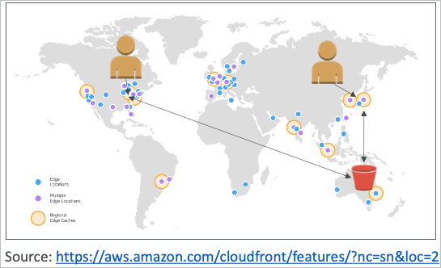
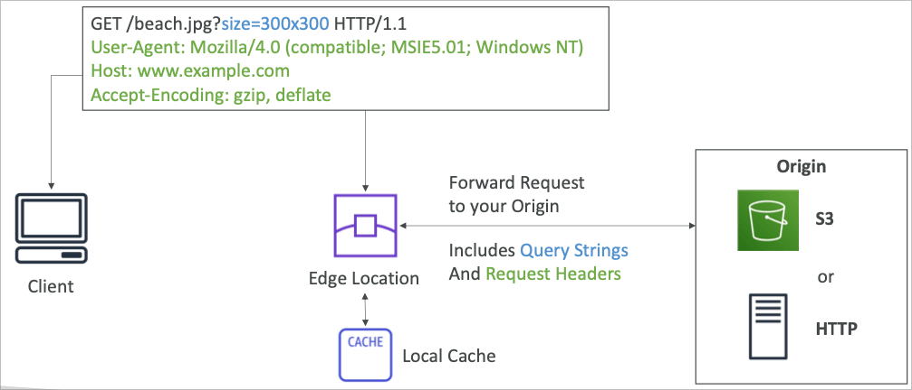
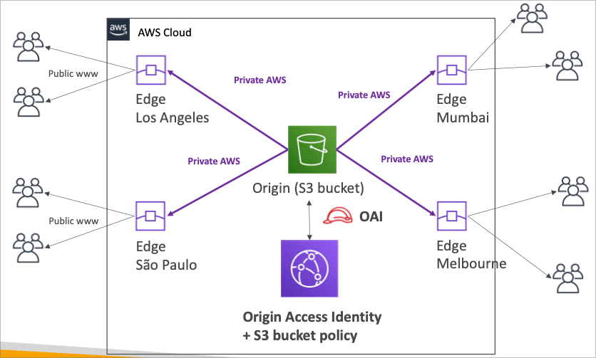
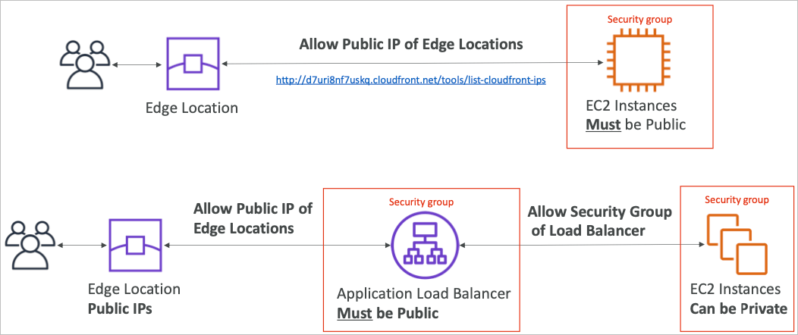
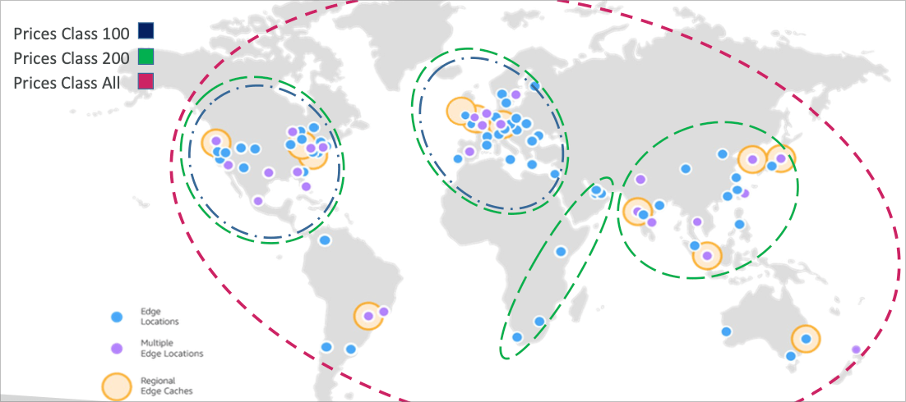
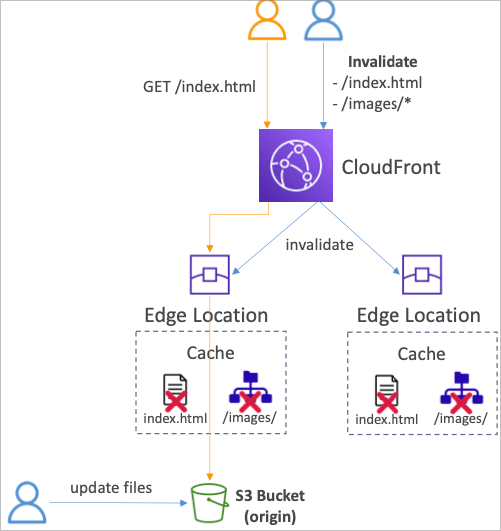
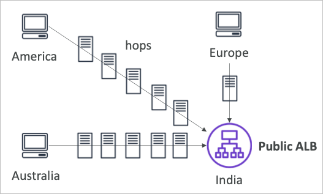
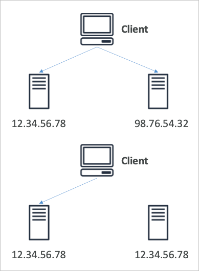
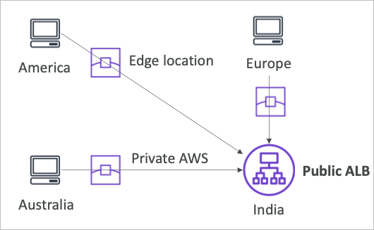

# CloudFront

- 컨텐츠 딜리버리 네트워크 (CDN)
- 엣지서버 캐싱을 통해 컨텐츠의 읽기 퍼포먼스의 향상
- 엣지 로케이션은 전 세계 216개 (증가중) 존재
- DDoS 방어, AWS Shield와의 연계, WAF와의 연계 가능

## Origin

- S3 버킷
  - 파일을 배포하고 엣지 로케이션에 캐싱하는 용도
  - OAI를 통한 보안 강화 가능 (Origin Access Identity)
  - CloudFront는 파일 업로드용으로 사용 가능 (Ingress)
- 커스텀 오리진 (HTTP)
  - 어플리케이션 로드 밸런서
  - EC2 인스턴스
  - S3 웹사이트 (static s3 웹사이트 호스팅이 먼저 활성화 되어 있어야 함)
  - HTTP 백엔드 사이트

## CloudFront 도식

### S3를 Origin으로 이용

### ALB 또는 EC2를 Origin으로 이용

## Geo Restriction

- 클라우드프론트에 배포된 컨텐츠에 제한을 설정 가능
  - 화이트리스트
    - 허가된 국가등을 지정하고 그 외에서는 접근 불가하게 하는 방식
  - 블랙리스트
    - 특정 국가를 차단하고 그 외에서는 접근 허용하는 방식
- 국가에 대한 기준은 서드파티 지오 데이터베이스를 참조하고 있음
- 저작권 등의 국제 법률에 의거한 국가 차단 등

## CloudFront vs S3 Cross Region Replication

- S3 크로스 리전 복제와 클라우드프론트와의 차이점
- 클라우드프론트
  - 글로벌 엣지 로케이션
  - TTL을 정하고 파일이 캐시됨
  - 정적 컨텐츠를 서비스하는데 특화되어 있음
- S3 크로스 리전 복제
  - 각각의 리전마다 수동으로 설정이 필요함
  - 파일은 실시간에 근접하게 복제되지만 완벽히 실시간은 아님
  - 읽기 전용
  - 특정 일부 리전에서 저지연의 동적 컨텐츠에 대한 허가의 경우 유용

## Price Classes

- 클라우드프론트는 각 엣지로케이션에서의 egress 트래픽에 대해 과금금액이 다름
- 엣지로케이션의 지역을 제한하는 것으로 트래픽이 비싼 엣지로케이션을 제외할 수 있고, 이는 비용 절감에 도움이 됨

## Cache Invalidations

- 클라우드프론트는 백엔드 오리진에 캐시를 저장해놓고 TTL동안 접속하는 유저들에게 캐시된 내용을 보여줌
- TTL동안 원본이 업데이트 되어도 해당 기간동안 만료된 자료가 보일 수 있음
- 이를 해결하기 위해 TTL이 남아있어도 캐시를 강제로 무효화 할수 있음
- 모든 캐시파일을 “_”로 지정해서 무효화하거나 특정 경로를 지정할 수도 있음 “/images/_”

## Global users application

- 특정 리전 ALB에서 운영중인 서비스를 글로벌하게 엑세스 할 경우
  - 다른 리전에 있는 유저에게는 퍼블릭 인터넷(라우터)을 몇차례 경우하기 때문에 퍼포먼스 저하가 필연적임
- 이를 해결하기 위해 AWS의 엣지로케이션을 이용하여 글로벌 엑셀러레이터를 출시

### Unicast IP vs Anycast IP

- Unicast IP
  - 종래의 시스템으로 하나의 시스템에 하나의 IP를 부여 하는 것
- Anycast IP
  - 같은 IP를 가진 복수의 시스템이 존재하고, 클라이언트는 hop이 적은 쪽으로 트래픽이 라우팅됨

## Global Accelerator

- 글로벌 엑셀러레이터는 애니캐스트 IP의 특징을 이용한 서비스로, 복수의 엣지 로케이션에 동일한 퍼블릭 IP를 Anycast IP로 부여하는 것이 주된 기술적 특징임
- 글로벌 엑세스의 트래픽이 최단경로의 엣지 로케이션으로 라우팅되면 이 트래픽은 AWS의 프라이빗 네트워크를 통해 원본 리전의 서비스에 도착하여 호스팅됨

- 글로벌 엑셀러레이터를 사용할 수 있는 서비스는 EIP, EC2, ALB, NLB, 퍼블릭과 프라이빗 관계 없이 이용 가능
- 안정적인 퍼포먼스
  - 지능적 라우팅을 이용 저지연과 고속 리전간 통신을 지원함
  - 캐시 문제가 없음 (엣지로케이션을 이용하지만 어디까지나 원본에서 서비스되는 형태임)
  - AWS 내부망을 이용하여 원본까지 트래픽이 전달됨
- 동작 감시
  - 어플리케이션에 대한 동작감시를 지원
  - 이를 통해 서비스에 대한 실패를 감지하고 failover를 할 수 있도록 도와줌
  - 동작감시를 통해 DR이 가능함
- 보안
  - 2개의 외부 아이피가 부여되는데, 이를 화이트리스트로 등록 가능
  - AWS Shield와 연계하여 DDoS 방어를 제공
