# Containers on AWS

## Docker

- Docker는 어플리케이션을 배포하기 위한 개발 플랫폼
- 어플리케이션은 컨테이너에 패키징되며 어떤 OS에서도 동작할 수 있음
- 어플리케이션을 어떤 환경에도 종속적이지 않게 실행 가능
  - 머신 종류
  - 호환성 이슈
  - 예측 행동
  - 적은 작업
  - 유지보수와 배포의 편리함
  - 어떤 언어/OS/기술과도 호환 가능
- 사용 사례
  - 마이크로서비스 아키텍쳐
  - 온프레미스에서 클라우드로의 전환

## OS상에서 Docker 실행 도식

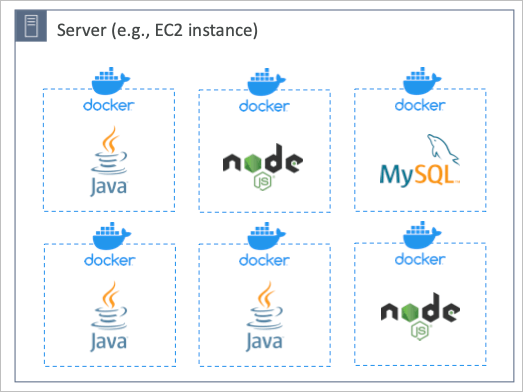

## 도커 이미지 저장소

- 도커 이미지는 도커 리포지토리에 저장됨
- Docker Hub
  - 퍼블릭 리포지토리
  - 많은 베이스 이미지들이 이미 배포되고 있음 (Ubuntu, MySQL 등)
- Amazon ECR
  - 프라이빗 리포지토리
  - 퍼블릭 리포지토리 (Amazon에서 제공하는 공식 퍼블릭 리포지토리)

## 도커와 가상머신의 차이

- 도커는 가상머신과 비슷하지만 똑같지는 않음
- 가상머신이 호스트OS에 하이퍼바이저로 각각의 게스트OS를 생성하는 반면, 도커는 호스트OS의 리소스를 공유하며 도커 데몬이 어플리케이션만을 격리시켜 다른 환경처럼 꾸며줌

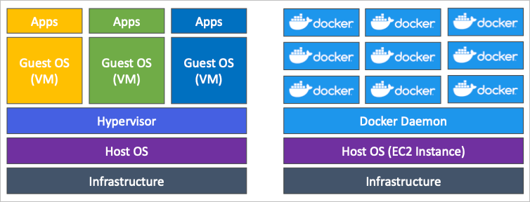

## 도커 사용까지 흐름

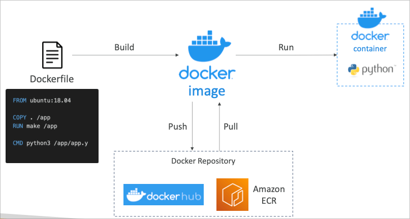

## AWS에서 도커 컨테이너를 관리하는 서비스들

- Amazon Elastic Container Service (Amazon ECS)
  - 아마존의 컨테이너 플랫폼
- Amazon Elastic Kubernetes Service (Amazon EKS)
  - 아마존의 관리형 쿠버네티스 플랫폼 (오픈소스 기반)
- AWS Fargate
  - 아마존의 독자 서버리스 컨테이너 플랫폼
  - ECS 또는 EKS에 레버리징 가능
- Amazon ECR
  - 프라이빗 컨테이너 리포지토리

## ECS (EC2 Launch Type)

- 도커 컨테이너를 AWS에서 구현하는 방식은 ECS Task를 ECS Cluster에서 실행하는 것
- ECS Cluster에는 두가지 방식이 존재하는데 그 중 EC2 인스턴스에 ECS 에이전트를 설치하여 실행하는 방식임
- EC2 인스턴스를 미리 구성하여 해당 EC2 인스턴스에 도커 기반 ECS 에이전트를 설치
- 각각의 EC2 인스턴스는 ECS 클러스터의 구성요소로 등록됨
- ECS 클러스터가 각 EC2에서 운영되고 있는 ECS 에이전트에 명령을 내리고, 태스크를 올림
  - 태스크 = 이미지

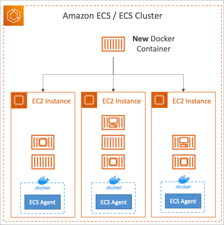

## ECS (Fargate Launch Type)

- 백엔드 인프라를 관리할 필요 없이 AWS에서 관리형 서비스로 운영
- 태스크에 대한 정의와 세부 사항만을 제공하면 해당 요구사항에 맞추어 인프라를 구성해줌

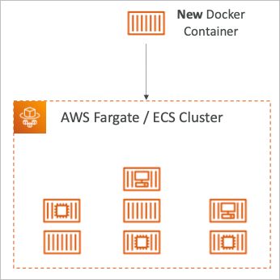

## IAM Role for ECS

- EC2 인스턴스 프로필 (EC2 실행 타입)
  - ECS 에이전트에서 사용되는 역할
  - ECS 서비스에 API 요청에 대한 권한을 컨트롤
  - CloudWatch Logs에 로그를 저장하거나, ECR에서 이미지를 풀링하거나, 설정 파일/패스워드 등과 같이 민감한 정보들을 Secret Manager나 Parameter Store등에서 읽어들일때 필요한 권한등을 명시
- ECS 태스크 역할
  - 각각의 태스크마다 필요한 권한을 별도로 명시

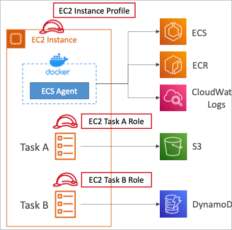

## Load Balancer Integrations

- 어플리케이션 로드 밸런서가 지원되며 일반적으로 이용됨
- 네트워크 로드 밸런서는 고성능의 네트워크나 처리량을 요구할때 추천됨
- CLB는 추천되지 않음 (포트 맵핑등을 지원안하고, Fargate에서 이용 불가)

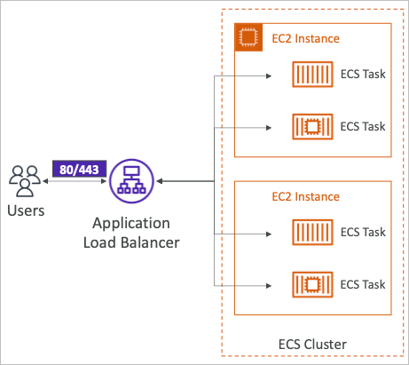

## Data Volumes (EFS)

- ECS는 EFS와 궁합이 좋은데, 각각의 EC2 인스턴스 내의 태스크들이 모두 볼륨으로 EFS를 사용하게 되면 전부 공유하는 스토리지로 이용 가능하기 때문임
- 또한 EFS도 서버리스이기 때문에 Fargate와 함께 사용하면 인프라에 대한 걱정 없이 서비스를 운영 가능
- 사용 사례
  - 복수 AZ에 대한 가용성 높은 공유 스토리지를 이용하는 서비스
- S3은 서비스에 볼륨으로 사용할 수 없음 (오브젝트형 스토리지)

## ECS Service Auto Scaling

- 자동으로 ECS 숫자를 늘리거나 줄이는 기능
- AWS Application Auto Scaling을 이용
  - ECS Service Average CPU Utilization
  - ECS Service Average Memory Utilization (Scale on RAM)
  - ALB Request Count Per Target (ALB의 지표를 이용)
- 타겟 트래킹
  - CloudWatch에 등록된 지표에 의해
- 스텝 스케일링
  - CloudWatch에 등록된 지표의 알람에 의해
- Scheduled Scaling
  - 정해진 시간에
- ECS에서 스케일링을 한다고 EC2 인스턴스가 증가하는것은 아님
- 설정 CPU와 RAM에 따라 EC2 내에 여러개의 태스크를 가동할 수 있기 때문임

## EC2 Launch Type - Auto Scaling EC2 Instances

- ECS 백엔드 인스턴스를 ECS 서비스가 오토 스케일함
- Auto Scaling Group Scaling
  - CPU 사용량에 따라서 ASG가 자동으로 인스턴스를 조절
- ECS Cluster Capacity Provider
  - ECS 태스크를 기동할때 자동으로 인프라를 관리
  - Capacity Provider가 ASG와 연계되어 있음

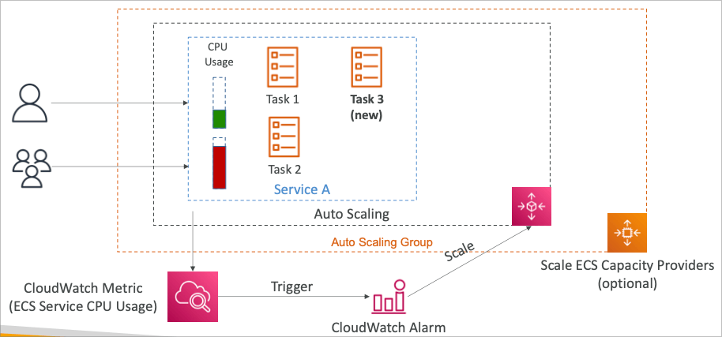

## EventBridge에 의해 트리거되는 ECS 태스크

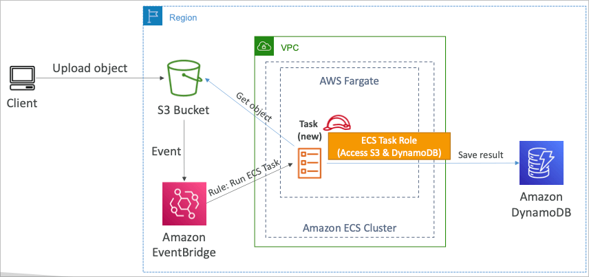

- Amazon EventBridge가 ECS 태스크를 실행할 수 있기 때문에, 서버리스 환경을 이용하여 S3 버킷에 파일을 업로드 했을때, 해당 파일에 대한 처리를 수행할 수 있음
- 또한 태스크 IAM 역할을 이용하면 그때 수행되는 태스크에 필요한 권한을 부여할 수 있음

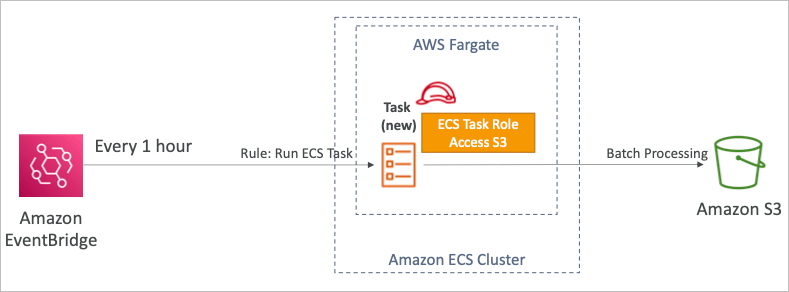

- EventBridge는 스케줄링에 의해 시간단위로 태스크 실행이 가능하기 때문에, 이를 이용해서 정기적으로 배치 작업을 수행 가능

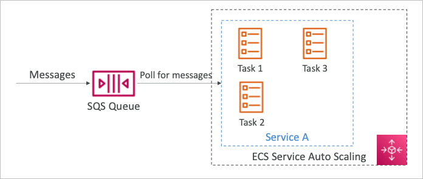

- SQS 큐에 들어와있는 메시지 수를 CloudWatch를 통해 지표로 설정하고, 해당 지표에 따라서 ECS 태스크의 Auto Scaling이 동작하게 설정 가능
- 따라서 큐에 작업이 밀려있을 경우 태스크를 증가시켜서 처리량을 올릴 수 있게 됨

## Amazon ECR

- ECR (Elastic Container Registry)
- AWS에 도커 이미지를 저장
- 프라이빗과 퍼블릭이 존재 (퍼블릭은 AWS에서 제공하는 퍼블릭 갤러리)
- ECS와 완벽하게 연동되며, S3이 백엔드 저장소로 사용되고 있음
- IAM에 의한 접근제어 정책
- 이미지 취약점 검사, 버전 관리, 이미지 태깅, 라이프사이클(만료) 관리 등을 지원

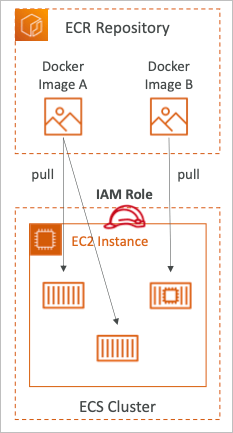

## Amazon EKS 개요

- Amazon EKS (Elastic Kubernetes Service)
- 아마존에서 제공하는 관리형 쿠버네티스 클러스터
- 쿠버네티스는 오픈소스로 자동으로 배포, 스케일, 컨테이너등을 관리할 수 있는 도구
- ECS의 대체제로, API가 다른 형태임
- EKS는 EC2와 Fargate를 둘 다 지원하기 때문에 어느것을 사용해도 됨
- 사용 사례
  - 회사에서 이미 쿠버네티스로 만들어진 인프라가 존재할 경우
  - AWS로의 마이그레이션이나 다른 클라우드와 동시에 이용 등

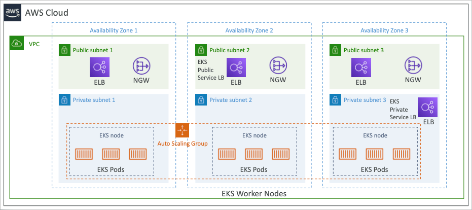

## Node Types

- 관리형 노드 그룹
  - EC2 내에 관리형 노드를 작성해줌
  - EKS의 ASG 관리에 노드도 포함됨
  - On-Demand 또는 Spot타입을 지원
- 직접 관리하는 노드
  - 설정등을 직접 관리하고 싶을 경우 활용
  - EKS 최적화 API를 사용하거나 직접 인스톨 가능
  - On-Demand 또는 Spot타입을 지원
- AWS 파게이트
  - 인프라에 대한 관리 없이 노드 사용 가능

## Serverless 정의

- 서버리스는 개발자들의 새로운 패러다임으로 서버를 더이상 관리하지 않는 것
- 코드 혹은 함수를 그대로 배포하여 사용
- 최초의 서버리스는 함수를 배포하는것으로 FaaS (Function as a Service) 를 의미했음
- 근래에는 서버리스가 단순히 함수 뿐 아니라, 다양한 분야 (데이터베이스, 메시지, 스토리지 등) 로 퍼져서 사용되고 있음
- 서버리스는 서버가 없는것이 아닌, 백엔드 인프라를 관리하지 않아도 된다는 의미

## Serverless in AWS

- Lambda
- DynamoDB
- Cognito
- API Gateway
- SNS & SQS
- Kinesis
- Aurora Serverless
- Step Function
- Fargate

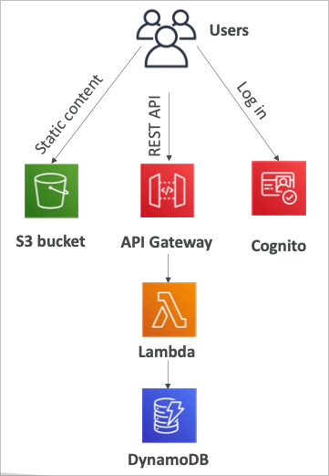

## AWS Lambda

### EC2

- 클라우드 상의 가상 서버
- RAM과 CPU가 제한됨
- 계속해서 가동됨
- 스케일링의 의미는 서버 자체를 추가하거나 삭제하는 것

### Lambda

- 가상 함수 (관리할 서버는 없음)
- 시간이 제한됨 (15분)
- 필요한 만큼 실행할 수 있음 (병렬적으로)

## Benefits of Lambda

- 심플한 과금 모델
  - 요청한 횟수와 실행한 시간에 따라 과금
  - 프리 티어로 1,000,000회의 실행 횟수와 400,000GB 초 만큼의 시간을 제공
- 다양한 AWS 서비스와 연계 가능
- 다양한 프로그래밍 언어와 연계 가능
- AWS CloudWatch를 통한 모니터링 가능
- 최대 10GB의 메모리까지 리소스 할당 가능
- 메모리를 증가시키면 CPU와 네트워크 대역폭이 자동으로 증가

## AWS Lambda Language

- Node.js (JavaScript)
- Python
- Java (Java 8 compatible)
- C# (.NET Core)
- Golang
- C# / Powershell
- Ruby
- Custom Runtime API
- Lambda Container Image
  - 컨테이너 이미지를 통한 람다 API 실행
  - ECS / Fargate 도커 이미지를 가상화하여 실행 가능

## 람다와 연계하는 메인 서비스들

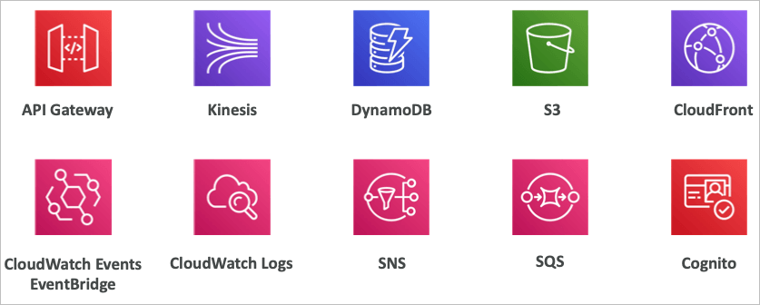

- API Gateway
  - HTTP 엔드포인트를 직접 JSON 형태로 람다 함수에 연결 가능
- Kinesis
  - 데이터 전송 중 실시간 처리를 람다 함수에 연결 가능
- DynamoDB
  - 테이블에 데이터가 들어올 때 람다 함수를 연결해서 작업 수행 가능
- S3
  - 오브젝트가 생성될 때 람다 함수 연계 가능
- CloudFront
  - Lambda@Edge
- CloudWatch EventBridge
  - AWS의 각종 서비스에 대한 이벤트를 람다 함수와 연결
- CloudWatch Logs
- SNS
- SQS
- Cognito
  - 유저 로그인 시 람다 함수 연계 가능

## Serverless Thumbnail creation

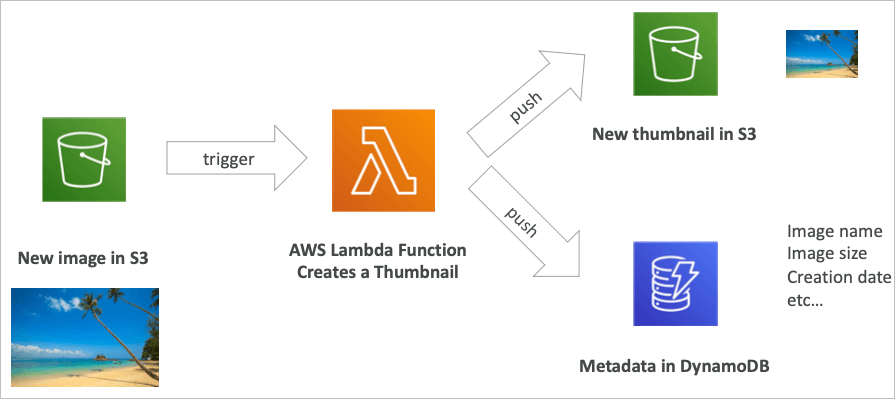

- S3에 파일이 인풋되었을 때 람다 함수를 연계하여 썸네일을 작성하고 썸네일 메타데이터를 다이나모DB에 저장

## Serverless CRON job

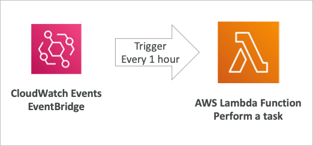

- CloudWatch EventBridge를 통해 스케줄된 람다 함수 실행 가능

## Lambda Pricing

- 요청
  - 1백만 요청까지 무료
  - 그 이후 백만단위당 $0.2
- 사용시간
  - 400,000GB 초까지 무료
  - 그 이후 600,000GB초당 $1.0

## Lambda 제약사항

- 실행
  - RAM 128MB ~ 10GB
  - 실행시간 900초
  - 환경변수 4KB
  - 함수 컨테이너 512MB ~ 10GB
  - 동시 실행수 1000 (증가 가능)
- 배포
  - 배포 사이즈 50MB
  - 비압축 배포 code + 종속성 250MB
  - /tmp 저장소를 파일 스타트업으로 활용 가능
  - 환경변수 4KB

## Edge Customization

- 특정 로직을 엣지에서 실행하고 있는 어플리케이션
- 엣지 함수
  - CloudFront 배포 (엣지 로케이션)에서 코드를 실행
  - 유저에게 최단거리에서 실행할수 있기 때문에 지연시간 최적화
- CloudFront는 두가지 타입의 함수를 지원
  - CloudFront Function
  - Lambda@Edge
- 서버를 관리할 필요는 없고, 자동으로 글로벌 배포가 됨
- 사용 사례
  - 웹사이트 보안 및 프라이버시
  - Edge에서의 다이나믹 웹 어플리케이션
  - SEO (Search Engine Optimization)
  - 지능적 라우팅
  - 실시간 이미지 변환
  - AB 테스팅
  - 유저 인증 및 인가
  - 유저 우선순위 할당
  - 유저 추적 및 분석

## CloudFront Functions

- JavaScript로 구성된 경량화 함수
- 고성능의 스케일업, 지연시간에 민감한 CDN 함수 처리
- 밀리초 단위의 실행대기시간, 초당 수백만 요청 처리 가능
- 요청자에게 보내는 응답과 요청을 수정 가능
  - Viewer Request 클라우드 프론트에 요청자의 요청을 전달
  - Viewer Response 처리된 결과를 클라우드 프론트로부터 요청자에게 전달
- CloudFront의 네이티브 기능

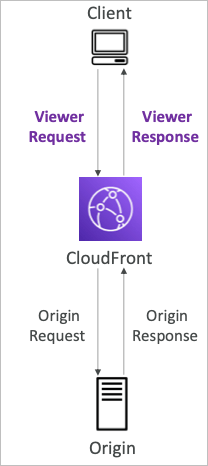

## Lambda@Edge

- NodeJS와 Python과 같은 백엔드 함수 수행
- 초당 수천단위의 요청 처리 가능
- Viewer Request
- Viewer Response
- Origin Request
- Origin Response
- 함수 자체는 하나의 리전에 존재하고, 해당 함수를 클라우드프론트가 글로벌에 배포

## CloudFront Functions vs Lambda@Edge

### CloudFront Functions

- 캐시 키 일반화
  - 요청에 대한 헤더 쿠키 쿼리 스트링등을 최적화하는 캐시 키로 생성
- 헤더 조작
  - HTTP 헤더에 특정 값을 Insert/Modify/Delete 가능
- URL 재작성
  - 요청을 덮어쓰기 가능
- Request Authentication & Authorization
  - JWT등의 토큰을 작성하여 허가/불허가 가능

### Lambda@Edge

- 더 긴 시간동안의 작업 (백엔드, API 요청 등)
- CPU와 RAM 조정 가능
- 서드파티 라이브러리에 의존함

## Lambda 네트워킹

### default

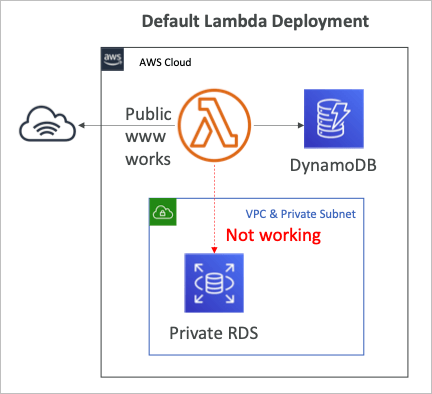

- 기본적으로 람다 함수는 VPC 밖에서 수행됨 (AWS 람다 전용 VPC)
- 그래서 VPC 내부의 프라이빗 리소스와 직접적인 연계가 불가 (RDS, ElastiCache, ELB 등)

### Lambda in VPC

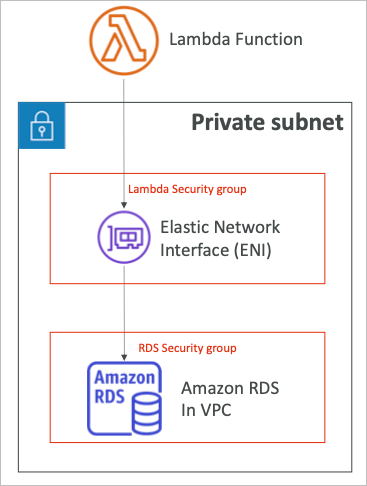

- 람다를 생성할 때 VPC를 지정하여 서브넷과 SG를 지정함
- 람다는 ENI를 작성하여 서브넷과 직접 교류할 수 있게 됨

## Lambda with RDS Proxy

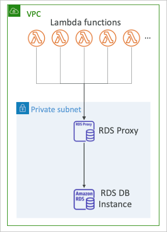

- 람다함수가 직접적으로 데이터베이스에 접근하게 되면 단위 함수로 너무 많은 데이터베이스 커넥션 오버헤드가 발생할 수 있음
- RDS Proxy
  - 프록시를 사용하여 DB 풀 커넥션을 공유하게 됨
  - 66% 실패 감소등 효과를 볼 수 있음 (커넥션 보존)
  - IAM 인증을 강제하고 Secret Manager에 크레덴셜을 저장하여 활용 가능
- 람다 함수는 in VPC로 배포되어야 하며, 그 이유는 RDS Proxy는 외부 공개가 불가능하기 때문

## DynamoDB

- 완전 관리형, 고가용성으로 복수 AZ에 복제되는 DB
- NoSQL 데이터베이스로 관계형이 아니지만, 트랜잭션을 지원
- 대규모 워크로드로 스케일링, 분산형 데이터베이스
- 초당 수백만 요청 처리, 조단위 행, 수백 테라바이트의 스토리지
- 빠르고 안정적인 퍼포먼스 (한자리 밀리초 응답시간)
- IAM과 연동한 보안성, 인증 및 관리
- 저비용과 자동 스케일링 용량
- 유지보수 불필요, 가용성
- 스탠다드, IA 테이블 클래스 지원

## DDB 기본

- 다이나모DB는 테이블로 만들어짐
- 각각의 테이블은 프라이머리 키가 존재 (생성 시점에 결정되어야 함)
- 각각의 테이블은 행 수에 제한이 없음
- 각각의 아이템에는 속성이 있음 (생성 이후에도 추가 가능, null을 허용)
- 각각의 아이템 사이즈는 400KB로 제한됨
- 각 데이터 타입
  - 스칼라
    - 스트링, 넘버, 바이너리, 불리언, Null
  - 도큐먼트
    - List Map
  - 셋
    - 스트링셋, 넘버셋, 바이너리셋
- 다이나모DB는 스키마의 변경이 자유로움

## 테이블 예제

- 메인 키인 파티션키와 보조 키인 소트키로 이루어진 테이블에, 속성이 계속해서 추가될 수 있음

## Read/Write 용량 모드

- 테이블의 용량 사용 모드를 정할 수 있음
- 프로비전 모드 (기본)
  - 초당 읽기/쓰기 숫자를 정해서 사용
  - 사용하기 전에 용량을 결정해야 함
  - 정해진 만큼의 읽기/쓰기 용량만큼을 지불하게 됨
  - 자동 스케일링 기능을 추가하여 RCU WCU를 증가시킬 수 있음
- 온디맨드 모드
  - 읽기/쓰기의 용량이 자동으로 스케일되며 워크로드에 맞춰짐
  - RCU WCU개념이 없고 사용한 만큼 과금됨 (단, 고비용)
  - 예측 불가능한 워크로드나 갑자기 트래픽이 몰리는 시스템에 적합 (프로비전 모드의 스케일링 기능은 폭발적인 증가에 따라오지 못함)

## DynamoDB Accelerator (DAX)

- 다이나모DB를 위한 완전 관리형, 고가용성, 끊김 없는 인 메모리 캐시
- 읽기 병목을 해결할 수 있는 캐시 역할을 수행
- 캐시된 데이터에 대한 마이크로초 반응속도를 보여줌
- 다이나모DB의 로직 변경 불필요, 앞단에서 자동 수행
- 기본 5분 캐시타임 (변경 가능)

## DAX vs ElastiCache

- 엘라스티캐시와 DAX는 상호간에 구현을 동일하게 할 수 있음
- DAX는 오브젝트 단위의 캐시 능력을 보여주고, ElastiCache는 결과를 저장하는데 특화되어 있음
- 일반적으로 다이나모DB에서는 굳이 ElastiCache보다는 DAX를 유효화하면 해결되는 경우가 많음

## DynamoDB Stream Processing

- 테이블 내 변경사항이 생겼을 경우 (아이템레벨) 순서에 따라 데이터를 처리하는 스트림을 생성
- 사용 사례
  - 실시간으로 데이터 처리 (가입자에게 이메일 송신)
  - 실시간 사용량 분석
  - 연관 테이블에 데이터 추가
  - 다른 리전의 테이블로 데이터 복제
  - 그 외 어떤 변경사항과 연동된 로직 처리 (람다함수)

### DynamoDB Streams

- 24시간 데이터 보존
- 소비자 숫자 제한
- 람다 트리거 또는 Stream Kinesis 어댑터로 소비자 제한

### Kinesis Data Streams (newer)

- 1년간의 데이터 보존
- 소비자 숫자에 더 유연한 제한
- 람다, Kinesis Data Analytics, Firehose, Glue ETL 등으로 연계 가능

## DDB Global Tables

- 복수의 리전으로 복제되는 테이블 (양방향 복제)
- 여러 리전에서 접근하는 어플리케이션이 DDB와 연계되는 경우
- 양방향 복제가 필요한 경우 (Active-Active)
- DDB Streams를 기반으로 한 기능

## DDB TTL

- 테이블의 속성값에 따라 일정 기간이 지난 후 자동으로 아이템을 삭제

- 특정 시점 이전의 데이터가 필요 없는 경우와 웹 세션의 경우 주로 채택되는 방법

## Backups for DR

- 특정 시점의 데이터를 지속적으로 백업
  - 35일까지 백업 가능
  - 특정 시점을 지정하여 해당 시점의 데이터로 복원 가능
  - 복원 처리는 새로운 테이블을 생성함
- 온디맨드 백업
  - 원하는 시점에 풀백업 (보존기간 무제한)
  - 퍼포먼스의 지연이나 영향없이 백업 가능
  - AWS Backup 서비스로 설정 가능
  - 복원 처리는 새로운 테이블을 생성함

## DDB와 S3간의 연계

- S3으로의 추출 (PITR기능을 이용중이어야 함)
  - 35일까지의 어떤 데이터도 추출 가능
  - 현재 테이블의 읽기 퍼포먼스에 영향 없음
  - DDB의 데이터 분석용도로 활용 가능
  - 감사를 위한 스냅샷 용도
  - JSON또는 ION포맷으로 추출
- S3으로 임포트
  - CSV, JSON또는 ION포맷
  - 쓰기 퍼포먼스에 영향 없음
  - 새로운 테이블을 생성
  - CloudWatch Logs를 통해 에러 발생시 로그 확인 가능
