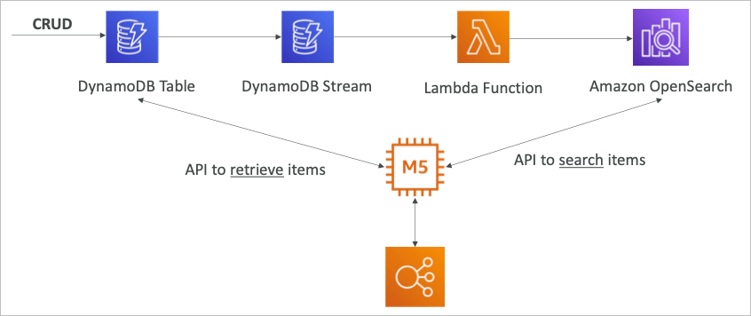

# Data & Analytics

## Athena

- S3 데이터에 직접 쿼리를 수행할 수 있는 서버리스 서비스
- Presto 기반으로 파일 내용에 SQL을 수행 가능
- CSV, JSON, ORC, Avro, Parquet 등의 파일을 지원
- 스캔된 데이터 1TB당 $5.0
- 아마존 퀵사이트에 리포트/대시보드 표시에 주로 이용됨
- 사용사례
  - 비지니스 인사이트/분석
  - 보고서/분석 및 쿼리 (각종 데이터 소스에 대한)

## Athena 퍼포먼스 개선

- columnar 데이터 타입을 추천 (비용 절감)
  [[개념][데이터베이스] 칼럼지향 데이터베이스(columnar database)](https://118k.tistory.com/400)
  - 아파치 parquet 또는 ORC가 권장됨
  - 큰 성능 증가
  - Glue를 이용하면 데이터를 Parquet 또는 ORC로 변환 가능
- 데이터 압축을 통한 반환 데이터 축소 (bzip2, gzip, lz4, snappy, zlip, zstd)
- 데이터셋의 파티셔닝을 통한 쿼리의 간략화
- 큰 파일일 수록 효율적임

## Athena 통합 쿼리

- 아테나는 커스텀 데이터 소스를 이용하여 상호간의 조인을 허용
- 예를 들어, 람다를 이용하여 각종 데이터 소스 (RDS, DDB, Redshift …)등으로부터 데이터를 각각 가져옴
- 가져온 데이터들끼리의 조인 등을 통해 결과 도출 가능
- 도출된 데이터는 다시 S3에 저장됨 (아테나 쿼리 결과)

## Redshift Overview

- 레드시프트는 PostgreSQL을 기반으로 했지만 OLTP를 제거한 기술
- OLAP 기능만을 목적으로 하고 있는 서비스
- OLTP
  - 웹 서비스에서 주로 발생하는 트랜잭션 처리
  - 읽기/쓰기/변경/삭제 등이 주로 트랜잭션
  - 실시간 데이터를 처리해서 질의자에게 돌려주는 것을 목적으로 함
- OLAP
  - 쌓여있는 데이터에서 어떠한 가공을 통해 원하는 데이터를 추출하는 것이 목적
  - 분석을 위한 데이터 처리 및 가공이 주된 역할
- 다른 데이터 웨어하우스 서비스보다 성능면에서 큰 이점이 있고, PB단위의 데이터까지 다룰 수 있음
- Columnar 스토리지 (행기반)로 병렬 쿼리 엔진을 가지고 있음
- 레드시프트 인스턴스를 프로비전한 만큼 과금됨
- SQL 인터페이스가 존재하며 쿼리를 수행 가능
- 아마존 퀵사이트 혹은 타블로와 같은 툴과 연계 가능
- 아테나와 비교하여 더 빠른 쿼리 및 조인이 가능한데, 이는 인덱스를 보유하고 있기 때문임

## Redshift Cluster

- 레드시프트는 리더노드와 컴퓨트노드로 나누어짐
- 리더노드는 질의자의 쿼리를 받아주는 노드로 컴퓨트 노드는 리더노드의 지시하에 쿼리를 수행하는 인스턴스
- 각각의 노드는 인스턴스이며, 인스턴스 옵션을 통해 비용 절감 가능

## Redshift 스냅샷 & DR

- 레드시프트는 멀티 리전을 지원하지 않음
- 스냅샷을 통해 S3에 데이터를 저장해야 하는데, 자동화된 백업과 온디맨드 백업을 지원
- 자동화된 백업은 8시간당, 5기가당으로 둘중 만족시키는 조건하에 백업이 진행되고 보존기간은 35일까지 지정 가능
- 온디맨드 백업은 PITR을 지원하고 삭제 전까지 유지 가능
- 레드시프트 자동 백업을 통해 스냅샷을 다른 리전에 자동으로 복제 하는 기능도 설정 가능

## Redshift 데이터 로딩

- 레드시프트에 데이터를 쌓는 방식으로는 3가지 패턴이 있음

### Amazon Kinesis Data Firehose

- 파이어호스를 통해 레드시프트 클러스에 직접 연결

### S3 카피 커맨드를 이용하여 레드시프트에 연결

- VPC 인터페이스를 통해 S3과 직접 내부망을 이용하게 하지 않으면 카피 명령어는 인터넷을 통해 수행됨 (느림, 비쌈)

### EC2 인스턴스 JDBC 드라이버

- 인스턴스에 레드시프트 JDBC 드라이버를 이용하여 직접 연결하여 데이터 로딩

## Redshift 스펙트럼

- S3에 있는 데이터를 분석할때 사용
- 레드시프트 스펙트럼이 S3에 병렬적으로 쿼리를 처리하여 컴퓨트노드↔리더노드를 통해 질의자에게 결과를 전달해줌

## Amazon OpenSearch Service

- Amazon ElasticSearch의 다른 이름
- DDB에서 쿼리는 프라이머리 키 또는 인덱스에 대해서만 수행 가능
- OpenSearch를 이용하면 어떤 필드도 검색 가능하며, 일부 매칭도 가능
- OpenSearch를 검색용 DB로 사용하는 것은 흔한 패턴
- OpenSearch는 개별적인 클러스터 관리형 인스턴스를 요구 (서버리스가 아님)
- SQL을 지원하지 않음 (독자적인 쿼리 언어가 존재, JSON타입)
  [Query DSL | Elasticsearch Reference [5.4] | Elastic](https://www.elastic.co/guide/en/elasticsearch/reference/5.4/query-dsl.html)
- Kinesis Data Firehose나 AWS IoT, CloudWatch Logs등과 같은 데이터 수집기로 데이터 보존 필요
- Cognito와 IAM을 통한 보안 인증 지원, KMS, TLS를 통한 전송, 저장 데이터의 암호화 지원
- OpenSearch Dashboard 지원

## DDB에서 OpenSearch 패턴

- DDB에서 Streams를 이용하여 모든 아이템에 대한 변경사항을 람다를 이용하여 OpenSearch에 저장
- 아이템에 대한 검색은 OpenSearch를 이용하고, 특정 데이터를 확정하여 가져오는 부분을 DDB에서 수행

## CloudWatch Logs에서의 OpenSearch 패턴

- 클라우드워치 로그를 필터를 통해 람다함수로 실시간으로 오픈서치에 저장
- 키네시스 파이어호스는 60초 또는 1MB(최대 버퍼 저장량)의 데이터 전송 딜레이가 존재

## Kinesis Data Streams에서 OpenSearch 패턴

## Amazon EMR

- Elastic MapReduce
- 하둡 클러스터로 빅데이터의 분석 및 처리에 이용
- 클러스터는 수백대의 인스턴스로 구성됨
- EMR은 Apache Spark, HBase, Presto, Flink 등의 번들을 함께 제공
- 이러한 번들의 설치부터 설정까지 서포트하는 기능들이 포함되어 있음
- 오토 스케일 및 스팟 인스턴스 등과 연계하여 비용 절감
- 사용 사례
  - 데이터 처리
  - 머신 러닝
  - 웹 인덱싱
  - 빅 데이터

### 구성 요소

- 마스터 노드
  - 클러스터의 관리, 지정, 동작감시 (항상 구동)
- 코어 노드
  - 태스크의 실행 및 데이터의 보존 (항상 구동)
- 태스크 노드 (옵션)
  - 태스크를 수행하기 위한 노드로 일반적으로 스팟 인스턴스로 구동
- 구매 옵션
  - 온디맨드: 예측 가능하고 안정적이며 제거되지 않음
  - 예약: 최소 1년 예약으로 저렴하게 이용 가능 (EMR 인스턴스는 이용 가능하다면 예약 인스턴스를 우선 사용)
  - 스팟 인스턴스: 태스크 처리 용도로 이용 가능

## Amazon QuickSight

- 서버리스 머신러닝을 기반으로 한 비니지스 서비스
- 자동으로 스케일되고 지표를 첨부 가능, 세션 당 과금
- 사용 사례
  - 비지니스 분석, 시각화
  - 애드혹 분석
  - 비지니스 인사이트
- RDS, Aurora, Athena, Redshift, S3 등과 연계
- 인 메모리 컴퓨팅 (SPICE 엔진)
- 엔터프라이즈 에디션 → CLS (칼럼 레벨 보안)

## QuickSight 통합

## QuickSight 대시보드 및 분석

- 유저 (스탠다드) 및 그룹 (엔터프라이즈) 정의
  - IAM이 아닌 퀵사이트의 유저 및 그룹만으로 제어됨
- 대시보드
  - 읽기 전용 스냅샷과 공유 가능한 분석 결과
  - 필터링, 패러미터, 컨트롤 등을 저장 가능
- 대시보드 및 분석 결과를 유저 및 그룹과 공유 가능
- 대시보드를 공유하기 위해서는 발행해야 함
- 대시보드를 볼 수 있는 권한이 있다면, 데이터도 볼 수 있음
