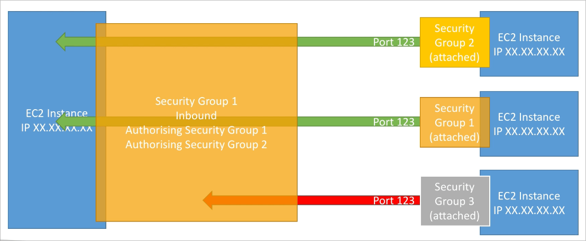

# EC2 기본

## AWS Budget Setup (요금 알림 설정)

- IAM 유저에서 청구 관련 내용을 확인할 수 있도록 권한을 설정하는 부분을 체크해줌
- 예산 설정(Budget Setup)을 통해 월간 예산을 일정 수준으로 잡아두면, 해당 예산이 근접했을 경우에 알림을 받을 수 있음
  - Threshold(근접치) 정도를 설정 (예를 들어, 예산의 80% 등)
  - 실제(actual), 예상(forecast)을 분류해서 설정 가능
    - 예상(forecast)이란, 현재 이대로 월말까지 사용했을때 어느정도 비용이 발생할지 예측해주는 기능
  - 알림은 이메일 등으로 설정 가능

## Amazon EC2

- EC2는 AWS에서 제공하는 가장 잘 알려진 서비스 중 하나
- EC2는 Elastic Compute Cloud의 약어로 IaaS를 의미함
- 주요 기능 및 개요로 다음과 같은 것들이 존재
  - 가상 머신의 대여 (EC2)
  - 가상 드라이브에 데이터를 저장 (EBS)
  - 각 가상 머신에 대한 부하를 분산 (ELB)
  - 각 서비스가 들어있는 가상 머신을 자동으로 조절 (ASG)

## EC2 크기 및 설정 옵션

- OS(운영체제)의 선택
  - Linux
  - Windows
  - MacOS
- 컴퓨팅 퍼포먼스 & 코어
- 메모리 용량
- 저장소 타입
  - 네트워크 타입 (EBS & EFS)
  - 로컬 스토리지 타입 (EC2 Instance Store)
- 네트워크 카드, IP 부여 (public ip)
- 방화벽 설정 (보안 그룹: security group)
- 부트스트래핑 스크립트 (첫 기동시 실행할 스크립트)

## EC2 User Data (부트스트래핑)

- EC2 User Data라고 불리는 스크립트를 이용할 수 있음
- 가상 머신이 처음 실행될때 기동되어야 할 일련의 작업 명세서로, 최초 실행시에만 동작하며 그 이후에는 재기동 등을 하더라도 동작하지 않음
- 이러한 스크립트에서 실행시킬 작업의 예로서 다음과 같은 것들이 존재함
  - OS 업데이트
  - 소프트웨어 설치
  - 서비스에 필요한 파일의 다운로드 및 준비
  - 기타 등등
- EC2 User Data 스크립트는 루트 유저 권한으로 실행됨

## EC2 인스턴스 타입

[Amazon EC2 Instance Types - Amazon Web Services](https://aws.amazon.com/ec2/instance-types/)

- AWS는 서비스에 필요한 다양한 타입의 인스턴스를 제공하고 있으며, 유저는 해당 타입중 하나를 선택해서 이용할 수 있음
- AWS에서 제공하는 인스턴스를 분류하기 위해 이름에 컨벤션을 가지고 있음
  - m5.2xlarge
  - m → 인스턴스 클래스
  - 5 → 인스턴스 세대
  - 2xlarge → 인스턴스 클래스에서 제공하는 사이즈 (CPU, RAM등)

### 일반적인 목적 (T시리즈: Tiny)

- 웹서버와 코드 저장소와 같이 일반적인 워크로드를 처리하는데 적합하게 설계된 인스턴스 클래스
- 컴퓨팅파워, 메모리, 네트워킹이 적절하게 배분되어 있음
- 그중에서도 t2.micro 타입은 프리티어 대상으로 활용되고 있음

### 컴퓨팅 최적화 (C시리즈: Compute)

- 컴퓨팅에 특화된 작업을 소화해낼 수 있는 고성능 프로세서를 탑재한 인스턴스 클래스
- 사용 예제
  - 배치 작업
  - 미디어 트랜스코딩
  - 고성능 웹서버
  - 고성능 컴퓨팅 (HPC)
  - 머신러닝, 모델링
  - 분산 게이밍 서버

### 메모리 최적화 (R시리즈: Ram)

- 빠른 성능이 요구되는 워크로드, 특히 메모리에 의한 작업이 많이 요구되는 경우에 적합하게 설계된 클래스
- 사용 예제
  - 고성능 관계형, 비관계형 데이터베이스
  - 웹 서버 캐시 스토리지
  - BI에 최적화된 메모리 데이터베이스
  - 빅데이터 처리용 프로세서

### 스토리지 최적화 (I시리즈: IO)

- 스토리지에 최적화된 작업, 예를 들면 순차읽기나 쓰기와 같은 많은 엑세스가 동시에 일어나는 작업에 특화된 클래스
- 사용 예제
  - 고빈도 온라인 트랜잭션 처리 (OLTP)
  - 관계형 또는 NoSQL 데이터베이스
  - 메모리 캐시형 데이터베이스 (Redis)
  - 데이터 웨어하우스 어플리케이션
  - 분산 파일 시스템

## Security Groups

- 보안 그룹은 AWS 네트워크 보안에 필수불가결한 기능
- EC2 인스턴스로부터의 인바운드와 아웃바운드 트래픽을 조절

- 보안 그룹은 허용 규칙만 작성 가능
  - 인바운드 룰은 기본 모든 통신에 대해 차단
  - 아웃바운드 룰은 기본 모든 통신에 대해 허용
- 보안 그룹은 IP 혹은 또 다른 보안 그룹을 참조할 수 있음
- 보안 그룹은 EC2 인스턴스의 방화벽과 같이 동작함
- 방화벽 룰로서 사용 가능한 것들
  - 포트
  - IP 범위 (IPv4, IPv6)
  - 방향 (인바운드 또는 아웃바운드)

- 보안 그룹은 복수의 인스턴스에 붙일 수 있음 (보안그룹:인스턴스=N:N)
- 리전/VPC에 종속적임 → 다른 리전, VPC에서 사용 불가
- EC2를 래핑하고 있기 때문에 보안 그룹에 의해 차단된 통신은 EC2의 존재여부도 파악 불가
- SSH 포트는 별도의 보안그룹으로 관리하는 것이 관리효율적임
- 어플리케이션에 접속할때 타임아웃이 발생하면 보안그룹이 연관되어 있을 가능성이 큼
- 반대로, 어플리케이션에 접속할때 접속 거부가 발생하면 인스턴스까지는 트래픽이 도달했으므로 보안그룹이 아닌 서버 자체의 어플리케이션에 문제가 있을 가능성이 큼

### 보안그룹이 또 다른 보안그룹을 참조하는 예

## 알려진 포트

- 22 (SSH)
- 21 (FTP)
- 22 (SFTP)
- 80 (HTTP)
- 443 (HTTPS)
- 3389 (RDP)

## SSH Summary Table

## EC2 Instance Connect

- 임시 공개키를 생성하여 인스턴스에 업로드 하는 방식을 통해 로컬에 있는 인증서 키파일을 지정하지 않아도 로그인 가능함

## EC2 Instance IAM Role

- 인스턴스 내에 aws configure를 통해 엑세스 키를 저장하는 것은 좋지 못한 생각임
  - 평문화되어 저장되기 때문에 인스턴스에 접근하는 누구나 해당 키를 확인할 수 있음
  - 인스턴스가 해킹당할 경우에 해당 키가 누설되어 더 큰 문제가 발생할 수 있음
  - 따라서 인스턴스에는 직접 엑세스키를 설정하는 것이 아닌, IAM 역할을 만들어서 붙여줘야 함

## EC2 Instance 구매 옵션

- On-Demand 인스턴스
  - 짧은 워크로드, 예측가능한 가격으로 사용한 인스턴스의 초(seconds)당 지불가능
- 예약 인스턴스 (1년 또는 3년)
  - 긴 텀의 워크로드
  - 변경가능한 예약 인스턴스
    - 긴 텀의 워크로드를 가지지만, 인스턴스 타입의 변경이 예상되는 경우
- 절약 플랜 (1년 또는 3년)
  - 어느정도 정해진 사용량을 긴 텀으로 가져가고 싶을 때 사용
- 스팟 인스턴스
  - 매우 짧은 워크로드로 그만큼 저렴하지만 언제든지 인스턴스를 잃을 수 있음 (불안정)
- 전용 호스트
  - 물리적인 서버 전체를 임대, 인스턴스 배치를 컨트롤 가능
- 전용 인스턴스
  - 호스트 머신 1대를 다른 고객과 같이 사용하지 않음
- 용량 예약
  - AZ내의 일정 수준의 용량을 특정 기간동안 예약

### EC2 On Demand

- 사용한 만큼 지불하는 구조
  - 리눅스 또는 윈도우의 경우 1분 후부터 초단위로 지불 가능
  - 다른 os의 경우에는 시간단위 과금
- 선불금액이 없지만 러닝코스트는 제일 비쌈
- 사용기간을 예측할수 없거나 짧지만 안정적인 인스턴스를 원하는 경우 권장할만함

## EC2 Reserved Instance

- On-Demand에 비해 최대 72%의 할인율로 인스턴스 가동 가능
- 특정 인스턴스 조건을 미리 계약으로 결정해두고 사용하는 패턴
- 기간의 경우 1년과 3년이 있으며 장기계약이 될 수록 더 저렴해짐
- 기간동안 선불금을 설정할 수 있는데, 선불금 지불 없음, 절반, 전체를 선택할수 있으며 선불금이 많아지면 할인율도 올라감
- 두가지 타입의 예약이 가능
  - 리전내 타입 예약
  - AZ내 타입 예약
- 장기간의 일관된 인스턴스 퍼포먼스를 요구하는 사양의 경우 권장됨 (데이터베이스 등)
- 구입하고 필요없어진 경우 마켓플레이스에 판매 가능
- 장기간의 워크로드를 요구하지만, 필요에 따라 다른 인스턴스 타입으로의 조절이 필요하다면 Convertible Reserved Instance를 고려할 수 있음

## EC2 Savings Plan

- 장기간의 계약을 통해 인스턴스를 할인받을 수 있음
- 특정 인스턴스 타입을 원하는 기간동안 계약 가능
- EC2 Saving Plan의 제공범위 밖의 인스턴스 클래스를 사용하게 될 경우 On-Demand 금액이 청구됨
- 특정 리전의 인스턴스 타입으로 범위가 제한되어 있음
  - 다만 인스턴스 크기와 OS등에 제약이 없는 버전임

## EC2 Spot Instance

- On-Demand에 비해 최대 90%의 할인을 받을 수 있음
- 인스턴스는 실행 도중 강제로 종료당할 수 있으며 이는 현재 사용중인 AZ의 인스턴스 수용량에 따라 유동적임
  - 가격도 그에 따라서 조절되며, 남아있는 인스턴스 호스트가 없는 경우에는 가격이 올라가고 반대의 경우에는 내려감
- AWS내에서 제공되는 모든 EC2 계약중 가장 코스트 효율적인 과금제임
- 인스턴스를 잃어도 괜찮은 워크로드(자동으로 작업이 저장된다거나, 종료 시 텀동안 현재 작업내용을 보관할 수 있는 경우)에 적합함
  - 배치 작업
  - 데이터 분석
  - 이미지 처리
  - 분산화된 워크로드
  - 시작시간과 종료시간이 언제여도 상관없는 분산된 워크로드
- 데이터베이스와 같이 종료시에 치명적인 서비스에는 사용이 거의 불가능함

## EC2 Dedicated Hosts

- EC2가 호스팅되는 물리적인 서버 전체를 임대하여 사용하는 플랜
- 회사의 컴플라이언스 준수나 서버에 대한 소프트웨어 라이센스의 요구에 의해 이용되는 편 (예를 들면 소켓 당, 코어 당 같은 VM 소프트웨어에 대한 라이센스 등)
- 구입 옵션
  - On-Demand
    - 전용 호스트에 대해 초당 과금
  - Reserved
    - 1년 또는 3년 계약 (선불금 옵션 또한 존재)
- 가장 비싼 옵션 (물리적인 호스트 전체를 임대하므로)

## EC2 Dedicated Instances

- 인스턴스가 가동되는 물리적인 장비를 다른 고객과 나눠쓰지 않음
- 단, 같은 계정 내 다른 인스턴스와는 물리장비를 공유할 가능성이 있음
- 물리적인 장비 내에 어떠한 컨트롤을 가질 수 없음 (이 점이 전용 호스트와의 차이점)

## EC2 Capacity Reservations

- 특정 AZ에 대해 일부 On-Demand 인스턴스들에 대한 예약 시스템
- On-Demand라고 하더라도 AZ내에 용량이 초과되면 인스턴스를 생성할 수 없는 경우가 있는데, 이것을 방지하기 위함임
- 인스턴스를 실행하지 않더라도 예약으로 잡고 있는 용량에 대해서는 과금이 들어가며, 예약 용량에 대해서 Savings Plan 등을 적용하는것은 가능함
- 단기간에 절대로 방해받지 않아야 하는 워크로드 등을 위해 이러한 플랜을 사용할 수 있음

## EC2 Spot Instance Requests

- On-Demand에 비해 최대 90% 할인된 금액으로 인스턴스 사용 가능
- 최대 spot 금액을 설정해두고, 현재 spot 금액이 설정한 금액보다 적은 경우에 요청 내용에 따라 인스턴스가 생성됨
  - spot 금액은 현재 리전, az의 용량에 따라 달라짐
  - 만일 설정 금액보다 현재 spot 금액이 더 높아질 경우에는 2분간의 유예 후에 인스턴스가 강제 종료됨
    - 2분동안 현재 실행중이던 작업을 저장하고 다음 스팟 인스턴스가 처리할 수 있도록 어플리케이션의 내결함성을 다져놓을 필요가 있음
- 다른 옵션으로는 spot block이라는 것이 있는데, 이는 정해진 시간동안은 인터럽션이 발생하지 않도록 어느정도 예약시간을 잡아두는 것을 말함 (1~6시간 최대)
- spot 인스턴스는 상황에 따라 인스턴스가 강제 종료될 위험이 존재하기 때문에 내결함성이 있는 분산환경에서 사용하거나, 배치 작업과 같은 중단되어도 상관없는 프로세스에서 유용하게 사용될 수 있음

## EC2 Spot Instance Pricing

## Spot Instance를 제거하는 방법

- Spot Request가 한번 올라가고 인스턴스를 실행하면 일반적으로 요청은 종료됨
- 단, 타입이 영속적(persistent)일 경우에는 조건에 맞는 경우 인스턴스를 계속 실행시킴
  - 이런 옵션이 필요한 이유는, 스팟 인스턴스의 경우 조건에 따라 인스턴스가 계속 종료될 수 있기 때문에, 필요한 만큼을 적어둔 Request를 운용하면서 일정 대수를 계속 실행시키도록 하기 위함임
- Request가 계속 남아있을 경우에 인스턴스를 종료시켜도, Request가 계속해서 Spot Instance를 실행할 수 있기 때문에, 영속적인 Request를 이용중이라면, 먼저 Request를 종료시킨 이후에 인스턴스를 종료해야 함

## Spot Fleets

- 스팟 플릿은 스팟 인스턴스 셋과 더불어 온디맨드 인스턴스도 실행 가능(온디맨드는 옵션)
- 스팟 플릿은 가격 제약조건에 따라 가장 적합한 타겟을 자동으로 선정함
  - 실행에 필요한 조건을 명세
    - 인스턴스 타입
    - OS
    - AZ 등
  - 여러개의 제약조건을 설정 가능
  - 스팟 플릿은 실행조건에 명세된 만큼의 인스턴스가 작성되면 인스턴스 생성을 중단

### 스팟 플릿의 여러가지 배치 전략

- lowestPrice
  - 가장 저렴한 금액의 풀 안에서 인스턴스를 실행 (비용 최적화, 짧은 워크로드)
- diversified
  - 모든 풀에 인스턴스를 분산시킴 (가용성 최적화, 긴 워크로드)
- capacityOptimized
  - 인스턴스 숫자에 최적화된 용량을 가진 풀을 선정
