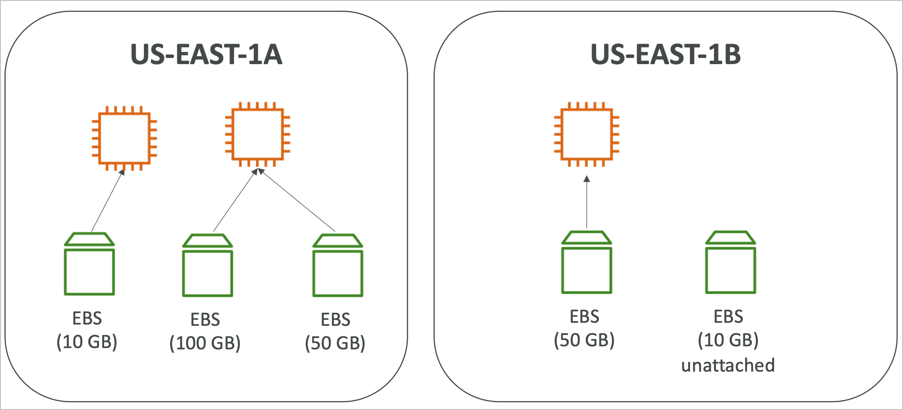
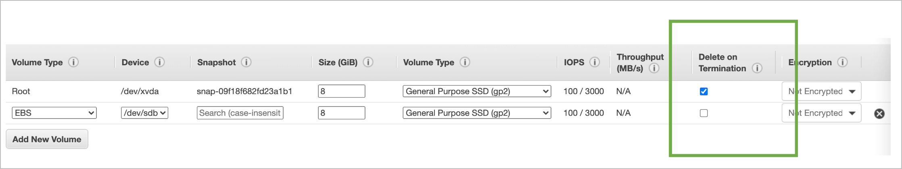
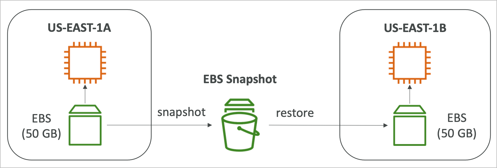
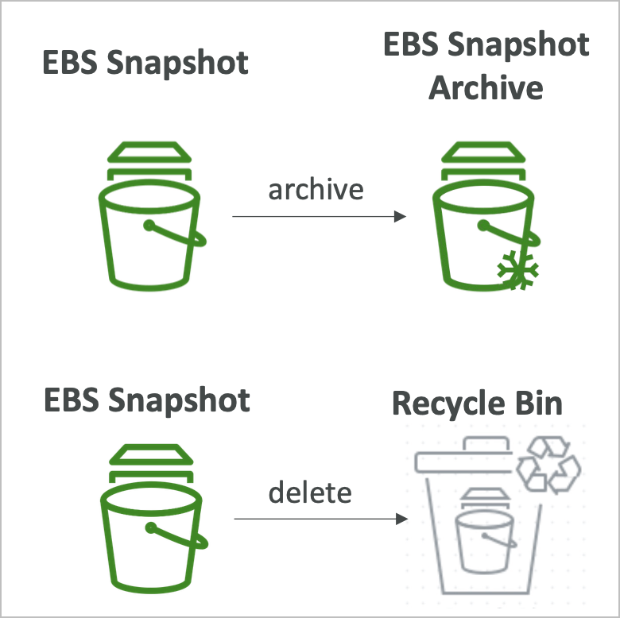
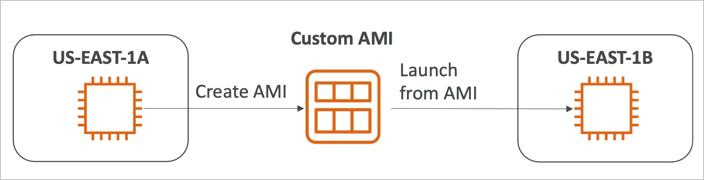
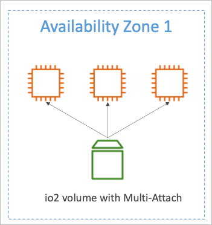

# EC2 Instance Storage

## EBS 볼륨

- EBS(Elastic Block Storage)는 네트워크 볼륨으로 인스턴스가 실행중에 붙여서 사용할 수 있는 저장소
  - 네트워크 드라이브이기 때문에 인스턴스와의 소통이 약간의 지연이 발생할 수 있음
  - 하나의 인스턴스에서 다른 인스턴스로 이동시킬 수 있음
- EBS에 저장된 데이터는 영속적이며, 이는 인스턴스가 종료되어도 유지할 수 있음
  - 기본적으로는 루트 볼륨에 한해서 인스턴스가 삭제될 때 같이 삭제되도록 설정됨 (delete on terminate)
- EBS 볼륨은 동시에 하나의 인스턴스에만 사용가능
  - 단, 특정 EBS 타입의 경우에는 동시에 여러대의 인스턴스에서 사용 가능한 기능이 있음
- AZ에 종속적임
  - us-east1a에 생성된 EBS를 us-east1b에 있는 인스턴스에 붙일 수 없음
  - 스냅샷 기능을 통해 특정 AZ에서 다른 AZ로 복사가 가능하기 때문에 이런 기능을 이용해서 옮겨야 함
- 무료티어에 30GB의 EBS 볼륨에 대해 제공되고 있음
- 사전정의된 사양에 의해 할당받아 사용하는 개념
  - 용량과 IOPS등을 정의하고 해당 사양만큼 미리 할당받아 사용가능
  - 필요에 따라서는 사용중인 EBS의 용량의 증설이 가능함

## EBS 볼륨의 인스턴스 삭제시 동작

- 기본적으로 루트 볼륨은 Delete on Termination이 on인 상태로 추가됨
- 루트 볼륨이 아닌 볼륨은 Delete on Termination이 off인 상태로 추가됨
- 이 설정은 언제든 변경이 가능하기 때문에, 인스턴스가 제거되더라도 데이터를 남기고 싶을 경우에는 이를 활용하면 됨
  - 단, 콘솔상에서는 불가능하고, CLI를 통해서 설정 변경 가능

## EC2 Snapshot

- 특정 시점의 EBS를 카피로 남기는 작업
- 스냅샷을 작성할때 볼륨을 꼭 비활성화 해야 할 필요는 없지만, 권장됨 (데이터 무결성을 위해)
- 카피된 스냅샷은 다른 AZ 혹은 리전으로 이동 가능

## EC2 Snapshot 기능

- EBS Snapshot Archive (스냅샷 아카이빙)
  - 스냅샷을 아카이브 티어로 옮기면 75% 저렴하게 보관할 수 있음
  - 다만, 복구시 즉시 되는것은 아니고 24~72시간까지 대기시간이 존재
- Recycle Bin (휴지통 기능)
  - 삭제된 스냅샷을 임시저장하는 공간으로 1일~1년간 복구 가능
- Fast Snapshot Restore (FSR)
  - 스냅샷을 복원하면 볼륨을 사용할 수 있도록 최적화 시간이 필요한데, 이를 최단기간으로 줄여주는 기능
  - 도큐먼트에 의하면 시간당 1TiB의 복원율을 지원한다고 함
  - 다만, 고비용이므로 사용시 주의가 필요

## AMI Overview (개요)

- AMI는 Amazon Machine Image의 약어
- EC2 인스턴스의 커스텀화 기능
  - 기본 OS에 다양한 최적화 설정, 소프트웨어등을 설치해두고 저장
  - 미리 설정되어 있으므로 초기 부트스트래핑이 필요없고 바로 설정된 상태로 사용 가능
- AMI는 리전에 종속적임 (다른 리전으로 복사 가능)
- 3가지 방식의 AMI가 존재
  - 퍼블릭 AMI
    - 아마존에서 제공하는 기본 OS AMI
  - 직접 작성한 AMI
    - 서비스에 최적화된 설정, 소프트웨어등을 직접 미리 설치해서 저장
  - 마켓 플레이스 판매 AMI
    - 각 벤더에서 직접 만들어낸 AMI로 특정 소프트웨어 등을 탑재했다거나 최적화된 설정을 한 상태로 판매하고 있음

## AMI의 작동방식 (EC2)

- EC2 인스턴스 시작 후 설정 등 커스터마이징
- 인스턴스 정지 (데이터 무결성을 위해)
- AMI 작성 (스냅샷도 동시에 작성됨 → AMI는 스냅샷 기반)
- 작성된 AMI로 다른 인스턴스 작성

## EC2 Instance Store

- EBS는 네트워크 드라이브이므로 대부분의 환경에 적합하지만, 네트워크 구성에서 오는 제약사항이 존재
- 초고성능의 하드디스크 IOPS가 필요한 경우에는 Instance Store를 이용가능
- EC2가 적재되어 있는 호스트에 직접 연결된 물리적인 하드드라이브를 이용하여 지연없는 성능 실현
- 전체적인 퍼포먼스가 증가하지만 임시적인 디스크로 인스턴스 정지 혹은 제거시 데이터가 삭제됨
  - 이는 장애로 인한 중지도 마찬가지이기 때문에 상시 데이터에 대한 보호 및 백업 필요
- 사용 사례
  - 캐시
  - 버퍼
  - 임시 데이터 저장소

## EBS 볼륨 타입

- 현재시점에 AWS에서 제공되는 볼륨 타입은 6종류가 있음
  - gp2 / gp3 (SSD)
    - 일반적인 사용목적의 SSD 볼륨으로 퍼포먼스와 가격면에서 균형잡힌 타입으로 대부분의 사용목적에 적합
  - io1 / io2 (SSD)
    - 고성능, 저지연의 퍼포먼스가 필요한 미션 크리티컬한 서비스에 적합한 타입으로 비용이 큼
  - st1 (HDD)
    - 저비용의 HDD 볼륨으로 자주 엑세스되고 처리량이 중요한 작업에 이용될 수 있음
  - sc1 (HDD)
    - 아주 저렴한 HDD 볼륨으로 아카이빙용으로 활용 가능한 볼륨타입
  - EBS 볼륨은 용량과 처리량, IOPS로 특성이 나누어져 있음
  - gp2/gp3, io1/io2 볼륨을 루트 볼륨(부팅 볼륨)으로 설정 가능함

### General Purpose SSD (gp)

- 비용 효율적이며, 저지연
- 시스템 부트 볼륨, 가상 데스크탑, 개발환경이나 테스트 환경 등 다양한 곳에 사용 가능
- 1GiB to 16 TiB까지 사용 가능
- gp3
  - 기본 3000 IOPS와 125MiB/s의 처리량을 지원
  - 개별적으로 IOPS와 처리량을 설정 가능함
- gp2
  - 용량에 따라서 IOPS가 16000까지 증가하는 타입
  - 3000 미만의 IOPS를 가진 용량을 설정할 경우 3000까지 자동으로 버스트 함 (크레딧이 존재함)
  - GiB당 3 IOPS를 제공하고 5333GiB를 넘기면 최대 IOPS에 도달

### Provisioned IOPS (PIOPS) SSD (io)

- IOPS 퍼포먼스가 중요한 비지니스 어플리케이션
- 또는 물리적으로 초당 16000 IOPS 이상을 요구하는 어플리케이션
- 데이터베이스 작업에 유용 (스토리지 퍼포먼스와 무결성에 민감한 DB)
- io1 / io2 (4 Gib to 16 TiB)
  - 니트로 EC2의 경우 최대 PIOPS를 64000까지 증가 가능
  - 니트로가 지원되지 않는 타입의 인스턴스는 32000까지 가능
  - io2가 io1에 비해 가격이 저렴하면서 더 좋은 내구성을 가지고 있으므로 io2를 많이 사용하는 추세
- io2 블록 익스프레스 (block express)
  - 4 GiB to 64 TiB
  - 밀리초 단위의 지연속도
  - 최대 PIOPS를 256000까지 제공함 IOPS:GiB 단위는 1000:1 이상이어야 함
- EBS 멀티 어태치(multi-attach)를 지원
  - 하나의 EBS를 동시에 여러개의 인스턴스에서 사용하는 기능

### Hard Disk Drives (HDD)

- 부트 드라이브로 사용 불가
- 125 MiB to 16 TiB
- 처리량 최적화된 HDD (st1)
  - 빅데이터, 데이터 웨어하우스, 로그 처리 등
  - 최대 처리량의 500 MiB, 최대 IOPS는 500까지 가능
- Cold HDD (sc1)
  - 자주 사용되지 않는 데이터의 아카이빙 용도
  - 저렴한 비용으로 많은 데이터를 저장하고 싶을 경우 사용
  - 최대 처리량은 250 MiB, 최대 IOPS는 250까지 가능

## EBS Multi-Attach io1/io2

- 같은 AZ에 있는 서로 다른 EC2에 같은 EBS 볼륨을 적용
- 모든 인스턴스가 EBS에 대해 RW권한을 전부 가지고 있으며 볼륨에 대한 최대 퍼포먼스가 적용됨
- 사용 사례
  - Teradata와 같이 고수준의 가용성을 요구하는 클러스터 리눅스 어플리케이션 등
  - 동시 쓰기 작업이 발생하는 어플리케이션
- 최대 16개의 인스턴스에서 동시에 사용 가능
- 일반적인 파일시스템이 아닌 클러스터 전용 파일시스템이 별도로 존재하는데 그것을 이용해야 함

## EBS Encryption

- 암호화된 EBS볼륨을 작성하면
  - 볼륨안의 모든 데이터가 암호화됨
  - 전송되는 모든 데이터가 암호화된 상태로 이동함
  - 볼륨에서 생성되는 스냅샷 또한 암호화됨
  - 암호화된 스냅샷에서 생성되는 볼륨도 전부 암호화됨
- 암호화와 복호화는 유저가 신경쓸 필요 없음 (백그라운드에서 모두 자동으로 처리됨)
- 암호화는 실제 사용상에는 거의 영향을 미치지 않음 (아주 적은 지연정도)
- EBS 암호화 키는 KMS의 것을 사용함 (AES-256)
- 암호화되지 않은 스냅샷을 복사할때 암호화 할수 있음

### 암호화: 암호화되지 않은 EBS 볼륨을 암호화하기

- 암호화되지 않은 볼륨으로부터 EBS 스냅샷을 작성
- 암호화되지 않은 스냅샷으로부터 복사할때 암호화를 설정
- 암호화된 스냅샷으로부터 암호화된 새로운 EBS 볼륨을 작성
- 인스턴스에 암호화된 볼륨을 사용
