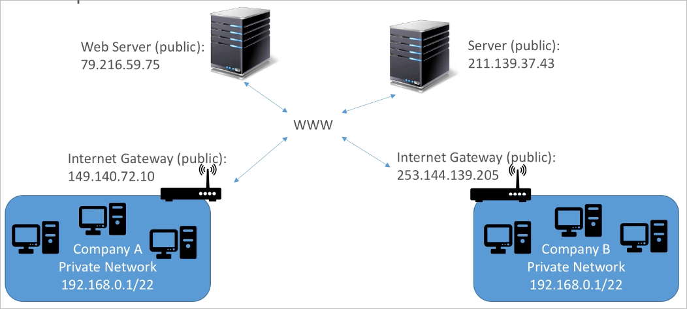
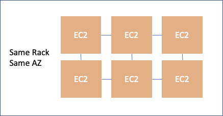
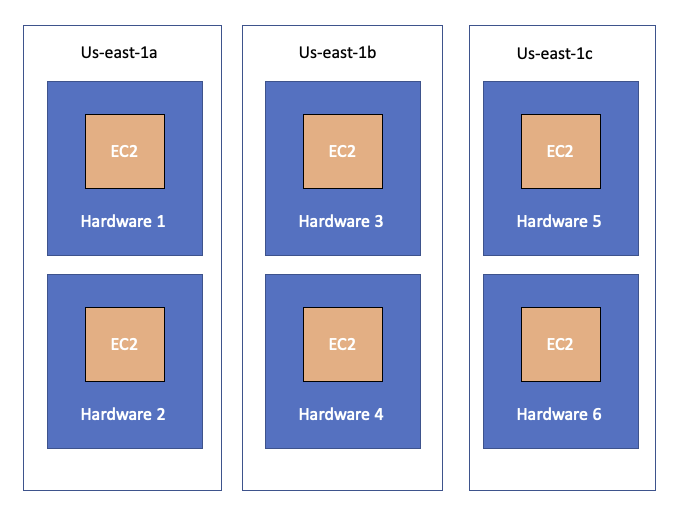
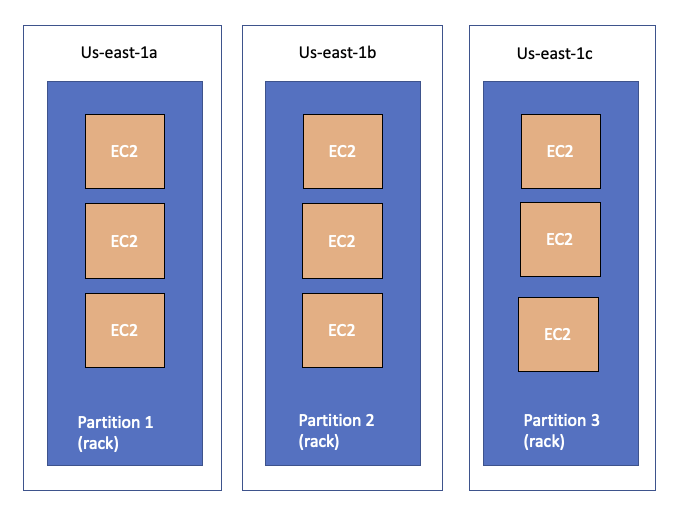

# EC2 SAA

## Private vs Public IP (IPv4)

- 네트워킹에서는 2가지 IP종류가 있는데, IPv4와 IPv6
  - IPv4
    - `1.160.10.240`
  - IPv6
    - `3ffe:1900:4545:3200:f8ff:fe21:67cf:ac10`
- IPv4가 일반적으로 온라인에서 많이 사용되는 형태
- IPv6는 IoT(Internet of Things)에서 많이 사용되는 새로운 형태로 IPv4의 문제점들을 해결한 버전
- IPv4는 370억개의 서로 다른 퍼블릭 주소를 가질 수 있으나, 현재 거의 고갈됨
- 주소의 형태로는 `[0-255].[0-255].[0-255].[0-255]`

## Private IP와 Public IP의 특징

### Public IP

- Public이라는 말은 인터넷상에서 특정이 가능하다는 의미
- 전세계 웹에서 유일하게 식별이 가능해야 함 (같은 Public IP를 다른 PC가 소유할수는 없음)
- 지리적으로 특정이 가능하게 설계되어 있음

### Private IP

- Private으로 설계된 네트워크 상에서 기기를 특정하기 위해 사용됨
- Private 네트워크 상에서 고유한 IP를 보유하면 됨
- 서로 연결되지 않은 네트워크 상에서는 같은 IP를 가질 수 있음
- Private 네트워크 하에 있는 기기는 인터넷을 통하기 위해서 인터넷 게이트웨이(프록시)를 통해야 함
- IPv4의 어느 특정 영역이 Private IP를 위해 고유한 범위를 위해 준비되어 있음
  - 10.0.0.0/8
  - 172.16.0.0 – 172.31.255.255
  - 192.168.0.0/16

## Elastic IPs

- EC2 인스턴스를 재기동하면 Public IP가 계속해서 변경됨
- 고정된 Public IP를 인스턴스에 부여하고 싶을때 Elastic IP를 이용
- Elastic IP는 삭제전까지 고유한 IPv4 주소를 할당받는 개념으로, 인스턴스에 부여 할 수 있음
  - 한번에 하나의 인스턴스만 사용 가능
- Elastic IP를 다른 기기에 붙이면 즉시 IP가 반영되므로 fail over등에 사용은 가능하지만 실무적으로 이러한 패턴을 도입하는 경우는 거의 없음
- 기본적으로는 계정당 5개의 EIP를 제공하지만 한도는 늘릴 수 있음
- EIP 자체를 이용하는 것은 지양하고, DNS이름이나 ELB를 이용하는것을 권장

## Placement Groups

- 서버를 운용하다보면, EC2 인스턴스의 배치 전략에 대해서 조정해야 할 필요가 있음
  - 이러한 전략은 placement groups을 통해서 정의 가능함
- 배치 그룹을 작성할때 다음중 하나의 전략을 설정 가능
  - Cluster
    - 단일 AZ내에 저지연의 그룹을 묶는 것
  - Spread
    - 같은 AZ내에서 서로 다른 하드웨어를 사용하게 하는 것
  - Partition
    - 파티션이라는 논리 그룹으로 설정해둔 랙(서버 하드웨어의 집합)단위로 분산하는 것

### Cluster

- 모든 인스턴스를 같은 AZ내에 같은 랙에 배치하는 패턴
- 장점
  - 인스턴스간 저지연 네트워크로 묶임 (10 Gbps 네트워크 안에서)
- 단점
  - 만약 랙에 장애가 발생하면 클러스터 내 모든 인스턴스가 동시에 영향을 받음
- 사용 예제
  - 고성능 네트워크 속도를 요구하는 빅데이터 작업
  - 어플리케이션 사양상 고성능 네트워크를 요구하는 제약사항이 있을 경우

### Spread

- 배포 전략에 사용되는 인스턴스의 배치를 AZ와 랙단위로 최대한 분리하는 패턴
- 장점
  - 물리적 내결함성이 강함 (모든 장비와 위치가 분산되어 있음)
- 단점
  - 배치 패턴에 사용되는 AZ당 최대 7개의 인스턴스만 사용 가능
  - 따라서, 대규모 분산에는 적합하지 않음
- 사용 예제
  - 내결함, 가용성이 최대로 요구되는 서비스
  - 서로간의 장애로 인해 영향을 최소화 하는 서비스

### Partition

- 단일 AZ당 최대 7개의 파티션을 생성 가능
- 파티션당 인스턴스를 100개 단위로 생성 가능하며, 같은 파티션은 같은 랙을 사용한다는 의미
- 인스턴스가 어느 파티션에 들어있는지 메타데이터를 통해 확인 가능
- 같은 파티션에는 고성능의 네트워크로 묶이고, 파티션을 각 리전의 AZ에 배포가능하므로 분산화도 노릴수 있는 패턴
- 사용 예제
  - 빅데이터 처리 작업
  - 대규모 분산 환경
