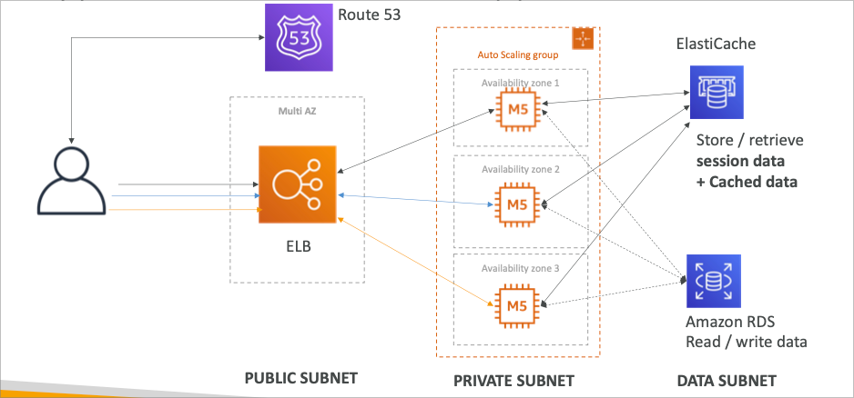

# Elastic Beanstalk

## AWS에서 개발자가 가진 문제점들

- 인프라 관리
- 코드의 배포
- 데이터베이스, 로드밸런서 등의 설정
- 인프라의 확장 방법

### 착안점

- 거의 대부분의 웹 어플리케이션의 구조는 비슷함
- 개발자는 코드를 실행시킬 곳이 필요함
- 가능하면 다른 어플리케이션에서 같은 방법과 환경관리를 원함

## Elastic Beanstalk 개요

- 엘라스틱 빈스토크는 개발자 시선에 맞춘 서비스 관리환경을 제공하는데 목적이 있음
- 서비스를 제공하는데 필요한 모든 인프라 관련 컴포넌트를 한데 묶어서 관리 가능
- 관리형 서비스
  - 서비스 용량 최적화, 로드밸런싱, 스케일링, 어플리케이션의 동작감시, 인스턴스 설정 등..
  - 개발자는 어플리케이션을 개발하는 코드와 코드를 업로드 할 수단만 준비하면 됨
- 직접 설정또한 가능하게 권한이 준비되어 있음
- 빈스토크 자체는 무료로 사용가능하지만, 언더라잉 인프라에 대한 과금은 발생함

## Components

- 어플리케이션
  - 엘라스틱 빈스토크 컴포넌트 세트 (환경, 버전, 설정 등등)
- 어플리케이션 버전
  - 어플리케이션 코드의 버전
- 환경
  - 특정 어플리케이션 버전에 종속되는 AWS 리소스들의 집합
  - Tiers (티어)
    - 웹 서버 티어
    - 워커 티어
  - 복수의 환경을 구성 가능 (dev, test, prod, …)

## Supported Platform

- Go, Java, .NET, Node.js, PHP, Python, Ruby, Packer, Single Container Docker, Multi-container Docker, Preconfigured Docker
- 플랫폼을 직접 만들수도 있음

## Web Server Tier vs Worker Tier

- 웹 환경 특징
  - ELB와 ASG로 이루어진 고가용성 구성
  - RDS 또한 추가 가능
- 워커 환경 특징
  - SQS를 기반으로 메시지 처리 인스턴스로 구성
  - 메시지 숫자에 따라서 ASG가 자동으로 인스턴스 수량을 조절함
- 웹 환경과 워커 환경을 복합적으로 구성할 수도 있음
