# High Availability and Scalability

- 확장성이 의미하는 것은 어플리케이션 / 시스템이 더 큰 부하를 견딜 수 있도록 늘어나는 것
- 확장에는 두가지 방식이 있음
  - 수직적 확장
  - 수평적 확장 (유연성이라고도 부름)
- 확장성은 곧 가용성과 직결됨

## 수직적 확장 (Vertical Scalability)

- 수직적 확장은 인스턴스의 크기를 증가시키는 것으로 설명됨
- t2.micro를 t2.large로 변경하게 되면 그만큼 CPU 및 RAM의 사용량 증가를 커버할 수 있음
- 분산이 불가능한 시스템에서는 수직적 확장이 필요하고 데이터베이스 등이 그 예임
- 하드웨어 제약으로 인해 무한정 증가시키기는 힘든 방식

## 수평적 확장 (Horizontal Scalability)

- 수평적 확장은 시스템/어플리케이션의 복제로 양을 늘리는 것으로 설명됨
- 수평적 확장은 분산 가능한 시스템에만 적용 가능
- 웹 어플리케이션과 모던 어플리케이션에서 주로 사용되는 방식
- 퍼블릭 클라우드의 등장으로 수평적 확장이 매우 쉬워짐 (클릭 몇번 혹은 자동으로 인스턴스 증설 가능)

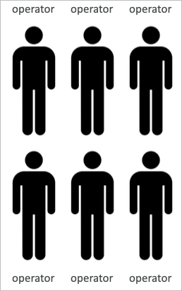

## 고가용성 (High Availability)

- 고가용성은 일반적으로는 수평적 확장으로 달성 가능
- 고가용성이란 어떤 어플리케이션/시스템이 2개 이상의 데이터 센터에서 동시 운영되고 있음을 의미 (데이터 센터는 AWS에서 AZ를 의미)
- 특정 데이터 센터에 장애가 생겨 전체를 사용할수 없게 되더라도 서비스가 유지되는 것
- AWS에서의 고가용성은 수동적 방식과 적극적 방식이 존재
  - 수동적 방식
    - RDS의 복수 AZ구성이나 EFS의 복수 AZ 구성처럼 사용자가 직접 관리하지 않아도 되는 방식
  - 적극적 방식
    - 서비스나 어플리케이션을 직접 EC2등에 탑재하여 복수로 구성하는 방식

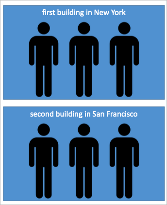

## EC2에서의 고가용성과 확장성

- 수직적 확장
  - EC2에서는 단순히 EC2의 사이즈를 증가시키는 방식으로 수직적 확장을 달성 가능
  - t2.nano (0.5GiB RAM, 1 vCPU)
  - u-l2tbl.metal (12.3TiB RAM, 448 vCPUs)
- 수평적 확장
  - 인스턴스를 복수 작성하면 수평적 확장을 달성 가능
  - 이를 위해 ASG (Auto Scaling Group), LB (Load Balancer) 등을 지원함

## Load balancing이란?

- 로드 밸런싱은 이름 그대로 트래픽을 여러 서버로 분산시키는 것

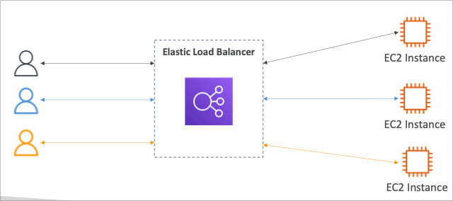

## Load balancer를 사용하는 이유

- 부하를 여러 EC2 인스턴스로 분산할 수 있음
- 하나의 접속 포인트만 공개할 수 있음 (LB의 DNS)
- 다운스트림 인스턴스의 장애를 원활하게 해결 가능
- 서비스에 대한 모니터링을 수행 가능
- SSL Termination (HTTPS)을 수행 가능
- 쿠키에 의한 stickiness 기능 지원
- 복수 AZ에 대한 고가용성 지원
- 내부적 트래픽과 외부에서의 트래픽을 분리 가능

## AWS ELB (Elastic Load Balancer)

- ELB는 AWS의 관리형 로드 밸런서
  - AWS가 직접 관리하고 작동을 보장
  - 내부적 업그레이드 및 유지보수, 고가용성을 알아서 관리해줌
  - AWS상에서 정말 필요한 일부 설정만을 사용자에게 위임
- ELB는 사용하려면 비용이 발생하지만 실질적으로 그 비용 이상의 가치가 있음 (관리비용 삭감 등)
- AWS의 다른 많은 서비스들과 유기적으로 연계되는 기능을 제공
  - EC2, EC2 ASG, ECS
  - AWS Certificate Manager (ACM), CloudWatch
  - Route 53, AWS WAF, AWS Global Accelerator

## Health Check (동작감시)

- 동작감시는 LB의 핵심 기능중 하나
- 다운스트림의 인스턴스를 주기적으로 감시 (요청/응답)
- 하나의 포트와 경로를 통해 주기적으로 요청을 보냄
- 응답이 200이 아닌 경우 해당 다운스트림 객체를 비활성화 하여 트래픽을 보내지 않음

## AWS의 LB타입

- AWS에서는 4가지 타입의 로드밸런서를 제공
- Classic Load Balancer (v1) 2009년 CLB
  - HTTP, HTTPS, TCP, SSL (secure TCP)
- Application Load Balancer (v2) 2016년 ALB
  - HTTP, HTPS, WebSocket
- Network Load Balancer (v2) 2016년 NLB
  - TCP, UDP, TLS (secure TCP)
- Gateway Load Balancer 2020년 GLB
  - 3계층 동작 IP 프로토콜
- 기본적으로 새롭게 구성할때는 신버전의 로드밸런서를 사용하는것이 기능적으로 권장됨
- 특정 로드밸런서에는 internal과 external로 트래픽을 대응하는 방식이 다른 것들이 있음

## 로드밸런서의 보안그룹

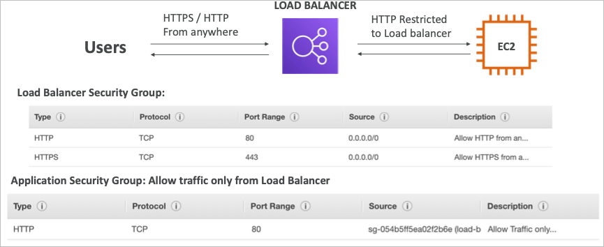

## Classic Load Balancer (v1)

- TCP(레이어4), HTTP & HTTPS(레이어7)을 지원
- TCP 또는 HTTP 베이스로 동작감시 수행
- CLB는 별도의 호스트네임으로 제공됨 (xxx.region.elb.amazonaws.com)

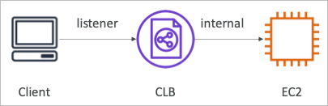

## Application Load Balancer (v2)

- 7계층을 지원하는 어플리케이션 로드 밸런서 (HTTP)
- 로드 밸런서는 복수의 HTTP 서비스를 로드 밸런싱 할 수 있음 (타겟 그룹)
- 같은 머신 안에 있는 복수의 서비스 또한 로드 밸런싱 가능 (컨테이너형태)
- HTTP/2와 웹소켓 지원
- 리다이렉트 지원 (HTTP를 HTTPS로 변환 등)
- ALB는 마이크로서비스와 컨테이너 베이스 어플리케이션에도 적합하게 사용 가능
  - ECS 또는 도커 어플리케이션
- 포트 매핑을 지원하므로 같은 인스턴스 내에 다이나믹 포트로 운영되는 서비스도 지원가능하기 때문임
- 따라서, 클래식 로드 밸런서였다면 하나의 호스트만 지원하기 때문에 못하는 다양한 기능들을 ALB에서 제공함

### 타겟그룹

- URI 베이스로 타겟 그룹 지정 가능
  - example.com/users
  - example.com/posts
- 호스트명 기반으로 타겟 그룹 지정 가능
  - one.example.com
  - other.example.com
- 쿼리스트링 또는 헤더 기반으로 타겟 그룹 지정 가능
  - example.com/users?id=123&order=false
  - JWT

### HTTP Based Traffic 도식

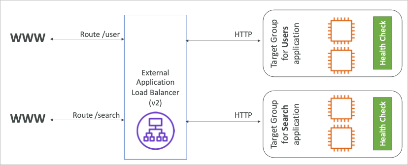

## Target Groups

- EC2 인스턴스 (HTTP)
  - ASG등으로 자동화된 관리도 가능
- ECS 태스크 (HTTP)
  - ECS에서 관리되는 동적 컨테이너
- 람다 함수
  - 서버리스 함수형 서비스로, HTTP 요청이 JSON 이벤트로 변환되어 전달됨
- IP 주소
  - 내부 IP 주소 (S2S VPN등을 연결한 사내망 온프레미스등에 직접 연결 가능)
  - 단, 내부 IP 주소만 사용 가능
- ALB는 복수의 타겟 그룹을 운영 가능
- 동작감시는 타겟그룹단위로 수행되기 때문에 각각의 서비스를 별도로 확인하고 처리하게 됨

## 쿼리스트링 / 패러미터 라우팅

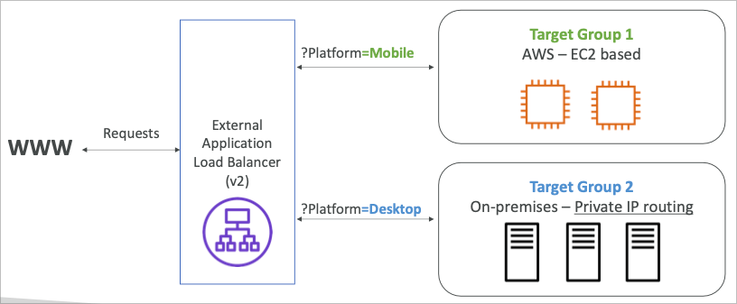

## ALB 추가정보

- ALB는 별도의 호스트네임으로 제공됨 (xxx.region.elb.amazonaws.com)
- 기본적으로 어플리케이션 서버에서는 클라이언트의 IP를 직접 알아낼 수는 없음
  - IP는 X-Forwarded-For 헤더명으로 기재됨
  - X-Forwarded-Port (포트), X-Forwarded-Proto (프로토콜) 또한 존재

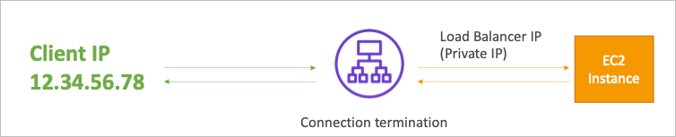

- 클라이언트는 로드밸런서를 거쳐서 들어오기 때문에 서버측에서는 로드밸런서의 아이피로만 표시됨

## Network Load Balancer (v2)

- 레이어4 로드 밸런서
  - TCP & UDP 트래픽을 로드 밸런싱
  - 초당 백만단위의 요청을 처리 가능
  - ALB에 비해 더 낮은 지연 (ALB ~400ms NLB ~100ms)
- NLB는 AZ당 퍼블릭 IP를 1개씩 노출 가능함
  - EIP를 이용하면 IP 고정 가능
  - IP로만 소통 가능한 특정 서비스들과 연계시 사용 가능
- TCP 또는 UDP 트래픽에 대해 고속 통신이 필요한 경우 주로 사용됨

## NLB 트래픽 (TCP)

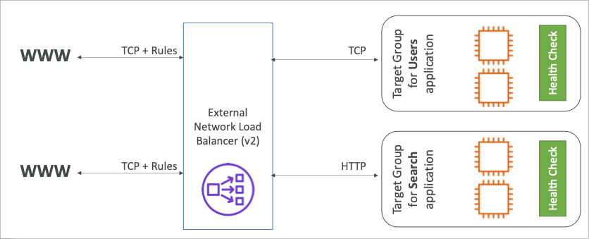

## NLB의 타겟그룹

- EC2 인스턴스
- IP 주소 (내부 주소)
- ALB
  - NLB와의 콤비네이션으로 IP주소 노출을 통한 엑세스 및 ALB의 HTTP 룰을 동시에 이용하기 위함
- NLB의 타겟그룹 동작감시는 TCP, HTTP, HTTPS 프로토콜로 진행됨

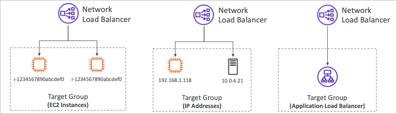

## Gateway Load Balancer

- AWS내에 서드파티 어플라이언스(방화벽, 패킷분석도구 등)를 설치해두고 사용하는 경우
- 게이트웨이 로드밸런서를 이용하여 어플라이언스 타겟 그룹을 생성하여 트래픽을 통과시킬 수 있음
- GLB는 레이어3(네트워크/IP패킷)에서 동작함
- Transparent Network Gateway
  - VPC내의 트래픽 경유지로 이용
- Load Balancer
  - 서드파티 어플라이언스에 트래픽 분산
- 내부적으로 GENEVE 프로토콜(포트 6081에서 동작)을 이용

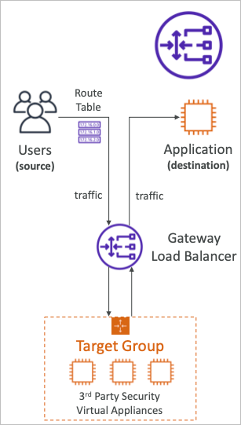

### 타겟그룹

- EC2 인스턴스
- IP 주소 (온프레미스 머신)

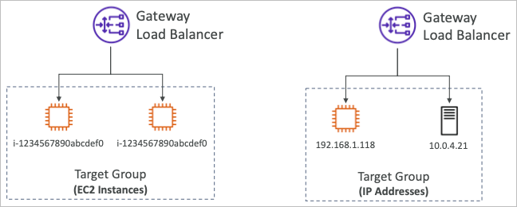

## 스티키 세션 (Sticky Sessions)

- 스티키 세션을 적용하는 것으로 같은 유저를 항상 같은 백엔드 인스턴스로 연결시키는 것이 가능
- CLB 혹은 ALB에서 제공하는 기능
- 내부적으로 쿠키를 이용하여 유저를 같은 인스턴스로 배분
- 세션 데이터등을 백엔드 인스턴스에 직접 저장하는 서비스의 경우 활용 가능
- 스티키 세션을 적용하면 세션 데이터는 보존할 수 있지만, 유저가 특정 서버에 몰릴 수 있음

### 쿠키 이름

- Application-based Cookie (어플리케이션 기반 쿠키)
  - 커스텀 쿠키
    - 타겟 서비스가 생성할 수 있는 쿠키
    - 어플리케이션의 요구사항에 따라서 쿠키이름을 설정 가능
    - 쿠키 이름은 각 타겟 그룹마다 유니크하게 적용해야 함
    - 쿠키의 이름을 AWSALB, AWSALBAPP, AWSALBTG 등으로 사용하면 안됨 (AWS에서 예약어로 사용중)
  - 어플리케이션 쿠키
    - 로드밸런서에 의해 자동으로 만들어지는 쿠키
    - 쿠키 이름은 AWSALBAPP
- Duration-based Cookie (시간기반 쿠키)
  - 로드밸런서에 의해 자동으로 만들어지는 쿠키
  - 쿠키 이름은 ALB의 경우 AWSALB이며, CLB의 경우에는 AWSELB가 됨

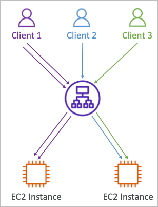
