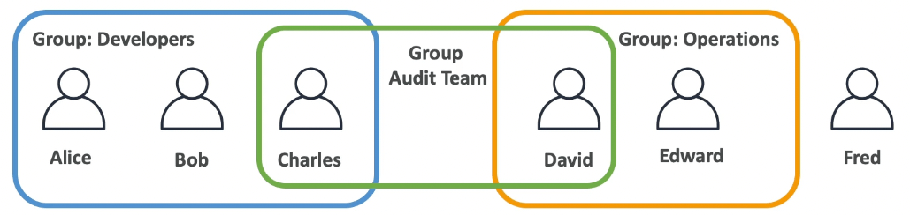
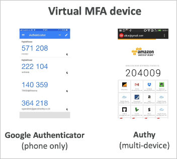

# IAM (Identity and Access Management)

## IAM 유저와 그룹

- IAM = `Identity and Access Management` (식별, 접근제한 관리)의 약어로 글로벌 서비스
- Root account (루트 계정)
  - AWS 계정의 총 관리자로 모든 권한을 보유함
  - 공유해서는 안되며, 유출되면 심각한 보안문제가 발생할 수 있음
- Users (유저 계정)
  - 조직내의 한 유저를 대변하는 계정
  - 유저는 그룹화 할 수 있음
- Groups (그룹)
  - 그룹은 유저를 포함할 수 있으며, 그룹이 다른 그룹을 포함할 수는 없음
- 유저는 되도록이면 최소 하나 이상의 그룹에 포함되어야 함 (AWS 권장사항)
- 동시에 복수 그룹에 속하는 유저가 있을 수 있음

## IAM 권한

- 유저와 그룹에 JSON 문서라고 부르는 정책을 할당할 수 있음
- 정책문서에는 각 AWS 서비스에 대한 어떠한 것들을 허가, 거부할지 기재되어 있음
- AWS 권고사항으로 정책은 최소한의 권한만을 부여하는것이 권장됨

## IAM 유저

- 유저를 작성해야 하는 이유
  - 기본적으로 AWS계정을 생성하면 이메일로된 루트 계정으로 진입하는데, 모든 권한을 가지고 있어서 유출될 경우 보안상 문제가 생길 수 있음
  - 기본적으로 AWS에서 권한을 통해 통제가능하기 때문에, 유저를 작성하고 권한을 할당하는것이 바람직함
- AWS 계정 alias 설정
  - 로그인시 계정이름이 12자리 숫자가 되므로, 알기 쉬운 명칭으로 계정명을 추가할 수 있음

## IAM 정책

- IAM 정책은 유저 혹은 그룹에 직접 붙일 수 있음
- 그룹에 정책을 설정하게 되면, 해당 그룹안에 있는 모든 유저가 권한을 얻게 됨
- IAM 정책은 유저에 직접 설정할 수 있고, 정책을 마스터화 하여 만들수도 있지만 직접 인라인으로 설정하여 마스터 없이 바로 정책을 적용할 수 있는 옵션이 있음
- 유저는 동시에 여러 그룹에 속할 수 있기 때문에, 여러 그룹에 속한 유저는 여러 그룹의 정책에 영향을 받음

## IAM 정책 구조

### Version

- IAM 정책 버전으로 `2012-10-17`이 현재 고정적으로 사용되고 있음

### Effect

- 하위 기술할 Principal, Action에 정의된 서비스 및 서비스에서 실행할 액션이 궁극적으로 허가인지 거부인지 결정

### Principal

- 연관되어 있는 AWS 관련 계정 및 유저

### Action

- 연관된 서비스 및 실행할 액션

### Resource

- 액션이 실행될 서비스 및 위치 (서비스에 따라 기술방법에 약간 차이가 있음)

## IAM 비밀번호 정책

- 비밀번호 정책 설정으로 계정 보안을 강화할 수 있음

### AWS 비밀번호 정책

- 비밀번호의 최소 길이
- 비밀번호에 특정 문자 타입 포함
  - 대문자
  - 소문자
  - 숫자
  - 알파벳이 아닌 기호
- IAM 유저에게 비밀번호 설정 가능여부 선택
- 일정시간이 지난 후 반드시 비밀번호를 변경하도록 강요 (비밀번호 만료일 설정)
- 비밀번호 재사용 금지 정책

## 다요소 인증 (MFA)

- 유저의 권한에 따라서는 AWS의 리소스를 삭제하거나 변경할 수 있음
- 특히, `Administrator` 권한을 가지고 있는 유저나 루트 계정의 경우 모든 권한을 가지고 있기 때문에 계정 보안을 보다 주의깊게 살펴야 함
- MFA는 알고있는 것 + 가지고 있는 것을 이중으로 인증하기 때문에 만약 비밀번호가 누출된다 하더라도 임시 번호가 발급되는 디바이스(예를 들어 스마트폰 등)가 없다면 로그인이 불가능하게 됨

## 다요소 인증에 사용되는 옵션

- 다양한 물리적, 소프트웨어적 방식으로 다요소 인증이 가능하도록 지원하고 있음

## AWS에 접속하는 방법

- AWS에 접속하기 위해서는 3가지 옵션이 존재
  - `AWS Management Console` (관리콘솔) → 비밀번호와 MFA로 인증
  - `AWS CLI` (`Command Line Interface`) → 엑세스 키로 인증
  - `AWS SDK` (`Software Development Kit`) → 엑세스 키로 인증
- 엑세스 키는 AWS 관리콘솔에서 만들 수 있음
- 유저별로 각각 고유한 엑세스 키를 생성 가능
- 엑세스 키와 시크릿은 비밀번호와 같이 절대 공유해서는 안되는 정보
- `ACCESS_KEY_ID` = 유저명
- `SECRET_ACCESS_KEY` = 비밀번호

## CLI란 무엇인가?

- AWS 서비스에 커맨드라인으로 접근할 수 있는 도구로 웹페이지가 아닌 쉘에서 직접 AWS와 소통가능하게 도와줌
- AWS 서비스에 대한 API를 통해서 접근하는 구조

## SDK란 무엇인가?

- AWS 소프트웨어 개발 킷의 약어로, 특정 언어에 종속된 API라고 볼 수 있음
- AWS 서비스를 프로그래밍적으로 컨트롤 가능하도록 도와줌
- 어플리케이션에서 SDK를 이용하면 AWS와 연계할수 있음
- 지원 언어들
  - `SDKs` (자바 스크립트, 파이썬, `PHP`, `.NET`, `Ruby`, `Java`, `Go`, `Node.js`, `C++` 등)
  - `Mobile SDKs` (안드로이드, iOS, 등)
  - `IoT Device SDKs` (임베디드, 아두이노 등)
- `AWS CLI` 또한 `AWS SDK`를 이용한 툴 (내부적으로는 파이썬을 이용)

## AWS CloudShell

- AWS CLI가 설치된 상태로 사용 가능한 임시 쉘 머신
  - 계정정보는 로그인된 사용자와 연동됨
- 파일 업로드나 다운로드도 쉽게 가능함

## IAM 역할

- IAM 정책을 그룹이나 유저에 부여해서 유저에게 권한을 줄 수 있다는 점은 알고 있지만, AWS 서비스가 다른 AWS 서비스를 호출할때의 권한은 어떻게 조절할까
- IAM 역할이 그러한 기능을 수행하는데, 역할은 유저처럼 동작하며, 역할에 여러가지 정책들을 부여할 수 있음
- IAM 역할을 AWS 서비스에 부여하면, 해당 AWS 서비스는 IAM 역할에 부여된 권한으로 AWS의 다른 서비스들과 소통할 수 있게 됨
- 주로 사용되는 역할들
  - EC2 인스턴스 역할
  - 람다 함수 역할
  - 클라우드포메이션 역할

## IAM 보안 도구 (security tools)

### IAM Credential Report (account-level)

- 계정 내 모든 유저의 Credential(권한 식별자)의 상태를 보여주는 레포트 도구

### IAM Access Advisor (user-level)

- 유저에게 부여된 권한과 해당 권한이 마지막으로 사용된 일자를 보여줌
- 이 정보를 이용해서 부여된 권한의 재검토를 해 볼수 있음 (예를 들면, 필요없는 권한은 삭제하거나 등)

## IAM 가이드라인, BP (Best Practice)

- 루트 계정은 어떠한 경우에도 사용하지 말것
- 1명당 하나의 계정을 가져야 함 (공유 금지)
- 될수 있다면 유저를 그룹에 포함시켜서 권한관리 해야 함
- 비밀번호 설정을 복잡하게 해 둘것
- MFA의 사용을 강제할 것
- AWS 서비스에 권한을 줄 때는 IAM 역할을 사용할 것
- CLI / SDK를 위한 엑세스 키 사용을 검토할 것
- IAM Credential 레포트를 적절히 사용하여 종종 권한과 접근상황을 검토할 것
- 절대로 IAM 유저나 엑세스 키를 공유하지 말 것
