# Identity and Access Management Advanced

## Sample OU

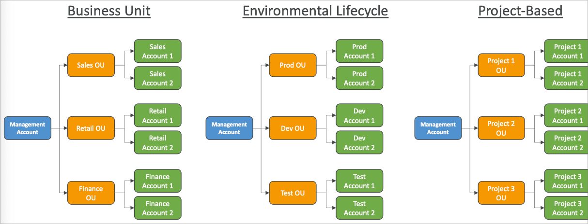

## AWS Organizations

- 글로벌 서비스
- 복수 AWS 계정을 관리할 수 있도록 도움을 주는 서비스
- 메인 계정이 관리 계정(management account)이 됨
- 다른 계정은 멤버 계정(member accounts)으로 소속됨
- 멤버 계정은 하나의 organization에 속할 수 있음 (복수 가입 불가)
- 모든 계정에서 발생하는 비용을 하나로 통합 가능
- 사용량에 따른 과금 방식이 하나로 통합되어 사용량 이점을 얻을 수 있음 (볼륨 할인)
- 예약 인스턴스와 절약 플랜을 전 계정에 통합으로 적용 가능
- AWS 계정 생성에 대한 자동화 API를 이용 가능하게 됨

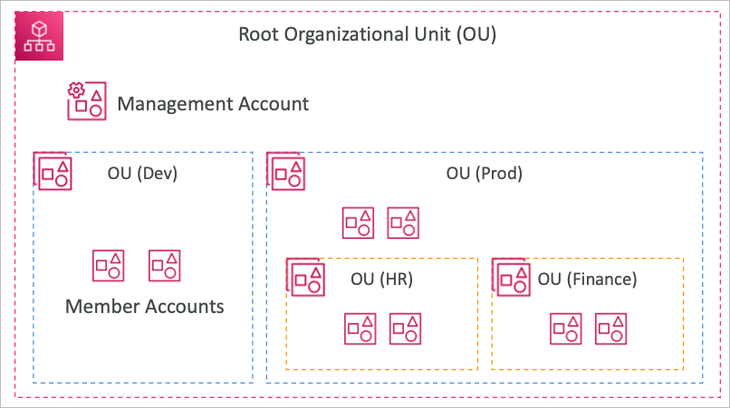

### 이점

- 복수 계정 vs 하나의 계정안에 다중 VPC 운용
- 태깅을 이용한 청구 관리
- 모든 계정의 CloudTrail 적용 및 중앙 S3 계정으로의 로그 송신
- CloudWatch Logs의 중앙화
- 관리 목적의 크로스 계정 역할 배포

### 보안 (Service Control Policies: SCP)

- OU나 계정에 대한 통합 IAM 정책 적용
- 관리 계정에는 적용되지 않음 (최고 관리자 권한)
- IAM처럼 명시적 허용이 필요 (기본 거부)

## SCP 상속도

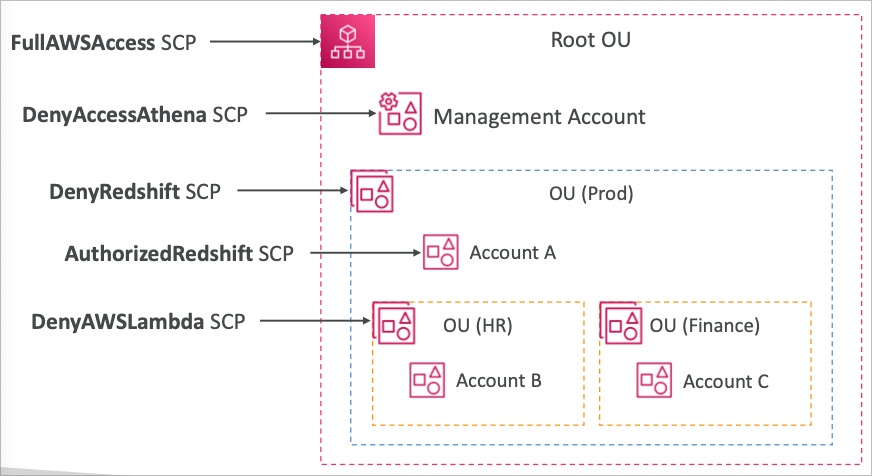

### 관리 계정

- 어떤 것도 할 수 있음 (SCP 적용 안됨)

### Account A

- 어떤 것도 할 수 있음 (FullAWSAccess) Root OU 정책
- Redshift에 대한 접근 거부 (DenyRedshift) Prod OU 정책

### Account B

- 어떤 것도 할 수 있음 (FullAWSAccess) Root OU 정책
- Redshift에 대한 접근 거부 (DenyRedshift) Prod OU 정책
- Lambda에 대한 접근 거부 (DenyAWSLambda) HR OU 정책

### Account C

- 어떤 것도 할 수 있음 (FullAWSAccess) Root OU 정책
- Redshift에 대한 접근 거부 (DenyRedshift) Prod OU 정책
- Lambda에 대한 접근 거부 (DenyAWSLambda) Finance OU 정책

## SCP 샘플

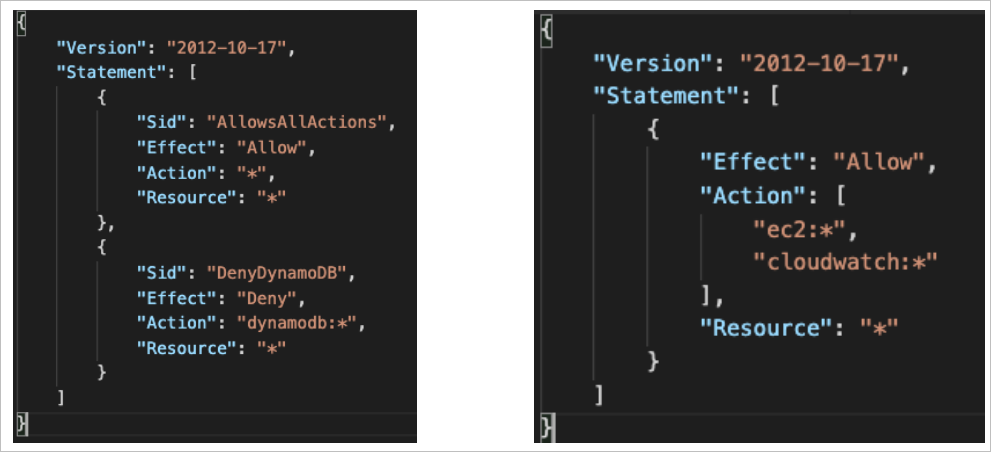

- 블랙리스트
- 화이트리스트

## IAM 조건

### aws:SourceIp

- 특정 IP에 대한 조건식

```json
{
  "Version": "2012-10-17",
  "Statement": [
    {
      "Effect": "Deny",
      "Action": "*",
      "Resource": "*",
      "Condition": {
        "NotIpAddress": {
          "aws:SourceIp": ["192.0.2.0/24", "203.0.113.0/24"]
        }
      }
    }
  ]
}
```

### aws:RequestedRegion

- API 요청이 들어오는 리전을 제어하는 조건식

```json
{
  "Version": "2012-10-17",
  "Statement": [
    {
      "Effect": "Deny",
      "Action": "*",
      "Resource": "*",
      "Condition": {
        "StringEquals": {
          "aws:RequestedRegion": ["eu-central-1", "eu-west-1"]
        }
      }
    }
  ]
}
```

### ec2:ResourceTag

- 태그 기반으로 제어하는 조건식
- aws:PrincipalTag (사용자에 대한 태그 평가)

```json
{
  "Version": "2012-10-17",
  "Statement": [
    {
      "Effect": "Allow",
      "Action": ["ec2:startInstances", "ec2:StopInstances"],
      "Resource": "*",
      "Condition": {
        "StringEquals": {
          "ec2:ResourceTag/Project": "DataAnalytics",
          "aws:PrincipalTag/Department": "Data"
        }
      }
    }
  ]
}
```

### aws:MultiFactorAuthPresent

- MFA를 강제

```json
{
  "Version": "2012-10-17",
  "Statement": [
    {
      "Effect": "Allow",
      "Action": ["ec2:*"],
      "Resource": "*"
    },
    {
      "Effect": "Deny",
      "Action": ["ec2:*"],
      "Resource": "*",
      "Condition": {
        "BoolIfExists": {
          "aws:MultiFactorAuthPresent": false
        }
      }
    }
  ]
}
```

## IAM for S3

- 버킷단위 정책과 오브젝트 단위 정책을 구별할 줄 알아야 함
- s3:ListBucket은 대상이 arn:aws:s3:::test 등과 같이 지정되며, 버킷단위 정책임
- s3:GetObject, s3:PutObject, s3:DeleteObject 등과 같이 뒤에 Object가 붙은 API는 오브젝트 단위 정책으로 버킷 뒤에 키 이름을 명시해야 함 arn:aws:s3:::test/\*

## Resource Policies & aws:PrincipalOrgID

- aws:PrincipalOrgID는 Organization을 통한 OU로 자격을 한정할때 사용됨

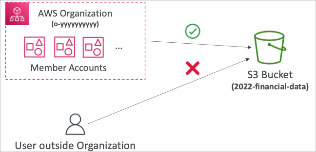

## IAM Role vs Resource Based Policies

- 크로스 계정
  - 계정 B의 리소스 기반 정책을 통해 계정 A의 유저의 접근을 허용
  - 계정 A유저가 계정 B의 유효한 정책을 지닌 유저의 권한을 취득하여 접근

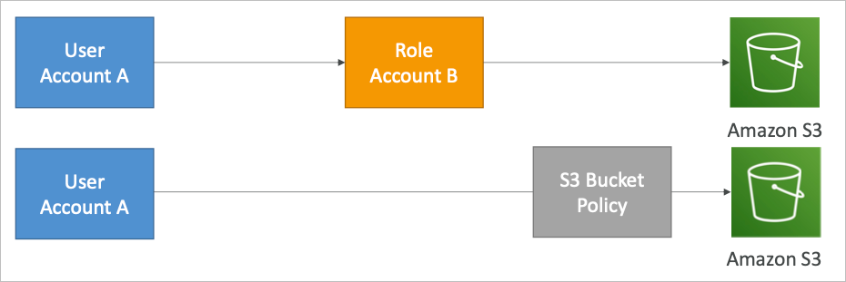

### 무슨 차이가 있지?

- 권한을 취득한다는 것은 현재의 권한을 포기한다는 것이기 때문에 오리지널 권한을 잃어버리게 됨
- 리소스 기반 정책에 의해 접근할 수 있다는 의미는 원래의 권한이 유지된다는 것을 의미
- 계정 B의 유저로 권한을 취득하는 것은 계정 B에서의 작업만이 허용되고, 계정 A에는 접근 권한이 없기 때문에 연계 작업시에 유의해야 함

### Amazon EventBridge

- AWS에서는 IAM 역할이 필요한 서비스와 리소스 기반 정책을 지원하는 서비스가 나뉘어 있음
- 리소스 기반 정책 지원: SNS, SQS, CloudWatch Logs, API Gateway 등
- IAM 역할 지원: Kinesis Stream, Systems Manager, Run Command, ECS Task 등

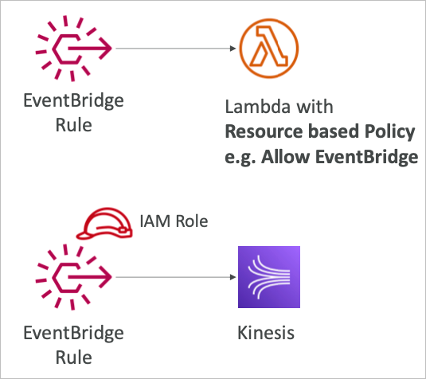

- 따라서 각각의 서비스에 맞게 EventBridge Rule을 리소스 기반으로 허용하거나 IAM 역할을 부여해야 함

## IAM Permission Boundaries

- IAM 권한 영역은 유저에게 혹은 역할에 적용될 수 있는 범위를 한정짓는 것
- IAM 정책을 결정할때 영역에 설정되어 있는 권한 범위만 영향을 받게 됨 (나머지는 무효)
- Organization SCP와 연계하여 유저의 최종 권한을 좁혀나갈 수 있게 됨

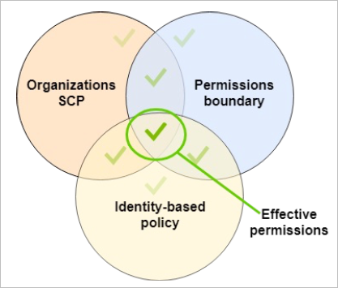

## IAM 정책 평가 로직

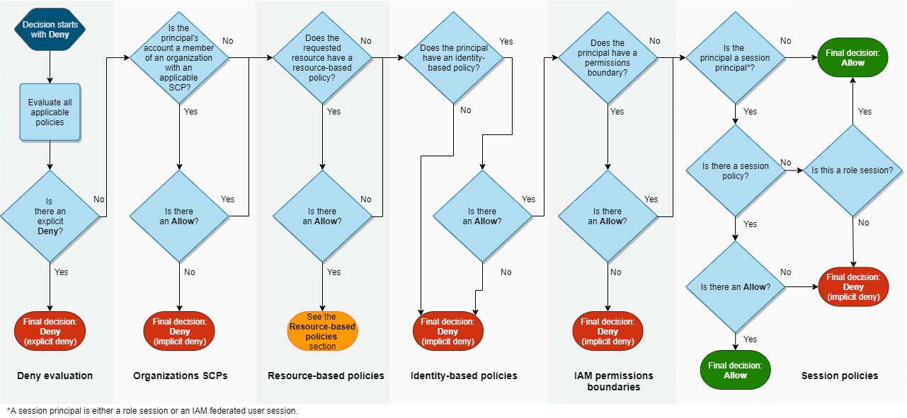

## Amazon Cognito

- 웹 또는 모바일에서의 유저 인증 수행
- Cognito User Pools
  - 앱 유저를 위한 로그인 기능 지원
  - API Gateway 또는 ALB와 연계
- Cognito Identity Pools (Federated Identity)
  - AWS 크레덴셜을 제공하여 AWS 리소스 접근을 허용
  - Cognito User Pool 및 각종 Identity provider와 연계
- Cognito vs IAM: 코그니토는 수많은 유저, 모바일, SAML등의 포인트 워드가 존재함

## Cognito User Pool (CUP)

- 서버리스 데이터베이스를 통해 유저 인증을 수행
- 간단 로그인: 유저명/패스워드, 이메일 등
- 패스워드 리셋
- 이메일, 모바일 인증
- MFA 적용
- Facebook, Google, SAML등 연계

### API Gateway 및 ALB와의 연계

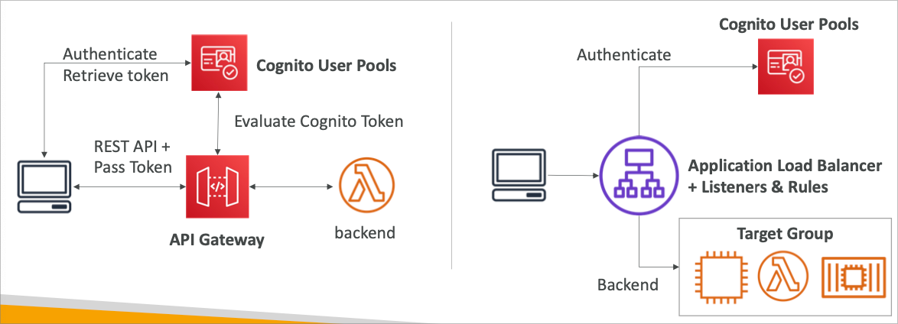

## Cognito Identity Pools (Federated Identities)

- AWS 서비스에 임시 접근하기 위한 토큰(크레덴셜)을 발행
- 유저는 CUP 또는 기타 서드파티 로그인과 연계 가능
- 인증된 유저는 API Gateway에 직접 접근 가능
- Cognito에 정의된 IAM 정책에 해당하는 크레덴셜을 획득
- user_id 기반으로 유저별 권한을 커스터마이징 가능
- 기본 IAM 롤이 존재하며, 게스트 유저에게 적용됨

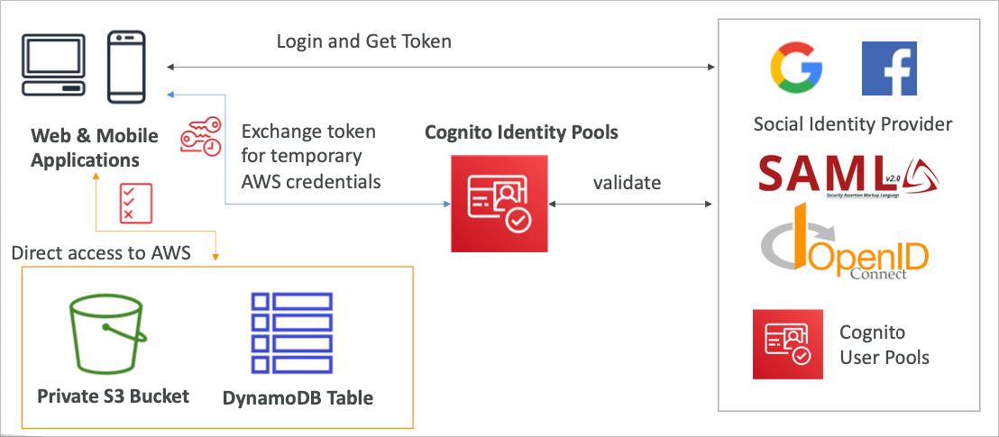

## AWS IAM Identity Center (AWS Single Sign-On)

- 로그인 한번을 통해 연동
  - AWS 계정 컨트롤
  - 비지니스 클라우드 어플리케이션 (세일즈포스, 박스, 마이크로소프트 365 등)
  - SAML 2.0 기반 어플리케이션
  - EC2 윈도우 인스턴스
- 인증 제공자
  - IAM Identity Center에서 제공되는 빌트인 인증
  - 서드파티 인증 (AD, OneLogin, Okta 등)

### Login Flow

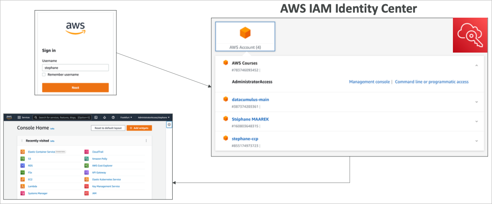

### 연동 서비스

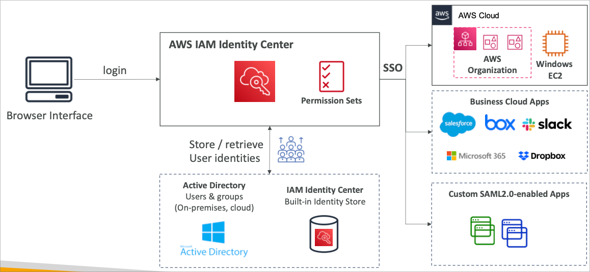

## Fine-Grained Permissions and Assignments

### 다중 계정 권한

- Organization 내의 복수 계정에 대한 접근 권한 관리
- 권한 셋: AWS 엑세스에 대한 유저와 그룹 IAM 정책 컬렉션

### 어플리케이션 적용

- SSO 접근을 통한 SAML 2.0 대응 비지니스 어플리케이션
- URL, 인증서, 메타데이터 제공

### Attribute-Based Access Control (ABAC)

- IAM Identity Center에 저장된 유저의 속성값에 의한 Fine-Grained 권한 조절
- Cost Center, title, locale 등
- 권한을 한번 적용하고 AWS에서 속성값에 따라 다른 접근방식을 허용

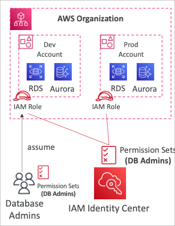
