# Integration & Messaging

- 여러개의 어플리케이션을 배포하게 되면 상호간에 연동이 필요
- 어플리케이션의 연동에는 두가지 패턴이 있음

### 동기적 커뮤니케이션

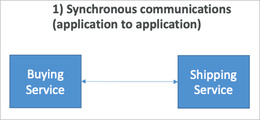

### 비동기적 커뮤니케이션

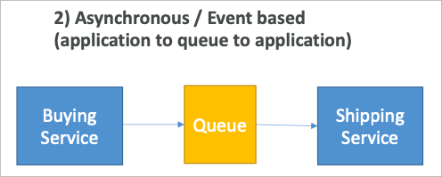

- 동기적 커뮤니케이션의 경우 주고받는 어플리케이션에 문제가 생길 경우 문제가 전파됨 (요청이 불가, 응답이 오지 않음)
- 문제가 전파되는 것을 막기 위해서는 어플리케이션의 소통을 연결짓지 않고 중개자를 둘 필요가 있음
  - SQS 큐 모델
  - SNS 발행자 구독자 모델
  - Kinesis 실시간 스트리밍 모델
- 이러한 서비스들은 어플리케이션의 확장성을 크게 증가시켜 줌

## Amazon SQS

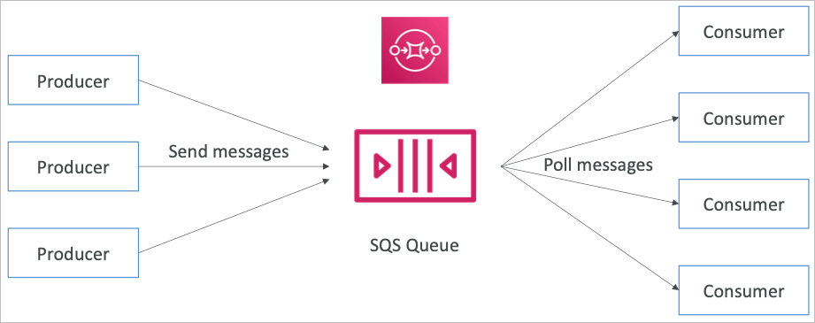

## Standard Queue

- AWS의 서비스 중 가장 오래된 서비스
- 완전 관리형 서비스로, 어플리케이션을 디커플링하기 위해 사용
- 특징
  - 무제한 처리량, 무제한 메시지 저장 가능
  - 기본 메시지 저장 기간 4일, 최대 14일
  - 저지연 (<10ms 퍼블리싱, 리시빙)
  - 하나의 메시지 당 최대 256KB를 담을 수 있음
- 중복 메시지가 발생할 수 있음 (최소 1번은 전달됨을 보장)
- 반드시 순서대로 처리되는 것은 아님 (최대한 순서대로 처리하려고 함)

## 메시지의 생산 (생산자)

- SDK를 이용해서 메시지를 생산할 수 있음 (SendMessage API)
- 메시지는 소비자가 처리할 때 까지 계속해서 보존됨
- 메시지는 기본 4일, 최대 14일까지 설정한 기간동안 처리되지 않으면 소실됨
- 예를 들어 주문을 처리한다고 하면 메시지 내용으로는
  - 주문ID
  - 고객ID
  - 기타 다른 속성들
- SQS 스탠다드는 무제한 처리량을 지원

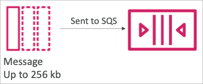

## 메시지의 처리 (소비자)

- 소비자는 EC2 인스턴스, 서버 혹은 AWS 람다 등이 됨
- SQS 메시지를 폴링 (최대 10개까지 한번에 가져올 수 있음)
- 메시지를 처리함 (RDS에 메시지를 입력한다거나, 처리는 자유)
- 처리된 메시지를 SQS에서 삭제 (Delete Message API)

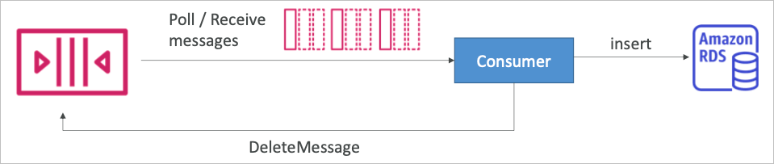

## EC2 인스턴스 복수 소비자

- 소비자는 병렬적으로 메시지를 폴링하여 처리할 수 있음
- 메시지는 최소한 1번은 전달됨
- 메시지의 생산순서에 최대한 맞춰줌
- 소비자는 메시지가 처리되면 삭제함
- 소비자를 수평적 확장을 통해 메시지의 처리량을 극대화 할 수 있음

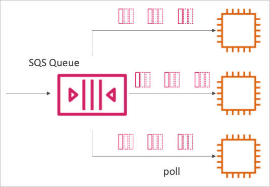

## SQS와 ASG와의 연계

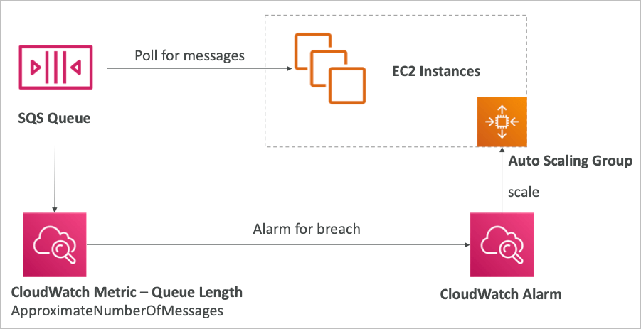

- SQS 큐 메시지 숫자에 따라서 일정 숫자가 되면 클라우드워치 알람을 생성하고, 해당 알람에 따라서 ASG에서 인스턴스 숫자를 증가시킬 수 있음

## SQS로 어플리케이션 티어간 디커플링을 구현

- 프론트엔드의 처리량과 백엔드의 처리량이 다르기 때문에, 인스턴스 그룹을 별도로 생성할 수 있음
- 프론트엔드 그룹과 백엔드 그룹을 1:1로 매칭하는 것이 아닌, 사이에 큐를 놓고 메시지를 받아서 처리하게 하면 프론트엔드의 부하와 백엔드의 부하를 각각 측정하여 ASG를 다른 조건하여 가동시킬 수 있음

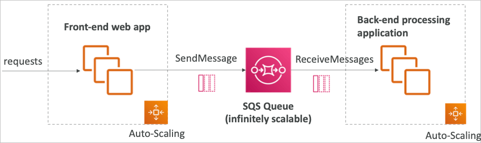

## SQS Security

- 암호화
  - HTTPS API를 이용한 전송 중 암호화
  - 큐 내의 데이터를 KMS Key를 이용한 암호화
  - 클라이언트가 직접 암호화 복호화를 원한다면 클라이언트 사이드의 암호화도 허용
- 접근 제어
  - IAM 정책을 이용하여 SQS API 접근 권한을 설정 가능
- SQS 접근 정책 (S3의 버킷 정책과 비슷)
  - 다른 AWS 계정의 SQS Queue 접근 권한 설정
  - 다른 서비스 (SNS 또는 S3 등) 에서의 R/W 권한 설정

## Message Visibility Timeout

- 소비자에 의해 메시지가 폴링되면, 다른 소비자들에게는 메시지가 보이지 않음
- 기본적으로 메시지 가시 타임아웃은 30초로 설정되어 있음
- 따라서 기본적으로 30초간 메시지 처리 시간이 주어지게 됨
- 메시지 가시성 타임아웃 시간이 지난 후에는 SQS에서 해당 메시지가 다시 소비자들에 의해 처리될 수 있음

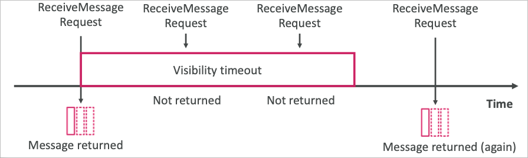

- 메시지가 처리중에 타임아웃이 지나버리면 메시지가 중복 처리될 수 있음
- 따라서 소비자는 메시지 처리에 시간이 더 소진될 것 같으면 ChangeMessageVisibility API를 이용해 이 시간을 변경할 수 있음
- 너무 많은 시간을 설정해버리고 만약 소비자에 문제가 생겨서 처리에 실패하면 해당 시간동안 다른 소비자들이 메시지를 처리하지 못하게 될 수도 있음
- 또한 너무 짧은 시간을 설정해버리면 메시지의 중복 처리가 발생할 수도 있음

## Long Polling

- 소비자는 큐에 있는 메시지를 폴링할 때 큐에 메시지가 없는 상태여도 최대 20초간 대기하며 메시지를 기다릴 수 있음
- 이를 긴 폴링이라고 하는데, API 요청 수를 줄이기 위한 좋은 방법임
- 또한, 메시지를 기다리면서 메시지가 들어올 경우 즉시 받아서 처리할 수 있기 때문에 처리 지연시간 감소에도 도움이 됨
- 이러한 장점으로 인해 짧은 폴링보다 긴 폴링이 선호됨
- WaitTimeSeconds API를 이용하여 얼마나 길게 폴링할지 요청 단계에서 설정 가능

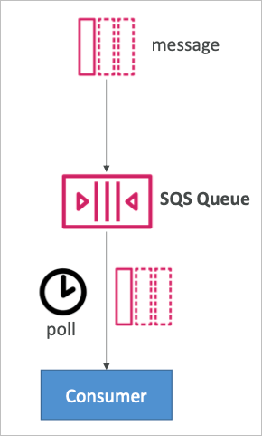

## FIFO Queue

- FIFO = First In First Out

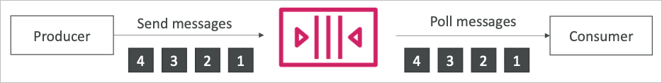

- 생산자가 입력한 메시지의 순서를 보장
- 순서를 보장하기 위해 처리량이 무제한이 아님
  - 초당 300 메시지 (배치없이), 초당 3000 메시지 (배치, 10개 메시지를 한번에 가져오기)
- 정확하게 한번만 들어오고 나감 (중복제거)
- 소비자에 의해 처리되는 메시지는 정확하게 순서대로 이루어짐

## SQS의 DB 전달자 패턴

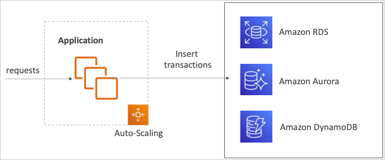

- 어플리케이션 레이어의 EC2 플릿이 데이터베이스와 직접 연결되어 있을 경우
  - 어느 순간에 DB쪽 처리량을 넘어서면 트랜잭션이 소실될 수 있음 (혹은 에러)

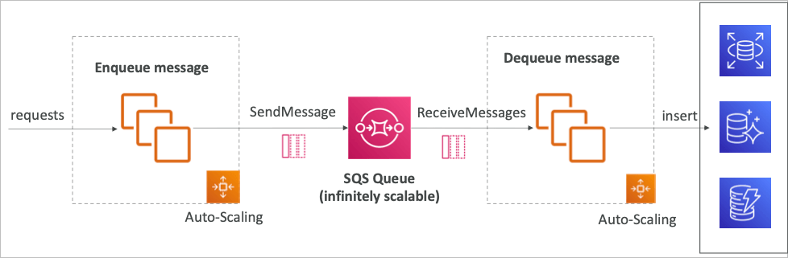

- SQS를 RDS의 전달자 EC2 플릿의 매개체로 선택해서 RDS가 감당 가능한 만큼의 쓰기 작업을 최대치로 정할 수 있음
  - EnQueue DeQueue 패턴

## Amazon SNS

- 메시지 하나를 다른 여러 서비스들에 보내고 싶을 때

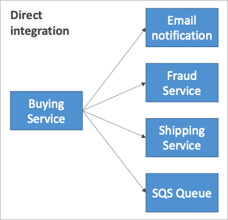

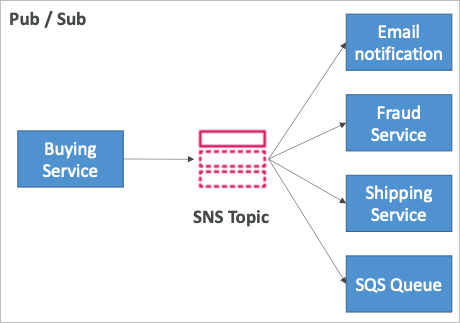

- 직접 서비스들과 연계하여 메시지를 작성할 수도 있지만, 디커플링을 위해 서비스는 SNS를 통해 메시지를 발행하고 구독자(연계하는 다른 서비스)에서 발행된 메시지를 보게 할 수도 있음
- 이를 발행자 구독자 패턴이라고 함
- 이벤트 발행자는 하나의 메시지만을 SNS에 발행하면 됨
- 필요한 만큼의 이벤트 수신자(구독)들이 구독된 SNS 토픽에서 메시지를 받아볼 수 있음
- 각각의 구독자들은 모든 메시지를 받아볼 수 있음 (필터를 통해 일부 구독자들에게만 받아보게 할 수도 있음)
- 토픽 당 12,500,000 구독자(서비스) 연계 가능
- 100,000 개의 토픽까지 생성 가능

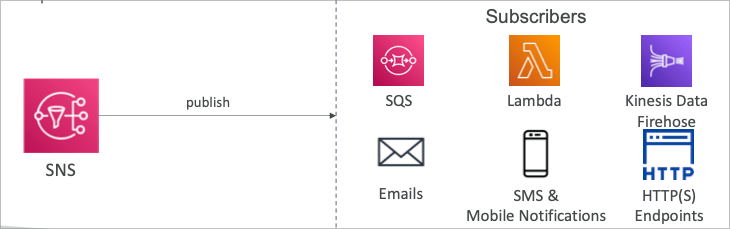

## 대부분의 서비스들이 SNS와 연계 가능

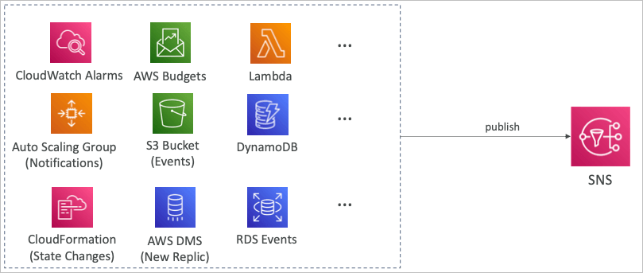

## SNS 발행 방법

- SDK를 이용한 토픽에 메시지 발행
  - 토픽 생성
  - 원하는 만큼 연계할 서비스로부터 구독 설정
- 다이렉트 발행 (모바일 앱을 위한 SDK)
  - 플랫폼 어플리케이션을 생성
  - 엔드포인트 작성
  - 플랫폼 엔드포인트로 메시지 발행
  - Google GCM, Apple APNS, Amazon ADM 등과 연계 가능

## SNS 보안

- 암호화
  - HTTPS API를 통한 전송 중 암호화
  - KMS 키를 통안 데이터 암호화
  - 클라이언트의 필요에 의해 암호화 직접 수행 가능
- 접근 제어
  - IAM 정책을 통한 SNS API 접근 제어
- SNS 접근 정책 (S3 버킷 정책과 유사)
  - 다른 계정의 SNS 토픽에 접근 제어
  - 다른 서비스들이 SNS 토픽에 발행권한을 줄 때 유효

## SNS와 SQS를 연계한 Fan Out 패턴

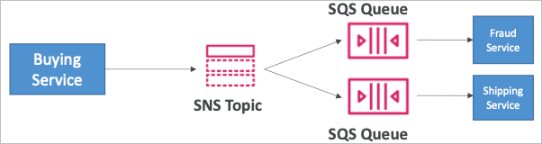

- SNS에 하나 발행한 메시지를 통해 구독자에서 SQS 큐를 사이에 두고 전달자 역할로 대신 활용
- 완전 디커플링 데이터 소실 없음
- SQS는 데이터 영속화, 서비스에 맞춰진 데이터 처리량 (직접 처리하고 삭제하기 때문), 가능할 때까지 재처리를 지원하기 때문에 연계하면 장점이 생김
- 구독하려는 서비스가 추가되면 SQS를 추가하면 됨
- SQS의 접근 제어 정책에 SNS로부터의 쓰기 권한을 줘야 함

### 팬아웃을 이용한 사례 (S3 이벤트를 복수의 큐로)

- S3 이벤트 룰은 하나의 프리픽스에 대해 하나밖에 설정 가능
- S3 이벤트를 SNS로 연계하여 SNS를 복수의 큐나 필요한 다른 서비스에서 구독하면 팬아웃으로 연계 가능

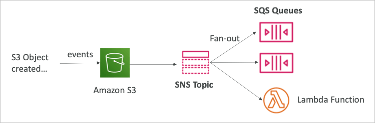

## SNS FIFO 토픽

- FIFO = First In First Out

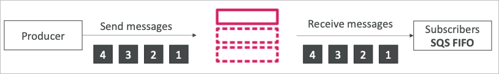

- SQS FIFO와 유사
  - 메시지 그룹 ID별 순서가 보장됨 (같은 그룹 내 메시지는 순서대로 도착함)
  - 중복제거 ID 또는 컨텐츠 기반으로 중복제거 기능
- SQS FIFO만 구독자로 설정 가능
- 처리량 제한 (SQS FIFO와 동일한 처리량)

## SNS FIFO와 SQS FIFO를 결합한 팬아웃

- 팬아웃 모델을 순서에 맞는 메시지 처리와 중복제거를 이용하며 활용하고 싶을 경우

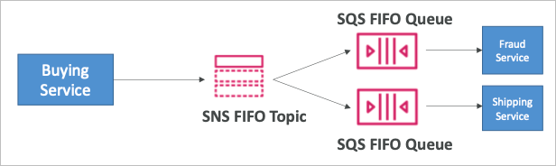

## Message Filtering

- JSON 정책으로 SNS 토픽의 구독자를 필터링하여 메시지를 보낼 수 있음
- 필터가 설정되지 않은 구독자는 모든 메시지를 받아봄

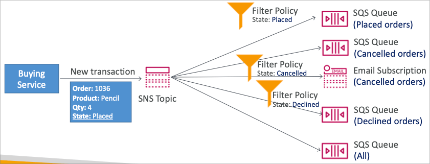

## Kinesis 개요

- 실시간 데이터를 통해 수집, 처리, 분석등을 수행하기 쉽게 도움을 주는 서비스
- 어플리케이션 실시간 로그, 지표, 웹사이트 클릭 스트림, IoT 데이터 등
- Kinesis Data Stream
  - 데이터 스트림을 보존하고 저장, 처리하는데 활용
- Kinesis Data Firehose
  - AWS 안팎으로 데이터를 보내는 역할
- Kinesis Data Analytics
  - 실시간 데이터를 SQL이나 아파치 Flink등을 통해 분석
- Kinesis Video Streams
  - 비디오 영상을 실시간으로 캡쳐하여 처리

## Kinesis Data Streams

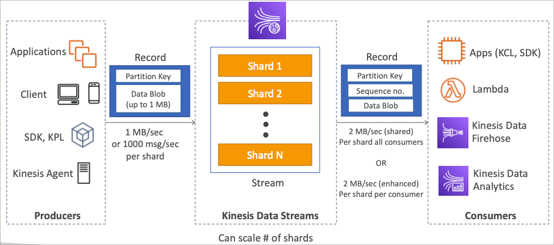

- 데이저 보존 기한을 1일~365일까지 설정 가능
- 데이터의 재전송 기능 존재
- 데이터가 한번 키네시스 데이터 스트림으로 들어와서 저장되면 불변함
- 같은 샤드로 전송되는 같은 파티션 키를 가진 데이터는 순서가 보장됨
- 생산자로서 AWS SDK, 키네시스 생산자 라이브러리 (KPL), 키네시스 에이전트 등이 있을 수 있음
- 소비자로 키네시스 소비자 라이브러리 (KCL), AWS SDK 등이 있고, 관리형 서비스로 람다, 키네시스 데이터 파이어호스, 키네시스 데이터 애널리틱스 등이 있을 수 있음

## 키네시스 데이터 스트림 용량 모델

- 프로비전 모드
  - 샤드의 갯수를 사용자가 정하고 직접 API를 이용해서 스케일링
  - 샤드 당 1MB/s 의 처리량 (쓰기)
  - 샤드 당 2MB/s 의 처리량 (읽기) → 강화된 팬아웃 소비자 선택시
  - 샤드당 시간당 과금 모델
- 온디맨드 모드
  - 프로비전이나 용량을 관리할 필요 없이 자동으로 증가
  - 기본 용량이 4MB/s 설정되며 계속 스케일링됨
  - 스케일 기준은 30일간의 피크 처리량을 관찰하고 자동으로 설정됨
  - 스트림을 시간당 과금하고 처리된 용량에 따라서도 추가과금이 있음

## 키네시스 보안

- IAM 정책에 의한 접근제어, 인증
- HTTPS를 통한 전송 중 암호화
- KMS를 통한 데이터 암호화
- 직접 암호화/복호화 가능 (복잡한 방식이 있지만 대응 가능)
- VPC 엔드포인트를 이용해 키네시스 전용 인터페이스를 VPC 내에 설치 가능
- API 요청을 CloudTrail을 통해 감사 가능

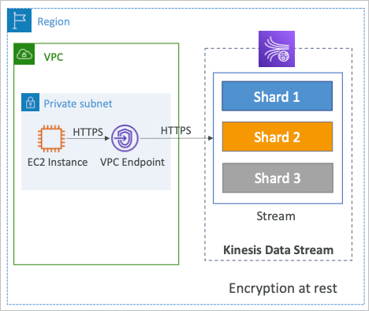

## Kinesis Data Firehose

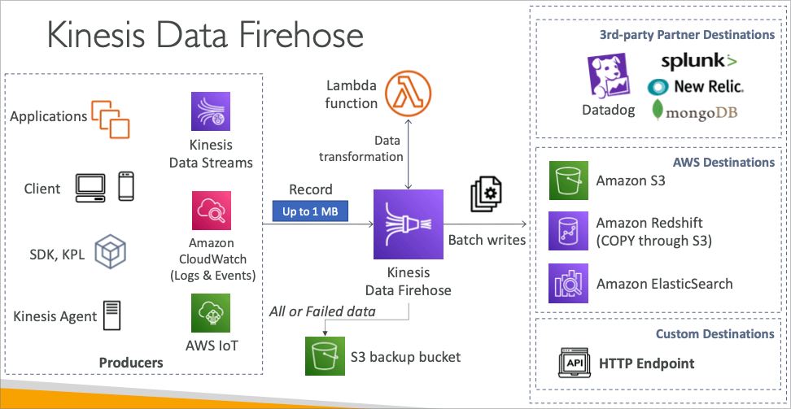

- 완전 관리형 서비스로, 유저측에서 관리할 필요없이 자동으로 스케일링 됨
  - AWS Redshift / Amazon S3 / ElasticSearch
  - 서드파티와 연동 Splunk / MongoDB / DataDog / NewRelic 등
  - HTTP 엔드포인트로의 전송 지원
- 데이터를 보낸 만큼만 과금
- 거의 실시간
  - 60초의 최소 배치 가동 주기
  - 또는 1MB의 데이터가 쌓였을때 송신
- 많은 데이터 포맷 지원, 람다를 통한 변환, 압축 등 지원
- S3 버킷에 실패한 데이터 또는 전체 데이터를 보존 가능

## Kinesis Data Stream vs Firehose

### Kinesis Data Stream

- 데이터를 저장해두고 스케일링을 통해 전송하는 서비스
- 생산자, 소비자 파트를 일정부분 코딩을 통해 구현해야 함
- 실시간 (~200ms)
- 스케일링을 컨트롤 가능 (샤드 분산/병합)
- 1~365일간의 데이터 저장
- 데이터 재전송 지원

### Kinesis Data Firehose

- 서드파티 데이터 관리 툴 / S3 / 커스텀 HTTP 엔드포인트에 전송
- 완전 관리형
- 거의 실시간 (최소 60초)
- 자동으로 스케일링
- 데이터 저장 없음
- 재전송 지원 안함

## Kinesis Ordering

- 키네시스에서는 파티션 키를 통해 해싱으로 샤드를 결정하고 매칭된 샤드를 통해 데이터를 송신
- 같은 샤드에서는 순서가 지켜짐

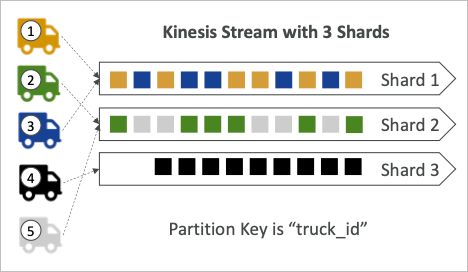

## SQS Ordering

- SQS 스탠다드에서는 순서를 보장하지 않음
- SQS FIFO 모델에서는 순서가 보장되는데, Group ID 기반으로 된 순서를 보장함
- Group ID가 없다면 모든 메시지는 순서가 보장됨
- Group ID를 지정하는 것은 Kinesis에서 파티션 키를 통한 샤드를 정하는 것과 비슷함
- SQS에서는 처리량 제한 (300메시지/초, 배치를 통해 10개씩 전송한다고 가정하면 3000메시지/초)

## Kinesis vs SQS Ordering

- Kinesis Data Stream과 SQS의 특성을 잘 이해하고 어떤 것을 선택할지 정하는 것이 중요
- Kinesis의 제약사항으로는 샤드당 1MB/s의 송신을 지원한다는 것과 병렬적으로 데이터 송신이 가능하다는 점
- SQS FIFO의 제약사항으로는 100개의 Group ID가 최대라는 점과 300msg/s의 처리량 제약이 있다는 점

## SQS vs SNS vs Kinesis

### SQS

- 소비자가 데이터를 끌어다 사용
- 데이터는 소비된 이후 삭제됨
- 원하는 만큼의 소비자를 둘 수 있음
- 데이터 처리량의 프로비전이 필요하지 않음
- FIFO 모델을 이용하면 데이터의 순서가 보장됨
- 풀링된 데이터의 비표시 기간을 제공함

## SNS

- 구독들에게 메시지를 푸시함
- 12,500,000의 구독자 제한 제약사항이 존재
- 데이터는 영속적이지 않음 (데이터가 전달되지 못하면 소실됨)
- 발행/구독 모델
- 100,000개의 토픽 수 제한 제약사항이 존재
- 데이터 처리량의 프로비전이 필요하지 않음
- SQS와 연계하여 팬아웃 설계가 가능
- FIFO를 통한 발행 순서 보장 / SQS FIFO와 연계한 순서 보장 팬아웃 설계 가능

### Kinesis

- 스탠다드 데이터 프로비전 모델
  - 데이터를 폴링해서 사용
- 강화된 팬아웃 모델
  - 데이터가 푸시되며 샤드당 2MB/s의 처리량을 지원
- 데이터의 재전송 가능 (Kinesis Data Stream)
- 빅데이터 처리와 같은 실시간 처리에 사용됨
- 샤드 단위에서 순서가 보장됨
- 데이터는 1~365일 보전 가능하고 이후 소실됨
- 처리량(샤드 숫자)에 대한 프로비전 모델과 온디맨드 스케일링 모드가 존재

## Amazon MQ

- 온프레미스 서비스가 MQ 프로토콜을 이용중이고 이를 SNS, SQS로의 재개발 없이 이전하고 싶을 때
- MQ 브로커를 아마존에서 제공해주는 관리형 서비스로 이전 가능
- 멀티AZ을 지원하기 때문에 가용성이 보장됨

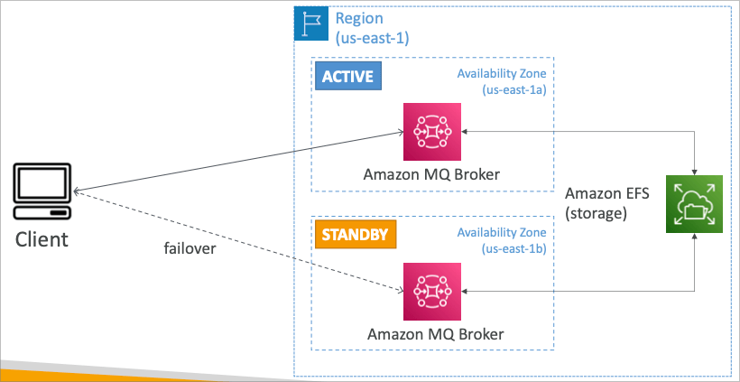
