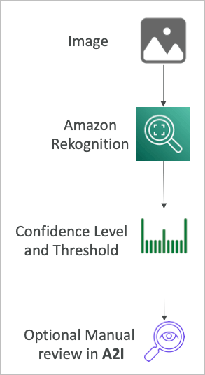

# Machine Learning

## Amazon Rekognition

- 머신 러닝을 이용해 이미지나 비디오에서 물체, 사람, 텍스트, 장면 등을 찾아냄
- 얼굴 분석과 얼굴 인식을 통해 유저를 인식하고 사람 수를 셀 수 있음
- 유명인사의 얼굴 데이터베이스를 통해 인식 가능
- 사용 사례
  - 라벨링
  - 컨텐츠 감사
  - 텍스트 감지
  - 얼굴 감지 및 분석 (성별, 나이, 감정 등)
  - 얼굴 찾기 및 인증
  - 유명인사 인식
  - 경로 추적 (축구 등 특정 인물의 경로 파악 등, 스포츠 게임 분석)

### Rekognition 컨텐츠 감사

- 이미지나 비디오에 불법적이거나 허용되어선 안되는 컨텐츠가 포함되어 있을 경우
- 소셜 미디어나 방송, 광고, E커머스등에서 안전한 유저 이용을 위해
- 최소한의 레벨 설정을 통해 1차적으로 걸러낸 이미지를 옵션으로 사람이 직접 플래깅하는 A2I를 적용할 수 있음

## Amazon Transcribe

- 자동으로 음성을 텍스트로 변환
- 딥러닝 프로세스를 이용해 자동 음성 인식을 적용 텍스트로 빠르고 정확하게 변환해줌
- 자동으로 개인정보를 삭제해주는 기능이 포함되어 있음
- 여러 언어를 동시에 알아듣고 변환하는 기술을 지원
- 사용 사례
  - 고객 서비스 전화
  - 자동 자막
  - 음성의 메타데이터 추출을 통해 검색 가능한 방식으로 변환

## Amazon Polly

- 텍스트를 음성파일로 변환
- 어플리케이션에서 음성을 말하게 할 수 있음

### Lexicon & SSML

- 특정 단어를 원하는 발음으로 해줌
  - AWS ⇒ Amazon Web Service
- Lexicon을 업로드하고 SSML을 설정하면 됨
- SSML에는 여러가지 지원 명령들이 있는데, 말하는 도중 쉼이라던가, 속삭임과 같은 것도 지정 가능

## Amazon Translate

- 자연어 언어 번역기
- 컨텐츠의 로컬라이징을 지원하며, 웹사이트 등의 번역 등을 지원하여 인터네셔널 사이트등을 제작하는데 도움이 될 수 있음

## Amazon Lex

- Alexa와 동일하게 음성 인식을 통한 명령 수행 가능
- 자연어 이해로 화자를 인식함
- 챗봇이나 콜센터 봇을 만드는데 도움

### Amazon Connect

- 전화를 받고 연락 흐름을 만드는 클라우드 기반 가상 콜센터
- AWS로 다른 CRM 시스템과 연계 (salesforce등)
- 선금이 없고 다른 콜센터 솔루션 대비 80%이상 저렴

