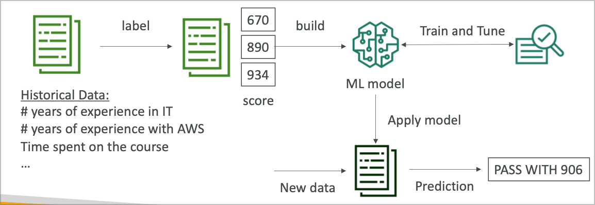
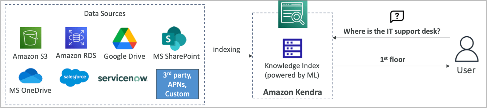
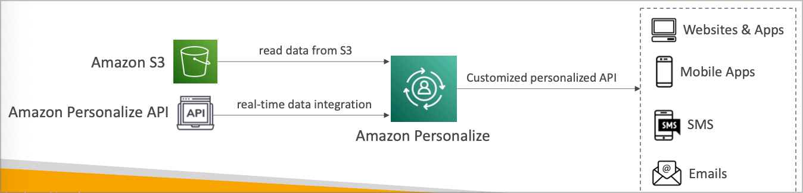
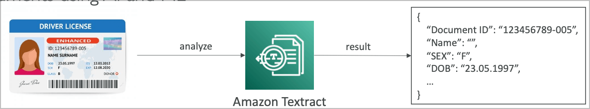

# Machine Learning

## Amazon Rekognition

- 머신 러닝을 이용해 이미지나 비디오에서 물체, 사람, 텍스트, 장면 등을 찾아냄
- 얼굴 분석과 얼굴 인식을 통해 유저를 인식하고 사람 수를 셀 수 있음
- 유명인사의 얼굴 데이터베이스를 통해 인식 가능
- 사용 사례
  - 라벨링
  - 컨텐츠 감사
  - 텍스트 감지
  - 얼굴 감지 및 분석 (성별, 나이, 감정 등)
  - 얼굴 찾기 및 인증
  - 유명인사 인식
  - 경로 추적 (축구 등 특정 인물의 경로 파악 등, 스포츠 게임 분석)

### Rekognition 컨텐츠 감사

- 이미지나 비디오에 불법적이거나 허용되어선 안되는 컨텐츠가 포함되어 있을 경우
- 소셜 미디어나 방송, 광고, E커머스등에서 안전한 유저 이용을 위해
- 최소한의 레벨 설정을 통해 1차적으로 걸러낸 이미지를 옵션으로 사람이 직접 플래깅하는 A2I를 적용할 수 있음

## Amazon Transcribe

- 자동으로 음성을 텍스트로 변환
- 딥러닝 프로세스를 이용해 자동 음성 인식을 적용 텍스트로 빠르고 정확하게 변환해줌
- 자동으로 개인정보를 삭제해주는 기능이 포함되어 있음
- 여러 언어를 동시에 알아듣고 변환하는 기술을 지원
- 사용 사례
  - 고객 서비스 전화
  - 자동 자막
  - 음성의 메타데이터 추출을 통해 검색 가능한 방식으로 변환

## Amazon Polly

- 텍스트를 음성파일로 변환
- 어플리케이션에서 음성을 말하게 할 수 있음

### Lexicon & SSML

- 특정 단어를 원하는 발음으로 해줌
  - AWS ⇒ Amazon Web Service
- Lexicon을 업로드하고 SSML을 설정하면 됨
- SSML에는 여러가지 지원 명령들이 있는데, 말하는 도중 쉼이라던가, 속삭임과 같은 것도 지정 가능

## Amazon Translate

- 자연어 언어 번역기
- 컨텐츠의 로컬라이징을 지원하며, 웹사이트 등의 번역 등을 지원하여 인터네셔널 사이트등을 제작하는데 도움이 될 수 있음

## Amazon Lex

- Alexa와 동일하게 음성 인식을 통한 명령 수행 가능
- 자연어 이해로 화자를 인식함
- 챗봇이나 콜센터 봇을 만드는데 도움

### Amazon Connect

- 전화를 받고 연락 흐름을 만드는 클라우드 기반 가상 콜센터
- AWS로 다른 CRM 시스템과 연계 (salesforce등)
- 선금이 없고 다른 콜센터 솔루션 대비 80%이상 저렴

## Amazon Comprehend

- 자연어 처리 NLP (Natural Language Processing)
- 완전 관리형 서버리스 서비스
- 텍스트 안에서 인사이트와 관계등을 찾아냄
  - 텍스트의 언어 (한국어, 영어 등)
  - 핵심 구문, 장소, 사람, 브랜드, 이벤트 등의 추출
  - 텍스트의 긍정적, 부정적 척도
  - 토픽에 따른 파일 분류
- 사용 사례
  - 고객의 응답 (이메일) 등의 긍정도 척도 분석을 통한 대응
  - 여러 파일들의 토픽에 따른 분류 등

## Comprehend Medical

- Amazon Comprehend Medical은 진료 기록을 분석하는 툴
  - 진단 수첩 분석
- PHI 분석
- 결과를 S3에 저장하여 Kinesis Data Firehose로 실시간 분석 또는 환자의 진료 내용을 텍스트로 기록하여 Comprehend Medical과 연동

## Amazon SageMaker

- 완전 관리형 머신 러닝 모델 개발/데이터 과학용 툴
- 일반적으로 서버를 구성하여 분석용 도구를 설치하고 운용하는 것은 쉬운 일이 아님
- 머신 러닝의 과정을 단순화 하면 아래와 같음

- 과거의 기록과 공부 자료를 통해 성적을 예상하는 프로그램

## Amazon Forecast

- 완전 관리형 서비스로 어떤 특정한 상황을 머신러닝으로 유추하여 예상하는 것
- 샘플: 비옷의 할인 예측
- 몇달에 걸쳐 예상되는 결과를 몇시간 안에 도출
- 사용 사례
  - 제품 출시 예상
  - 주가 예상

## Amazon Kendra

- 머신러닝에 의한 완전 관리형 문서 검색 서비스
- 각종 문서 형태 (텍스트, pdf, HTML, PPT, word, FAQs 등) 에서 결과를 도출
- 자연어 검색과 호환됨
- 유저의 선호도에 따라서 학습하여 액션/피드백을 돌려줌 (계속적인 러닝)
- 수동으로 검색 결과를 최적화 할 수 있는 기능이 존재 (커스텀 형태로)

## Amazon Personalize

- 실시간 개인화 추천에 따른 완전 관리형 앱 빌딩 서비스
- 사용 예제
  - 쇼핑몰에서 몇개의 물건을 구매 후 필요한 다른 물건들을 추천해주는 서비스
  - Amazon.com에서 사용되고 있는 머신러닝 추천 알고리즘
- 서비스는 웹사이트, 어플리케이션, SMS, 이메일 마케팅 서비스 등과 연계
- 일일히 머신러닝 모델을 빌드하고 트레이닝 할 필요 없이 바로 사용 가능
- 사용 사례
  - 리테일 샵, 미디어 및 엔터테인먼트 등

## Amazon Textract

- 자동으로 텍스트, 손글씨, 각종 데이터에서 문서를 스캔하고 문자열을 추출해내는 서비스

- 폼과 테이블 등에서 데이터를 추출
- PDF, Image 등과 같은 문서 및 이미지 등에서도 추출 가능
- 사용 예제
  - 금융 서비스 (청구서, 금융 레포트)
  - 헬스케어 (메디컬 기록, 보험 약관)
  - 공공기관 (세금 고지, 인증 문서, 여권 등)

## 머신 러닝 종합

- 레코그니션
  - 얼굴 인식, 라벨링, 유명인사 식별
- 트랜스크라이브
  - 음성을 텍스트로 (자막 등)
- 폴리
  - 텍스트를 음성으로
- 트랜스레이트
  - 번역
- 렉스
  - 음성인식 툴 개발 (챗봇)
- 커넥트 (콜센터)
- 컴프리핸드 (자연어 처리)
- 세이지메이커 (머신러닝 모델링)
- 포어캐스트 (정확도 높은 예측)
- 켄드라 (머신러닝 기반 검색 엔진)
- 퍼스널라이즈 (실시간 추천)
- 텍스트랙트 (문서로부터 텍스트 인식 및 추출) OCR
