# Monitoring, Audit and Performance

## CloudWatch Metrics

- AWS의 모든 서비스에 대한 지표를 제공
- 지표는 모니터링하는 변수 (CPU사용률, 네트워크 패킷 수 등)
- 지표는 네임스페이스에 속함
- 디멘션(차원)은 지표의 속성값 (인스턴스ID, 환경, 기타)
- 하나의 지표당 10개의 디멘션까지 분류 가능
- 지표는 타임스탬프가 있어 시계열로 나열 가능
- 클라우드워치 대시보드를 이용하여 지표를 한데 표현할 수 있음
- 커스터 지표를 이용하면 기본적으로 지원하는 지표 외에 것을 수집할 수 있음 (램 사용량은 기본 지표가 아니며, 이는 커스텀 지표를 사용하는 가장 흔한 예)

## Metric Streams

- 클라우드워치의 지표는 클라우드워치 뿐만 아니라 다른 서드파티 모니터링 엔진에도 거의 실시간으로 보낼 수 있음
- 이는 Kinesis Data Firehose를 통해서 1MB 혹은 60초당 메시지를 보낼 수 있기 때문에 거의 실시간임
- 옵션으로 필터링을 통해 원하는 조건의 데이터만 스트림 가능

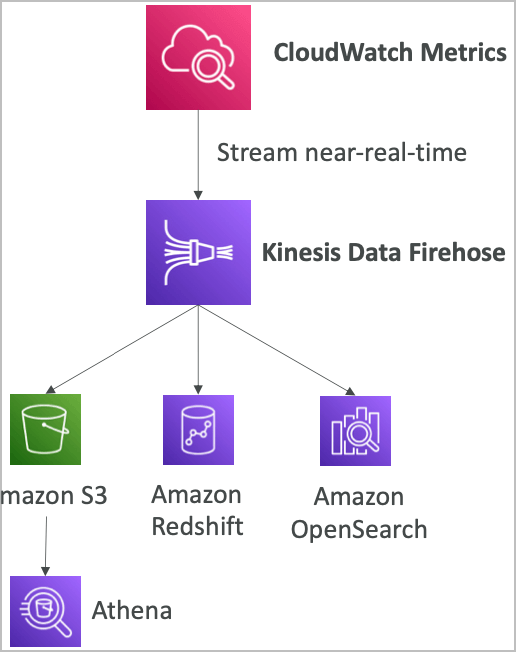

## CloudWatch Logs

- 로그 그룹
  - 로그 집합의 이름, 일반적으로는 어플리케이션의 이름을 선정
- 로그 스트림
  - 어플리케이션/로그 파일/컨테이너의 인스턴스 (디멘션)
- 로그 만료 기간 설정
  - 로그가 기록되고 나서 얼마나 보존할지 기한을 설정 (만료 없음부터 최대 10년까지)
- CloudWatch 로그는 다양한 곳으로 보내거나/저장 가능
  - AWS S3 (추출)
  - Kinesis Data Streams (실시간 연계)
  - Kinesis Data Firehose (엔드포인트 송신)
  - AWS Lambda (변환)
  - ElasticSearch (키밸류 검색엔진)

## CloudWatch Logs Sources

- SDK, CloudWatch Logs Agent, CloudWatch Unified Agent
- Elastic Beanstalk: 어플리케이션 로그 수집
- ECS: 컨테이너 로그 수집
- AWS Lambda: 함수 실행 기록 (로그, 에러 검증)
- VPC Flow Logs: VPC 전용 메타데이터 로그
- API Gateway: 요청 로그
- CloudTrail based on filter: 특정 설정에 따른 감사 기록 로그
- Route53 Logs: DNS 쿼리 기록

## CloudWatch Logs Metric Filter & Insights

- 클라우드워치 로그는 필터링 식이 존재하며 이용 가능
  - 예를 들면 특정 아이피에 대한 로그만
  - 에러 코드나 특정 에러 텍스트에 대한 검출 등
- 지표 필터를 이용하여 해당 로그가 발생했을 때 클라우드워치 알람과 연동 가능
- 클라우드워치 로그 인사이트는 특정 쿼리를 지정해두고 대시보드에서 게속 활용하고 시각화 할 수 있도록 하기 위함

## CloudWatch Logs - S3 Export

- 로그 데이터는 추출을 위해 최대 12시간까지 대기
- API요청은 CreateExrportTask
- 실시간 추출은 불가능 (로그 구독을 대신 활용할것)

## CloudWatch Logs Subscriptions

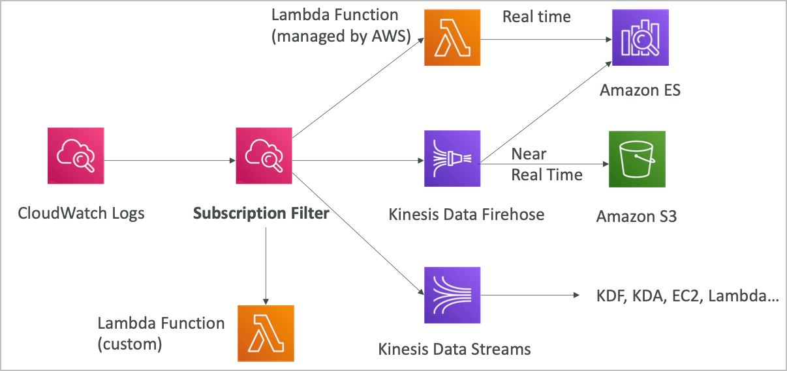

- 클라우드워치 로그를 실시간으로 필터링하여 다양한 엔드포인트 및 서비스로 송신할 수 있음
- 또한 다양한 계정의 각기 다른 리전으로부터의 로그를 하나의 데이터 스트림을 통해 Firehose로 S3에 모아둘 수도 있음

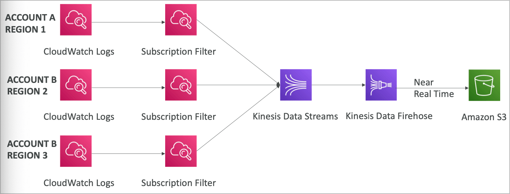

## CloudWatch Logs for EC2

- 디폴트로 EC2에서 클라우드워치로의 로그를 보내는 기능은 없음
- CloudWatch 에이전트를 설치하여 로그 파일을 전송 가능
- IAM 권한을 적절하게 설정해야 함
- CloudWatch Logs 에이전트는 온프레미스 환경에도 설치 가능

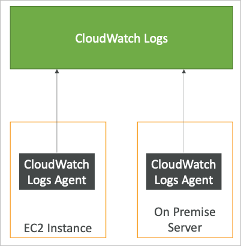

## Logs Agent와 Unified Agent

- EC2 인스턴스나 온프레미스 서버에 설치 가능
- Logs Agent
  - 오래된 버전 (권장되지 않음)
  - CloudWatch Logs에 로그를 보내는 기능만 존재
- Unified Agent
  - RAM이나 프로세스 등을 보내는 기능도 추가되어 있음
  - 로그를 수집하여 CloudWatch Logs에 전송 가능
  - SSM Parameter Store를 이용하여 설정을 중앙화 관리 가능

## CloudWatch Unified Agent 지표

- CPU (활성화, 게스트, 유휴, 시스템, 유저 단위)
- Disk 지표 (가용, 사용중, 전체), Disk IO (쓰기, 읽기, 바이트 IOPS 등)
- RAM (가용, 사용중, 전체, 캐시)
- Netstat (TCP 또는 UDP 커넥션, 패킷 수, 인아웃 바이트)
- 프로세스 (전체, 종료, 유휴, 가동중, 슬립)
- Swap 용량 (가용, 사용중, 전체 사용량 %)
- EC2의 기본 지표와는 다른 추가적인 지표 수집 가능

## CloudWatch Alarms

- 알람은 어떤 지표든 이용하여 트리거될 수 있음
- 다양한 옵션을 제공 (샘플링, %, 최대 최소, 기타)
- 알람 상태
  - OK
  - INSUFFICIENT_DATA (지표 데이터 부족)
  - ALARM
- 기간
  - 상태가 평가될때까지의 시간
  - 커스텀 지표를 통한 고해상도 설정: 10초, 30초 또는 60초의 배수

## CloudWatch Alarm Targets

- EC2 인스턴스에 대한 정지, 삭제, 재기동, 복구 등
- ASG에 대한 트리거
- SNS로 메시지 발행 (이것과 연계한 다양한 액션들)

### Composite Alarm

- 알람은 하나의 지표를 통해 설정됨
- 컴포지트 알람은 여러개의 지표 상태를 등록할 수 있음
- AND 또는 OR 연결
- 특정 상태에 대해서만 알람을 설정하고 싶을 때 유용하게 활용될 수 있음

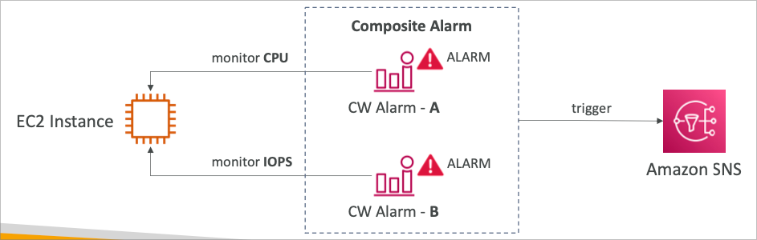

## EC2 인스턴스 복구

- 상태 검사
  - 인스턴스 상태 = EC2의 VM
  - 시스템 상태 = 백엔드 하드웨어
    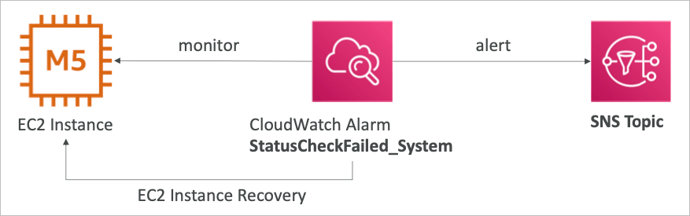
- 복구
  - 같은 프라이빗, 퍼블릭 Elastic IP, metadata, 배치 그룹 등

## 기타 CloudWatch Alarm 정보

- 알람은 Logs 지표 필터에 의해 활성화 될 수 있음

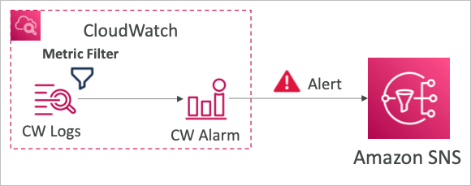

- 알람을 수동으로 설정할 수 있음

```bash
aws cloudwatch set-alarm-state --alarm-name "myAlarm" --state-value ALARM --state-reason "testing purpose"
```

## Amazon EventBridge

- 원래 Amazon CloudWatch Events에서 기능이 강화되면서 명칭이 변경됨
- 스케줄링: 크론 작업 (일정화 스크립트)


- 이벤트 패턴: 이벤트 발생 베이스로 특정 작업을 수행

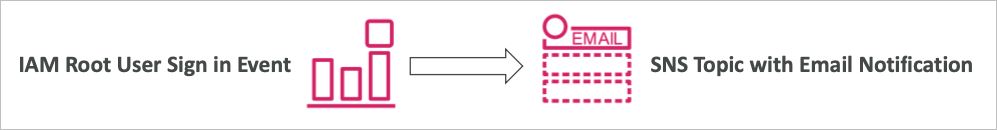

- 람다 함수를 트리거하거나 SQS/SNS 메시지를 발행

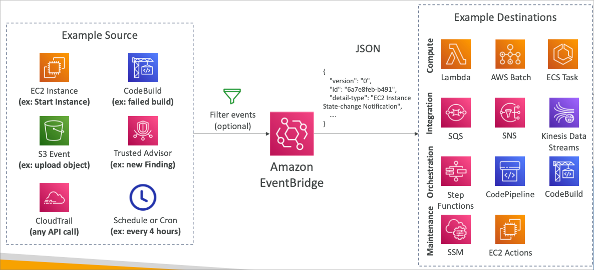

- 각종 이벤트 소스로부터의 이벤트를 필터링(옵션)하여 이벤트 브리지는 다양한 AWS 타겟 서비스에 트리거 및 패러미터 전달자로서의 역할을 수행
- 전달되는 패터리터는 JSON 형식

### Event Bus

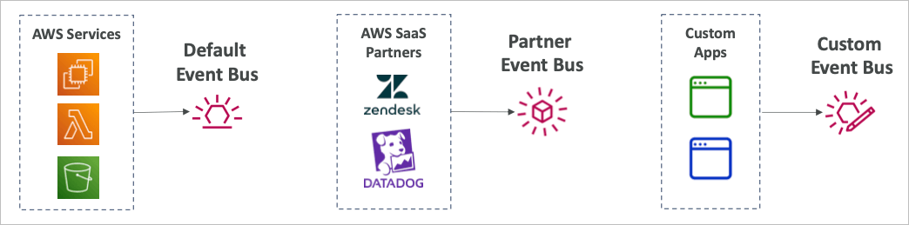

- 이벤트 버스는 크게 3가지 타입이 존재
- Default Event Bus: AWS의 기본 서비스들
- Partner Event Bus: AWS 이벤트 브리지를 지원하는 서드파티 서비스 (미리 준비된 템플릿이 존재)
- Custom Event Bus: 어플리케이션에서 직접 이벤트 브리지와 호환되는 형태의 데이터를 전달 (JSON)
- 이벤트 버스는 이벤트를 아카이브 가능하며 재전송할수 있기 때문에 (동일한 이벤트 재발생) 디버깅과 테스트에 유용함

### Schema Registry

- 이벤트 브릿지는 이벤트를 자체적으로 분석해서 스키마를 제공해줌
- 스키마 레지스트리는 어플리케이션을 위한 코드를 만들고 데이터 구조를 이벤트버스에 맞추어 제공
- 스키마는 버전관리로 이력을 남길 수 있음

### Resource-based policy

- 이벤트 버스에 대한 권한 관리
- 다른 AWS 리전 및 계정에서 접근을 허용할 수 있음
- 사용 사례
  - 이벤트 버스의 중앙집중화 (한 계정에서 통합 관리)

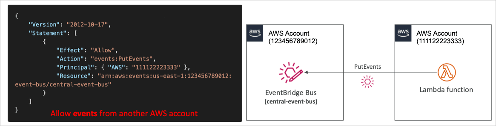

## CloudWatch Container Insights

- 컨테이너로부터의 지표와 로그를 수집하고 정제하고 종합
- ECS, EKS, Kubernetes on EC2, Fargate에서 동작
- EKS와 Kubernetes에서 CloudWatch 에이전트가 컨테이너로 동작하며 다른 컨테이너들의 정보를 수집함

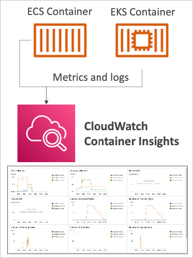

## CloudWatch Lambda Insights

- AWS Lambda의 지표들과 데이터를 모니터링
- 람다가 실행되는 환경의 CPU시간 및 메모리, 디스크, 네트워크등을 모니터링
- 람다 특징인 콜드 스타트, 워커 셧다운 등 또한 분석하고 모니터링 가능

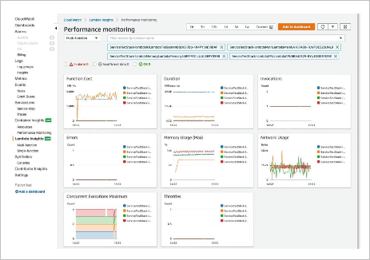

## CloudWatch Contributor Insights

- 로그 자료를 분석하여 시간 기반의 기여도 데이터를 보여줌
  - Top N의 기여자를 지표로 보여줌
  - 기여자를 중복제거 후 계산, 사용량을 표시
- 특정 시스템 퍼포먼스에 특정 유저의 영향도를 파악할 수 있음
- AWS에서 발생하는 각종 다양한 로그와 연동됨 (VPC, DNS 등)
- 예를 들면, 특정 네트워크 하에서 악영향을 미치고 있는 유저를 판별하거나 특정 에러를 계속해서 발생시키고 있는 웹페이지를 특정
- 적용할 룰을 직접 정할 수도 있지만 CloudWatch Logs에서 정한 샘플 룰을 이용할 수 있음

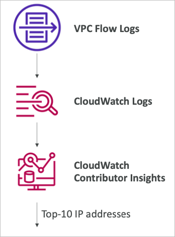

## CloudWatch Application Insights

- 현재 진행중인 문제점에 대한 문석과 가능성 있는 문제에 대한 지원등을 포함한 자동화된 대시보드를 제공함
- Amazon EC2 인스턴스에서 작동중인 어플리케이션 및 특정에 대해서만 지원
  - Java, .NET, Microsoft IIS Web Server, Databases
- AWS의 다양한 서비스와도 연동 가능
- SageMaker 기반
- 어플리케이션 상태에 대한 모니터링 가시성 증강 및 문제 해결 및 해소에 걸리는 시간의 감소
- Amazon EventBridge로의 알림 전송 및 연계

## CloudWatch Insights and Operational Visibility

- CloudWatch Container Insights
- CloudWatch Lambda Insights
- CloudWatch Contributors Insights
- CloudWatch Application Insights
