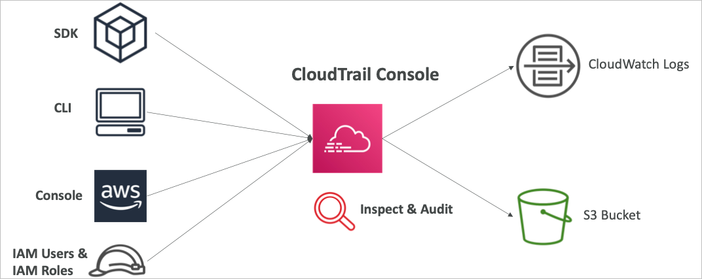
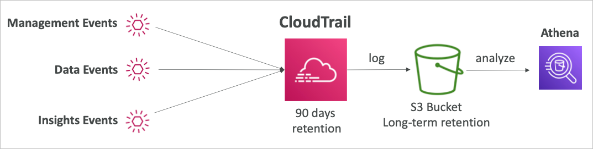
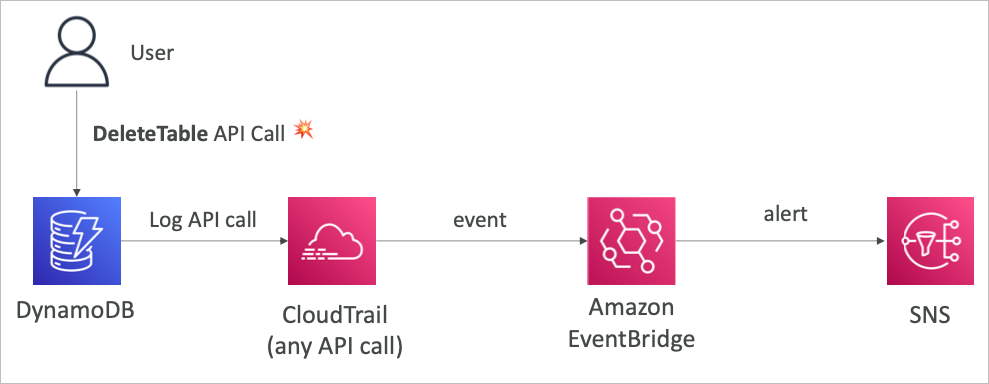
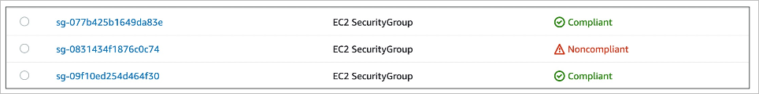
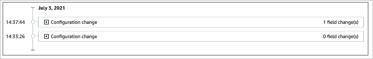
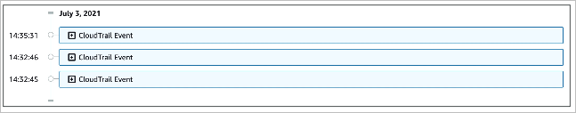
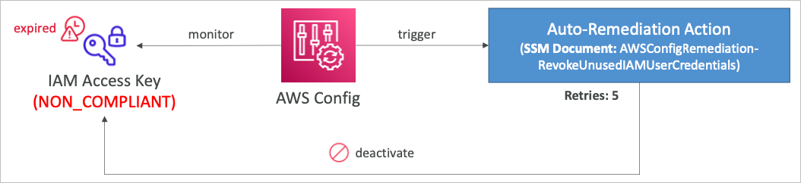
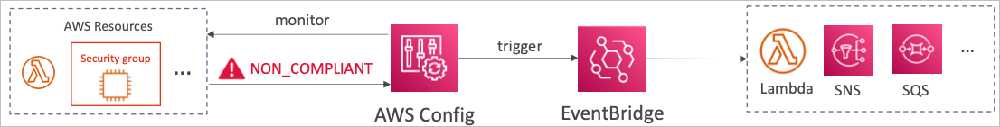
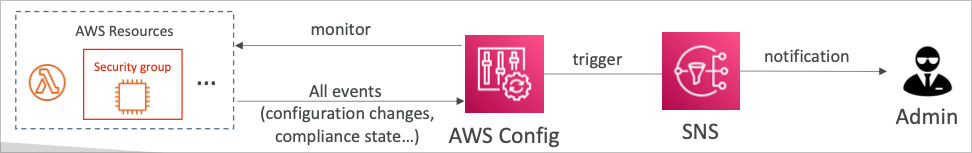

# Monitoring, Audit and Performance

## CloudWatch Metrics

- AWS의 모든 서비스에 대한 지표를 제공
- 지표는 모니터링하는 변수 (CPU사용률, 네트워크 패킷 수 등)
- 지표는 네임스페이스에 속함
- 디멘션(차원)은 지표의 속성값 (인스턴스ID, 환경, 기타)
- 하나의 지표당 10개의 디멘션까지 분류 가능
- 지표는 타임스탬프가 있어 시계열로 나열 가능
- 클라우드워치 대시보드를 이용하여 지표를 한데 표현할 수 있음
- 커스터 지표를 이용하면 기본적으로 지원하는 지표 외에 것을 수집할 수 있음 (램 사용량은 기본 지표가 아니며, 이는 커스텀 지표를 사용하는 가장 흔한 예)

## Metric Streams

- 클라우드워치의 지표는 클라우드워치 뿐만 아니라 다른 서드파티 모니터링 엔진에도 거의 실시간으로 보낼 수 있음
- 이는 Kinesis Data Firehose를 통해서 1MB 혹은 60초당 메시지를 보낼 수 있기 때문에 거의 실시간임
- 옵션으로 필터링을 통해 원하는 조건의 데이터만 스트림 가능


## CloudWatch Logs

- 로그 그룹
  - 로그 집합의 이름, 일반적으로는 어플리케이션의 이름을 선정
- 로그 스트림
  - 어플리케이션/로그 파일/컨테이너의 인스턴스 (디멘션)
- 로그 만료 기간 설정
  - 로그가 기록되고 나서 얼마나 보존할지 기한을 설정 (만료 없음부터 최대 10년까지)
- CloudWatch 로그는 다양한 곳으로 보내거나/저장 가능
  - AWS S3 (추출)
  - Kinesis Data Streams (실시간 연계)
  - Kinesis Data Firehose (엔드포인트 송신)
  - AWS Lambda (변환)
  - ElasticSearch (키밸류 검색엔진)

## CloudWatch Logs Sources

- SDK, CloudWatch Logs Agent, CloudWatch Unified Agent
- Elastic Beanstalk: 어플리케이션 로그 수집
- ECS: 컨테이너 로그 수집
- AWS Lambda: 함수 실행 기록 (로그, 에러 검증)
- VPC Flow Logs: VPC 전용 메타데이터 로그
- API Gateway: 요청 로그
- CloudTrail based on filter: 특정 설정에 따른 감사 기록 로그
- Route53 Logs: DNS 쿼리 기록

## CloudWatch Logs Metric Filter & Insights

- 클라우드워치 로그는 필터링 식이 존재하며 이용 가능
  - 예를 들면 특정 아이피에 대한 로그만
  - 에러 코드나 특정 에러 텍스트에 대한 검출 등
- 지표 필터를 이용하여 해당 로그가 발생했을 때 클라우드워치 알람과 연동 가능
- 클라우드워치 로그 인사이트는 특정 쿼리를 지정해두고 대시보드에서 게속 활용하고 시각화 할 수 있도록 하기 위함

## CloudWatch Logs - S3 Export

- 로그 데이터는 추출을 위해 최대 12시간까지 대기
- API요청은 CreateExrportTask
- 실시간 추출은 불가능 (로그 구독을 대신 활용할것)

## CloudWatch Logs Subscriptions


- 클라우드워치 로그를 실시간으로 필터링하여 다양한 엔드포인트 및 서비스로 송신할 수 있음
- 또한 다양한 계정의 각기 다른 리전으로부터의 로그를 하나의 데이터 스트림을 통해 Firehose로 S3에 모아둘 수도 있음


## CloudWatch Logs for EC2

- 디폴트로 EC2에서 클라우드워치로의 로그를 보내는 기능은 없음
- CloudWatch 에이전트를 설치하여 로그 파일을 전송 가능
- IAM 권한을 적절하게 설정해야 함
- CloudWatch Logs 에이전트는 온프레미스 환경에도 설치 가능


## Logs Agent와 Unified Agent

- EC2 인스턴스나 온프레미스 서버에 설치 가능
- Logs Agent
  - 오래된 버전 (권장되지 않음)
  - CloudWatch Logs에 로그를 보내는 기능만 존재
- Unified Agent
  - RAM이나 프로세스 등을 보내는 기능도 추가되어 있음
  - 로그를 수집하여 CloudWatch Logs에 전송 가능
  - SSM Parameter Store를 이용하여 설정을 중앙화 관리 가능

## CloudWatch Unified Agent 지표

- CPU (활성화, 게스트, 유휴, 시스템, 유저 단위)
- Disk 지표 (가용, 사용중, 전체), Disk IO (쓰기, 읽기, 바이트 IOPS 등)
- RAM (가용, 사용중, 전체, 캐시)
- Netstat (TCP 또는 UDP 커넥션, 패킷 수, 인아웃 바이트)
- 프로세스 (전체, 종료, 유휴, 가동중, 슬립)
- Swap 용량 (가용, 사용중, 전체 사용량 %)
- EC2의 기본 지표와는 다른 추가적인 지표 수집 가능

## CloudWatch Alarms

- 알람은 어떤 지표든 이용하여 트리거될 수 있음
- 다양한 옵션을 제공 (샘플링, %, 최대 최소, 기타)
- 알람 상태
  - OK
  - INSUFFICIENT_DATA (지표 데이터 부족)
  - ALARM
- 기간
  - 상태가 평가될때까지의 시간
  - 커스텀 지표를 통한 고해상도 설정: 10초, 30초 또는 60초의 배수

## CloudWatch Alarm Targets

- EC2 인스턴스에 대한 정지, 삭제, 재기동, 복구 등
- ASG에 대한 트리거
- SNS로 메시지 발행 (이것과 연계한 다양한 액션들)

### Composite Alarm

- 알람은 하나의 지표를 통해 설정됨
- 컴포지트 알람은 여러개의 지표 상태를 등록할 수 있음
- AND 또는 OR 연결
- 특정 상태에 대해서만 알람을 설정하고 싶을 때 유용하게 활용될 수 있음


## EC2 인스턴스 복구

- 상태 검사
  - 인스턴스 상태 = EC2의 VM
  - 시스템 상태 = 백엔드 하드웨어
    
- 복구
  - 같은 프라이빗, 퍼블릭 Elastic IP, metadata, 배치 그룹 등

## 기타 CloudWatch Alarm 정보

- 알람은 Logs 지표 필터에 의해 활성화 될 수 있음


- 알람을 수동으로 설정할 수 있음

```bash
aws cloudwatch set-alarm-state --alarm-name "myAlarm" --state-value ALARM --state-reason "testing purpose"
```

## Amazon EventBridge

- 원래 Amazon CloudWatch Events에서 기능이 강화되면서 명칭이 변경됨
- 스케줄링: 크론 작업 (일정화 스크립트)


- 이벤트 패턴: 이벤트 발생 베이스로 특정 작업을 수행


- 람다 함수를 트리거하거나 SQS/SNS 메시지를 발행


- 각종 이벤트 소스로부터의 이벤트를 필터링(옵션)하여 이벤트 브리지는 다양한 AWS 타겟 서비스에 트리거 및 패러미터 전달자로서의 역할을 수행
- 전달되는 패터리터는 JSON 형식

### Event Bus


- 이벤트 버스는 크게 3가지 타입이 존재
- Default Event Bus: AWS의 기본 서비스들
- Partner Event Bus: AWS 이벤트 브리지를 지원하는 서드파티 서비스 (미리 준비된 템플릿이 존재)
- Custom Event Bus: 어플리케이션에서 직접 이벤트 브리지와 호환되는 형태의 데이터를 전달 (JSON)
- 이벤트 버스는 이벤트를 아카이브 가능하며 재전송할수 있기 때문에 (동일한 이벤트 재발생) 디버깅과 테스트에 유용함

### Schema Registry

- 이벤트 브릿지는 이벤트를 자체적으로 분석해서 스키마를 제공해줌
- 스키마 레지스트리는 어플리케이션을 위한 코드를 만들고 데이터 구조를 이벤트버스에 맞추어 제공
- 스키마는 버전관리로 이력을 남길 수 있음

### Resource-based policy

- 이벤트 버스에 대한 권한 관리
- 다른 AWS 리전 및 계정에서 접근을 허용할 수 있음
- 사용 사례
  - 이벤트 버스의 중앙집중화 (한 계정에서 통합 관리)


## CloudWatch Container Insights

- 컨테이너로부터의 지표와 로그를 수집하고 정제하고 종합
- ECS, EKS, Kubernetes on EC2, Fargate에서 동작
- EKS와 Kubernetes에서 CloudWatch 에이전트가 컨테이너로 동작하며 다른 컨테이너들의 정보를 수집함


## CloudWatch Lambda Insights

- AWS Lambda의 지표들과 데이터를 모니터링
- 람다가 실행되는 환경의 CPU시간 및 메모리, 디스크, 네트워크등을 모니터링
- 람다 특징인 콜드 스타트, 워커 셧다운 등 또한 분석하고 모니터링 가능


## CloudWatch Contributor Insights

- 로그 자료를 분석하여 시간 기반의 기여도 데이터를 보여줌
  - Top N의 기여자를 지표로 보여줌
  - 기여자를 중복제거 후 계산, 사용량을 표시
- 특정 시스템 퍼포먼스에 특정 유저의 영향도를 파악할 수 있음
- AWS에서 발생하는 각종 다양한 로그와 연동됨 (VPC, DNS 등)
- 예를 들면, 특정 네트워크 하에서 악영향을 미치고 있는 유저를 판별하거나 특정 에러를 계속해서 발생시키고 있는 웹페이지를 특정
- 적용할 룰을 직접 정할 수도 있지만 CloudWatch Logs에서 정한 샘플 룰을 이용할 수 있음


## CloudWatch Application Insights

- 현재 진행중인 문제점에 대한 문석과 가능성 있는 문제에 대한 지원등을 포함한 자동화된 대시보드를 제공함
- Amazon EC2 인스턴스에서 작동중인 어플리케이션 및 특정에 대해서만 지원
  - Java, .NET, Microsoft IIS Web Server, Databases
- AWS의 다양한 서비스와도 연동 가능
- SageMaker 기반
- 어플리케이션 상태에 대한 모니터링 가시성 증강 및 문제 해결 및 해소에 걸리는 시간의 감소
- Amazon EventBridge로의 알림 전송 및 연계

## CloudWatch Insights and Operational Visibility

- CloudWatch Container Insights
- CloudWatch Lambda Insights
- CloudWatch Contributors Insights
- CloudWatch Application Insights

## CloudTrail

- 가버넌스와 컴플라이언스 준수를 위해 AWS 계정을 감사
- 기본으로 ON 설정이 됨
- 이벤트 및 API 요청에 대한 정보를 저장
  - Console
  - SDK
  - CLI
  - AWS 서비스
- CloudTrail로부터 로그를 S3 또는 CloudWatch Logs로 저장 가능
- 모든 리전 (기본) 또는 하나의 리전만 감시 가능
- AWS에서 어떤 리소스가 삭제되면 CloudTrail을 먼저 조사



## CloudTrail Events

### Management Events

- AWS 계정 내 전반적인 활동이력에 대한 로그
- 예를 들어
  - 보안 설정 (IAM AttachRolePolicy)
  - 라우팅 데이터 설정 (Amazon EC2 CreateSubnet)
  - 로깅 설정 (AWS CloudTrail CreateTrail)
- 기본적으로 클라우드 트레일은 관리 이벤트에 대해서는 로그를 남김
- 이벤트는 Read Event와 Write Event로 구분됨
  - Read Event (읽기, 변경하지 않는 것)
  - Write Event (서비스를 변경하는 것)

### Data Event

- 데이터 이벤트는 볼륨이 크기 때문에 기본적으로는 꺼져 있음
- S3의 오브젝트 단위 레벨의 로그 등
- 람다함수의 실행 로그 등

## CloudTrail Insights

- CloudTrail Insights는 계정 내 일반적이지 않은 행동을 감지
  - 리소스의 프로비전
  - 서비스 리밋 (AWS 제한) 도달
  - IAM 액션의 증가
  - 유지보수성 행동과 다른 것들
- 클라우드 트레일 인사이트는 평상시의 관리 이벤트를 분석하여 베이스라인을 잡음
- 쓰기 이벤트를 계속해서 분석하여 일반적이지 않은 패턴을 검출
  - CloudTrail 콘솔에서 확인 가능
  - Amazon S3로 이벤트를 송신 가능
  - EventBridge 기반으로 작동됨


## CloudTrail Events Retention

- 기본적으로 클라우드트레일은 90일간의 데이터를 보존
- 추가적으로 기간을 늘리고 싶다면 S3에 저장하고 Athena를 통한 분석이 유효



## Amazon EventBridge - Intercept API Calls

- 클라우드 트레일에서 API 요청에 대한 인터셉트가 가능하기 때문에 중요 요소에 대한 API 요청을 이벤트 브릿지와 연계하면 SNS로 발행 가능



## CloudTrail 실습

- 로그 상세 (JSON 형태로 상세한 기록이 남아 있음)
- Read-Only true false로 읽기 쓰기 조회가능
- CloudTrail 생성 (기본 생성되어 있는것과 다른 것을 생성)
  - Organization을 사용중일 경우 중앙화 설정 있음
  - 버킷이름 설정 가능 (클라우드 트레일 외에 S3에 추가적으로 저장하여 보존기간 증가)
  - 어떤 로그를 저장할지 체크 가능 (관리, 데이터, 인사이트)
    - 관리형은 무료이며 KMS는 별도로 로깅 할지 말지 설정 가능
    - 데이터형은 다양한 이벤트 소스르 선택하고 각종 이벤트 API를 설정 가능
    - 인사이트는 설정하면 자동으로 분석시작
- 아테나에서 클라우드 트레일용 샘플 테이블 생성 쿼리를 제공함

## AWS Config

- AWS 리소스에 대한 컴플라이언스 적용으로 감사 및 기록이 가능
- 시계열에 따른 설정 변경을 기록 가능
- AWS Config 도입에 따른 사례들
  - SG에 대한 허가되지 않은 SSH 접속이 허용되어 있는가?
  - 퍼블릭 공개된 버킷이 존재하는가?
  - ALB 설정이 어떻게 변경되어 왔는가?
- 설정에 변화가 생겼을때 알람(SNS)을 받아볼 수 있음
- AWS Config은 리전별 서비스
- 다른 리전과 계정에 대한 중앙집중식 관리를 허용 (한곳에서 볼 수 있음)
- 데이터는 S3에 저장하고 아테나를 통한 분석 가능

## Config Rules

- AWS 관리형 룰이 75개 이상 제공됨
- 커스텀 룰을 작성하여 원하는 감시대상을 선정 가능 (AWS Lambda를 통한 정의가 필요)
  - gp2 타입을 사용하는 EBS 디스크를 알고 싶을 경우
  - t2.micro 인스턴스가 얼마나 존재하는지 알고 싶을 경우
- 룰은 평가되고 또한 트리거될 수 있음
  - 각각의 룰을 위반/준거하는 설정 변경이 발생했을 시
  - 일정 시간마다
- AWS Config 룰은 기록을 하고 알림은 가능하지만 해당 액션을 블록하는 것은 아님

### 컴플라이언스 평가



### 시계열에 의한 리소스 설정 표시



### 시계열에 의한 CloudTrail API 요청 확인



## Config Rules Remediations

- SSM 오토메이션을 이용하면 규정 준수에 실패한 리소스에 대한 자동 교정 절차를 밟을 수 있음
- AWS 관리형 자동화 도큐멘트가 존재하며, 커스텀화 하여 필요한 작업을 수행할 수 있음
- 교정 작업은 재시도가 가능하고 리소스가 규정 준수에 실패한 상태에 있을 경우 지속적으로 교정을 시도할 수 있음



## Config Rules Notifications

- 규정 준수에 실패한 리소스에 대한 알림을 트리거할 수 있음 (EventBridge 경유)



- 설정 변경으로 인한 규정 준수/실패에 대한 알림을 SNS를 통해 받을 수 있음 (필터링 적용)



## CloudWatch vs CloudTrail vs Config

### CloudWatch

- 퍼포먼스 모니터링 (지표) 대시보드
- 이벤트 및 알람
- 로그 수집 및 분석

### CloudTrail

- 계정단위 API 요청을 기록
- 특정 리소스에 대한 추적
- 글로벌 서비스

### Config

- 설정 변경을 추적 및 기록
- 리소스의 컴플라이언스 준수 여부 평가
- 시계열로 설정 변경을 표시

## ELB와의 연동

### CloudWatch

- 접속 상태 등을 모니터링
- 에러 코드의 비율을 시각화
- 대시보드를 통해 로드밸런서 퍼포먼스에 대한 인사이트 획득

### Config

- 로드밸런서의 SG 룰 추적
- 로드밸런서의 설정 변경 추적
- SSL 인증서가 적용되었는지 확인 (규정 준수여부)

### CloudTrail

- 누가 ELB에 대한 API 요청을 했는지 추적
