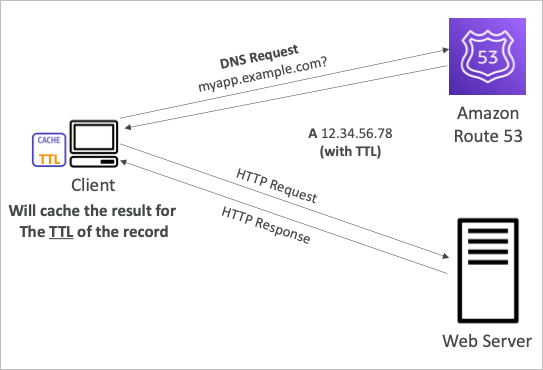
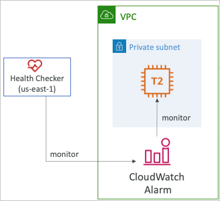
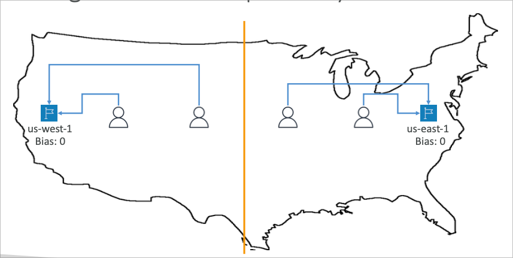

# Route 53

## DNS

- Domain Name System은 자연어로 이루어진 도메인을 특정 IP와 연결짓기 위한 기능
- [google.com](http://google.com) → 172.217.18.36
- DNS는 인터넷 백본에 존재
- DNS는 상속 네이밍 구조로 이루어짐
  - .com
  - .example.com
  - www.example.com
  - api.example.com

## DNS 명명구조

- Domain Registrar
  - Amazon Route 53
  - GoDaddy
  - …
- DNS Records
  - A
  - AAAA
  - CNAME
  - NS
  - …
- Zone File
  - DNS Records를 포함하고 있는 리스트
- Name Server
  - DNS 쿼리를 해석해줌 (인증형태 혹은 비인증형태)
- Top Level Domain (TLD)
  - .com
  - .us
  - .gov
- Second Level Domain (SLD)
  - amazon.com
  - google.com
  - …

## DNS의 백그라운드

- 웹브라우저는 로컬 머신에 캐시된 DNS가 없다면 로컬 DNS서버에 질의
- 로컬 DNS서버는 루트부터 시작하여 목적 DNS를 해석하여 IP를 가져옴
- 반환시 TTL을 이용해 일정시간 캐싱함

## Amazon Route 53

- 고가용성, 확장성을 가진 관리형 인증 DNS
  - 인증 = 유저가 DNS를 업데이트 하고 관리 할 수 있음
- Route 53은 Domain Registrar로의 기능도 같이 겸함
- EC2 등의 리소스에 직접 동작감시를 할 수 있는 기능 제공
- AWS 서비스 중 SLA 100%를 보장하는 유일한 서비스

## Records

- 도메인 내 트래픽을 어디로 보낼 지에 대한 명세
- 각각의 레코드는 다음을 포함
  - 도메인/서브도메인명 ex) example.com
  - 레코드 타입 A or AAAA
  - 값 12.34.56.78
  - TTL DNS 쿼리 질의자에 얼마나 캐시를 보관할지 여부 (초단위)
- Route 53은 다음과 같은 레코드 타입을 지원
  - A / AAAA / CNAME / NS
  - CAA / DS / MX / NAPTR / PTR / SOA / TXT / SPF / SRV

## Record Types

- A → IPv4에 대한 맵핑
- AAAA → IPv6에 대한 맵핑
- CNAME → 동일 존의 호스트명 또는 다른 존의 호스트명
  - 맵을 따라가면 결국엔 A 또는 AAAA로 귀결됨
  - CNAME은 Zone Apex라고 불리는 도메인 네임스페이스에는 설정 불가능
  - 예를 들면, [example.com](http://example.com) 자체에는 CNAME 설정 불가 (www.example.com에 설정 가능)
- NS → 호스팅 존에 대한 네임서버
  - 호스팅 존 아래 있는 레코드들이 어떤식으로 처리될지 정하는 서버의 호스트 혹은 주소가 맵핑됨

## Hosted Zone

- 도메인 네임스페이스에 대한 도메인과 서브도메인들에 대한 모든 명세가 집약되어 있는 컨테이너
- Public Hosted Zone
  - 퍼블릭 도메인에 대한 명세 및 도메인 해석을 제공
- Private Hosted Zone
  - 프라이빗 도메인에 대한 명세 및 도메인 해석을 제공
  - VPC 내부 트래픽에 대한 트래픽 흐름 (application.company.internal 등)
- 도메인 호스트 존은 월 $0.5를 지불하게 됨

## Public vs Private Hosted Zone

## Records TTL (Time To Live)

- TTL은 DNS 서버로부터의 결과를 얼마나 캐싱할지에 대한 초단위 설정
- 높은 TTL 설정
  - Route 53에 직접 조회하는 트래픽이 줄어듦 (캐싱에서 대부분 처리됨)
  - 레코드 변경시 반영이 느리고, 때에 따라서는 만료된 데이터가 반환될 수 있음
- 낮은 TTL 설정
  - 더 많은 직접조회가 일어나기 때문에 그 만큼 비용이 발생함
  - 레코드 변경시 반영이 빠름
- Alias 레코드를 제외하면 TTL은 모든 레코드에 필수로 설정해야 함

## CNAME vs Alias

- AWS 리소스(로드밸런서, 클라우드프론트 등)는 AWS 호스트명으로 퍼블릭에 노출됨
  - xx.region.elb.amazonaws.com 등을 도메인에 연결
- CNAME
  - 도메인 존의 서브도메인을 다른 호스트이름에 연결
  - 루트 도메인에는 사용 불가
- Alias
  - AWS 리소스의 호스트명을 직접 가리킴
  - 루트 도메인과 서브도메인 둘다 사용 가능
  - 무료

## Alias Records

- AWS 리소스에 직접 호스트이름을 맵핑
- DNS 기능의 확장형태
- 자동으로 AWS 리소스의 IP를 감지하고 적용
- CNAME과는 다르게 DNS 네임스페이스의 Zone Apex(루트도메인)에 적용 가능
- Alias 레코드는 A/AAAA 레코드에서 제공됨
- TTL을 설정할 수 없음

## Alias Records Targets

- 타겟으로 가능한 리소스 일람
- ELB
- CloudFront Distribution (클라우드프론트 배포)
- API Gateway
- Elastic Beanstalk Environment
- S3 Websites
- VPC Interface Endpoints
- Global Accelerator accelerator
- 같은 호스트 존에 있는 Route 53 records
- 단, EC2 인스턴스의 DNS 이름은 Alias로 설정 불가

## Routing Policy - Simple

- 일반적으로 하나의 리소스를 대상으로 한 트래픽 라우팅
- 다중 값을 설정하여 같은 레코드에 여러 IP를 리턴할 수 있음
- 다중 값이 리턴되면 클라이언트에서 랜덤하게 하나의 IP를 선택해서 라우팅하게 됨
- Alias가 설정되면 하나의 AWS 리소스를 대상으로 설정해야 함
- 동작감시와 연계되지 않음

## Routing Policy - Weighted

- 요청에 대해 각각의 비중을 % 단위로 설정할 수 있음
- 결정되는 트래픽의 경우
  - 설정값 / 모든 설정값의 합계로 이루어지며 합계가 꼭 100이어야 하는 것은 아님
- DNS 레코드는 같은 이름과 타입이어야 함
- 동작감시와 연계되지 않음
- 사용 사례
  - 지역별 로드밸런싱
  - 어플리케이션 A/B 테스트
- 가중치를 0으로 설정하면 더이상 트래픽을 보내지 않음
- 모든 값의 가중치가 전부 0일 경우 같은 비율로 트래픽을 보냄

## Routing Policy - Latency-based

- 지연속도 기반으로 가장 가까운(지연이 적은)위치의 레코드를 반환
- 지연속도가 영향평가에 큰 기준이라면 유용하게 활용 가능
- 지연속도는 일반적으로 AWS 리전 베이스로 결정되는 경우가 많음
- 동작감시와 연계 가능 (failover 기능이 있음)

## Health Check

- HTTP 동작감시는 퍼블릭 리소스에 대해서만 수행 가능
- 동작감시에서 실패가 발생하면 자동으로 DNS Failover를 수행
  - 동작감시를 통해 엔드포인트 감시
  - 다른 동작감시를 모니터링 할 수 있음
  - CloudWatch의 지표 알람을 통한 Failover 또한 가능
- 동작감시는 설정하면 CW 지표로 관리됨

### 엔드포인트 감시

- 15개의 글로벌 동작감시기가 동시에 엔드포인트를 감시함
  - 성공/실패를 판단하는 기준은 3회 연속
  - 인터벌 30초 (10초까지 낮출 수 있음, 단 비용 추가)
  - HTTP, HTTPS, TCP를 지원
  - 18%의 동작감시기가 성공이면 성공으로 판단 그렇지 않으면 실패
  - 동작감시기의 리전을 선택 가능
- 엔드포인트의 응답이 2xx 또는 3xx일 경우 성공으로 판단
- 동작감시의 응답은 최초 5120 바이트의 문자열을 보고 판단
- 동작감시기로부터의 엑세스를 보안그룹 등에서 설정해야 함 (IP 주소 범위)

### 다른 동작감시를 모니터링

- 다른 동작감시를 모니터링하여 성공/실패를 판정
- 동작감시기들의 조합을 OR AND NOT으로 묶음
- 최대 256개의 동작감시기 모니터링 가능
- child 노드의 동작감시기 성공 비율 설정 가능

### 내부 리소스를 동작감시

- Route 53은 VPC 밖에 있기 때문에 내부 리소스에 직접 접근하기는 어려움
- 따라서 내부에 접근 가능한 CloudWatch 지표감시를 통한 알람 설정 후 알람을 기준으로 Failover 설정을 하면 DNS Failover에 대응 가능

## Routing Policy - Failover (Active-Passive)

- Route 53의 동작감시를 기반으로 동작감시 성공상태일때는 프라이머리 타겟을 반환
  - 실패시에 세컨더리 타겟을 반환

## Routing Policy - Geolocation

- 지연시간 기반과는 다른 방식으로, 유저의 실제 위치에 기반함
- 대륙, 나라에 따라서 특정 레코드를 반환함
- 반드시 기본 레코드를 생성해야 함 (위치가 일치하지 않을 경우 전부 해당 레코드로 반환)
- 사용 사례
  - 웹사이트 현지화
  - 일부 지역의 접근 거부
  - 로드 밸런싱
- 동작감시와 연계 가능

## Routing Policy - Geoproximity

- 대상 리소스와 유저의 실제 거리에 따라 트래픽을 라우팅
- 정해진 기준(가중치)에 따라서 더 많은 트래픽을 보낼 수 있는 기능이 있음
- 특정 지리적 위치에 가중치를 설정하는 것으로 확장 혹은 축소 시킬 수 있음
  - 확장 → 1 ~ 99 더 많은 트래픽을 라우팅
  - 축소 → -1 ~ -99 더 적은 트래픽을 라우팅
- 리소스는
  - AWS 리소스 (특정 AWS 리전)
  - AWS 외 리소스 (위도 경도 베이스)
- Route 53에서 제공하는 Traffic Flow 기능을 이용해야 함

## Routing Policy - Multi-Value

- 복수의 타겟 리소스가 존재할 때 사용
- Route 53은 복수 타겟 리소스를 반환하는데, 심플 라우팅과 다른 점은 동작감시가 연계된다는 점
- 최대의 8개 타겟에 대한 동작감시를 포함한 라우팅 가능
- 동작감시가 실패한 리소스에 대한 타겟을 포함하지 않음으로써 좀 더 안전한 트래픽 라우팅을 지원

## Domain Registrar vs DNS Service

- 도메인 등록과 DNS 관리는 별개의 문제
- 도메인 등록을 하는 서비스에서는 일반적으로 DNS 관리 서비스도 지원하는것이 일반적이지만 둘이 반드시 동일해야 할 이유는 없음
- 예를 들어 아마존에서 구입한 도메인을 Route 53에 등록하지 않아도 되고, GoDaddy에서 구입한 도메인을 Route 53으로 관리해도 됨

- 어떻게 DNS 관리 서비스를 변경할 수 있을까?
  - Nameserver 변경 옵션을 통해 각각의 서비스에서 제공하는 네임서버 일람을 등록하면 됨
