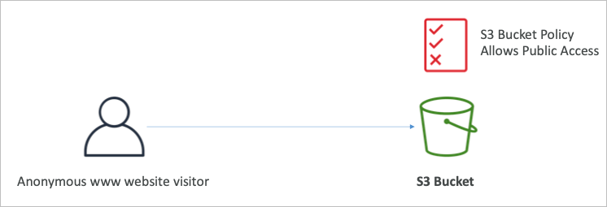
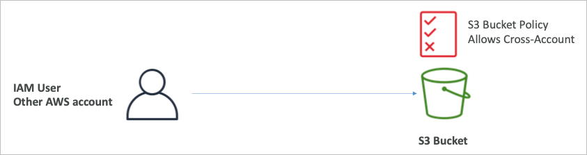
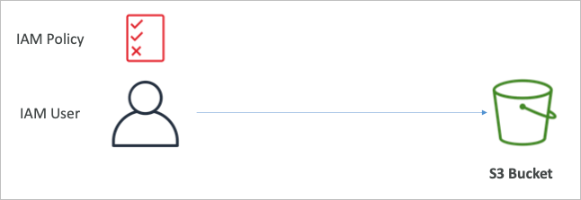
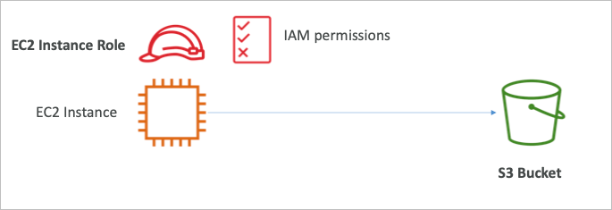
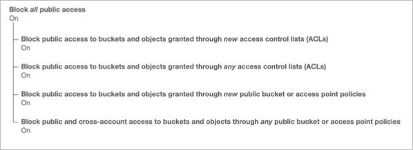

# S3

## S3 Overview

- Amazon S3는 다양한 사례가 이미 존재하는 AWS내에서도 핵심 서비스 중 하나
- “무한정 확장하는 스토리지”로 설명하고 있음

## S3 사용사례

- 백업 및 저장소
- DR용 데이터 보관
- 아카이빙
- 하이브리드 클라우드 저장소
- 어플리케이션 호스팅
- 미디어 호스팅
- 데이터 레이크 빅데이터 분석
- 소프트웨어 배포
- 정적 웹사이트

### 실사례

- 나스닥
  - 7년간의 데이터를 S3 글래시어에 보관중
  - 글래시어는 S3의 아카이빙 스토리지
- 시스코
  - 시스코는 비지니스 인사이트를 얻기 위해 데이터 분석용으로 S3에 저장된 데이터를 이용

## S3 개념

### 버킷

- Amazon S3는 파일을 오브젝트라 명명하고 이를 버킷(디렉토리)에 저장
- 버킷은 글로벌하게 유니크한 이름이어야 함
- 버킷은 리전 단위로 관리/만들어짐
  - 글로벌하게 이름관리 하기 때문에 글로벌 서비스 같지만 실질적으로 데이터는 리전단위로 관리됨
- 버킷 이름 명명 규칙
  - 대문자 불가, 언더라인 불가
  - 3~63 글자
  - 아이피를 나타내선 안됨
  - 소문자 영숫자로 시작해야 함
  - xn—으로 시작해서는 안됨
  - -s3alias로 끝나선 안됨

### 오브젝트

- 오브젝트는 파일이고 키와 값으로 구성됨
- 키는 FULL PATH가 됨
  - s3://my-bucket/my_file.txt
  - s3://my-bucket/my_folder/another_folder/my_file.txt
- 키는 prefix와 object_name으로 구성됨
  - s3://my-bucket/my_folder/another_folder/my_file.txt
- 디렉토리의 개념이 엄밀하게는 없음
  - 디렉토리의 모든 주소가 키의 이름 (/가 포함된 긴 문자열)
- 오브젝트의 값은 최대 5TiB (5000GiB)
- 5GiB보다 큰 파일을 업로드하려면 멀티파트업로드 라는 기능을 이용해야 함
- 메타데이터
  - 텍스트로 된 키/값의 쌍으로 파일의 정보를 담고 있음
- 태그
  - 유니코드의 키/값의 쌍으로 최대 10개 지정가능
  - 보안과 라이프사이클 관리에 도움이 됨
- 버전 ID
  - 파일 버저닝이 켜져 있을 경우에 파일마다 버전관리를 위한 식별자로 사용됨

### 보안

- User-Based
  - IAM 정책 → 특정 유저의 IAM 권한 설정으로 API의 접근권한을 분류 가능
- Resource-Based
  - 버킷 정책
    - S3 콘솔에서 적용되는 전체 버킷 설정 (다른 계정에서 접근 가능하도록 설정 가능)
  - Object ACL
    - 버킷 정책과는 별도로 좀 더 세세한 부분(오브젝트단위)로 추가적인 컨트롤이 요구될 때
  - Bucket ACL
    - 자주 사용되지는 않음
- IAM 정책이 S3오브젝트에 미치는 영향
  - IAM 권한을 가진 유저 또는 리소스 정책에서 허용 설정이 되어 있는 리소스는 접근 가능
  - 명시적 거부가 설정되어 있지 않은 리소스 (명시적 거부가 설정되면 어떤 권한도 거부됨)
- 암호화
  - S3는 암호화 키를 이용해 오브젝트 암호화 가능

## Bucket Policy

- JSON 기반 정책
  - Resources → 버킷과 오브젝트
  - Effect → Allow / Deny
  - Actions → 접근제어할 API 목록
  - Principal → 계정 또는 정책을 적용할 유저
- 버킷 정책을 사용하는 타이밍
  - 버킷의 퍼블릭 엑세스를 허용하고 싶을 때
    
  - 오브젝트 업로드 시 암호화를 강제하고 싶을 때
  - 다른 계정의 유저에게 권한을 부여 할 때 (크로스 계정)
    
  - IAM 권한을 가진 유저 혹은 IAM 역할을 가진 EC2 인스턴스
    
    

## 버킷 퍼블릭 엑세스 설정

- AWS에서는 S3에 대한 공개설정을 버킷단위로 설정하는 부분이 추가적으로 존재
- 버킷 정책에서 퍼블릭 엑세스를 허용한다고 하더라도, 이 설정을 사용하면 공개를 막을 수 있음
- 계정단위로 설정하는 옵션도 지원

## S3 Static Website Hosting

- S3에서는 인터넷 퍼블릭 엑세스를 허용하는 것으로 정적 웹사이트 호스팅이 가능
- 웹사이트 URL은 리전에 따라 조금 다르게 설정됨
  - http://bucket-name.s3-website-aws-region.amazonaws.com
  - http://bucket-name.s3-website.aws.region.amazonaws.com
- 403 에러가 발생한다면 버킷 정책을 확인하여 퍼블릭 엑세스 허용 권한을 다시한번 점검
