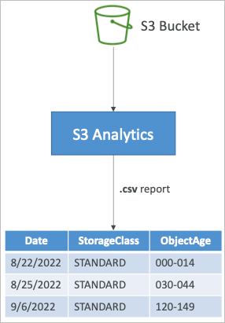
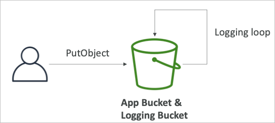

# S3

## S3 Overview

- Amazon S3는 다양한 사례가 이미 존재하는 AWS내에서도 핵심 서비스 중 하나
- “무한정 확장하는 스토리지”로 설명하고 있음

## S3 사용사례

- 백업 및 저장소
- DR용 데이터 보관
- 아카이빙
- 하이브리드 클라우드 저장소
- 어플리케이션 호스팅
- 미디어 호스팅
- 데이터 레이크 빅데이터 분석
- 소프트웨어 배포
- 정적 웹사이트

### 실사례

- 나스닥
  - 7년간의 데이터를 S3 글래시어에 보관중
  - 글래시어는 S3의 아카이빙 스토리지
- 시스코
  - 시스코는 비지니스 인사이트를 얻기 위해 데이터 분석용으로 S3에 저장된 데이터를 이용

## S3 개념

### 버킷

- Amazon S3는 파일을 오브젝트라 명명하고 이를 버킷(디렉토리)에 저장
- 버킷은 글로벌하게 유니크한 이름이어야 함
- 버킷은 리전 단위로 관리/만들어짐
  - 글로벌하게 이름관리 하기 때문에 글로벌 서비스 같지만 실질적으로 데이터는 리전단위로 관리됨
- 버킷 이름 명명 규칙
  - 대문자 불가, 언더라인 불가
  - 3~63 글자
  - 아이피를 나타내선 안됨
  - 소문자 영숫자로 시작해야 함
  - xn—으로 시작해서는 안됨
  - -s3alias로 끝나선 안됨

### 오브젝트

- 오브젝트는 파일이고 키와 값으로 구성됨
- 키는 FULL PATH가 됨
  - s3://my-bucket/my_file.txt
  - s3://my-bucket/my_folder/another_folder/my_file.txt
- 키는 prefix와 object_name으로 구성됨
  - s3://my-bucket/my_folder/another_folder/my_file.txt
- 디렉토리의 개념이 엄밀하게는 없음
  - 디렉토리의 모든 주소가 키의 이름 (/가 포함된 긴 문자열)
- 오브젝트의 값은 최대 5TiB (5000GiB)
- 5GiB보다 큰 파일을 업로드하려면 멀티파트업로드 라는 기능을 이용해야 함
- 메타데이터
  - 텍스트로 된 키/값의 쌍으로 파일의 정보를 담고 있음
- 태그
  - 유니코드의 키/값의 쌍으로 최대 10개 지정가능
  - 보안과 라이프사이클 관리에 도움이 됨
- 버전 ID
  - 파일 버저닝이 켜져 있을 경우에 파일마다 버전관리를 위한 식별자로 사용됨

### 보안

- User-Based
  - IAM 정책 → 특정 유저의 IAM 권한 설정으로 API의 접근권한을 분류 가능
- Resource-Based
  - 버킷 정책
    - S3 콘솔에서 적용되는 전체 버킷 설정 (다른 계정에서 접근 가능하도록 설정 가능)
  - Object ACL
    - 버킷 정책과는 별도로 좀 더 세세한 부분(오브젝트단위)로 추가적인 컨트롤이 요구될 때
  - Bucket ACL
    - 자주 사용되지는 않음
- IAM 정책이 S3오브젝트에 미치는 영향
  - IAM 권한을 가진 유저 또는 리소스 정책에서 허용 설정이 되어 있는 리소스는 접근 가능
  - 명시적 거부가 설정되어 있지 않은 리소스 (명시적 거부가 설정되면 어떤 권한도 거부됨)
- 암호화
  - S3는 암호화 키를 이용해 오브젝트 암호화 가능

## Bucket Policy

- JSON 기반 정책
  - Resources → 버킷과 오브젝트
  - Effect → Allow / Deny
  - Actions → 접근제어할 API 목록
  - Principal → 계정 또는 정책을 적용할 유저
- 버킷 정책을 사용하는 타이밍
  - 버킷의 퍼블릭 엑세스를 허용하고 싶을 때
    
  - 오브젝트 업로드 시 암호화를 강제하고 싶을 때
  - 다른 계정의 유저에게 권한을 부여 할 때 (크로스 계정)
    
  - IAM 권한을 가진 유저 혹은 IAM 역할을 가진 EC2 인스턴스
    
    

## 버킷 퍼블릭 엑세스 설정


- AWS에서는 S3에 대한 공개설정을 버킷단위로 설정하는 부분이 추가적으로 존재
- 버킷 정책에서 퍼블릭 엑세스를 허용한다고 하더라도, 이 설정을 사용하면 공개를 막을 수 있음
- 계정단위로 설정하는 옵션도 지원

## S3 Static Website Hosting

- S3에서는 인터넷 퍼블릭 엑세스를 허용하는 것으로 정적 웹사이트 호스팅이 가능
- 웹사이트 URL은 리전에 따라 조금 다르게 설정됨
  - http://bucket-name.s3-website-aws-region.amazonaws.com
  - http://bucket-name.s3-website.aws.region.amazonaws.com
- 403 에러가 발생한다면 버킷 정책을 확인하여 퍼블릭 엑세스 허용 권한을 다시한번 점검

## Versioning

- S3에서 파일의 버전관리를 설정할 수 있음
- 버킷 단위로 설정 가능
- 같은 키로 파일이 덮어쓰기 되면 버전ID가 부여되어 기록됨
- 버전관리는 기본적으로 설정하는 것이 권장됨
  - 실수로 파일을 삭제하는 것을 방지 (버전 복구 기능)
  - 전 버전으로 되돌리기 가능
- 참고
  - 버전 관리 기능이 활성화 되기 전에 업로드 된 파일의 버전은 null
  - 버전 관리 기능을 비활성화 하더라도 직전까지 생성되었던 버전은 유지됨


## Replication (CRR & SRR)

- 버전관리 기능이 활성화 된 원본 및 목적지 S3 버킷 필요
- CRR (Cross Region Replication)
  - DR 및 컴플라이언스
  - 지연속도 감소 목적 (유저가 다른 리전에서 접속하는 경우)
  - 다른 계정으로의 복제
- SRR (Same Region Replication)
  - 로그 보존
  - 프로덕션과 테스트 환경과의 실시간 복제
- AWS의 다른 계정의 버킷으로 복제 가능
- 복제 작업은 비동기로 이루어짐
- 적절한 IAM 권한이 필요 (원본에 대한 읽기, 목적지에 대한 쓰기)

### 복제에서 알아두어야 할 내용

- 복제를 활성화 한 뒤에 생성된 새로운 오브젝트에 한해 복제가 이루어짐
- 옵션으로 기존 항목을 복사하는 S3 배치 복제라는 기능이 있음
  - 기존의 오브젝트들과 실패한 복제를 다시 복제하는 기능
- 삭제를 복제하기
  - 삭제 마커를 복제할 수 있음 (옵션)
  - 버전ID를 지정하여 영구적으로 삭제하는 작업은 복제되지 않음 (악용 방지)
- 복제의 체이닝은 일어나지 않음
  - 예를 들어 버킷1을 버킷2에 복제, 버킷2를 버킷3에 복제하는 설정을 했다고 가정했을때, 버킷1에서의 변화를 버킷2가 복제하지만, 해당 작업이 버킷 3에게까지 복제되지는 않음

## Storage Classes

- Standard - General Purpose
- Standard-Infrequent Access (IA)
- One Zone-Infrequent Access (One Zone IA)
- Glacier Instant Retrieval
- Glacier Flexible Retrieval
- Glacier Deep Archive
- Intelligent Tiering

## Durability and Availability

- Durability 내구성
  - 다중 AZ에 구성된 오브젝트의 내구성 11.9 (99.999999999%)
  - 이 수치는 예를 들면 10,000,000 개의 오브젝트를 저장했다고 했을 때, 평균적으로 10,000년에 하나의 파일이 소실될 수 있음을 나타냄
  - 모든 스토리지 클래스에서 내구성은 동일
- Availability 가용성
  - 얼마나 서비스가 중단없이 지속될 수 있는지에 대한 지표
  - 스토리지 클래스에 따라 다름
  - Standard의 경우 99.99%의 가용성 (1년에 53분을 이용하지 못할 수 있음)

## S3 Standard

- 99.99% 가용성
- 자주 사용되는 데이터
- 저지연 및 높은 처리량
- 동시 2개의 데이터센터 장애에도 유지 가능
- 사용 사례
  - 빅데이터 분석
  - 모바일 및 게이밍 어플리케이션
  - 컨텐츠 배포

## S3 Infrequent Access

- 자주 사용되지 않는 데이터
- 저장에는 비용이 저렴해지지만, 데이터를 사용할때 비용이 발생 (원래는 발생 안함)
  - 따라서 엑세스가 적은 데이터 타입에 유용
- Standard-Infrequent Access (Standard IA)
  - 99.9% 가용성
  - 사례 → DR, 백업 등
- One Zone-Infrequent Access (One Zone IA)
  - 단일 AZ에 저장되는 IA로 데이터센터 장애시 사용 불가
  - 99.5% 가용성
  - 사례 → 두번째 백업 카피

## Glacier Storage Classes

- 저비용의 보관으로 아카이빙/백업 달성
- 요금 체계
  - 저장에는 매우 저렴한 데이터 비용
  - 데이터를 꺼내 올때 추가과금이 발생
- Instant Retrieval
  - 데이터를 꺼내올 때 대기시간이 매우 짧음 (분기에 한번정도 엑세스 하는데 적합)
  - 최소 저장 기간이 90일 (즉, 90일 내에는 데이터를 꺼내올 수 없음)
- Flexible Retrieval
  - Expedited (1~5분 대기), Standard (3 to 5시간 대기), Bulk (5 to 12시간 대기)
  - 최소 저장 기간이 90일
- Deep Archive
  - Standard (12시간 대기), Bulk (48시간 대기)
  - 최소 저장 기간이 180일

## Intelligent-Tiering

- 일부 월당 모니터링 및 티어링 과금이 발생
- S3에서 자동으로 파일의 엑세스 빈도를 체크하여 티어를 이동
- 꺼내 올 때 과금 없음
- Frequent Access Tier (자동)
  - 기본 티어
- Infrequent Access tier (자동)
  - 30일간 엑세스가 없을 경우
- Archive Instant Access tier (자동)
  - 90일간 엑세스가 없을 경우
- Archive Access tier (옵션)
  - 90~700일간 설정으로 선택 가능
- Deep Archive Access tier (옵션)
  - 180일~700일간의 설정으로 선택 가능

## 스토리지 클래스 이동

- 오브젝트의 스토지 클래스를 전환하는 것은 가능
- 자주 사용되지 않는 오브젝트가 있다면 Standard IA로 전환
- 자주 사용하지 않고 데이터를 필요로할 때 즉시 사용할 필요가 없다면 더 저렴한 글래시어나 딥아카이브를 이용 가능
- 수동으로 오브젝트의 스토리지 클래스를 변경할 수도 있지만, 라이프사이클 매니저로 자동화 할 수 있음


## Lifecycle Rules

- Transition (변환)
  - 오브젝트의 스토리지 클래스를 변경
    - 60일 이후에는 Standard IA로 변경한다거나
    - 6개월 뒤에는 글래시어로 아카이빙을 위해 이동한다거나
- Expiration (만료)
  - 오브젝트를 일정 기간 후에 삭제 또는 만료
    - 엑세스 로그를 365일 이후에 삭제
    - 버전관리가 설정되어 있을 경우 일정 기간 후에 오래된 버전을 삭제
    - 오래된 멀티파트 업로드 실패분을 삭제
- 룰은 프리픽스 형태로 타겟지정을 할 수 있음
  - s3://mybucket/mp3/\*
- 룰은 태그를 타겟으로 지정할 수 있음
  - Department: Finance

## Storage Class Analysis

- 오브젝트의 적당한 클래스를 정하는데 도움이 됨
- Standard나 Standard IA 클래스에 적용가능
  - One-Zone IA나 글래시어에는 적용 불가
- 데일리 업데이트
- 24~48시간의 처음 분석시간이 필요
- 라이프사이클 룰을 사용중이라면 강화하는데, 사용하지 않는다면 도입하는데 충분한 도움이 됨



## Requester Pays

- 일반적으로 S3 스토리지에 대한 전송요금은 버킷 소유자가 지불하는 것
- 요청자 지불 옵션을 이용해 버킷 소유자가 아닌 오브젝트 요청자에게 전송비용을 전가시킬 수 있음
- 데이터량이 많을 경우 다른 계정에 자료를 공유할때 도움이 되는 옵션
- 요청자를 식별하기 위해 퍼블릭 공개는 불가능하며, AWS에서 식별가능한 계정을 소유한 이용자여야 함


## Event Notification

- S3:ObjectCreated, S3:ObjectRemoved .. 등과 같은 API 요청
- 오브젝트 이름으로 필터링 가능 (\*.jpg)
- 사례
  - 이미지 업로드 시 자동으로 썸네일 생성 트리거 작성
- 원하는 만큼 S3 이벤트 작성 가능 (무제한)
- S3 이벤트는 다른 서비스를 호출하는데 보통은 수초 안에서 끝나지만 간혹 분단위로 길어질 수도 있음


### S3 Event Notification with Amazon EventBridge

- S3 이벤트의 경우 타겟이 한정적이었으나, EventBridge와 연계가능해지고 난 이후에는 EventBridge에서 많은 다른 서비스들과의 연계가 가능하게 됨


- 강화된 필터링
  - JSON 방식으로 다양한 옵션 적용 가능 (메타데이터, 파일사이즈, 이름 ..)
- 동시에 여러 목적 서비스로의 연계
  - StepFunction
  - Kinesis Stream / Firehose
- 이벤트브릿지 고유 기능
  - 아카이빙
  - 재전송
  - 안정적인 전송보장 등

## Baseline Performance

- S3는 기본적으로 자동으로 스케일링되며 요청은 100ms ~ 200ms안에 끝남
- 어플리케이션에서 요청할때 prefix당 3500의 PUT/COPY/POST/DELETE 요청이 가능하고, 5500의 GET/HEAD 요청이 가능
- 만들 수 있는 prefix의 개수에는 제한이 없음
- prefix란 폴더/디렉토리를 의미함

### Multi-Part upload

- 100MB이상의 파일이면 권장되고 5GiB이상이면 필수가 됨
- 병렬 업로드를 지원하여 속도를 증가시킬 수 있음


### Transfer Acceleration

- AWS 엣지 로케이션으로의 전송 거점을 변경하여 업로드 속도를 최적화
- 사용자와 가장 가까운 로케이션을 선정하고, 엣지 로케이션과 실제 버킷이 있는 장소까지는 아마존 글로벌 네트워크를 이용하여 빠르게 전송됨
- 멀티파트 업로드와 연계됨


## Byte-Range Fetches

- GET 요청을 병렬화하여 읽기 속도를 올림
- 속도 뿐 아니라 실패 내성에도 도움이 되는 기능
- 사용 사례
  - 업로드 속도 증가
    
  - 파일의 일부만 먼저 읽어서 정보 확인 (헤더)
    

## S3 Select Glacier Select

- SQL을 이용해서 S3내에 있는 정보를 서버사이드로 처리한다음 데이터를 가져오기
- row와 column까지 분석해서 필터링 가능
- 모든 데이터를 가져와서 어플리케이션에서 처리하는 것 보다 비용적 측면에서도 저렴하고 데이터도 작기 때문에 속도도 빠르게 됨


## S3 배치 작업

- S3에 있는 오브젝트들에 특정 작업을 실행 가능
  - 메타데이터 일괄 수정 및 설정
  - S3 버킷 간의 데이터 이동 카피
  - 오브젝트들 암호화
  - ACL 일괄 변경, 태그 변경
  - Glacier로부터 데이터 복원
  - 오브젝트 당 람다 함수 호출
- 배치 작업은 오브젝트 리스트에 대해 수행됨
- 배치를 사용하는 이유는 재실행, 진척 추적, 완료 통지 등 다양한 부가기능을 제공하기 때문임
- S3 인벤토리를 이용해 S3 오브젝트 목록을 추출하여 S3 Select로 필터링 하고 배치 작업을 수행 가능


## Object Encryption

- S3에서 오브젝트를 암호화 하는 4가지 방식
- 서버 사이드 암호화 (SSE)
  - S3에서 제공하는 암호화 키로 서버 사이드 암호화 (SSE-S3)
    - 오브젝트는 S3 전용 키로 암호화 됨
    - KMS에서 발행하는 계정 전용 키로 다른 계정과 공유 불가
  - KMS에서 제공하는 암호화 키로 서버 사이드 암호화 (SSE-KMS)
    - 오브젝트는 KMS에서 발행한 키로 암호화 됨
    - 다른 계정과 공유 가능
  - 클라이언트가 업로드한 암호화 키로 서버 사이드 암호화 (SSE-C)
    - 소유한 암호화 키로 암호화가 필요한 경우
- 클라이언트 사이드 암호화

### SSE-S3

- AWS에서 소유한 키로 암호화를 수행
- 서버 사이드 암호화 방식
- 암호화 타입은 AES-256
- 오브젝트 업로드 시 헤더에 “x-amz-server-side-encryption: AES256”을 명시하면 됨


### SSE-KMS

- AWS KMS에서 발행한 암호화 키로 오브젝트 암호화를 수행
- KMS의 이점으로는 유저가 컨트롤 가능한것과 CloudTrail에서 사용 이력을 확인할 수 있다는 점
- 서버 사이드 암호화 방식
- 오브젝트 업로드 시 헤더에 “x-amz-server-side-encryption: aws:kms”를 명시하면 됨


### KMS 방식의 제약사항

- KMS방식의 암호화를 선택하면 KMS에 의한 제약사항이 추가됨
- 업로드 시 암호화를 위해 KMS API인 GenerateDataKey가 발생함
- 다운로드 시 복호화를 위해 Decrypt API가 발생함
- 이는 KMS의 제약사항인 초당 5500, 10000, 30000의 요청횟수에 영향을 받음
- 이러한 제약사항에 영향을 받기 시작하면 서비스 제한을 늘리는 요청을 해야 함 (AWS Support)


### SSE-C

- AWS 밖에 있는 유저 전용 키를 이용하여 서버 사이드 암호화를 수행
- S3에서는 암호화 키를 저장하지 않음
- HTTPS로 전송 중 암호화를 반드시 사용해야 함
- 모든 HTTP 통신에 헤더를 통해 암호화 키가 제공되어야 함


### Client Side Encryption

- S3에서 제공하는 라이브러리를 이용해 클라이언트 머신에서 암호화를 수행
- 암호화된 파일을 S3에 전송
- 복호화는 S3에서 오브젝트를 내려받고, 클라이언트 머신에서 수행


## Encryption in transit (SSL/TLS)

- SSL/TLS를 이용한 전송 중 암호화
- S3에서는 비암호화, 암호화 엔드포인트를 둘 다 제공
- HTTPS가 권장됨
- SSE-C 방식일 경우 HTTPS는 필수가 됨

## Default Encryption vs Bucket Policy

- 버킷 정책은 오브젝트가 업로드 되는 단계에서 측정
- 기본 암호화는 업로드 이후에 오브젝트를 암호화
- 따라서 버킷 정책에서 암호화 설정이 되어 있지 않으면 거부하는 정책은 기본 암호화 적용 전에 이루어진다는 점을 이해하면 됨

## CORS

- Cross-Origin Resource Sharing (CORS)
  - 다른 오리진 리소스 사용
- Origin은 스킴(프로토콜)과 호스트(도메인), 포트의 조합으로 이루어짐
  - https://www.example.com (443포트의 HTTPS)
- 웹 브라우저는 메인 오리진에 접속하면서도 다른 오리진에 요청을 보낼 수 있도록 되어 있음
- 오리진 예시
  - 같은 오리진 http://www.example.com/app1 & http://www.example.com/app2
  - 다른 오리진 http://www.example.com & http://other.example.com
- 다른 오리진으로의 요청은 다른 오리진에서 명시적으로 허용하지 않는 한 거부됨
  - 허용방법은 CORS 헤더에 Access-Control-Allow-Origin을 명시하는 것


## S3 CORS

- 클라이언트가 엑세스 하는 웹사이트에서 S3 버킷의 이미지를 참조한다고 가정
- 이 경우 S3 버킷은 메인 오리진과 다른 오리진이 되므로 CORS를 허용해야 할 필요가 있음
- CORS는 도메인을 지정해도 되지만, \*로 지정하면 모든 메인 오리진을 허용하게 됨


### CORS 설정 샘플

```json
[
  {
    "AllowedHeaders": ["*"],
    "AllowedMethods": ["PUT", "POST", "DELETE"],
    "AllowedOrigins": ["http://www.example.com"],
    "ExposeHeaders": [
      "x-amz-server-side-encryption",
      "x-amz-request-id",
      "x-amz-id-2"
    ],
    "MaxAgeSeconds": 3000
  }
]
```

## MFA Delete

- MFA (Multi-Factor Authentication)
  - 고유 디바이스에서 받은 원타임 인증 코드를 이용하여 인가받은 작업을 수행하는 것
- S3에서 MFA를 적용할 수 있는 작업
  - 오브젝트 버전의 영구적인 삭제
  - 버킷의 버전관리 비활성화
- MFA가 필요하지 않은 작업
  - 버전관리의 활성화
  - 삭제된 버전의 리스팅
- MFA Delete를 적용하려면 버킷의 버전관리가 반드시 활성화 되어 있어야 함
- 버킷 소유자(루트 계정)에서 MFA 삭제를 활성화/비활성화 할 수 있음

```bash

```

## Access Logs

- 감사 목적으로 S3 버킷에 대한 로그 저장이 필요한 경우가 있음
  - 모든 계정에서 발생하는 S3에 대한 요청, 인증, 거부 등에 대한 기록
- 그러한 데이터들을 모아두고 분석 도구등을 이용하여 데이터를 검증할 수 있음
- 로그를 모아두는 전용 버킷을 생성할 수 있는데, 같은 리전에 존재해야 함


- 단, 로그 저장 버킷의 대상이 자기 자신이 되면 로그를 저장하는 로그가 루프하며 무한하게 용량이 증가할 수 있음



## Pre-Signed URLs

- S3 콘솔, CLI 혹은 SDK에서 미리 서명된 URL을 발행
- URL 만료
  - S3 콘솔 720분까지 분단위 혹은 시간단위 설정 가능 (12시간)
  - AWS CLI 초단위로 매개변수를 설정 가능 기본 3600초 최대 604800초 (168시간)
- 미리 서명된 URL을 통해 해당 URL로 접근하여 일정 시간동안 업로드/다운로드 권한을 얻을 수 있음 (GET/PUT)
- 사용 사례
  - 로그인 유저에게만 S3 버킷에 있는 프리미엄 비디오에 접근할 수 있는 권한 부여
  - 유저가 다운로드 받는 URL을 동적으로 변경하고 싶을 때
  - 정해진 S3 버킷 경로에 임시 업로드 권한을 지정해주고 싶을 때


## Glacier Vault Lock

- WORM (Write Once Read Many) 모델
- Vault Lock 정책을 설정
- 정책 자체를 잠금하여 수정을 금지함 (더이상 변경이나 삭제 불가)
- 컴플라이언스와 데이터 보관

## Object Lock (버전관리 필요)

- WORM (Write Once Read Many) 모델
- 오브젝트의 버전 삭제를 일정 기간 동안 금지
- 보관 모드 컴플라이언스
  - 모든 유저(루트 포함)의 삭제나 변경을 금지
  - 보관 기간 변경 불가, 모드 변경 불가
- 보관 모드 거버넌스
  - 어드민을 제외한 유저의 삭제나 변경을 금지
  - 어드민이 보관 기간이나 모드의 변경 가능 (IAM을 통한 제어)
- Legal Hold
  - 버킷 설정에 관계 없이 오브젝트의 보관을 무제한으로 함
  - s3:PutObjectLegalHold 권한이 있는 유저는 자유롭게 변경 가능

## Access Policy

- 각각의 엑세스 포인트가 고유한 DNS와 정책을 가지고 유저의 접근권한을 설정
  - 특정 IAM 유저 및 그룹
  - 하나의 AP에 하나의 정책을 할당하여 S3 정책관리를 단순화 하는데 목적이 있음


## Object Lambda

- 어플리케이션이 오브젝트에 접근하기 전 람다 함수를 통해 오브젝트를 가공할 수 있음
- 하나의 버킷 안에서 어플리케이션용 AP와 람다함수용 AP를 설치하여 어플리케이션이 접근할때 람다를 트리거
- 사용 사례
  - 오브젝트에 접근할 때 PII(Personally identifiable information)을 필요로 하여 어떠한 다른 데이터베이스 등에 접근할 필요가 있을 때 (로지컬한 처리)
  - S3 버킷에 있는 파일을 다른 포맷으로 변경한다거나 하는 변환 처리
