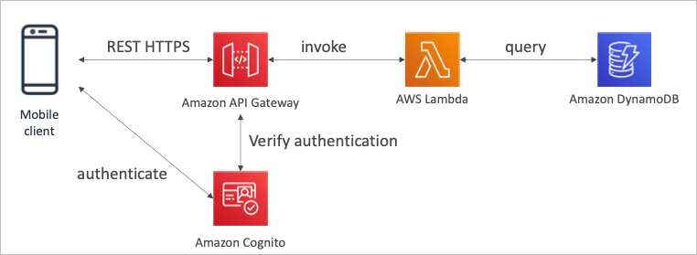
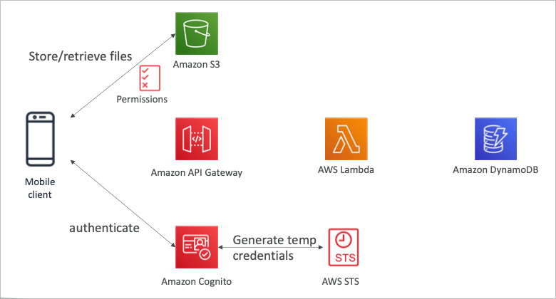
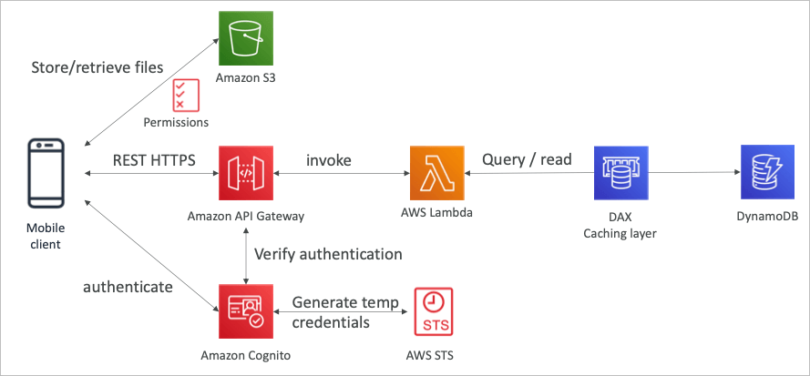
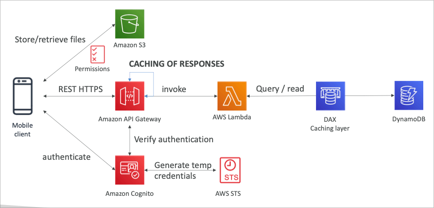

## MyTodoList

### 요구사항

- REST API를 통한 HTTPS 엔드포인트 노출
- 서버리스 아키텍쳐
- 유저는 S3을 통해 직접 소통 가능할것
- 관리형 서버리스 서비스를 통한 인증
- 유저는 투두를 작성하고, 조회함 (대부분은 조회)
- 데이터베이스는 가끔 많은 읽기를 위해 자동으로 스케일링되어야 함

### Mobile 앱 : REST API 계층

### Mobile 앱 : S3에 권한 부여

### Mobile 앱 : 고성능의 읽기 처리

### Mobile 앱 : 고성능의 읽기 처리 (캐싱 레이어 추가)

### 정리

- 서버리스 REST API
  - HTTPS
  - API Gateway
  - Lambda
  - DynamoDB
- 코그니토를 이용한 임시 크레덴셜 생성으로 STS를 이용, S3에 엑세스 (권한 설정)
- 앱 유저는 AWS에 직접 접속하여 S3 버킷 내용 확인 가능
- DDB와 DAX를 이용한 캐싱 테크 적용
- REST 요청 또한 API Gateway 캐싱을 적용
- 인증과 인가를 코그니토와 STS를 이용하여 보안성 확보
