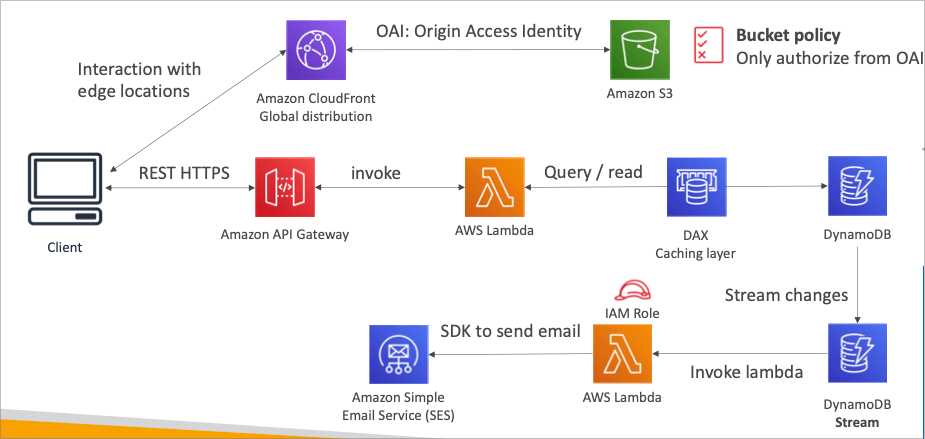
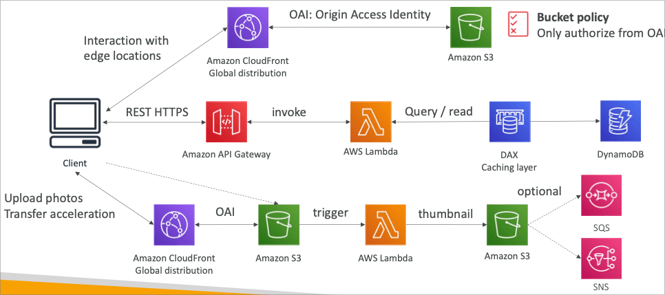

## MyTodoList

### 요구사항

- REST API를 통한 HTTPS 엔드포인트 노출
- 서버리스 아키텍쳐
- 유저는 S3을 통해 직접 소통 가능할것
- 관리형 서버리스 서비스를 통한 인증
- 유저는 투두를 작성하고, 조회함 (대부분은 조회)
- 데이터베이스는 가끔 많은 읽기를 위해 자동으로 스케일링되어야 함

### Mobile 앱 : REST API 계층

### Mobile 앱 : S3에 권한 부여

### Mobile 앱 : 고성능의 읽기 처리

### Mobile 앱 : 고성능의 읽기 처리 (캐싱 레이어 추가)

### 정리

- 서버리스 REST API
  - HTTPS
  - API Gateway
  - Lambda
  - DynamoDB
- 코그니토를 이용한 임시 크레덴셜 생성으로 STS를 이용, S3에 엑세스 (권한 설정)
- 앱 유저는 AWS에 직접 접속하여 S3 버킷 내용 확인 가능
- DDB와 DAX를 이용한 캐싱 테크 적용
- REST 요청 또한 API Gateway 캐싱을 적용
- 인증과 인가를 코그니토와 STS를 이용하여 보안성 확보

## Serverless hosted website

### 요구사항

- 글로벌 스케일 웹사이트
- 블로그는 가끔 작성되고 대부분 읽기 (자주 엑세스가 발생)
- 웹사이트의 일부 파일은 정적 파일이고, 나머지는 REST API로 동적 접근
- 캐싱이 가능한 곳에서는 적용
- 새로운 유저가 구독을 할 경우 이메일로 알림을 줌
- 업로드된 사진은 썸네일을 작성

### 유저 구독 이메일 (웰컴)

### 썸네일 작성 흐름

### 정리

- S3 정적 컨텐츠를 CloudFront를 이용 글로벌 엣지 로케이션으로 배포 (CDN)
- REST API는 API Gateway를 이용, 퍼블릭이기 때문에 코그니토는 필요 없음
- Global DDB 기능을 이용하여 데이터베이스를 양방향 모든 리전으로 복제
  - RDS를 이용한다면 오로라 글로벌 데이터베이스 이용 가능
- DDB Streams를 이용, 람다 함수로 유저 환영 이메일을 발송 가능
  - 람다 함수에 IAM 역할을 이용하여 SES를 사용
- S3은 SQS / SNS를 호출하여 추가적인 기능 수행 가능 (썸네일 작성)
