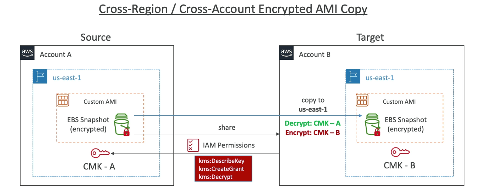

# AMI Overview

- AMI : Amazon Machine Image
- AMI는 EC2인스턴스의 커스텀화
  - 기본 EC2에 소프트웨어, 설정, 환경, 모니터링등을 추가
  - 빠른 부팅, 미리 설치된 소프트웨어 및 설정을 활용하기 위한 방법
- AMI는 리전에 기반하여 관리됨 (각 리전별로 복사가 가능)
- AMI를 통해 EC2 인스턴스를 시작할 수 있음
  - Public : AWS에서 기본적으로 제공하는 타입
  - Pricate : 직접 제작한 AMI
  - Marketplace : 다른 사람에 의해 만들어진 AMI (그리고 과금 형태일 가능성이 높음)

## AMI Process (from an EC2 instance)

- EC2 인스턴스를 시작한 뒤 각종 설정을 마침
- 인스턴스를 정지 (데이터의 일관성 보호를 위해, 실행중에도 옵션을 통해 AMI 제작 가능)
- AMI를 작성 : 이 과정을 수행하기 위해 EBS 스냅샷을 작성하게 됨
- AMI로부터 다른 인스턴스를 시작

## AMI No-Reboot Option

- AMI 작성시 인스턴스를 종료하지 않는 기능
- 기본적으로는 옵션이 선택되어 있지 않음 (AWS는 데이터 일관성 보호를 위해 AMI를 작성하기 전 인스턴스를 정지시킴)
- 이 옵션을 설정했을때 AMI를 인스턴스의 중단없이 제작할 수 있지만, OS 버퍼등은 디스크에 쓰여지지 않으므로 작업중인 데이터까지 전부 AMI로 작성되지 않을 수 있음

## AWS Backup Plans to create AMI

- AWS Backup은 EBS 스냅샷을 작성할때 인스턴스를 리붓하지 않음
  - 파일 시스템 일관성 체크를 하지 않는다는 뜻
  - 일관성 보호를 위해서는 이벤트브리지로 람다를 호출해서 재부팅 AMI 작성을 별도 API로 호출해야 할 필요성이 있음

## EC2 Instance Migration between AZ

- 특정 AZ의 인스턴스로부터 AMI를 작성한 뒤 해당 AMI로부터 다른 AZ에 인스턴스를 작성하면 됨

## Cross Account AMI Sharing

- AWS의 다른 계정과 AMI를 공유할 수 있음
- AMI를 공유하는것은 소유권에 영향을 주지 않음
- AMI를 공유하기 위해서는 암호화 되지 않은 경우 혹은 개별 KMS로 암호화한 경우만 가능
- 암호화된 AMI를 공유할 경우에는 암호화에 사용된 KMS키 또한 공유되어야 함

## AMI Sharing with KMS Encryption

- 계정A에서 계정B로 AMI를 공유한다고 하면, 실제 AMI가 존재하는 곳은 백단에서는 S3이 되고 바로 해당 AMI로부터 인스턴스를 시작하는 개념
- 만약 해당 AMI가 암호화 되어 있다고 하면, 암호화에 이용된 CMK를 공유해줘야 하며 마찬가지로 키를 이용할수 있도록 IAM 권한을 적절하게 설정해줄 필요가 있음
  - kms:DescribeKey
  - kms:CreateGrant
  - kms:Decrypt
  - kms:GenerateDataKey
  - kms:ReEncrypt

## Cross Account AMI Copy

- 공유된 AMI를 복사하게 되면 AMI에 대한 권한을 획득하게 됨
- 원본 AMI에 대한 오너가 읽기 권한을 허용해야 함

- 공유된 AMI가 암호화 되어 있다면 사용된 암호화 키에 대한 권한 역시 필요
- 복사된 AMI는 자신 소유의 CMK로 암호화 가능

## EC2 Image Builder

- 가상 이미지 혹은 컨테이너 이미지를 만드는 자동화 툴
- EC2 AMI에 대한 생성 유지보수 검증을 수행
- 검증된 AMI를 배포까지 수행함 (AMI는 리전 베이스지만 다른 리전에도 배포하는 등)
- 스케줄을 작성할 수 있으므로, 기간, 어떤 업데이트를 수행할지 등등
- 무료 서비스이며 생성 과정 중에 작성되는 EC2에 대한 비용정도만 지불하게 됨

## AMI in Production

- 유저권한을 조정하여 미리 승인된 AMI로부터만 인스턴스를 실행할수 있도록 할 수 있음

- AWS Config을 이용하여 어떤 인스턴스가 규정을 위반하는지 검출 가능

