# API Gateway 101

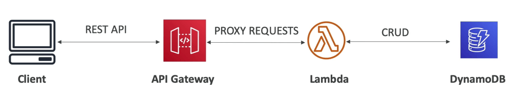

- AWS 람다 + API Gateway: 관리할 인프라가 없음
- WebSocket프로토콜을 지원함
- API 버저닝을 지원 (v1, v2...)
- 서로 다른 환경을 지원 (dev, test, prod ...)
- 보안을 담보 (인증과 승인)
- API키를 만들고 요청 쓰로틀링 설정이 가능
- Swagger Open API를 위한 API 정의가 가능
- 요청을 변환, 검증하고 응답함
- SDK를 만들고 API 상세 도큐멘트를 작성해줌
- API 캐시 응답을 지원

## API 게이트웨이 통합

- 람다함수
  - 람다함수의 호출
  - REST API를 노출하는 가장 일반적이고 쉬운 방법
- HTTP
  - 백엔드의 HTTP엔드포인트를 노출시킴
  - 예) 내부 HTTP API, ALB 등
  - 왜 굳이 API게이트웨이를? → 요청 비율의 제한, 캐싱, 유저 인증, API키 등을 활용하기 위함
- AWS서비스들
  - 어떤 AWS 서비스와도 통합이 가능하다
  - 예) AWS 스텝 펑션을 이용한 워크플로우, SQS에 포스트 메시지 작성 등
  - 왜 이때 API게이트웨이를? → 인증, 배포, 요청 비율 제한 등

## Endpoint 타입

- Edge-Optimized (기본) : 글로벌 클라이언트
  - 클라우드프론트의 엣지 로케이션을 이용하여 해당 장소에 API를 배포 (지연속도 감소를 위해)
  - API게이트웨이는 하나의 리전 베이스로 가동됨
- 리저널
  - 같은 리전에 있는 유저들에게 제공하는 경우
  - 클라우드프론트를 수동으로 런칭시킨 뒤 매칭시켜 캐싱 전략이나 배포 전략에 좀 더 세밀한 컨트롤이 가능
- 프라이빗
  - 같은 VPC내부에서만 접근이 가능하도록 설정 VPC 엔드포인트 (ENI) 를 사용하게 된다
  - 접근제한을 위해 리소스 정책을 이용한다

## 배포 스테이지

- API Gateway를 변경해도 즉시 효과가 발생하는 것은 아니다
- 배포 작업을 통해서 변화된 내용을 반영할 수 있다
- 주로 이러한 내용을 몰라서 혼동할때가 많다
- 변경점은 다양한 스테이지에 배포가능하다 (그리고 스테이지는 원하는 만큼 만들 수 있음)

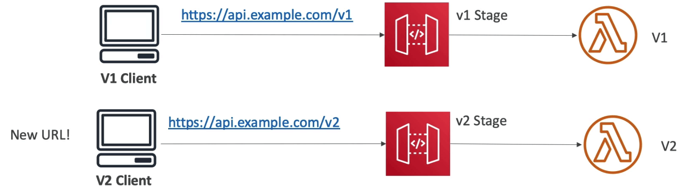

- 스테이지에는 이름을 붙일 수 있다 (dev, test, prod 등등)
- 각각의 스테이지는 고유한 설정 변수를 가진다
  - 스테이지 변수는 API 게이트웨이를 위한 환경 변수로 이해하자
  - 환경 내에서 자주 변경되는 일부의 설정이 있다면 그때 이용 가능하다
  - 예를 들면
    - 람다 함수의 ARN
    - HTTP 엔드포인트 주소
    - 패러미터
  - 유스케이스로서
    - HTTP 엔드포인트를 설정 (dev, test, prod..)
    - 맵핑 템플릿을 이용하여 람다 함수에 설정 변수를 전달
  - 스테이지 변수는 람다 함수에 context 오브젝트로 전달된다
    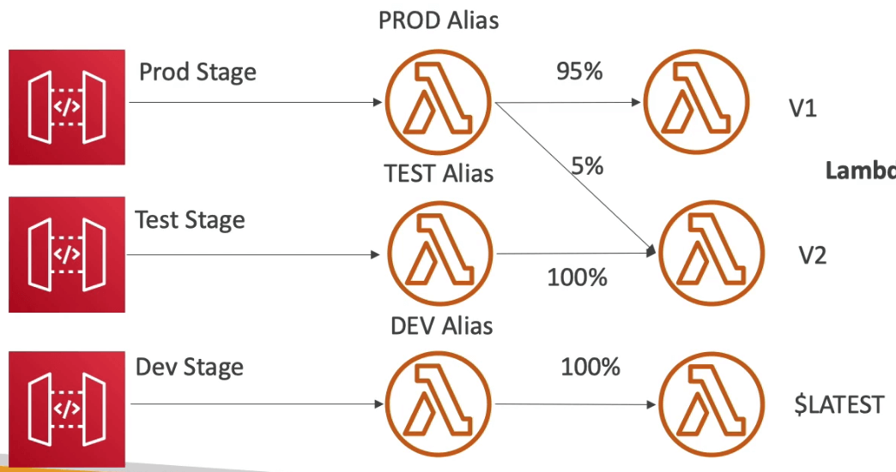
- 스테이지는 배포 이력에 따라 롤백이 가능하다

## 카나리 배포

- 어떤 스테이지에서도 카나리 배포를 이용할 수 있지만 일반적으로는 PROD 환경이 많음
- 일정 비율의 요청을 카나리 채널로 받는것을 의미
  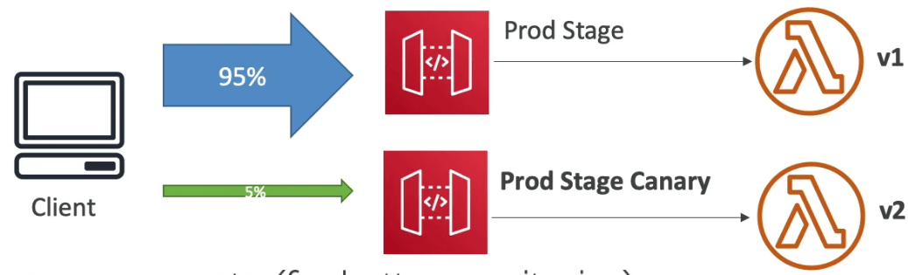
- 지표와 로그가 분리됨 (모니터링이 편리해짐)
- 스테이지 변수를 카나리를 위해 분리 가능
- 블루 그린 배포 전략 (람다와 API 게이트웨이를 이용한)

## 통합 타입

- 통합 타입 MOCK
  - API Gateway는 백엔드로 데이터를 송신하지 않고 바로 응답을 보내줌
- 통합 타입 HTTP / AWS (Lambda & AWS Services)
  - 통합 요청과 응답을 양쪽 다 설정해야함
  - 맵핑 템플릿을 이용해서 요청과 응답 양쪽에 데이터 맵핑 가능
- 통합 타입 AWS_PROXY
  - 클라이언트에서 들어오는 요청이 그대로 람다의 인풋으로 전달됨
  - 함수에서 응답해야 할 책임이 있음
  - 맵핑 템플릿이나 헤더, 쿼리 스트링은 전부 매개변수로 전달됨
- 통합 타입 HTTP_PROXY
  - 맵핑 템플릿은 없음
  - HTTP요청이 그대로 백엔드로 전달됨
  - HTTP응답은 API Gateway를 통해 전달됨

## 맵핑 템플릿

- 맵핑 템플릿은 요청과 응답을 수정할 수 있는 기능
- 쿼리 스트링 매개변수의 이름이나 값을 변경할 수 있음
- body content를 수정 가능
- 헤더를 추가 가능
- VTL(Velocity Template Language)를 이용해서 for loop, if 등 스크립트를 작성하면 됨
- 결과를 필터링 아웃 할 수 있음 (필요없는 데이터는 삭제)
- 예
  - SOAP API는 XML기반인데, REST API는 JSON 기반
    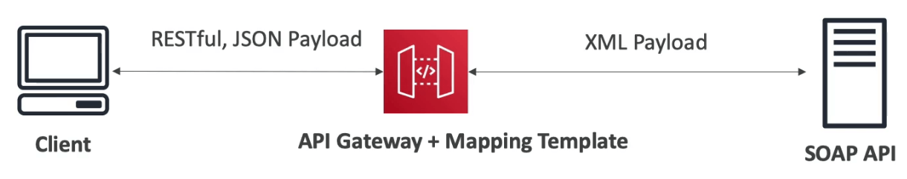
  - 이 경우에 API Gateway에서는
    - 유저로부터의 요청에 데이터를 가공 (경로, 페이로드, 헤더를 추가)
    - 요청 데이터에 기반하여 SOAP 메시지를 만들어 넘김
    - SOAP 서비스를 요청하고 XML 응답을 받아냄
    - XML 응답을 JSON으로 변경하여 클라이언트에게 응답
- 또 다른 예

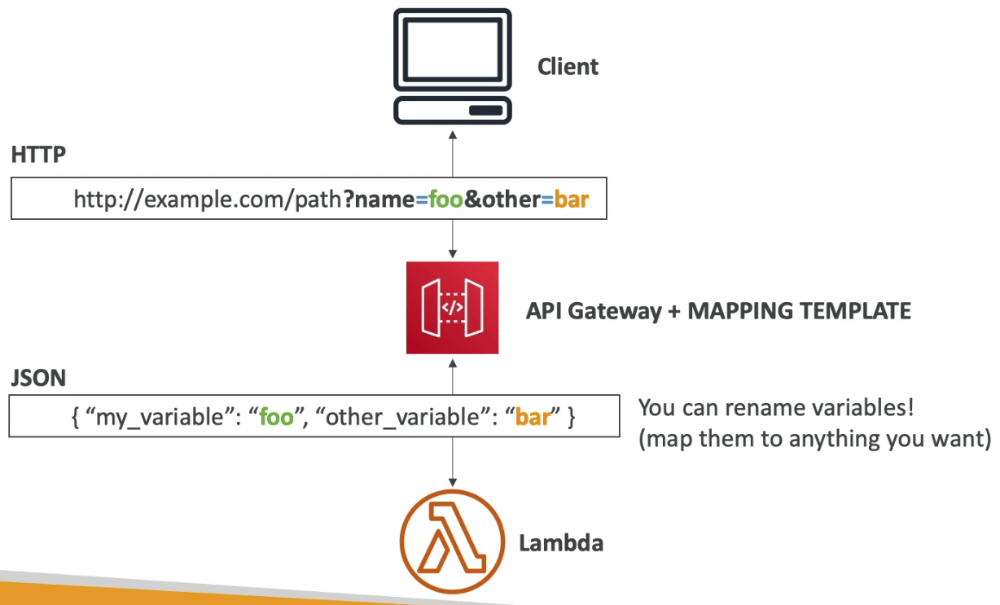

## API Gateway Swagger , Open API Spec

- RESTful API의 일반적인 정의 방법으로는 코드를 통해 API를 정의하는 것임
- 이미 있는 Swagger / OpenAPI 3.0 spec을 API Gateway에 임포트
  - Method
  - Method Request
  - Intergration Request
  - Method Response
  - API Gateway를 위한 AWS 익스텐션 제공
- 현재 API를 Swagger / OpenAPI spec을 위한 형태로 엑스포트
- Swagger는 YAML과 JSON으로 작성 가능
- Swagger를 이용해서 SDK를 만들 수 있음

## API 응답을 캐싱

- 캐싱은 백엔으로의 호출 수를 줄이는데 도움
- 기본 TTL은 5분이며, 최소 0초 ~ 3600초 (1시간) 까지 늘릴 수 있다
- 캐시는 **스테이지 별**로 지정하며
- **메서드 단위로 사용할지 안할지 결정**할 수 있다
- 캐시는 암호화 옵션을 제공
- 캐시의 용량은 0.5GB ~ 237GB 까지 제공
- 캐시는 비싸다. 따라서 프로덕션이나 프리 프로덕션 환경에서 추천한다

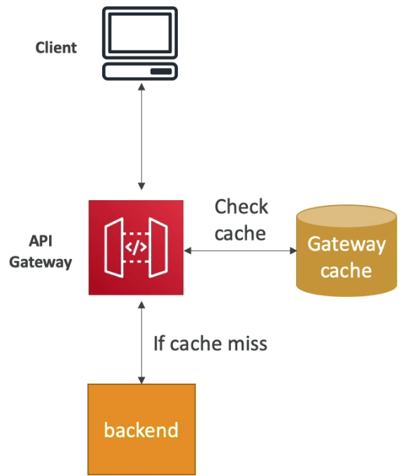

## 캐시 클리어

- UI상에서 전체 캐시를 퍼징 할 수 있음
- 클라이언트가 헤더를 이용해 캐시를 퍼징 가능 (Cache-Control: max-age=0)
- InvalidateCache 정책에 제한을 걸지 않으면 아무나 캐시를 초기화 할 수 있게 되므로 망함

## API 게이트웨이 플랜 적용 및 API 키 발행

- 만약 API를 고객에게 제공하고 사용량에 대해 청구하고 싶다면
- Usage Plan
  - 배포된 API 스테이지와 메서드에 누가 어디로 접근할수 있는지
  - 얼마나 그리고 얼마나 자주 접근 할수 있는지
  - API 키를 이용해서 클라이언트를 특정하고 측정하기 위해
  - 쓰로틀링 제한과 전체 요청 횟수 제한들을 각각의 클라이언트에 대해서 걸기 위해
- API 키
  - 알파벳+숫자조합으로 된 문자열로 고객을 위해 발행됨
  - EX: WBjasidj0jd0j19jdkajfo
  - 접근 제어와 사용 플랜을 지정할수 있음
  - 쓰로틀링 제한을 걸 수 있음
  - 전체 요청 횟수 제한을 걸 수 있음

## API 게이트웨이의 API 키 순서

- 사용 플랜을 설정하기 위한 순서로는
  1. API를 작성 후 API 키가 필요하도록 메서드를 설정한다. 그리고 API를 스테이지에 배포한다
  2. API키를 만들거나 임포트 한 뒤 개발자에게 배포한다 (이 경우에는 사용자)
  3. 사용 플랜을 만들고 쓰로틀 및 접근 제한을 설정한다
  4. API 스테이지와 사용 플랜이 걸린 API키를 매칭한다
- API의 요청자는 반드시 API 키를 명시해야 한다. (x-api-key 헤더)

## API 게이트웨이 로깅 & 트레이싱

- 클라우드워치 로그
  - 스테이지 단위로 클라우드워치 로깅을 활성화 가능 (로그 레벨)
  - API 단위로 셋팅을 덮어쓰기 가능 (ex ERROR, DEBUG, INFO)
  - 로그는 요청과 응답 바디에 대한 정보를 포함
- 엑스레이
  - 트레이싱을 활성화하면 API 게이트웨이에 대한 추가 정보를 확인할 수 있음
  - 엑스레이 API 게이트웨이와 AWS 람다를 조합하면 전체 그림을 볼 수 있음

## API 게이트웨이 클라우드워치 지표

- 지표는 스테이지별로 작성되고, 디테일한 지표도 활성화 가능하다
- CacheHitCount & CacheMissCount : 캐시의 효율도
- Count : 특정 시간동안 요청된 API의 총 수
- IntergrationLatency : API 게이트웨이가 릴레이한 뒤 백엔드에서 응답을 받을때까지 걸린 시간
- Latency : IntergrationLatency를 포함해서 그 외 API 게이트웨이의 자체 오버헤드를 포함해서 클라이언트가 요청부터 응답까지 걸린 총 지연시간
- 통합 지연시간 및 지연시간이 29초를 넘기게 되면 API 게이트웨이에서 타임아웃이 발생할 수 있다
- 4XX 에러(클라이언트) 및 5XX 에러(서버)

## API 게이트웨이 쓰로틀링

- 계정단위 제한
  - API 게이트웨이는 초당 10,000번의 API 요청을 전체 API에 대해서 걸고 있다
  - 이는 소프트 제한이므로 AWS에 요청하면 올려줌
- 쓰로틀링이 걸리고 있을때의 응답은 **429 Too Many Requests** (받아오기 에러) 가 발생한다
- 스테이지별 제한과 메소드별 제한을 통해 퍼포먼스를 증가시킬 수 있다 (공격받는 API가 있다거나)
- 또는 사용 플랜을 설정하여 API 키 단위로 고객 별 제한을 둘 수 도 있다
- **람다 동시사용성과 마찬가지 개념으로 하나의 API가 오버로딩되면 제한이 없을 경우 다른 API까지 영향을 받게 된다는 점을 명심하자**

## API 게이트웨이 에러

- 4xx는 클라이언트 에러를 의미함
  - 400: Bad Request
  - 403: 접근거부, WAF에서 차단
  - 429: 사용 제한횟수 초과, 쓰로틀링
- 5xx는 서버 에러를 의미
  - 502: Bad Gateway 에러, 일반적으로 람다 프록시 통합 백엔드에서의 응답이 잘못된 경우, 혹은 대량의 로딩으로 인해 일시적으로 사용 불가능한 경우
  - 503: Service Unavailable Exception
  - 504: Integration Failure - **엔드포인트 요청이 타임아웃 됬을때 29초 초과 라던가**

## API 게이트웨이 CORS

- CORS는 다른 도메인으로부터 API 요청을 받는 경우 반드시 설정해야 함
- preflight 요청의 경우 다음 헤더를 포함해야 함
  - Access-Control-Allow-Methods
  - Access-Control-Allow-Headers
  - Access-Control-Allow-Origin
- CORS는 콘솔에서 활성화도 가능하다

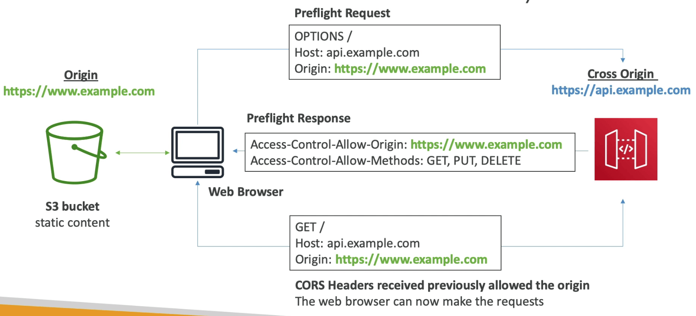

- CORS요청의 경우 프록시를 통과하면 프록시 람다에도 CORS (Access-ControlAllow-Origin) 을 입력해야 함

## API 게이트웨이 보안 (IAM 권한)

- IAM 인가 정책을 만들어 유저 혹은 권한에 붙인다
- 인증은 IAM을 통해, 인가는 IAM 정책을 통해서 한다
- AWS안에서 접근을 인가하기 위한 방법으로 사용하면 좋다 (EC2, 람다함수, IAM 유저 등)
- 헤더 안의 IAM 크레덴셜에 Sig v4를 활용한다

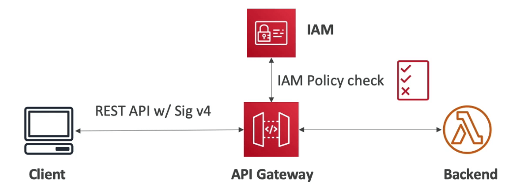

## API 게이트웨이 보안 (리소스 정책)

- 리소스 정책은 람다의 그것과 비슷하다
- 다른 계정의 접근을 허용할 수 있다 (IAM 보안과 연동하여)
- 다른 소스 아이피로부터의 접근을 허용할 수 있다
- VPC 엔드포인트에서의 접근을 허용할 수 있다

## API 게이트웨이 보안 (코그니토 유저 풀)

- 코그니토는 유저 라이프사이클을 완전 관리하고, 토큰은 자동으로 만료된다
- API 게이트웨이는 자동으로 코그니토로부터의 신원을 인증한다
- 특별한 다른 연동이 필요 없다
- 이 경우 인증은 코그니토 유저 풀이 담당, 인가는 API 게이트웨이 메서드에서 한다

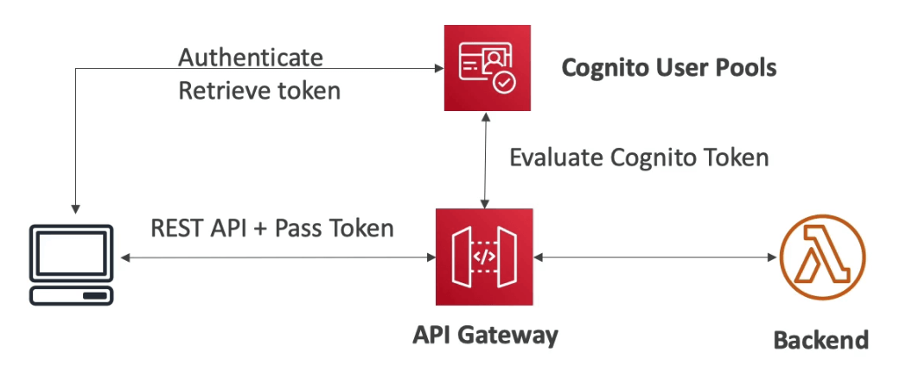

## API 게이트웨이 보안 (람다 인증 - 커스텀 3자 인증기관)

- 토큰 베이스 인증 (bearer token) - ex JWT (JSON Web Token) 또는 Oauth
- 람다 인증에 패러미터 기반의 요청을 보냄 (헤더, 쿼리 스트링, 스테이징 변수 등)
- 인증에 성공하면 람다는 유저를 위한 IAM 정책을 리턴해주며, 이는 정책 캐시에 저장됨
- 이 경우 인증은 외부 인증국, 인가는 람다 함수가 담당한다

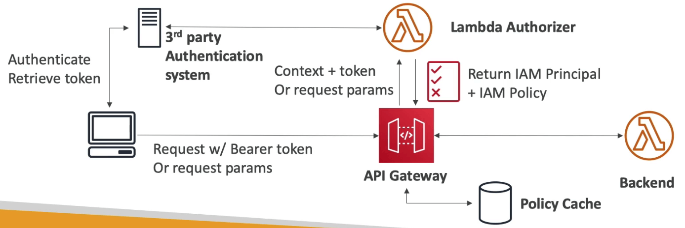

## API 게이트웨이 보안 정리

- IAM
  - 유저 / 역할 기반의 인증에 탁월하며 + 리소스 정책을 이용하면 다른 계정에도 적용 가능하다
  - 인증과 인가를 동시에 다룰 수 있다
  - Sig v4를 활용한다
- 커스텀 인증국
  - 3rd 파티 토큰을 이용
  - 직접 코딩을 해야 하지만 매우 유연하게 대처할 수 있으며, 어떤 IAM을 반환할지 선택 가능하다
  - 인증은 서드파티가 담당하고, 인가는 람다 함수가 담당한다
  - 람다 함수의 호출에 들어가는 비용을 부담해야 하고, 결과는 캐싱된다
- 코그니토 유저 풀
  - 유저 풀을 관리할 수 있다 (뒷단에는 페이스북이나 구글 로그인을 활용 가능하다)
  - 커스텀 코드를 작성할 필요가 없다
  - 백엔드에서 인증을 직접 구성해야 한다

## API 게이트웨이 - HTTP API vs REST API

- HTTP APIs
  - 낮은 지연시간, 더 높은 과금 효율성
  - 람다 프록시 HTTP 프록시 API 는 프라이빗 통합을 지원 (데이터 맵핑 없음)
  - OIDC와 OAuth 2.0 인증을 지원하고 CORS 또한 지원한다.
  - Usage plan과 API 키를 사용할 수 없음
- REST APIs
  - 모든 기능을 지원함 (Native OpenID Connect / OAuth 2.0을 제외하고)
    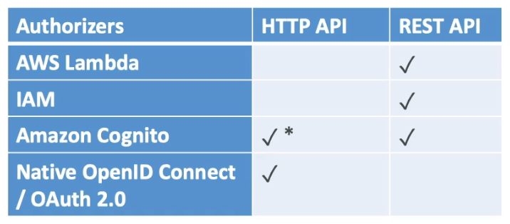

## API 게이트웨이 웹소켓API

- 웹 소켓이 무엇인가
  - 유저 브라우저와 서버간의 2방향 소통 커뮤니케이션
  - 서버는 클라이언트에게 정보를 푸시할 수 있음
  - 이 기능을 통해 상태 중심의 어플리케이션을 구현할 수 있음
- 웹 소켓 API는 채팅, 콜라보레이션 플랫폼, 멀티플레이어 게임, 금융 거래 플랫폼과 같은 리얼타임 어플리케이션에 주로 이용됨
- 다른 AWS 서비스들 (람다함수, 다이나모DB) 혹은 HTTP 엔드포인트와 동작한다

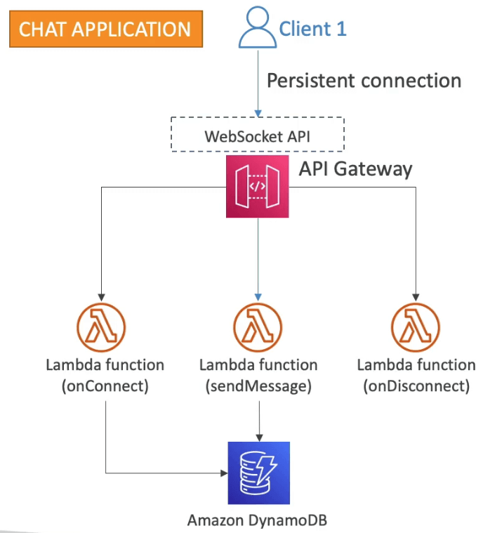

## 웹소켓 접속

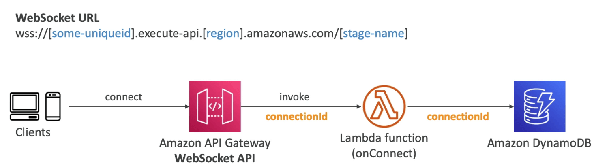

## 웹소켓 메시징

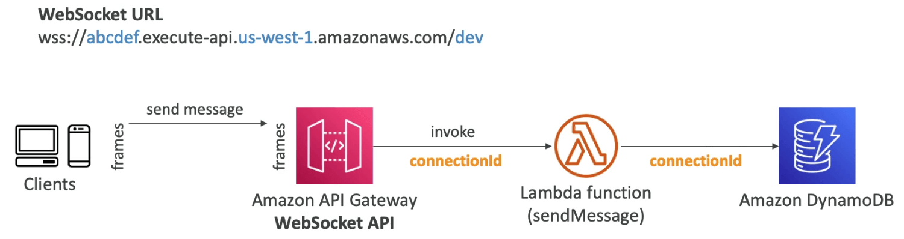

## 웹소켓 메시징 (서버측에서)

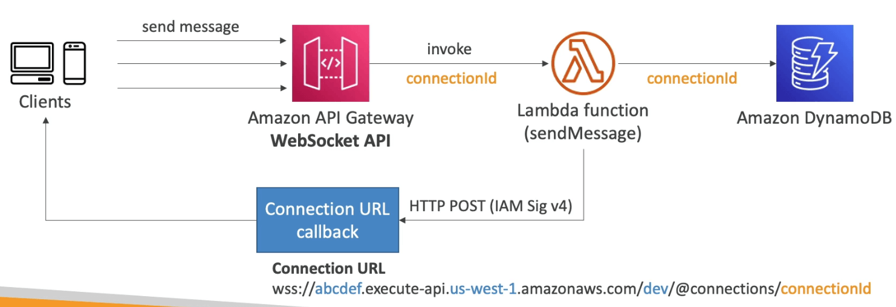

## 커넥션 URL 동작

- Connection URL
  - wss://[UniqueName].execute-api.[region].amazonaws.com/[stage]/@connections/connectionid

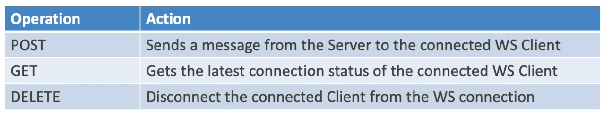

## API 게이트웨이 웹소켓 API 라우팅

- 들어오는 JSON 메시지를 통해 어떤 백엔드로 연결할지 판단할 수 있다
- 만약 라우팅이 없다면 → $default 로 라우팅을 하게 됨
- JSON에서 어떤 것을 라우팅으로 사용할지 정의함
  - 예를 들어 $request.body.action 을 라우팅으로 정의했을때 다음과 같은 JSON 요청이 들어오면
  ```json
  {
    "service": "chat",
    "action": "join",
    "data": {
      "room": "room1234"
    }
  }
  ```
  - action란에 있는 join이 라우팅이며 해당 백엔드가 정의되었다면 호출하고 없다면 $default를 호출함

## API 게이트웨이 아키텍쳐

- 회사의 전체 마이크로 서비스를 담당하는 하나의 인터페이스로서 작동할 수 있다
- API 엔드포인트를 각 리소스별로 다르게 지정할수 있으며
- 각각의 도메인을 유저에게 발행하여 다른 방식의 접근을 허용할수도 있고
- 도메인을 부여하여 SSL도 적용 가능
- API 게이트웨어 단에서 포워딩등 여러가지 작업을 할 수 있게 된다

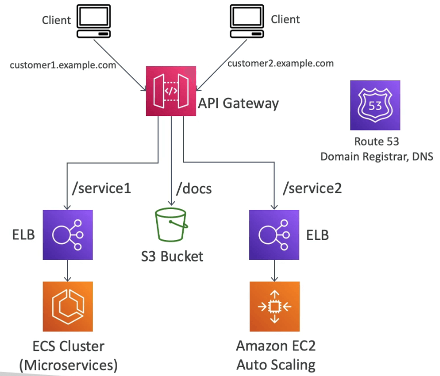
