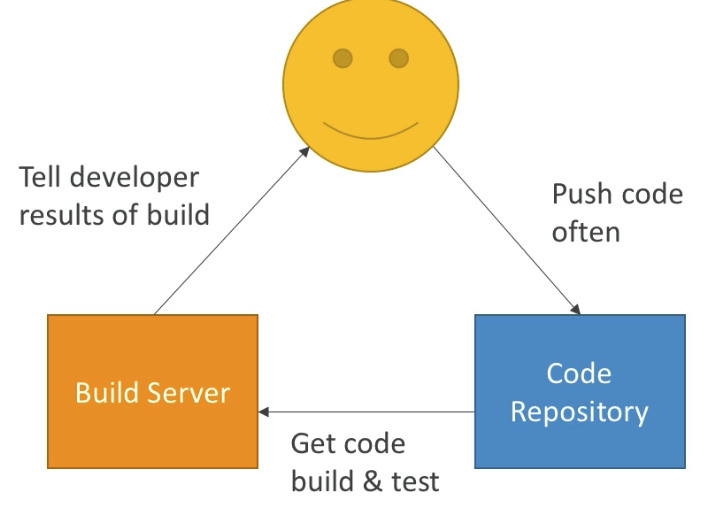
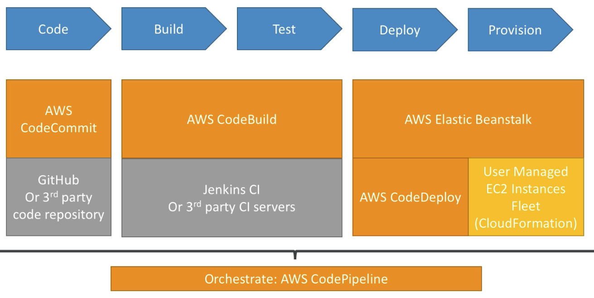
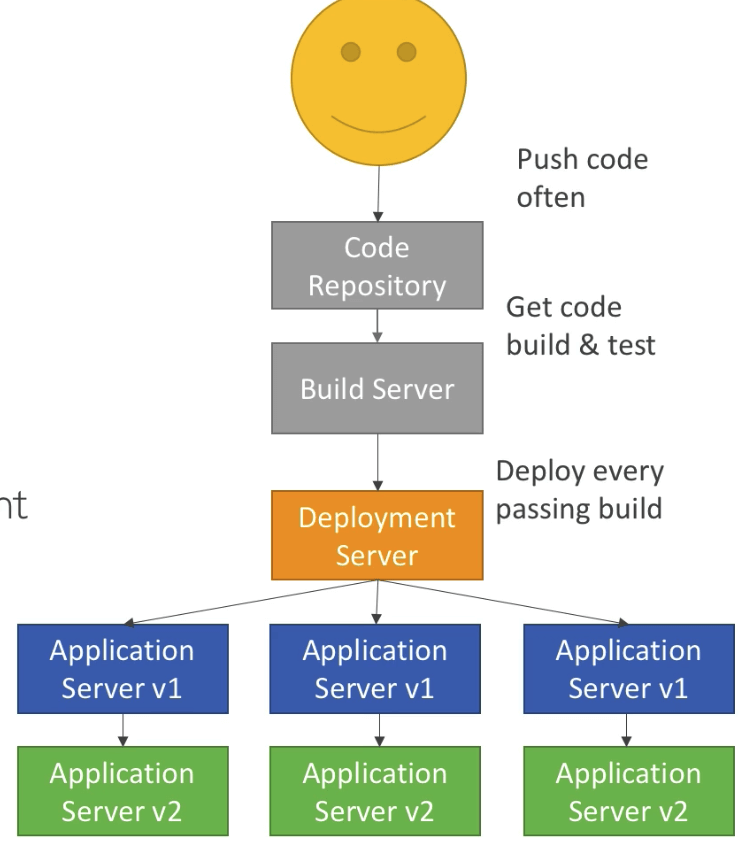
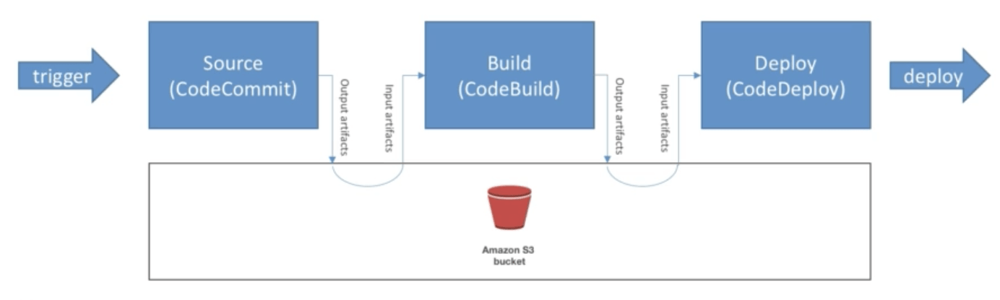
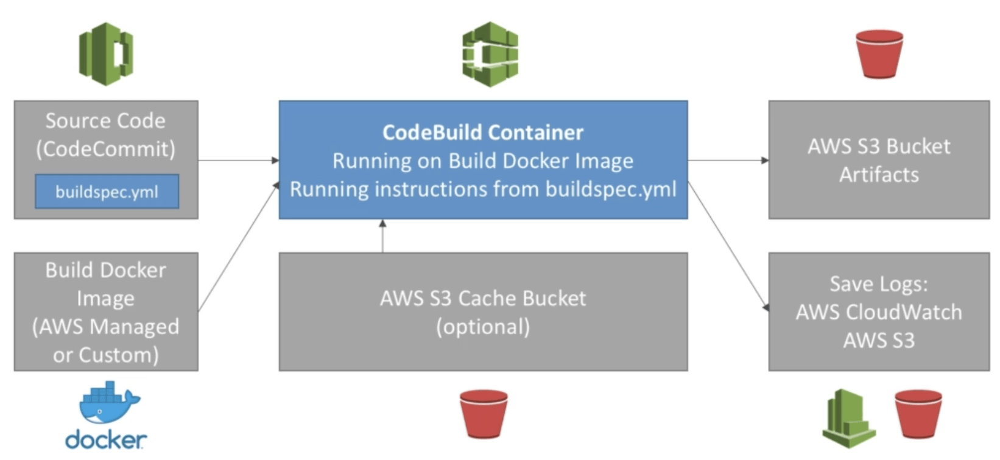
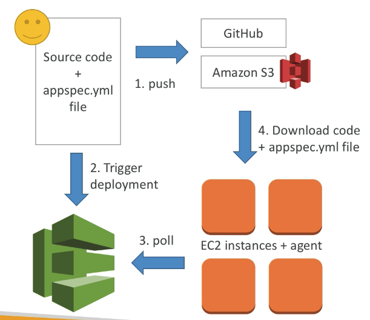

# AWS CICD

- AWS에서 수동으로 리소스를 만드는법을 알고 있는 상태 (펀더멘털)
- AWS CLI를 통한 프로그래밍적인 방법으로 조작하는 방법을 알고 있는 상태
- elastic beanstalk를 통해 어떻게 코드를 배포할수 있는지 봄
- 이러한 모든것들은 수동으로 조작할 시 오류가 빈번히 발생할 수 있음
- 이를 레포지토리에 코드 푸시를 통해 자동으로 배포되게 할 수 있음
  - 자동화
  - 정확한 방법
  - 배포 전 모든 테스트
  - 다양한 스테이지에 대응 (dev, test, pre-prod, prod)
  - 필요한 타이밍에, 수동 승인 단계를 추가
- AWS개발자가 되기 위해서는 AWS CICD를 배워야 함에는 틀림 없다

## Continuous Integration (지속적 통합)

- 개발자들은 코드를 코드 리포지토리에 자주 푸시한다 (깃헙 코드커밋 빗버킷 등등)
- 푸시된 코드는 즉시 테스트 및 빌드 후 서버 체크를 거쳐야 한다 (코드빌드 젠킨스 CI 등등)
- 개발자들은 빌드서버로부터 해당 결과를 받아봐야 한다
- 버그픽스는 조기에 빠르게 이루어질수록 좋다
- 테스트 된 코드는 빠르게 전달되고
- 자주 배포되며
- 개발자는 일련의 과정이 막힘없이 진행되니 행복하다

## CICD를 위한 기술 스택

## Contiuous Delivery (지속적 전달)

- 지속적 통합을 거치고 완성된 코드들은 원할때 언제든 안정적으로 배포가 될 수 있어야 한다
- 개발에는 이러한 일들이 자주 일어나고 빠르게 되길 원한다
- 3개월에 한번이라던가 하루에 5번만 릴리즈 가능하다거나 하는 제한을 원하지 않는다
- 이러한 목표를 달성하기 위해서
  - 코드디플로이
  - 젠킨스CD
  - 스피네이커
  - 기타 등등이 활용된다
    

## CodeCommit

- 버전 관리는 코드가 지속적으로 변화하는 와중, (롤백을 포함해서) 관리하는 방법이다
- Git과 같은 시스템을 이용하면 기본적으로 버전 관리 기능을 포함하고 있다
- 깃 저장소는 특정 머신 내에 존재할 수 있지만, 이를 온라인상으로 발전시키면 중앙집중 관리가 가능해진다
- 이를 통한 이점으로는
  - 다른 개발자와의 콜라보레이션
  - 코드를 어딘가에 백업할 수 있다는 점
  - 전체 코드를 확인하고, 감사할 수 있다는 점
- 깃 저장소는 아마도 고비용일수 있다
- 깃 산업에서는
  - GitHub: 퍼블릭 저장소는 무료, 개별 저장소는 유료로 운영
  - BitBucket
  - etc
- AWS 코드커밋은
  - 프라이빗 깃 저장소
  - 사이즈에 제한이 없음 (자동으로 스케일링)
  - 완전 관리형, 고가용성
  - 코드는 AWS 클라우드의 계정에만 존재 → 이는 보안과 컴플라이언스가 강화되는 효과
  - 시큐리티 (암호화, 접근 관리, 기타등등)
  - 다른 CI툴 (예를 들면 젠킨스CI, 코드빌드 등등)과 연계 가능하다

## CodeCommit 보안

- 언더라잉 인프라는 깃에 의해 동작
- 깃을 위한 인증 체계
  - SSH Key : AWS유저는 본인 스스로 SSH Key를 콘솔상에서 만들 수 있음
  - HTTPS : AWS CLI 인증 헬퍼 혹은 HTTPS 크레덴셜을 만들 수 있음
  - MFA : 1회용 인증 코드를 이용해서 작업을 진행
- 깃을 위한 인가 방식
  - IAM 정책을 통해 유저나 역할에 접근권한을 인가할 수 있음
- 암호화
  - 저장소는 자동으로 암호화 되며 이는 KMS 키를 통해 이루어짐
  - 전송중 암호화는 SSH 혹은 HTTPS를 통해 이루어짐
- 다른 계정 접근
  - SSH키를 공유하거나
  - AWS 크레덴셜 자체를 공유하는게 아니라
  - IAM 역할을 만들고 해당 역할에 권한을 부여한 뒤, STS나 다른 방식을 통해 역할을 얻어서 접근할수 있도록 허가한다

## CodeCommit vs GitHub

- 비슷한 점
  - 둘 다 깃 저장소를 제공
  - 코드 리뷰 (풀 리퀘스트) 제공
  - 깃허브와 코드커밋 둘다 AWS 코드빌드와 연계됨
  - HTTPS SSH 둘 다 제공
- 다른점
  - 보안성면에서 깃허브는 깃허브 유저
  - 코드커밋은 AWS IAM 유저나 역할
- 호스팅
  - 깃허브에 의해 호스팅됨
  - 깃허브 엔터프라이즈는 사내 서버내에 저장 가능
  - 코드커밋은 AWS에 의해 관리되고 호스팅됨
  - 깃허브는 UI가 충실하지만
  - 코드커밋은 최소한의 UI만 제공됨

## CodeCommit Notifications

- 코드커밋을 이용하면 AWS SNS, 람다함수, 클라우드워치 이벤트 룰에 알림을 줄 수 있다
- SNS와 AWS 람다를 사용하는 유스케이스
  - 브랜치의 삭제
  - 마스터 브랜치에 어떤것을 푸시
  - 외부 빌드 시스템으로부터의 알림
  - 코드 상에 어떤 특정한 것이 있는지를 확인하고 트리거링 (혹시 AWS 크레덴셜이 코드상에 포함되어 있는가 등등)
- 클라우드워치 이벤트 룰을 통한 유스케이스
  - 풀 리퀘스트 (코드 리뷰)에 대한 업데이트 (작성, 수정, 삭제, 코멘트가 남겨졌을때 등)
  - 커밋을 하면서 코멘트를 남겼을때
  - 클라우드워치 이벤트 룰은 SNS를 통한 알림이 된다

## CodePipeline

- CD툴
- 비주얼 워크플로
- 소스: 깃허브, 코드커밋, 아마존S3
- 로드 테스팅: 서드파티 툴
- 배포: AWS 코드디플로이 / 빈스토크 / 클라우드포메이션 / ECS 기타 등등
- 스테이지 만들기
  - 스테이지란 각각의 액션이 이루어지는 하나의 행을 말함
    - 스테이지는 액션그룹으로 이루어지며, 액션그룹 은 열 형태로 스테이지 안에서 병렬처리 가능한 처리 작업의 최소 단위임
  - 각각의 스테이지에서 순차적인 작업을 진행할 수 있으며, 병렬 처리 또한 지원한다
  - 스테이지의 예: 빌드 / 테스트 / 배포 / 로드테스트 / 기타 등등
  - 해당 과정 중에 수동 승인 프로세스를 만드는 것 또한 가능하다

## CodePipeline 아티펙트

- 각각의 파이프라인은 아티펙트를 만들어낸다
- 아티펙트는 Amazon S3를 거치면서 다음 스테이지로 정보를 전달한다

-

## CodePipeline 트러블슈팅

- 코드파이프라인은 AWS 클라우드워치 이벤트를 통해 상태변화를 감지하므로, SNS 알림을 보낼 수 있다
  - 파이프라인 실패시 알림
  - 스테이징이 취소되었을때 알림
- 파이프라인의 스테이징이 실패했을때, 해당 전체 과정은 중단되며, 콘솔을 통해 정보를 확인할 수 있다
- 클라우드트레일을 이용해서 API 요청을 감사할 수 있다
- 파이프라인이 제대로 작동하지 않는다면, 먼저 IAM 서비스 역할이 제대로 설정되어 있는지 확인해야 한다 (대부분 권한부족으로 인한 문제일 가능성이 높음)

## CodeBuild

- 완전 관리형 서비스로 제공됨
- 젠킨스와 같은 다른 빌드 툴의 대안으로 활용 가능
- 계속적 스케일링을 대응 (관리해야 할 서버가 필요 없으며 빌드하기 위해 기다릴 필요도 없음)
- 사용한 만큼만 과금: 빌드하지 않는 유휴시간에 비용이 들지 않음
- 빌드과정에 언더라잉은 도커를 기반으로 하고 있음
- 기본 도커 이미지를 확장해서 사용 가능
- 보안: KMS와 연계하여 빌드 아티펙트를 암호화 할 수 있으며, IAM을 통한 빌드 권한 부여, VPC를 이용한 네트워크 보안 (프라이빗 네트워크 이용 가능), 클라우드 트레일을 통한 API요청 감사 등을 지원함
- 깃허브, 코드커밋, 코드파이프라인, S3... 많은 리소스로부터 소스코드를 가져올 수 있다
- 빌드 구조는 코드로 정의할 수 있다 (buildspec.yml 파일을 이용)
- 코드빌드 통계를 이용, 지표를 모니터링 할 수 있다
- 클라우드워치 이벤트를 이용하면 실패한 빌드를 감지하고 알림을 전송할 수 있다
- 클라우드워치 알람을 이용해서 임계값을 설정하고, 해당 임계값이 넘어가는 시점에 알림을 전송할 수 있다
- 클라우드워치 이벤트, 글루를 이용한 AWS 람다를 이용 가능하다
- SNS 알림기능을 지원한다
- **빌드 과정은 코드로 정의될 수 있음 (buildspec.yml)**
  - 자바
  - 루비
  - 파이썬
  - 고
  - NodeJS
  - 안드로이드
  - 닷넷 코어
  - PHP
  - 도커로 어떤 환경이든 가능
- 코드빌드 작동방식
  - 소스코드를 코드커밋에 업로드
  - 루트에 buildspec.yml을 정의
  - 도커 이미지를 작성함
  - 코드빌드 컨테이너가 만들어짐 buildspec.yml이 시동됨
  - 빌드과정이 완료되면 S3버킷이 아티펙트를 작성함
  - 로그는 전부 CloudWatch에서 관리됨
  - 이벤트 등 활용 가능
    
- 빌드스펙
  - 코드의 **root 디렉토리**에 존재해야 함
  - 환경을 정의
    - 평문
    - 혹은 암호화 SSM Parameter Store 이용
  - 순서 페이즈 (phases)
    - install: 먼저 인스톨할 종속성
    - prebuild: 빌드 직전에 사용될 커맨드
    - **build: 실제 빌드 커맨드**
    - postbuild: 마지막 zip output 예를들어
  - 아티펙트: S3에 업로드되며 KMS로 암호화됨
  - 캐시: 종속성파일등은 s3에 캐시되어 재사용 가능 (퍼포먼스)
- 로컬 빌드
  - 데스크탑에서 코드빌드를 사용할 수 있음
  - CodeBuild 에이전트가 필요함

## CodeBuild in VPC

- 기본적으로 코드빌드는 VPC밖에서 실행됨
- 그래서 기본적으로는 VPC에서 접근 불가하다
- VPC를 정할 수 있다
  - VPC ID
  - 서브넷 ID
  - SG ID
- 그 후에 코드빌드가 EC2나 RDS나 ElastiCache등에 접근이 가능하다
- 유스케이스: 데이터쿼리나 인터널 로드 밸런서를 이용한 통합 테스트중 데이터가 필요할때

## CodeBuild 핸즈온

- buildspec.yml 파일을 이용하면 코드빌드에서 어떤 순서로 어떤 작업을 해야하는지 명시해줄수 있다.
- 코드커밋 → 코드빌드 → ECR에 도커로 빌드된 파일을 업로드
- 자동화는 아니지만 buildspec.yml 파일을 이용해서 어떤 파일을 빌드할지 정의하고 실행하여 ECR에 결과물을 도출할 수 있었음
- 코드빌드 환경변수편
  - 코드빌드의 환경변수는 기본적으로 AWS에서 제공해주는 것들이 있다.
    [Environment variables in build environments](https://docs.aws.amazon.com/codebuild/latest/userguide/build-env-ref-env-vars.html)
  - 하지만 추가적으로 빌드에 필요한 환경변수를 설정할수 있으며, DB비밀번호와 같이 민감한 정보의 경우에는 parameter store를 이용해서 kms로 암호화된 secure-string을 이용할수도 있다.
  - 다만, parameter store에 접근권한이 IAM으로 설정가능하며, SSMReadOnlyPolicy를 허용해주면 된다.
- 아티팩트
  - 아티팩트란 CodeBuild로 수행한 빌드의 산물을 의미한다.
  - 코드빌드를 수행한 뒤 아티팩트를 S3으로 업로드 할 수있다.
  - 기본적으로 아티팩트에 대한 암호화를 수행하며, 비활성화 할 수 있다.
- 클라우드워치와 연동
  - 클라우드워치 이벤트와 연동해서 자동화를 구현할 수 있다.
  - 코드빌드의 상태변화에 따라서 다양한 타겟 (람다, SNS, SQS..) 호출 가능
  - 코드커밋의 상태변화에 따라서 타겟 호출 가능
- 코드커밋 풀 리퀘스트의 검증

## AWS CodeDeploy

- 만들어진 어플리케이션은 많은 EC2에 배포해야 할 경우가 있다
- 이 인스턴스들은 엘라스틱 빈스토크에서 관리되지 않는다고 가정
- 코드를 배포하기 위한 다른 여러 다양한 방법과 툴이 존재한다 (앤서블, 테라폼, 쉐프, 퍼펫 등등)
- 관리형 서비스로 CodeDeploy를 활용할 수 있다
- 각각의 EC2 인스턴스 (또는 온프레미스)는 CodeDeploy 에이전트를 실행하고 있어야 한다
- 이 에이전트는 지속적으로 CodeDeploy에서 폴링을 하고 있다
- CodeDeploy는 appspec.yml파일을 전송한다
- 어플리케이션은 깃허브나 S3로부터 파일을 다운받는다
- EC2는 배포작업을 진행한다
- CodeDeploy 에이전트는 해당 작업의 성공 및 실패 여부를 보고한다

## CodeDeploy 다른 내용들

- EC2 인스턴스들은 각각 개발그룹에 따라 분류할 수 있다 (dev, test, prod 등)
- 배포에 대해 다양한 옵션을 설정할 수 있으며 유연하다
- CodeDeploy는 CodePipeline에 연계될 수 있으며 이때 Artifact를 이용하게 된다
- CodeDeploy는 셋업 도구들을 재사용할수 있고, 어떤 어플리케이션에서도 동작가능하며 규모를 자동으로 늘릴 수 있다
- Blue Green 전략은 EC2 인스턴스에서만 가능하다 (온프레미스에서는 불가능)
- AWS 람다 배포를 지원한다
- CodeDeploy는 존재하는 EC2 등에 대해서만 작동하며 새로운 리소스를 할당하지 않는다

## CodeDeploy에서의 메인 컴포넌트들

- 어플리케이션: 유니크한 이름
- 컴퓨터 엔진: EC2 혹은 온프레미스 혹은 Lambda
- 배포 설정: 성공 혹은 실패를 나누는 배포 기준
  - EC2, 온프레미스: Health 인스턴스의 최소 숫자 등을 정하고 판단
  - Lambda: 람다 함수의 트래픽 경로가 어떻게 되어 있는지 등
- 배포 그룹: 태깅된 인스턴스들의 그룹 (점진적인 배포 또한 가능)
- 배포 타입: 가동중 환경(in-place: 다운타임이 발생)에서 배포 혹은 Blue Green 배포
- IAM 인스턴스 프로필: 인스턴스에 S3 혹은 GitHub에서 코드를 가져올 수 있는 권한을 부여하기 위해 필요
- 앱 리비전: 어플리케이션의 자체 코드와 appspec.yml 파일
- 서비스 역할: CodeDeploy에 필요한 권한들
- 타겟 리비전: 배포할 어플리케이션의 버전

## CodeDeploy의 AppSpec

- 파일 섹션: S3이나 깃허브에서 파일시스템으로 어떻게 파일을 복사할지
- 훅: 새로 배포되는 어플리케이션의 설치 구조 (타임아웃 설정 가능)
  - ApplicationStop
  - DownloadBundle
  - BeforeInstall
  - AfterInstall
  - ApplicationStart
  - **ValidateService: 중요!**

## CodeDeploy 배포 설정

- Configs:
  - One a time: 한번에 하나의 인스턴스씩, 인스턴스가 하나라도 실패하면 배포가 중지
  - Half at a time: 한번에 50%
  - All at once: 빠르지만 다운타임이 발생. 개발환경에 적합
  - Custom: 최소 health 호스트 수는 75% 설정 등등
- Failure:
  - 인스턴스는 실패상태에 남게됨
  - 해당 상태에서 새로운 배포는 실패한 인스턴스부터 시작됨
  - 롤백하기 위해서는 다시 구버전을 배포하거나 실패시 자동 롤백을 설정하면 됨
- 배포 대상
  - EC2 인스턴스의 태그
  - ASG를 대상으로
  - ASG와 배포 대상 태그를 섞어쓸수도 있음
  - 혹은 커스텀 스크립트를 통해 그룹별로 다른 배포또한 가능

## CodeDeploy to EC2

- 배포 설정은 배포 전략 설정과 appspec.yml에 의해 정해진다.
- in-place방식으로 현재 가동중인 환경에서 배포 및 업데이트가 이루어진다.
- 각 배포의 단계마다 hook을 이용하여 작업을 명세할 수 있다.

## CodeDeploy to ASG

- In-Place 업데이트
  - 현재 인스턴스들을 업데이트 한다.
  - ASG안의 인스턴스들은 새로 만들어지며 배포된다.
- 블루 그린 업데이트
  - 새로운 ASG를 작성하고 해당 그룹에 새로운 인스턴스들에 새로운 어플리케이션을 배포한다.
  - 기존 버전의 인스턴스들은 그대로 존재한다
  - ELB의 사용이 필수가 된다

## CodeDeploy 롤백 (\*중요)

- 자동 롤백 옵션을 적용할 수 있다.
- 배포에 실패했을 경우 롤백할 수 있다.
- CloudWatch 알람 상태를 보고 롤백할 수 있다.
- 롤백 자체를 비활성화 할 수 있다.
- 롤백을 수행하게 되면, 실질적으로는 과거에 성공했던 버전을 새롭게 배포하는것과 동일하다.

## CodeStar

- 코드스타는 현재까지 사용했던 모든 CICD 툴을 한번에 묶어놓은 통합 툴이다.
- CICD가 이미 준비된 상태로 EC2, 람다, 빈스토크를 작성할 수 있다.
- C#, Go, HTML5, Java, Node.js PHP Python Ruby
- 이슈 트래킹은 지라 혹은 깃허브 이슈에서 가능
- Cloud9과의 통합도 가능함 (모든 리전은 아님)
- 대시보드를 제공하므로 한번에 다양한 컴포넌트들의 상태를 볼 수 있다.
- 커스터마이징을 다양하게 제공해주는 편은 아님 (제한적임)
