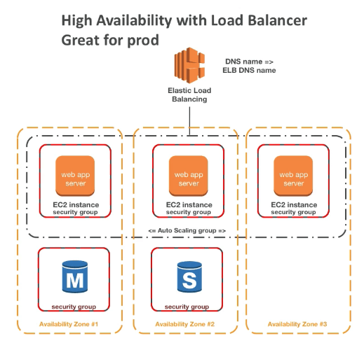

# 엘라스틱 빈스토크

- 엘라스틱 빈스토크는 AWS에서 어플리케이션을 배포함에 있어서 개발자 중심의 뷰를 제공한다.
- 엘라스틱 빈스토크에서는 지금껏 보아왔던 모든 도구들을 이용한다.
  - EC2
  - ASG (Auto Scaling Group)
  - ELB (Elastic Load Balancer)
  - RDS (Relational Database Service)
  - etc
- 그러나 이 모든것들은 하나의 뷰로 통합된다.
- 그럼에도 불구하고 모든 설정들은 전부 활용 가능하다.
- 빈스토크 자체는 무료이고, 사용된 리소스에 대해서만 비용을 지불하면 된다.

## Beanstalk

- 관리형 서비스
  - 인스턴스 설정 / OS는 빈스토크에 의해 관리된다.
  - 배포 전략은 설정할수 있지만, 엘라스틱 빈스토크에 의해 수행된다.
- 단지 코드를 업로드 하는것만이 개발자의 책임이다.
- 세가지 아키텍쳐 모델이 존재한다.
  - 하나의 인스턴스 배포 전략: 개발환경에 적합
  - LB + ASG: 프로덕션 환경 또는 pre-production 웹 어플리케이션 환경
  - ASG only: 웹이 아닌 어플리케이션 프로덕션 환경 (worker, message apps, etc..)
- 세가지 컴포넌트로 구성된다.
  - 어플리케이션
  - 어플리케이션 버전: 각각의 배포는 버전을 부여받는다.
  - 환경 이름 (dev, test, prod..): 자유로운 명명
- 어플리케이션 버전을 환경으로 배포하고, 해당 버전을 다음 어플리케이션 환경으로 진행시킨다. (패치)
- 전 버전으로의 롤백 기능을 지원한다.
- 환경의 모든 라이프사이클 관리 기능을 지원한다.

- 어떤 언어를 지원하는가?
  - Go
  - Java SE
  - Java with Tomcat
  - .NET on Windows Server with IIS
  - Node.js
  - PHP
  - Python
  - Ruby
  - Packer Builder
  - Single Container Docker
  - Multicontainer Docker
  - Preconfigured Docker
- 만약 지원하지 않더라도 커스터마이징 가능하다.

## 엘라스틱 빈스토크 배포 모드

- 싱글 인스턴스

- 로드밸런서가 포함된 고가용성

## 업데이트 시의 빈스토크 배포방식

- 한번에 모두(all at once): 새 버전을 모든 인스턴스에 동시에 배포합니다. 배포가 수행되는 동안 환경에 있는 모든 인스턴스가 잠시 서비스 중지됩니다.
- 롤링(Rolling): 새 버전을 배치로 배포합니다. 각 배치는 배포 단계 동안 서비스에서 제외되므로 배치에 있는 인스턴스의 수만큼 환경의 용량이 감소합니다.
- 추가 배치를 사용한 롤링(Rolling with additional batch): 새 버전을 배치로 배포하지만, 먼저 새로운 배치의 인스턴스를 시작하여 배포 프로세스 중에 모든 용량이 유지되도록 합니다.
- 변경 불가능(Immutable) - 변경 불가능 업데이트를 수행하여 새 버전을 새로운 인스턴스 그룹에 배포합니다.
- 트래픽 분할(Traffic splitting) - 새 버전을 새 인스턴스 그룹에 배포하고 수신되는 클라이언트 트래픽을 일시적으로 기존 애플리케이션 버전과 새 애플리케이션 버전 간에 분할합니다.

## 엘라스틱 빈스토크의 CLI

- 기본 CLI외에 EB cli를 설치하면 추가적인 명령어를 얻게 됨
  - eb create
  - eb status
  - eb health
  - eb events
  - eb logs
  - eb open
  - eb deploy
  - eb config
  - eb terminate

### 엘라스틱 빈스토크 배포 진행

- 종속성 정의
  - package.json 이나 requirements.txt
- 패키지 코드를 집파일로 묶어서 종속성 정의해줌
- 콘솔상에서 zip파일을 s3에 업로드 후 배포
- CLI에서는 s3에 명령어로 업로드 이후에 배포
- 엘라스틱 빈스토크는 업로드된 zip파일을 각각의 인스턴스에 배포함

## 엘라스틱 빈스토크 라이프사이클 정책

- 빈스토크는 1000개의 어플리케이션 버전을 저장 가능
- 오래된 버전을 삭제하고 싶을때 혹은 더이상 배포하지 않을 경우
- 오래된 버전을 라이프사이클 정책에 따라서 처리 가능
  - 시간기준 정책 (오래된 버전이 점점 삭제됨)
  - 용량기준 정책 (몇개의 버전 이상을 가지게 되면 오래된것부터 삭제되기 시작됨)
- 현재 사용중인 버전은 삭제되지 않음
- 빈스토크 관리메뉴상에서는 사라지더라도, S3에서는 남기는 옵션을 선택 가능

## EB Extensions

- 엘라스틱 빈스토크에 배포하기 위해서는 ZIP파일 형태로 파일을 업로드 해야 한다
- 파일을 이용하면 모든 패러미터들을 컨트롤 할 수 있다
- 요구사항
  - .ebextensions/ 디렉토리는 루트 소스 코드에 들어있어야 한다
  - YAML 혹은 JSON 포맷으로 작성해야 한다
  - .config 확장자를 사용해야 한다 (예를 들면 logging.config)
  - 기본 설정을 변경할 수 있다 (덮어쓰기 형식) option_settings:
    
  - 다른 AWS 리소스를 기재할 수 있다 RDS, ElastiCache DynamoDB 기타 등등
- 단 ebextensions에 적힌 리소스들은 엘라스틱 빈스토크를 삭제하면 같이 삭제된다

## 빈스토크와 클라우드포메이션

- 빈스토크는 클라우드포메이션에 기반한다
- 클라우드포메이션은 다른 AWS 서비스들을 프로비전하게 됨
- 사용예: 클라우드포메이션 리소스를 이용해서 다른 엘라스티캐시나 S3버킷, 원하는 어떤것이든 만들 수 있다.
  - ebextensions에 AWS리소스를 정의

## 빈스토크 클로닝

- 동일한 환경을 복제할 수 있다
- 프로덕션을 테스트 환경으로 복제할때 유용하게 활용 가능
- 모든 리소스와 설정은 복제된다
  - 로드밸런서 타입과 설정
  - RDS데이터베이스 타입 (데이터는 복제되지 않음)
  - 환경변수들
- 클론 후에는 설정을 변경할 수 있다.

## 빈스토크 마이그레이션

- 빈스토크 환경을 만들고 난 후에는 ELB의 타입을 변경할 수 없다 (설정만 변경 가능)
- 하지만 이걸 하고 싶다면?
  1. 새로운 환경을 만들되, LB외에는 동일한 설정을 한다.
  2. 새로운 환경으로 어플리케이션을 배포한다.
  3. CNAME스왑또는 ROUTE53의 기능을 이용해서 입구를 변경한다.

## RDS와 함께 빈스토크를 사용

- RDS는 빈스토크를 이용해서 예약이 가능하며 dev, test환경에서는 유용하다.
- 하지만 프로덕션에서는 적합하지 않을수 있는데, 데이터베이스의 수명주기가 빈스토크의 환경의 수명주기와 동일해지기 때문이다.
- 따라서 프로덕션 환경에서는 별도의 RDS를 생성한 뒤에 EB 어플리케이션에 접속주소만 넘겨주는것이 바람직하다.
- 그렇다면 이미 만들어져 있을땐 어떻게 대처할까?
  - 먼저 빈스토크 안에 있는 RDS를 스냅샷으로 백업한다. (만약을 위해)
  - 그리고 나서 RDS 콘솔로 이동해서 RDS데이터베이스 삭제 방지 정책을 체크한다.
  - 새로운 환경을 만들때 RDS를 만들지 말고, 그곳에 웹환경을 구축한다.
  - 새로운 환경이 기존 빈스토크의 RDS를 바라보게 한 뒤, CNAME스왑을 통해 입구를 변경한다.
  - 그리고 구버전의 EB를 삭제하면 DB가 남고, 클라우드포메이션에서는 삭제 에러가 발생하며 RDS만 남게 된다.
  - 그러면 수동으로 스택을 삭제해주자.

## 빈스토크와 싱글 도커

- 어플리케이션을 싱글도커 컨테이너에서 돌리기
- 아래를 제공
  - Dockerfile: 엘라스틱 빈스토크는 도커 컨테이너로 작동하게 빌드해줄것임
  - Dockerrun.aws.json (v1): 도커 이미지가 만들어진 곳을 지정해줌
    - Image
    - Ports
    - Volumes
    - Logging
    - Etc
  - 싱글도커 빈스토크는 ECS를 사용하지 않는다. 단지 EC2에서 도커를 돌릴 뿐

## 멀티도커 빈스토크

- 하나의 EC2인스턴스에서 복수의 컨테이너를 구동할때
- 다음을 만들어줌
  - EC2 클러스터
  - EC2 인스턴트들, 그리고 ECS 클러스터 입력이 되어 있음
  - 로드 밸런서 (고가용성 모드에서)
  - 작업 정의와 실행
- Dockerrun.aws.json (v2)가 루트 소스코드에 필요
- Dockerrun.aws.json은 ECS 작업 정의를 생성하는데 활용된다.
- 도커 이미지는 ECR에 미리 빌드되어 업로드 되어 있어야 함
  
