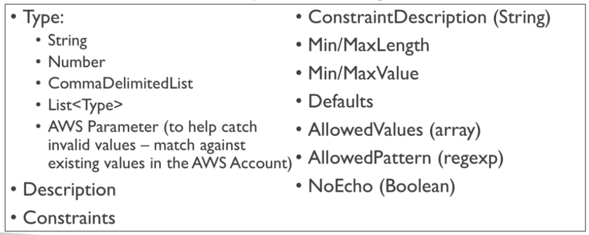
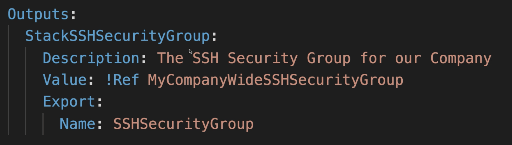

### 클라우드포메이션을 사용하는것으로 인한 메리트

- 인프라를 코드화
  - 수동으로 작성되는 리소스는 없으며, 이는 곧 모든 리소스를 컨트롤할수 있다는것을 의미함
  - 깃을 이용한 인프라의 버전 컨트롤이 가능해짐
  - 코드를 통해 인프라의 변경점을 리뷰할 수 있게 됨
- 비용면
  - 각각의 리소스들은 식별자를 이용하여 태깅되고 이는 비용을 산출하는것이 명확하게 된다
  - 클라우드포메이션 템플릿을 이용해 그 자체의 비용을 산출해낼수 있다
  - 절약플랜 : 개발환경에서 자동화를 통해 5pm에 리소스를 삭제하고, 동일한 환경을 8시에 만드는 등 비용절감이 가능하다
- 생산성
  - 인프라를 삭제하거나 다시 만드는것이 클라우드상에서 바로 진행된다.
  - 템플릿을 제출하면 자동으로 다이어그램을 만들어준다
  - 선언적인 프로그래밍으로 구현된다. (순서나 오케스트레이팅에 대한 부분이 필요없음) AWS에서 자동으로 순서를 지정해서 만든다.
- 다양한 리소스를 하나의 묶음으로 만들기
  - VPC 묶음
  - 네트워크 스택
  - 앱 스택
- 모든것을 새로 만들 필요는 없다
  - 웹상에 존재하는 템플릿이 있고 그걸 가져다 사용하면 됨
  - 도큐멘트를 참조할 수 있다

### 클라우드포메이션 작동 방식

- S3에 템플릿을 업로드하면 클라우드포메이션이 참조하게 된다
- 템플릿을 업데이트 하면 더이상 전 버전을 수정할 수 없다. 재 업로드를 통해 새로운 버전을 정의할 수 있을 뿐
- 스택들은 이름으로 구별한다
- 스택을 삭제하면 그 안에 있는 모든 아티펙트(리소스)들은 같이 삭제된다

### 클라우드포메이션 템플릿 배포

- 수동
  - 클라우드포메이션 디자이너를 이용
  - 콘솔에서 패러미터나 기타 입력을 수행
- 자동
  - YAML파일로 템플릿 정의
  - AWS CLI를 이용해서 배포
  - 모든 흐름을 자동화 하고 싶을때 권장되는 방법

### 클라우드포메이션 빌딩 블록

- 템플릿 컴포넌트
  1. **리소스 : 어떤 리소스를 만들것인가? (필수)**
  2. 패러미터 : 템플릿 인풋 다이나믹
  3. 맵핑 : 템플릿의 고정 값
  4. 아웃풋 : 만든것을 참조하기 위한 것
  5. 컨디셔널 : 리소스가 만들어질때 실행하는 조건들의 리스트
  6. 메타데이터
- 템플릿 헬퍼
  - 레퍼런스
  - 펑션

### 클라우드 포메이션 리소스

- 리소스는 클라우드 포메이션 템플릿의 핵심이다.
- 리소스는 서로 다른 AWS 컴포넌트 들로 표현된다.
- 리소스들 사이에는 서로 참조가 가능하다.
- AWS는 작성, 업데이트, 삭제를 자동으로 할줄 안다.
- 리소스 타입은 다음과 같이 정의한다.
  - AWS::aws-product-name::data-type-name
- 리소스들의 리스트는 다음을 참조할것
  [AWS resource and property types reference](https://docs.aws.amazon.com/AWSCloudFormation/latest/UserGuide/aws-template-resource-type-ref.html)
  [AWS::EC2::Instance](https://docs.aws.amazon.com/AWSCloudFormation/latest/UserGuide/aws-properties-ec2-instance.html)

### 클라우드 포메이션 패러미터

- 언제 패러미터를 사용하는가?
  - 스스로에게 질문해보라
  - 이 템플릿이 추후에 변경될 것인가?
  - 만약 그렇다면 이것은 패러미터화 시켜야 할것이다.
  - 패러미터를 사용하면 템플릿을 다시 업로드 해야 할 필요가 없어진다
    
  - **어떻게 패러미터를 참조하는가?**
    - Fn::Ref 함수가 패러미터 참조를 가능하게 한다
    - 템플릿의 어떤 곳에서도 사용할 수 있다
    - YAML에서 !Ref로 축약 사용 가능하다
  - **pseudo 패러미터**
    - AWS측에서 미리 지정해놓은 패러미터로 참조하면 바로 사용 가능
      

### 클라우드포메이션 맵핑

- 맵핑은 정적인 값을 미리 지정해두는것
- 그럼 언제 맵핑을 사용하고 언제 패러미터를 사용하는가?
  - 리전
  - AZ명
  - AWS Account
  - Environment (dev, prod)
  - 그 외 필요한 정적인 값들 (변하지 않는 경우)
    

### 클라우드포메이션 아웃풋

- 아웃풋 섹션은 필수는 아니지만, 다른 스택에 임포트할수 있는 값들이다. (먼저 엑스포트 한 이후에)
  - 엑스포트 예제
    
  - 임포트 예제
    
- 콘솔상에서도 아웃풋을 확인할 수 있다. (AWS CLI를 통해서도 가능)
- 네트워킹에 관련된 클라우드포메이션 템플릿을 작성하고 VPC ID나 SUBNET ID를 아웃풋으로 활용하는 경우에 매우 유용하다
- 스택 간의 콜라보레이션 등에 활용 할 수 있고 코드를 나누어 개발가능하다는 점에서 좋은 활용이 될 수 있다.
- 다른 스택에서 아웃풋을 참조하고 있을 경우 참조당한 스택을 삭제할 수 없다. (이때 에러 메시지가 아무것도 안나옴)
- 크로스 스택 참조
  - 다른 클라우드포메이션 템플릿의 아웃풋을 참조할 수 있다
  - 이때 Fn::ImportValue 함수를 이용
  - 참조한 스택을 지우기 전에는 오리지널 스택을 삭제할 수 없다

### 클라우드포메이션 컨디션

- 컨디션은 언제 사용할까?
  - 컨디션은 리소스를 작성할때 혹은 컨디션에 따라 아웃풋을 만들어낼 때 사용한다
  - 컨디션은 무엇이든 작성할수 있지만 일반적으로는 다음과 같은 경우에 활용이 많이 된다.
    - 환경에 대한 정의 (dev test prod)
    - AWS Region
    - Any parameter value
  - 각각의 컨디션들은 다른 컨디션, 패러미터, 맵핑 등을 참조할수 있다
- 어떻게 정의하나?

  ```yaml
  Conditions:
  	CreateProdResources: !Equals [ !Ref EnvType, prod ]

  Resources:
  	MountPoint:
  		Type: "AWS::EC2::VolumeAttachment"
  		Condition: CreateProdResources
  ```

- 반드시 알아두어야 할 펑션들
  ```
  Fn::Ref
  Fn::GetAtt
  Fn::FindInMap
  Fn::ImportValue
  Fn::Join
  Fn::Sub
  Condition Functions (Fn::If, Fn::Not, Fn::Equals, etc..)
  ```
- **Fn::Ref**
  - 레퍼런스 펑션은 다른 리소스를 참조한다.
    - 패러미터를 참조할 경우 : 패러미터의 값을 리턴한다.
    - 리소스를 참조할 경우 : 리소스의 물리적인 ID를 반환한다. ex EC2 ID
- **Fn::GetAtt**
  - 해당 리소스가 가진 고유값을 리턴한다.
  - 예를 들면 EC2 리소스는 AvailabilityZone, PrivateDnsName, PublicDnsName, PrivateIp, PublicIP 등을 속성으로 가진다.
    
- **Fn::FindInMap**
  - 맵을 참조할 경우 사용
- **Fn::ImportValue**
  - 다른 템플릿에서 엑스포트 된 값을 참조할 경우
- **Fn::Join**
  - !Join [ delimiter, [ comma-delimited list of values ] ]
  - !Join [ ":", [ a, b, c] ]
- **Fn::Sub**
  - Fn::Sub 또는 !Sub로 작성 가능한데, 어떠한 텍스트로부터 특정한 값을 제거할 때 사용한다
  - 예를들면 Fn::Sub 함수를 AWS 수도코드 혹은 참조값과 같이 사용할 수 있다
  - String 타입의 경우에는 ${VariableName} 과 같이 사용해야 한다
    
- **Condition Functions**
  - 논리ID와 함께 사용한다.
    
    - 연산으로 활용할 수 있는것은 다음과 같다.
      - Fn::And
      - Fn::Equals
      - Fn::If
      - Fn::Not
      - Fn::Or

### 클라우드포메이션에서 EC2의 User Data를 사용하기

- EC2를 기동할때 사용하는 user data를 CloudFormation에 직접 사용할수 있다
- 다만, 중요한 점은 클라우드포메이션에서 기입할때는 **Fn::Base64** 를 이용해서 변환해야 한다는 점
  - 예제
    
- 유저 데이터에 작성된 스크립트의 로그는 **/var/log/cloud-init-output.log** 에 기록된다.

### cfn-init

- AWS::CloudFormation::Init 은 리소스의 메타데이터에 존재해야 한다
- cfn-init 스크립트를 이용하면, 복잡한 EC2 설정을 읽기 쉽게 해준다
- init data를 통해 EC2 인스턴스는 클라우드포메이션에 직접 쿼리를 수행한다
- 작업에 대한 로그는 **/var/log/cfn-init.log** 에 저장된다
  

### cfn-signal & wait conditions

- cfn-init을 이용하면 미리 정의된 템플릿에 따라 EC2를 설정할 수 있지만, cfn-init이 성공적으로 수행되었는지 아닌지는 알 수 없다
- 따라서 cfn-signal을 이용해서 성공, 실패 여부를 검증해야 한다
- 클라우드포메이션에서 WaitCondition을 이용하면, 클라우드포메이션을 시그널을 기다리는 상태로 진입시킬 수 있다
- 이 후 cfn-signal을 이용해서 클라우드포메이션에 메시지를 주면, 성공여부를 판단하고 클라우드포메이션이 진행방향이 결정된다
  

### WaitCondition이 EC2 인스턴스로부터 시그널을 받지 못하는 경우

- EC2가 사용하는 AMI에 클라우드포메이션 헬퍼 스크립트가 설치되어 있는지 확인하자. 헬퍼 스크립트가 없으면 다운로드해서 사용해야 한다.
- cfn-init과 cfn-signal 커맨드가 성공적으로 수행되었는지 확인하자. /var/log/cloud-init.log나 /var/log/cfn-init-log 등을 확인해야 할 수도 있다
- 인스턴스에 로그를 확인하러 가기 위해서는 인스턴스에 접속해야 하는데, 시그널을 받지 못해 롤백이 자동으로 진행되면 인스턴스가 파기될수도 있다 이때는 롤백을 무효화 한 뒤에 확인해야 할 필요성이 있음
- 인스턴스가 인터넷 접속이 가능한지 확인하자. 기본적으로 시그널은 인터넷을 통해 클라우드포메이션으로 전송해야 하는데, [aws.amazon.com](http://aws.amazon.com) 으로 접속이 가능한지 확인하면 된다.
  ```bash
  curl -l https://aws.amazon.com
  ```

### 클라우드포메이션 롤백

- 스택 생성에 실패
  - 기본은 모든것들이 롤백됨. 로그를 볼수는 있다. OnFailure=ROLLBACK
  - 롤백 기능은 비활성화 할 수 있다. OnFailure=DO_NOTHING
  - 삭제기능 → 전체 스택을 삭제하고 남기지 않는다 OnFailure=DELETE
- 스택 업데이트 실패시
  - 스택은 자동적으로 롤백되며 성공적으로 작동한 전 버전으로 돌아간다
  - 이때는 에러메시지만 볼 수 있다

### 클라우드포메이션 체인지셋

- 스택을 업데이트 할 때, 어떤것들이 변화하는지 파악할 필요가 있다.
- 체인지셋은 업데이트 자체가 성공일지 실패일지는 알려주지 않는다.


### 클라우드포메이션 중첩 스택

- 중첩 스택이란, 다른 스택의 일부가 된 스택을 말한다.
- 중첩 스택은 특정 패턴의 반복을 격리하거나 일반적으로 사용되는 부분을 구현하는 경우가 많다.
- 예를 들면
  - 재사용 가능한 로드 밸런서 설정
  - 재사용 가능한 보안 그룹
- 중첩 스택은 모범 사례를 사용하는것이 좋다.
- 중첩 스택을 업데이트 하면 부모 스택이 업데이트 된다.

### 클라우드포메이션 삭제 시 데이터 남기기

- 리소스에 DeletionPolicy를 정의하면 스택 삭제시 개별 리소스에 대한 삭제정책을 설정할 수 있음
- DeletionPolicy=Retain
  - 클라우드포메이션 스택 삭제시 리소스를 남김
  - 어떠한 리소스/중첩 스택에도 적용 가능하다
- DeletionPolicy=Snapshot
  - EBS볼륨, 엘라스티캐시 클러스터, 엘라스티캐시 레플리케이션 그룹
  - RDS 인스턴스, RDS DB 클러스터, 레드시프트 클러스터
- DeletionPolicy=Delete (기본 정책)
  - AWS::RDS::DBCluster 리소스의 경우에는 기본 정책이 Snapshot이다
  - S3 버킷을 삭제하려면 먼저 버킷을 전부 비워야하며 그렇지 않으면 실패한다

### 클라우드포메이션 크로스 스택 vs 중첩 스택 차이점

- 크로스 스택
  - 다른 라이프 사이클을 가진다
  - 엑스포트 한 값이 다른 스택에서 임포트 된다
  - VPC등을 만들고 나서 해당 VPCID를 참조할 경우 크로스 스택
- 중첩 스택
  - 컴포넌트가 반드시 재사용될 경우
  - ALB 설정을 어떻게 재사용할지 정의

### 클라우드포메이션 커스텀 리소스 (람다)

- 클라우드포메이션에 커스텀 리소스를 정의하면 원하는 작업을 수행 가능
- AWS의 모든 리소스가 적용되는것은 아님 (신규 릴리즈된 리소스 등은 미지원)
- 온프레미스 리소스
- S3버킷이 삭제될때 비우기
- AMI id를 가져오기
  
- 정의한 람다함수는 오직 생성, 업데이트, 삭제시에만 트리거되며, 템플릿이 실행될때 반드시 같이 실행되는것은 아님
  

### 클라우드포메이션 스택세트

- 스택을 생성, 수정, 삭제할때 다른 계정과 리전에도 영향을 주는 오퍼레이션
- 어드민 계정이 스택세트를 만들게 된다
- 신뢰되는 계정이 스택 세트로부터 인스턴스를 생성, 업데이트, 삭제할 경우 스택세트에 반영된다
- 스택 세트를 업데이트 하면 모든 계정과 리전에 영향을 준다
  
