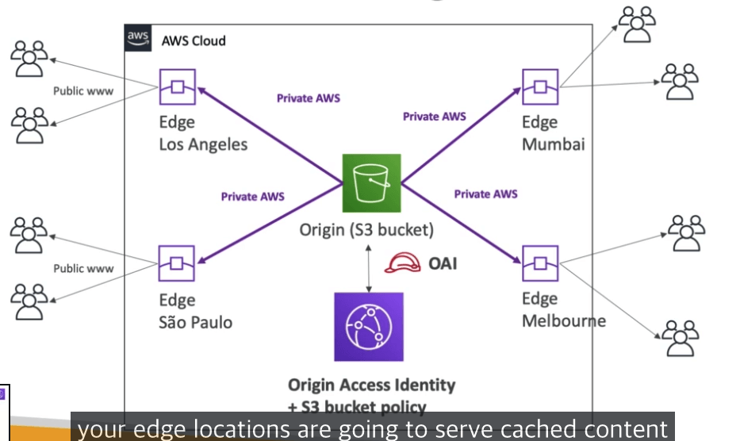
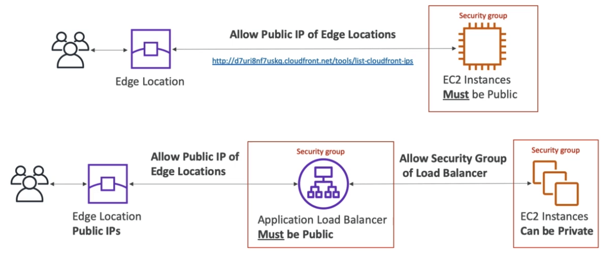

# CloudFront

- Content Delivery Network (CDN)
- 읽기 성능을 증가시키고, 컨텐츠는 엣지 로케이션에 캐시된다.
- 전 세계적으로 216개의 엣지 로케이션이 존재한다.
- 쉴드, WAF와 결합하여 DDoS 방어 기능을 수행한다.
- HTTPS로 공개할수 있고, 내부 HTTPS 백엔드와 소통도 가능하다.

## CloudFront 오리진

- S3버킷
  - 엣지 로케이션에 파일을 배포하기 위함
  - 클라우드프론트 OAI (Origin Access Identity)를 이용해서 보안을 강화
  - 클라우드 프론트는 업로드에도 활용 가능함
- Custom Origin (HTTP)
  - 어플리케이션 로드 밸런서
  - EC2 인스턴스
  - S3 웹사이트 (S3에서 스태틱 호스팅을 활성화 해야함)
  - 혹은 온프레미스 HTTP 서버도 가능함

## CloudFront의 작동방식 도식화

## CloudFront 지역 제한

- 어떤곳에 배포할것인지 제한할 수 있다.
  - 화이트리스트 : 특정 국가에 한정하여 허용하기
  - 블랙리스트 : 특정 국가를 블록하기

## CloudFront vs S3 Cross Region Replication

- 클라우드프론트
  - 글로벌 엣지 네트워크
  - 파일들은 TTL 시간동안 캐시된다.
  - 스태틱 파일의 배포에 적합하다.
- S3 Cross Region Replication
  - 각 리전마다 S3 버킷을 배포해야 한다.
  - 파일들은 거의 리얼타임으로 복제된다.
  - 읽기 전용이다
  - 몇몇개의 리전에 다이나믹 컨텐츠를 낮은 지연시간으로 배포하기에 적합하다.

## AWS CloudFront HandsOn

- 먼저 S3 버킷을 만든다
- CloudFront 배포를 만든다
- Origin Access Identity를 만든다
- S3 버킷을 Identity에 따라 엑세스 제한한다.
  - Origin Access Identity를 만들게 되면
  - 엑세스 아이디가 부여되고, S3버킷정책에 해당 ID로부터의 엑세스만 허가하는 룰을 통해서 보안을 담보한다.
  - 이를 통해서 모든 S3파일을 프라이빗 상태로 클라우드 프론트 경우로는 공개로 할 수 있다.

## CloudFront Access Logs

- 클라우드 프론트 엑세스 로그 : 모든 요청에 대한 로그가 만들어지며 이는 S3버킷에 저장된다.
