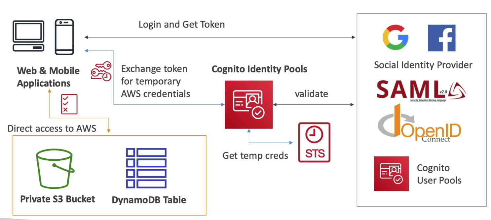
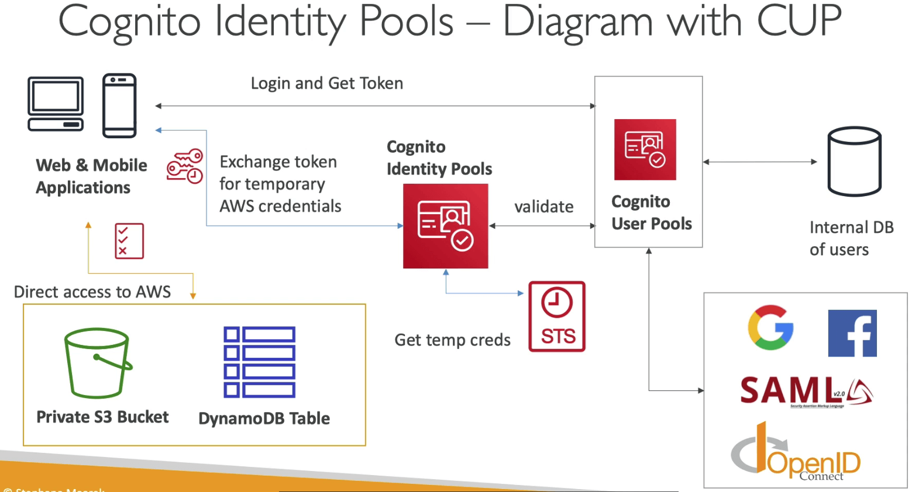

# Cognito

- 유저의 신원을 인증해서 어플리케이션을 이용할 수 있도록 하는 기술
- Cognito User Pools
  - 어플리케이션 유저를 인증하는 기능 (로그인)
  - API 게이트웨이와 ALB와 연동
- Cognito Identity Pools (Federated Identity)
  - AWS 크레덴셜을 유저에게 제공해서 직접 리소스에 접근할수 있도록 하는 기능
  - Cognito User Pools와 연동해서 신원 제공자로 활용 가능
- Cognito Sync
  - 모바일 디바이스와 연동해서 코그니토에 접근하기
  - 현재는 AppSync 서비스로 대체됨
- Cognito vs IAM : 다수의, 모바일 유저들, SAML을 통한 연동 등의 메시지가 전달되면 Cognito를 떠올릴것

## Cognito User Pools (CUP)

- 심플하게 모바일과 웹을 위한 서버리스 인증 데이터베이스라고 생각하면 됨
- 심플 로그인 기능으로 유저명 (이메일) 패스워드 인증부터
- 패스워드 리셋
- 이메일 핸드폰 번호 인증
- MFA
- 타사 인증수단 지원 : 페이스북, 구글, SAML까지
- 특정 유저를 블록하는 기능
- JSON Web Token으로 로그인 인증을 수행한다

- CUP은 API 게이트웨이와 ALB와 통합된다

## Cognito 람다 트리거

- 인증 이벤트
  - 인증 전 람다 트리거
  - 인증 후 람다 트리거
  - 토큰 생성 전 람다 트리거
- 사인업
  - 사인업 전 트리거
  - 확인 후 람다 트리거

## Cognito 인증 UI

- 코그니토는 UI를 제공해준다
- OIDC SAML등 다른 서비스 연계도 지원
- 커스텀 로고, CSS등을 삽입 가능

## Cognito Identity Pools (Federated Identities)

- 유저에게 임시적인 AWS 크레덴셜을 제공하기 위함
- 아이덴티티 풀은 신뢰할 수 있는 인증자들
  - Amazon Facebook Google Apple
  - Amazon Cognito user pool 에 있는 유저들
  - OpenID 혹은 SAML
  - 개발자 인증 아이덴티티 (커스텀 로그인 서버)
  - 코그니토 아이덴티티 풀은 게스트 엑세스를 지원
- 유저는 API게이트웨이를 이용, AWS 서비스에 직접 접근 할 수 있다
  - 코그니토에서 정의한 IAM 정책이 적용된다

## User pool vs Identity pool

- 코그니토 유저 풀
  - 웹이나 모바일 어플리케이션의 유저 데이터베이스
  - 다른 퍼블릭 소셜 OIDC SAML과 연동
  - UI 커스터마이징 로그인 옵션 제공
  - 람다를 이용한 트리거링
- 아이덴티티 풀
  - AWS 크레덴셜을 제공
  - 유저는 퍼블릭 소셜 OIDC 그리고 코그니토 유저 풀 에서 연동 가능
  - 게스트 유저 IAM도 별도 제공
  - 유저는 IAM 맵과 연동되어 역할 및 정책이 적용됨
- CUP + CIP = 유저 관리 및 AWS 엑세스 가능

## 코그니토 Sync

- AppSync로 대체됨
- 앱 설정이나 상태를 저장
- 크로스 디바이스 연동 (ios 안드로이드 기타 등등)
- 오프라인 용량 (온라인으로 되었을때 다시 연동)
- 데이터베이스에 데이터를 저장하고 20개의 데이터셋까지 싱크 가능
- Push Sync : 뒷단에서 조용히 모든 디바이스를 연동한다
- Cognito Stream : 코그니토 데이터를 키네시스로 전송
- Cognito Events : 응답이 오면 람다 함수를 가동
