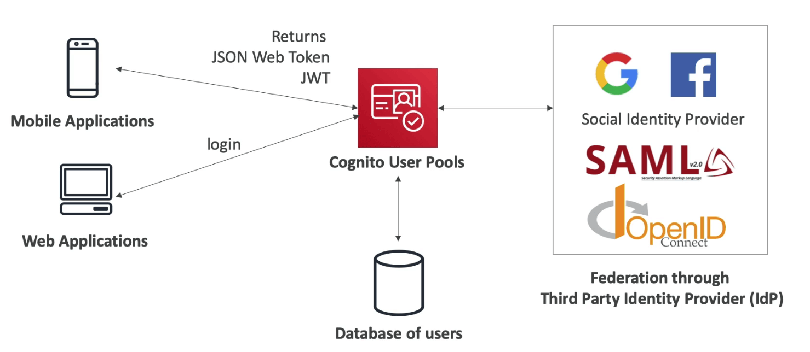
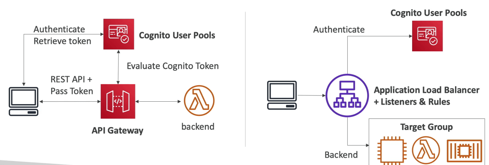
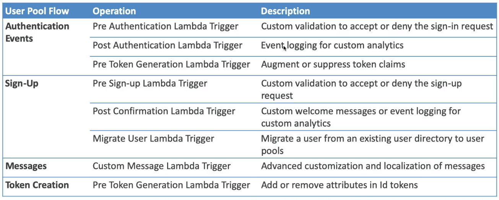

# Cognito

- 유저의 신원을 인증해서 어플리케이션을 이용할 수 있도록 하는 기술
- Cognito User Pools
  - 어플리케이션 유저를 인증하는 기능 (로그인)
  - API 게이트웨이와 ALB와 연동
- Cognito Identity Pools (Federated Identity)
  - AWS 크레덴셜을 유저에게 제공해서 직접 리소스에 접근할수 있도록 하는 기능
  - Cognito User Pools와 연동해서 신원 제공자로 활용 가능
- Cognito Sync
  - 모바일 디바이스와 연동해서 코그니토에 접근하기
  - 현재는 AppSync 서비스로 대체됨
- Cognito vs IAM : 다수의, 모바일 유저들, SAML을 통한 연동 등의 메시지가 전달되면 Cognito를 떠올릴것

## Cognito User Pools (CUP)

- 심플하게 모바일과 웹을 위한 서버리스 인증 데이터베이스라고 생각하면 됨
- 심플 로그인 기능으로 유저명 (이메일) 패스워드 인증부터
- 패스워드 리셋
- 이메일 핸드폰 번호 인증
- MFA
- 타사 인증수단 지원 : 페이스북, 구글, SAML까지
- 특정 유저를 블록하는 기능
- JSON Web Token으로 로그인 인증을 수행한다

- CUP은 API 게이트웨이와 ALB와 통합된다

## Cognito 람다 트리거

- 인증 이벤트
  - 인증 전 람다 트리거
  - 인증 후 람다 트리거
  - 토큰 생성 전 람다 트리거
- 사인업
  - 사인업 전 트리거
  - 확인 후 람다 트리거

## Cognito 인증 UI

- 코그니토는 UI를 제공해준다
- OIDC SAML등 다른 서비스 연계도 지원
- 커스텀 로고, CSS등을 삽입 가능
