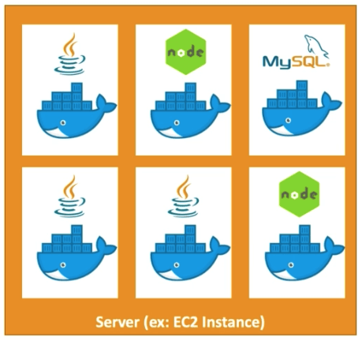
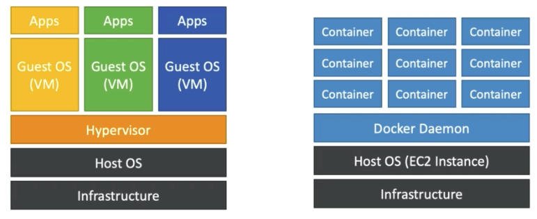

# Docker에 대해서

- 도커는 앱을 배포하기 위한 소프트웨어 개발 플랫폼으로 정의함
- 앱은 컨테이너에 패키징되며 어떤 OS에서도 실행 가능
- 앱은 동시에 실행가능하며 아래의 어떤 조건하에서도 실행할 수 있음
  - 머신의 종류
  - 호환성 문제 없음
  - 예측 가능한 수행능력
  - 적은 작업
  - 유지보수가 쉬우며 배포가 쉬움
  - 어떤 언어, OS, 기술에서도 작업 가능

## OS위에 올려진 Docker

- 하나의 인스턴스에 어러개의 도커 컨테이너를 적재할 수 있음
  

## 도커 이미지는 어디서 저장되는가?

- 도커 이미지는 도커 레포지토리에 저장된다
- 퍼블릭
  - 도커허브
    - 다양한 기술들이 현재 공식적으로 도커를 지원한다
    - 우분투
    - MySQL
    - NodeJS, Java 기타 등등
- 프라이빗
  - 아마존 ECR (Elastic Container Registry)

## Docker와 가상머신의 차이점

- 도커는 가상머신의 일종이지만 같지는 않다
- 리소스를 호스트와 공유한다 → 하나의 서버내에서 여러개의 컨테이너를 사용
- 가상머신은 인프라의 호스트OS에 하이퍼바이저를 이용해서 가상OS를 제공하는 형태
- 도커는 호스트OS위에 바로 도커 데몬을 올리고 그위에서 컨테이너를 바로 실행
  
