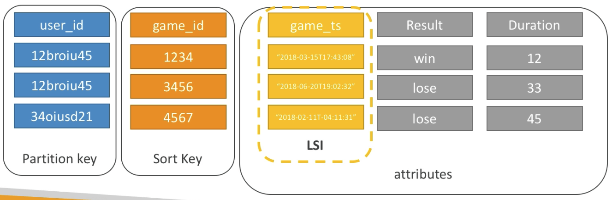
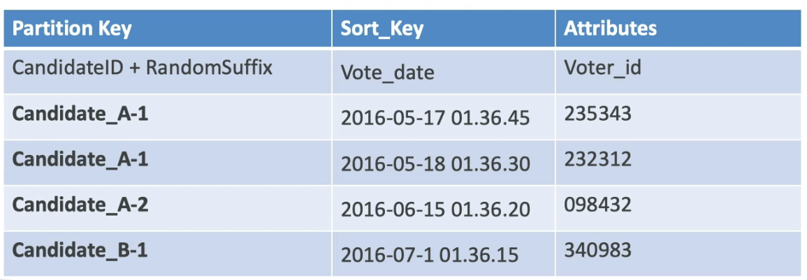

# DynamoDB

- 종래의 아키텍쳐
  - RDBMS 데이터베이스를 레버리지 한다
  - 이러한 데이터베이스들은 SQL 쿼리 언어를 사용한다
  - 데이터의 모델링이 매우 중요하다
  - 조인, 중복화, 계산이 가능하다
  - 수직적인 스케일링이 필요하다 (이는 일반적으로 더 많은 CPU, RAM, IO를 의미한다)
    

## NoSQL 데이터베이스

- NoSQL 데이터베이스는 관계형이 아니며, 분산 가능한 설계구조이다
- NoSQL 데이터베이스는 몽고DB와 DynamoDB와 같은 종류가 있다
- NoSQL 데이터베이스는 조인을 지원하지 않는다
- 쿼리하나에 필요한 모든 데이터는 하나의 행으로 존재해야 한다
- NoSQL 데이터베이스는 SUM과 같은 합산식으로 동작하지 않는다
- NoSQL 데이터베이스는 수평적인 스케일링이다
- NoSQL과 SQL은 어느것이 맞고 틀리다가 아닌, 단순히 설계와 필요에 의해 각각 다른 목적으로 사용된다

## DynamoDB

- 완전 관리형이며 3AZ 이상에 복제되는 고가용성 데이터베이스이다
- NoSQL 데이터베이스이고, 이는 곧 관계형이 아니라는 것을 의미
- 대량의 워크로드까지 스케일 가능하며 분산형 데이터베이스이다
- 초당 수백만 쿼리, 조단위의 행, 수백TB의 스토리지를 제공한다
- 빠르고 일관된 퍼포먼스 (낮은 지연속도와 응답속도)
- IAM과 통합되어 안전하고 인증과 관리를 제공한다
- DynamoDB 스트림을 통해서 이벤트 기반의 프로그래밍이 가능하다
- 저비용이며 용량이 자동으로 스케일링된다

## DynamoDB - 기본

- 다이나모DB는 테이블로 구성된다
- 각각의 테이블은 Primary Key를 가진다 (프라이머리 키는 반드시 테이블 생성시점에 지정되어야 한다)
- 각각의 테이블은 무제한의 아이템 수를 가질 수 있다 (= 행)
- 각각의 아이템은 attribute (속성)을 가진다 (속성은 어느때건 추가될 수 있으며 null이 될 수 있다)
- 아이템의 최대 사이즈는 400KB이다
- 지원되는 데이터 타입은 다음과 같다
  - 물리적인 타입 : string, number, binary, boolean, null
  - 도큐먼트 타입 : list, map
  - 셋 타입 : string set, number set, binary set

## DynamoDB 프라이머리 키에 대해서

- **옵션1 : 파티션 키만 사용 (해시를 이용하는 방법)**
- 파티션키는 각각의 아이템에 대해 고유하다
- 파티션 키는 다양하게 정할 수 있으며 데이터는 분산된다
- 예 : user_id를 사용한 유저 테이블

- **옵션2 : 파티션키와 정렬키의 복합**
- 콤비네이션은 반드시 유니크해야 한다
- 정렬키 == 범위키
- 예를 들어 : 유저 게임 테이블
  - user_id는 파티션 키
  - game_id는 정렬 키
    

## DynamoDB 파티션 키 트레이닝

- 영화 데이터베이스를 만들어본다고 가정
- 어떤 파티션 키가 데이터를 분산하는데 가장 적합할까?
  - movie_id
  - producer_name
  - leader_actor_name
  - movie_language
- movie_id가 가장 높은 카디널리티를 제공하므로 가장 좋은 후보가 된다
- movie_language는 많은 중복값을 가지기 때문에 잘못된 방향이다. 예를 들어 영어는 좋은 파티션키는 아닐것이다

## DynamoDB 처리량 프로비저닝

- 모든 테이블은 읽기와 쓰기 처리량을 미리 지정해야 한다
- Read Capacity Units (RCU): 읽기에 대한 처리량
- Write Capacity Units (WCU): 쓰기에 대한 처리량
- 옵션으로서 용량을 초과하는 처리량을 자동으로 스케일링하게 설정할 수 있다
- 처리량은 일시적으로 설정치를 초과할 수 있으며 이때 버스트 크레딧이 사용된다
- 버스트 크레딧을 전부 소진하고 나면 ProvisionedThrouputException이 발생한다
- 이후에는 지수 백오프를 이용하여 재시도 할 것이 권장된다

## DynamoDB WCU에 대한 더 자세한 설명

- 하나의 WCU는 초당 1KB사이즈의 객체 1개를 쓰는것을 의미한다
- 만약 아이템의 크기가 1KB를 초과할 경우 더 많은 WCU가 소진된다
- 예
  - 초당 2KB의 오브젝트를 10개 작성 → 2 \* 10 = 20 WCU
  - 초당 4.5KB의 오브젝트를 6개 작성 → 5 \* 6 = 30 WCU (1KB보다 작은 오브젝트는 올림 처리되어 4.5KB는 5KB로 산정된다)
  - 분당 2KB의 오브젝트를 120개 작성 → 초당으로 계산하면 120 / 60 \* 2 = 4 WCU

## DynamoDB Strong Consistent Read vs Eventually Consistent Read

- Eventually: 데이터를 쓴 직후에 읽을 경우, 예상치 못한 결과값을 얻을 수 있음을 의미함. 이는 데이터를 쓰고 나서 다른 읽기 서버로의 복제에 시간이 걸리기 때문에, 그 시간 사이에 읽어버리면 아직 갱신되지 않은 값을 얻을 수 있기 때문이다
- Strongly: 데이터를 쓴 직후에 읽더라도 반드시 갱신된 값을 얻을 수 있다. 이는 읽기에 시간이 좀 걸리더라도 읽기 서버에 데이터가 복제 되고 나서 읽는것을 보장하기 때문이다.
- 기본적으로는 DynamoDB는 Eventually Consistent Read를 제공하지만 옵션으로 패러미터에 ConsistentRead를 붙이게 되면 Strongly 읽기모드로 진행한다.

- 그렇다면 매번 Strongly Consistent Read를 쓰면 될 것을 왜 굳이 Eventually Consistent Read가 있는것일까?

## DynamoDB Read Capacity Units

- 1 RCU는 Strongly Consistent Read를 1초에 한번 또는 Eventually Consistent Read를 1초에 두번, 각각의 오브젝트 사이즈는 4KB까지를 의미한다
- 아이템 사이즈가 4KB를 넘어갈 경우에는 더 많은 RCU를 소진한다
- 예
  - 각각의 사이즈가 4KB인 오브젝트를 초당 10개 Strongly Consistent Read 패턴으로 읽기 → 1 \* 10 = 10 RCU
  - 각각의 사이즈가 12KB인 오브젝트를 초당 16개 Eventually Consistent Read 패턴으로 읽기 → (12 / 4) \* (16 / 2) = 24 RCU
  - 각각의 사이즈가 6KB인 오브젝트를 초당 10개 Strongly Consistent Read 패턴으로 읽기 → (8 / 4) \* (10) = 20 RCU 6KB는 올림처리되어 8KB와 동일하게 계산됨

## DynamoDB 파티션 인터널

- 데이터는 파티션내에 분배된다
- 파티션 키는 해싱 알고리즘을 통해 어떤 파티션에 데이터가 흘러갈지 결정한다
- 파티션수를 계산하기 위해서는
  - 용량 : (Total RCU / 3000) + (Total WCU / 1000)
  - 사이즈 : Total Size / 10GB
  - Total Partitions : CEILING(MAX(용량, 사이즈))
- **WCU와 RCU는 파티션에 균등하게 분배됨**

## DynamoDB 쓰로틀링

- RCU나 WCU를 초과해서 사용할 경우 ProvisionedThrouputExceededException이 발생한다
- 이유
  - 핫 키 : 하나의 파티션 키에 너무나 많은 데이터가 집중되어 있어서 일기가 너무 많이 발생
  - 핫 파티션 : 매우 큰 아이템이 소속되어 있음 RCU와 WCU는 아이템의 사이즈에 영향을 받는다
- 해결책
  - 지수 백오프를 이용해서 재시도한다 (SDK에는 이미 포함된 기능)
  - 파티션 키를 될수 있으면 세분화시킬 수 있는것으로 선정한다
  - RCU이슈가 발생할 경우에는 DynamoDB Accelerator를 이용할 수 있다 (DAX) - 캐시

## DynamoDB 데이터 쓰기

- **PutItem** : DynamoDB에 데이터를 쓰기 (데이터 자체를 만들어내거나, 전체를 교체함)
  - WCU를 소모함
- **UpdateItem** : DynamoDB의 데이터를 업데이트 (속성 일부를 업데이트)
  - 아토믹 카운터를 사용하거나 증가시키는 방식
- **Conditional Writes**:
  - 특정 조건에 대해 쓰기 및 업데이트를 실행, 그렇지 않으면 거부
  - 아이템에 동시에 접근할때 유용
  - 퍼포먼스에 영향은 없음

## DynamoDB 데이터 삭제

- **DeleteItem**
  - 하나의 행을 삭제
  - 조건에 의한 삭제 기능이 있음
- **DeleteTable**
  - 테이블상의 모든 아이템을 삭제함
  - 모든 행에 대해서 일일히 DeleteItem을 호출하는것보다 훨씬 빠름

## Batching Writes

- **BatchWriteItem**
  - 한번에 25개까지 **PutItem** 혹은 **DeleteItem**을 수행
  - 16MB의 데이터까지 쓰기 가능
  - 400KB의 데이터까지 하나의 아이템당 수행 가능
- 배치작업은 API 호출횟수를 감소시켜 지연시간 감소 효과를 누릴 수 있게 해줌
- 작업은 효과적으로 병렬 처리 가능함 (다이나모디비는 쓰기의 병렬처리를 지원함)
- 배치의 일부 작업이 실패할 수 있는데, 이때는 실패한 아이템에 대해서 재시도를 할 수 있음 (지수 백오프 알고리즘을 이용)

## 다이나모db 데이터 읽기

- **GetItem**
  - 프라이머리 키로 데이터 읽기
  - 프라이머리 키 = 해시 or 해시-범위
  - Eventually consistent read가 기본적으로 사용된다
  - 옵션으로 Strongly consistent read를 사용할 수 있는데 2배의 RCU를 사용하며, 읽기에 시간이 좀 더 걸릴 수 있다
  - **ProjectionExpression**을 이용하면 하나의 행 전체가 아닌 속성 중 일부만 떼어서 가져올 수 있다. 네트워크 트래픽을 줄일 수 있음
- **BatchGetItem**
  - 100개의 아이템
  - 16MB의 데이터
  - 아이템은 병렬로 동시에 처리되어 가져와지며 지연시간을 최소화 할 수 있다

## DynamoDB 쿼리

- 쿼리는 다음의 표현식에 의거해서 데이터를 가져옴
  - 파티션 키 값 (**반드시 = 오퍼레이션**이어야 함)
  - 정렬키 값 (=, <, ≤, >, ≥, between, begin) 옵션
  - FilterExpression을 통해 필터링 (클라이언트측 필터링, 즉 결과값을 가져온 뒤에 추가로 작업을 하고 걸러진 값은 폐기됨, 즉 필터전과 동일한 데이터량이 전송됨)
- 리턴
  - 최대 1MB까지의 데이터
  - Limit을 이용하면 갯수를 지정가능
- 결과값에 대해 페이지네이션 적용 가능
- 테이블에 대한 쿼리, 로컬 세컨더리 인덱스, 글로벌 세컨더리 인덱스에 쿼리 가능

## DynamoDB 스캔

- 스캔은 전체 테이블을 필터링한다 (비효율적)
- 최대 1MB데이터까지 가져옴 - 페이지네이션을 통해 계속해서 읽어들임
- RCU를 너무많이 사용하게 됨
- Limit을 이용하면 가져오는 데이터의 사이즈를 줄이거나 중지시킬수있다
- 더 빠른 퍼포먼스를 위해서는 병렬 스캔을 이용
  - 복수의 인스턴스를 이용해서 복수의 파티션에 동시다발적인 스캔이 가능
  - 처리량을 늘리는것은 곧 RCU 사용량을 늘리는것
  - Limit을 이용해서 병렬 스캔을 사용하는것은 Scan을 이용하는것과 동일
- **ProjectionExpression**과 **FilterExpression**을 사용할 수 있음

## DynamoDB LSI (Local Secondary Index)

- 테이블에 정렬키와 같은 역할을 수행하기 위해, LSI를 키로 지정할 수 있다 (해시되어 정렬키와 같은 역할 수행)
- 테이블당 5개의 LSI를 지정할 수 있다
- 정렬키는 정확히 하나의 스칼라 속성으로 구성되어야 함
- **LSI는 테이블 작성 시점에 지정되어야 함**

## DynamoDB GSI (Global Secondary Index)

- 키가 아닌 속성의 쿼리 속도를 증가시키기 위해, GSI를 이용할 수 있다
- GSI는 파티션키 + 추가적인 정렬키로 이루어짐
- 인덱스는 마치 새로운 테이블처럼 지정한 속성을 프로젝션 할 수 있다
  - 기존 파티션키와 정렬키는 항상 추가로 프로젝션되며
  - 지정된 추가 속성이 프로젝션된다
  - 메인 테이블로부터 모든 속성을 지정가능하다
- RCU와 WCU를 지정해야 한다
- **GSI는 테이블 작성 이후에 작성 및 수정이 가능하다**

## DynamoDB에서 인덱스와 쓰로틀링에 대해서

- GSI
  - 만약 GSI를 잘못 설정해서 GSI가 쓰로틀링이 생길 경우, 이는 메인테이블에도 영향을 준다.
  - 메인테이블에 설정한 WCU가 충분하더라도 GSI의 쓰로틀이 영향을 주는것
  - GSI의 파티션키를 신중하게 설정하자
  - WCU의 용량또한 적절하게 설정해줄 필요가 있다
- LSI
  - WCU와 RCU는 메인 테이블의 그것을 이용한다
  - 특별히 쓰로틀을 발생시키는 고려사항은 없음

## DynamoDB 동시성

- DynamoDB는 조건부 업데이트, 삭제 모델을 채택한다
- 이것은 허가받지 않은 아이템의 변경 및 삭제가 불가능함을 의미한다
- DynamoDB가 optimistic locking / 동시성 데이터베이스임을 의미한다
- 예를 들어

## DynamoDB DAX

- DAX = DynamoDB Accelerator
- DynamoDB를 위한 seamless 캐싱, 어플리케이션에서 다시 쓰기는 없음
- 쓰기 작업은 DAX를 거쳐 DynamoDB로 직접 쓰기
- 캐시 읽기와 쿼리에 밀리초단위 지연시간
- 핫키 문제를 해결가능 (너무 많은 읽기 문제)
- 캐시는 기본 5분의 TTL
- 클러스터에 최대 10개의 노드를 둘 수 있음
- 멀티AZ 지원 (최소 3개의 노드가 필요)
- 보안 (보존된 데이터에 대한 KMS, VPC, IAM, CloudTrail을 통한 감사 등)

## DAX vs ElastiCache

- DAX는 개별 오브젝트에 대한 쿼리, 스캔을 캐싱하는 용도로 최적화 됨
- 대량의 데이터를 읽어들여오는 쿼리가 있다고 하면, 결과값을 ElastiCache에 저장해두고, DynamoDB에 다시 요청할 필요 없이 캐시에서 읽어올 수 있다

## DynamoDB Streams

- DynamoDB의 변경(CRUD)은 DynamoDB Stream에 기록될 수 있다
- 스트림은 AWS Lambda 혹은 EC2에서 읽을 수 있으므로 이걸 이용하면 다음과 같은 것들을 할 수 있음
  - 리얼타임으로 어떠한 동작을 수행 (새로운 유저에게 이메일 송신)
  - 분석
  - 변화량 기록용 테이블 뷰
  - 엘라스티서치에 데이터를 삽입
- 스트림을 이용해서 리전별 복제가 가능
- 스트림 내의 데이터는 24시간동안 존속됨
  
- 데이터 변경 후에 스트림에 어떤 종류의 데이터를 기록할 것인지 4가지 패턴이 있다
  - KEYS_ONLY : 변경된 데이터의 키만 남김
  - NEW_IMAGE : 변경된 새로운 데이터의 전체 행
  - OLD_IMAGE : 변경전 데이터의 전체 행
  - NEW_AND_OLD_IMAGES : 변경전 데이터와 변경된 새로운 데이터의 전체 행
- DynamoDB 스트림은 샤드를 만들어낸다. 이는 키네시스 데이터 스트림과 같음
- 샤드를 프로비전 할 필요는 없고, AWS측에서 만들어줌
- 스트림 설정 이전 데이터가 스트림이 들어오지는 않으며, 설정 이후의 데이터가 스트림에 들어온다

## DynamoDB 스트림과 람다를 연계했을때

- 이벤트 소스 맵핑을 통해 DynamoDB 스트림과 람다 연계 가능
- 람다 함수를 실행할 수 있는 권한이 있어야 함
- **람다 함수는 동기식으로 호출됨**

## DynamoDB TTL

- TTL은 아이템의 만료 시간을 설정해서 자동으로 삭제할 수 있는 기능
- TTL은 추가 요금이 필요없으며, 어떠한 WCU, RCU를 요구하지 않음 자동으로 됨
- TTL은 DynamoDB의 백그라운드 작업으로 수행됨
- 목적으로는 테이블의 크기 관리, 용량의 감소 등이 있을 수 있음
- TTL은 행단위로 수행될 수 있으며 (타임스탬프 등을 이용하여 특정 시간이전에 입력된 행을 삭제한다거나)
- DynamoDB의 클렌징 작업은 TTL이 지나고 나서 48시간 안에 수행된다
- 지워진 아이템에 의거 GSI LSI에도 자동으로 인덱스가 삭제된다
- DynamoDB 스트림을 이용해서 삭제된 아이템을 복구할수도 있다
  - 스트림은 트리거에 의해 모든 데이터를 24시간동안 저장하므로 그곳에서 다시 복구 가능함
  - epochtime을 칼럼(속성)으로 지정

## DynamoDB CLI

- —profection-expression : 읽어들일 속성
- —filter-expression : 결과를 필터링
- 일반적인 CLI 페이지네이션은 DynamoDB와 S3에서 수행됨
  - 최적화
    - —page-size: API당 받아오는 아이템의 크기. 즉 —page-size 1은 한번의 API요청에 1개씩 아이템을 가져옴
  - 페이지네이션
    - —max-items: CLI에서 받아올 최대 아이템 숫자. NextToken을 줌
    - —starting-token: NextToken을 이용해서 그 이후 결과값을 받아옴

## DynamoDB 트랜잭션

- 트랜잭션 = 여러 행을 Create Update Delete할때 사용하는 기능
- all or nothing 작업이라고도 말한다
- 쓰기 모드: 스탠다드, 트랜잭션
- 읽기 모드: Eventually Consistency : 0.5 Strong Consistency : 1 Transactional : 2
- 2배의 WCU, RCU를 소모한다
- API: TransactWriteItems / TransactGetItems
- 예를 들어 은행 계정과 거래 테이블이 있다고 하자
  - 은행 계정의 잔고를 증가시키는것은
    1. 거래 테이블에 기록을 남김과 동시에
    2. 잔고를 증가시켜야 하지
  - 1이나 2가 없는데 하나만 성공한다는것은 불가능하다
  - 이런것이 트랜잭션이다

## 트랜잭션 용량 계산

- **시험에 필요**
- 5KB아이템 크기
- 트랜잭션 아이템이 초당 3번
  - 5KB / 1 per WCU _ 2 (트랜잭션 비용) _ 3(초당 액션수)
  - 5 _ 2 _ 3 = 30 WCU
- 트랜잭션 읽기가 초당 5번
  - 5KB / 4KB per RCU _ 2(트랜잭션 비용) _ 5(초당 액션수)
  - 2 _ 2 _ 5 = 20 RCU

## DynamoDB 세션 상태 캐시

- 일반적인 DynamoDB의 유즈케이스 (로그인 세션 저장)
- Vs ElastiCache
  - 엘라스티캐시는 메모리, 다이나모DB는 서버리스
  - 둘다 키 밸류 저장소
- Vs EFS
  - EFS는 네트워크형으로 EC2에 붙여야 함
- Vs EBS 와 Instance Store
  - EBS와 인스턴스 스토어는 로컬 캐싱만 가능하고 공유 캐시모델이 불가능
- Vs S3
  - S3는 높은 지연시간, 작은 오브젝트에는 사용 불가

## DynamoDB 쓰기 샤딩

- 두개의 후보자가 있고 투표를 한다고 가정해봤을때 Candidate A그리고 Candidate B가 있을 것이다
- 파티션 키를 candidate_id로 사용하게 되면 두개의 파티션만 존재하게 된다
- 분산을 위해서 suffix를 사용할 수 있다 (랜덤한 Suffix 혹은 계산된 Suffix)

- 파티션 키를 분산해서 처리를 분산 가능하다.

## DynamoDB 쓰기 타입

## DynamoDB 대용량 오브젝트 패턴

## DynamoDB S3 오브젝트 인덱싱

## DynamoDB 오퍼레이션

- 테이블 클린업
  - 옵션1 : 스캔 + 삭제 → 매우 느림 비싸고 많은량의 RCU WCU를 사용
  - 옵션2 : 테이블 드롭 + 다시 만들기 → 빠르고 싸고 효율적
- 테이블 데이터 카피
  - 옵션1 : AWS 데이터파이프라인 (EMR사용)
  - 옵션2 : 백업을 만들고 그것으로부터 새로운 테이블 이름으로 생성
  - 옵션3 : 스캔 + 작성 → 코드 작성이 필요
    

## DynamoDB 시큐리티 기타 기능

- 시큐리티
  - VPC엔드포인트로 인터넷 엑세스 없이 접근 가능
  - IAM과 통합됨
  - KMS를 통한 암호화
  - SSL TLS를 이용한 전송간 암호화
- 백업과 복구 기능
  - RDS와 비슷하게 특정 시간대를 지정해서 복구 가능
  - 퍼포먼스에 영향 없음
- 글로벌 테이블
  - 멀티 리전, 완전 복제, 고성능
- Amazon DMS (Database Migration Service)를 이용하여 DynamoDB로 이전 가능 (from Mongo, Oracle, MySQL, S3, 기타 등등)
- 개발 목적으로 DynamoDB를 로컬 환경에서 사용 가능
- DynamoDB에 직접 접속하고 싶을때 모델
  - 제 3의 인증국을 이용해서 인증 후에 적절한 IAM 역할 & 정책을 부여받은 키를 발행
  - 해당 키를 이용해서 AWS에 엑세스
    

## DynamoDB Fine Grained Access Control

- WIF또는 Cognito 인증 풀을 이용해서 AWS 크레덴셜을 발행
- IAM 역할에 접근하여 API엑세스 제한을 수행
- LeadingKeys: primary key에 대한 낮은 레벨에서의 엑세스를 제한하여 특정 칼럼을 비표시 하거나 하는 등의 설정이 가능
