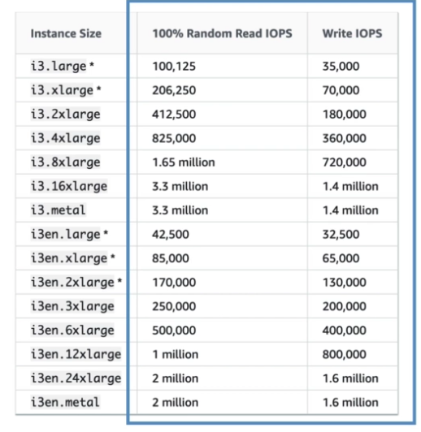

# EBS 101

- EBS볼륨은 네트워크 드라이브이다.
  - 네트워크를 통해서 인스턴스와 소통함
  - 따라서 인스턴스간의 이동이 순간적으로 이루어질 수 있음
- EBS는 같은 AZ안으로 종속된다. 다른 AZ로 이동하려면 복사해야한다.
  - 스냅샷을 통한 다른 AZ로 복사가능
- 용량을 미리 할당한다. (사이즈 혹은 IOPS 등)
  - 할당된 용량 혹은 처리량만큼 과금된다.
  - 용량은 계속해서 확장 가능하다. (최대치는 있음)

## EBS 볼륨 타입

- EBS는 다음 4가지 타입이 존재함
  1. GP2(SSD) : 일반적인 목적으로 사용하는 SSD 볼륨으로, 가격과 성능의 비율이 훌륭하며, 다양한 워크로드에 적합하다.
  2. IO1(SSD) : 퍼포먼스 중점의 SSD 볼륨으로 미션 크리티컬하고 고속, 고성능의 워크로드에 적합하다.
  3. ST1(HDD) : 자주 엑세스가 이루어지는 저가격의 하드디스크 볼륨이며, throughput-intensive 워크로드에 적합하다.
  4. SC1(HDD) : 엑세스가 자주 이루어지지 않는 저가격의 하드디스크 볼륨이며 엑세스가 자주 일어나지 않는 워크로드에 적합하다. (백업 등)
- EBS 볼륨은 각각의 타입별로 특성이 있다.
- GP2와 IO1만이 현재 부트 볼륨으로서 사용 가능하다.

## EBS 볼륨 타입 유스케이스

1. GP2
   - 대부분의 워크로드에 적합
   - 부트 시스템 볼륨으로 사용가능
   - 저지연 반응형 앱
   - 개발, 테스트 환경
   - 특징
     - 1GB ~ 16TB
       - 1기가당 3IOPS지만 3000 미만의 경우에는 버스트 기능을 가지고 있음, 또한 최소치는 100 IOPS가 된다.
       - 최대 IOPS는 16000이므로 5,334GB이후로는 IOPS는 증가하지 않고 용량만 증가
2. IO1
   - 특정 IOPS 퍼포먼스가 필요한 크리티컬한 비즈니스 어플리케이션에서 활용가능하며, 특히 16000이상의 IOPS가 필요할 경우에는 gp2 대신 사용할 수 있다.
   - 대형 데이터베이스 시스템에 특히 적합하다.
     - 몽고DB, 카산드라, MSSQL, MySQL, PostgreSQL, Oracle 기타 등등
   - 특징
     - 4GB ~ 16TB
       - IOPS는 할당됨 (PIOPS) 최소는 100이며 최대는 64000이다. 단 일반적으로는 32000이 최대이며 그 이상이 필요하면 Nitro instance라는 특정 타입을 사용해야 한다.
     - 미리 할당할 수 있는 IOPS는 볼륨 사이즈에 따라 최대치가 정해져 있으며 볼륨 \* 50이 최대치가 된다.
3. ST1
   - 낮은 가격으로 일관되고 빠른 처리량이 요구되는 스트리밍 워크로드
   - 빅데이터, 데이터 웨어하우스, 로그 처리
   - 아파치 카프카
   - 부트 볼륨으로 사용할 수 없음
   - 특징
     - 500GB ~ 16TB
     - 최대 IOPS는 500
     - 최대 처리량은 500MB/s 또한 버스트 가능
4. SC1
   - 자주 접근되지 않는 많은 양의 데이터 스토리지
   - 비용 문제가 가장 고려되어야 할 경우 활용 가능
   - 부트 볼륨으로 사용할 수 없음
   - 특징
     - 500GB ~ 16TB
     - 최대 IOPS는 250
     - 최대 처리량은 250MB/s 또한 버스트 가능

### EBS 볼륨 부스트

- 1000기가바이트 미만의 GP2타입의 볼륨은 버스트 기능을 통해 3000IOPS까지 퍼포먼스를 낼 수 있다.
- 이는 T계열의 인스턴스 CPU 타입과 비슷한 형태임.
- 최대 성능을 내는 동안 시간당 버스트 크레딧이 소모됨.
- 더 높은 용량을 가진 볼륨은 크레딧을 더 빠르게 충전함.
- IO 크레딧 버스트가 소진되면 어떻게 될까?
  - 기가바이트당 3 IOPS 만큼의 성능이 최대치가 되며
  - 애당초 크레딧이 소모될정도의 작업을 하고 있었다면 성능의 저하를 경험하기 때문에
  - 용량을 늘리거나 io1 타입으로 변경해야 할 것이다.
  - 클라우드워치를 통해서 모니터링이 가능하다.
- st1과 sc1에서는 처리량을 버스트 하는 형식이 존재한다.

## IOPS로부터 MB/s 계산하기

- gp2 : MB 최대 처리량 = (볼륨 사이즈 in GiB) x (IOPS per GiB) x (IO사이즈 in KiB)
- 예 ) 300 IO per second \* 256 KiB per IO operation = 75MiBs
- 최대 250MiBs ( 이 말은 즉 334GiB가 넘어가면 처리량이 더이상 늘지 않는다는 뜻 )
- AWS에서 제공하는 EBS는 IO당 256KiB가 최대이다.
- io1 : 최대 처리랑 1000MiB

## EBS 스냅샷

- 스냅샷은 증분형이며 변경된 블록만 저장한다.
- 스냅샷은 IO를 사용하기 때문에 볼륨이 바쁘게 사용중이라면 피하는 것이 좋다.
- 스냅샷은 S3에 저장된다. (하지만 직접 볼 수는 없다)
- 스냅샷을 만들 때는 볼륨을 detach 할 필요는 없으나 그렇게 하도록 권고하고 있다.
- 최대 100,000개의 스냅샷을 만들 수 있다.
- AZ나 리전에 종속적이나 복사할 수 있다.
- 스냅샷으로부터 AMI를 작성 할 수 있다.
- EBS 볼륨을 스냅샷으로부터 복구할 경우, 프리 워밍이 필요하다 (fio나 dd 커맨드를 통해서 전체 디스크를 한번 읽어주는것)
- 스냅샷은 amazon data lifecycle manager를 통해서 자동으로 만들 수 있다.
- 볼륨 마이그레이션
  - 스냅샷은 리전 베이스, 볼륨은 AZ베이스 이므로 특정 AZ에서 스냅샷을 카피한 뒤, 볼륨을 다른 AZ에 만든다.

## EBS 암호화

- 암호화된 EBS 볼륨을 만들기 위해서는 다음과 같은 것이 적용된다.
  - 볼륨안에 저장되어 있는 데이터들은 암호화 된다.
  - 인스턴스와 볼륨간에 이동하는 데이터가 암호화 된다. (볼륨은 네트워크 드라이브라는걸 명심하자)
  - 모든 스냅샷이 암호화 된다
  - 스냅샷으로 부터 만들어진 모든 볼륨들 또한 암호화 된다
- 암호화와 복호화는 투명하게 이루어진다. (우리가 해야 할건 없다)
- 암호화는 아주 조금이지만 지연속도에 영향을 주긴 한다.
- KMS (AES-256) 키를 사용한다.
- 암호화 되지 않은 스냅샷을 암호화하면서 복사하는것이 가능하다.
- 암호화된 볼륨을 스냅샷하면 그것또한 암호화 된다.

## EBS vs 인스턴스 스토어

- 어떤 인스턴스들은 EBS 볼륨을 루트로 가지지 않는다.
- 대신 인스턴스 스토어 (임시 스토리지) 라는 형태를 취하게 된다.
- 인스턴스 스토어는 물리적으로 하드웨어랑 결합된 형태이다. (EBS는 네트워크 드라이브 이다)
- 따라서
  - 더 좋은 IO 퍼포먼스를 기대할 수 있다
  - 버퍼 캐시 임시 컨텐츠 등에 활용된다
  - 재부팅시에는 데이터가 보존된다.
- 하지만
  - 인스턴스를 중지하거나 삭제하면 인스턴스 스토어는 소실된다
  - 인스턴스 스토어를 재할당 할 수 없다 (용량 개선)
  - 백업은 반드시 유저측에서 해야 한다

## 로컬 인스턴스 스토어

- 물리적인 디스크로 ec2 하드웨어에 직결되어 있다.
- 높은 IOPS를 제공한다. (물리 하드웨어 이기 때문)
- 디스크는 7.5TiB까지 제공한다.
- 블록 스토리지임
- 사이즈를 증가시킬 수 없음.
- 하드웨어 고장으로 데이터가 망가질 수 있음

## 시스템 관리자를 위한 간단지식

- 인스턴스를 삭제한 뒤에도 루트 볼륨을 사용할 필요가 있다면
  - 인스턴스 삭제시 루트 볼륨 삭제를 NO로 해둔다
  - 이는 인스턴스를 만들때 체크 할 수 있는 옵션이다
- EBS를 고성능으로 사용하고 싶다면 EBS-Optimized 인스턴스 타입을 선택할것
- EBS볼륨은 사용되고 있지 않을때도 비용이 차지된다.
- 롱텀 코스트 삭감으로 본다면, 볼륨을 사용하지 않는다면 스냅샷 해두고 나중에 복구하는게 나을 수 있다. 3배 쌈

## EBS 트러블슈팅

- 웨잇타임이 길거나 반응이 왠지 느린것 같다면 → IOPS를 증가시키는걸 고려할것
- EBS볼륨을 핏팅한 EC가 제대로 부팅되지 않는다면 볼륨 이름이 제대로 매핑되어 있는지 확인해볼것
- 볼륨 사이즈를 증가시킨 뒤에는 재파티셔닝을 해서 사이즈를 증가시킬 필요가 있다. 예를 들어 xfs_growfs 등

## EBS 레이드

- EBS볼륨을 레이드 설정에 사용할 수 있음
- RAID 0, RAID 1이 추천되며, RAID5, RAID6는 추천되지 않음

## EBS와 클라우드워치 모니터링

- EBS볼륨 지표중 중요한 것들
  - VolumeIdleTime : 읽기 쓰기를 하지 않은 시간
  - VolumeQueueLength : OP이 대기하는 수. 이 숫자가 높아지면 IOPS에 문제가 있거나 어플리케이션이 제대로 작동하지 않고 있을 가능성이 있음
  - BurstBalance : 이것이 0이 된다는것은 더 많은 IOPS가 필요하다는 뜻임
- gp2 볼륨 타입은 5분에 한번 보고됨
- io1 볼륨 타입은 1분에 한번 보고됨
- EBS 볼륨은 스테이터스 체크가 존재한다.
  - OK : 볼륨에 문제가 없음
  - Warning : 퍼포먼스 저하가 관측됨
  - Impaired : 퍼포먼스의 심각한 저하가 관측됨
  - Inssufficient-data : 지표 데이터 수집중
