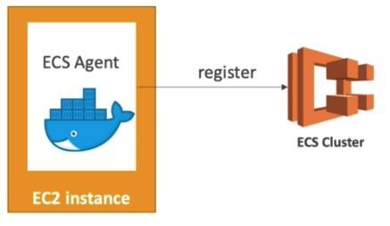
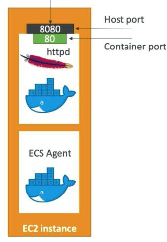
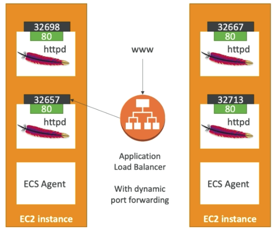
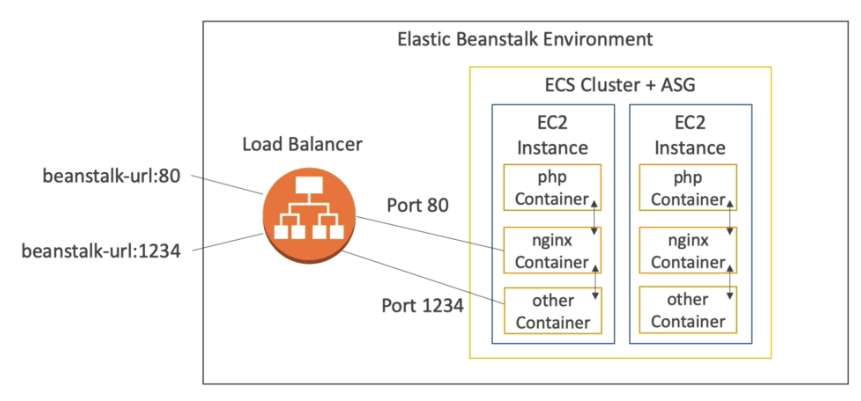

# ECS 클러스터에 대해서

- ECS 클러스터는 EC2 인스턴스들의 논리적인 집합
- EC2 인스턴스에 ECS 에이전트를 설치해서 기동시킴 (도커 컨테이너)
- ECS 에이전트는 ECS 클러스터에 인스턴스를 등록함
- EC2 인스턴스는 특별한 AMI로 기동되고 이 AMI는 ECS를 위해 특별히 제작된 것임
  

## ECS 작업 정의

- 작업 정의는 JSON 폼으로 된 명세서이며, ECS에게 어떤 도커 컨테이너를 실행할것인지 지시하는 것임
- 작업 정의에는 다음과 같은 정보가 포함됨
  - 이미지 이름
  - 컨테이너와 호스트의 포트 맵핑
  - 메모리와 CPU 사용량
  - 환경 변수
  - 네트워킹 정보
    

## ECS에서 클러스터 만들고 작업 정의를 생성하기

- ECS는 실습에서는 EC2 + 네트워크 기반 타입으로 생성
- ECS 클러스터를 생성하면 AWS의 백그라운드에서는 다음을 자동으로 생성한다
  - 런치 컨픽
    - 런치 컨픽에는 EC2의 부트스트랩 데이터(유저데이터)로서 /etc/ecs/ecs.config에 다음과 같은 정보를 남긴다
    ```bash
    ECS_CLUSTER=cluster-demo
    ECS_BACKEND_HOST=
    ```
  - 오토 스케일링 그룹
  - 설정한 숫자만큼의 EC2
- 작업 정의를 작성
  - 작업 정의는 다음과 같은 중요한 정보를 지정한다
    - CPU와 메모리
    - 도커 허브에서 끌어올 이미지 및 태그 (ECR로 가능)
    - 작업 정의 실행 역할 (작업정의를 실행할때 해당 IAM 역할을 부여받아 수행함)
    - 각종 네트워킹 설정 등
    - 특히 포트 맵핑 (호스트포트 : 컨테이너포트)

## ECS클러스터의 서비스를 중복화 시키는 방법

- 작업 정의로 생성한 서비스의 숫자를 늘리면 즉시 클러스터에서는 새로운 서비스를 기동하려고 시도
- 단, 호스트 포트를 정의해둔 경우 동일 인스턴스에서 동일 포트를 중복사용 불가능하기 때문에, 추가인스턴스를 제공해야 함
- 오토스케일 그룹에서 목표치와 최대치를 증가시켜 인스턴스를 증가시키면 새로운 서비스가 다른 인스턴스에서 기동됨
- 그렇다면 하나의 인스턴스에서 하나의 서비스밖에 기동하지 못하는건가? → 아님, 로드밸런스 이용
- 어플리케이션 로드밸런서는 다이나믹 포트포워딩을 이용해서, 호스트 포트를 지정하지 않을 경우 랜덤으로 포트를 할당하고 해당 포트를 맵핑
  

## ECR

- 도커 이미지로부터 ECS에 이미지를 불러와서 서비스에 띄울수 있게 됨
- ECR은 도커 허브의 프라이빗 버전이라고 생각하면됨
- IAM을 이용해서 접근제어를 수행 가능
- push와 pull을 수행하기 위해서는 명령어를 입력할 필요가 있음
  - $(aws ecr get-login —no-include-email —region us-east-1)
  - docker push 1234.dkr.ecr.us-east-1.amazonaws.com/demo:latest
  - docker pull 1234.dkr.ecr.us-east-1.amazonaws.com/demo:latest

## Fargate

- ECS 클러스터를 기동할때 EC2인스턴스를 실행하고, 에이전트관리를 해야함
- 이 경우 스케일링이 필요할 경우에는 수동으로 EC2의 숫자를 조절해야 한다 (자동이라고 하더라도 EC2의 숫자가 변화함)
- 결국 인프라를 관리해야 할 필요성이 생김
- 파게이트에서는 모든것이 서버리스로 가동되고 관리형이기 때문에, 서비스만 신경쓰면 됨

## 엘라스틱 빈스토크와 ECS조합

- 엘라스틱 빈스토크를 싱글 혹은 멀티 도커모드로 가동
- 멀티 도커모드에서는 엘라스틱 빈스토크의 EC2 인스턴스 내에 복수개의 컨테이너를 가동
- 엘라스틱 빈스토크는 다음을 제공
  - ECS 클러스터
  - ECS 클러스터용으로 설정된 EC2 인스턴스
  - 로드 밸런서 (고가용성 모드에서)
  - 작업 정의와 실행
- Dockerrun.aws.json 파일을 소스코드의 최상위에 작성하면 됨
- 도커 이미지는 미리 빌드되어 ECR등에 저장되어 있어야 함
  

## ECS 태스크 배치

- EC2타입의 태스크를 작성할때 ECS는 CPU, 메모리, 가능한 포트를 찾아서 특정 EC2에 배포해야 한다.
- 이와 비슷하게 스케일 인 할때도 ECS는 어떤 태스크를 죽여야 할지 선정해야 한다.
- 이걸 정하기 위해서, 배치 전략 및 배치 제약조건을 설정할 수 있다.
- Fargate에서는 AWS측이 알아서 정해주기 때문에, 이 전략은 EC2 타입의 ECS에서만 실행 가능하다.

### ECS 작업 배치 실행과정

- 작업 배치전략은 최선의 조건에 맞추려고 노력한다.
- ECS 배치 작업에서 다음과 같은 조건으로 컨테이너 인스턴스가 선택된다.
  1. CPU, 메모리, 포트 요구조건이 적합한 작업 정의에 맞는 인스턴스를 식별한다.
  2. 작업 제약조건에 적합한 인스턴스를 식별한다.
  3. 배치 전략이 적합한 인스턴스를 식별한다.
  4. 작업 배치상에서 인스턴스를 선택하여 실행한다.

### ECS 작업 배치 전략

- 빈팩
  - 최소한의 CPU와 메모리가 남을때까지 컨테이너를 배치한다. (최대한 배치)
  - 인스턴스의 숫자가 가장 적으므로 가격 절감의 효과가 있다.

```json
"placementStrategy": [
	{
		"field": "memory",
		"type": "binpack"
	}
]
```

- 랜덤
- 스프레드
  - 특정 값에 의거하여 균등하게 배포한다.
  - InstanceId 혹은 attribute:ecs.availibility-zone

### ECS 작업 배치 제약

- distinctInstance: 서로 다른 작업은 각각의 다른 컨테이너 인스턴스에 배치된다.
- memberOf: 특정 표현식에 맞는 인스턴스에 배치된다.
  - 클러스터 쿼리 언어를 사용함
