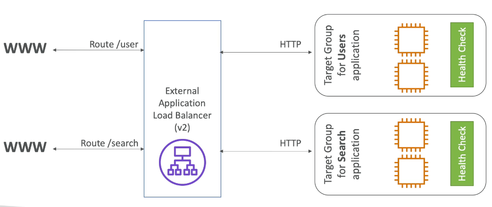

# Elastic Load Balancer

## Applicaion Load Balancer

- 7계층에서 동작하는 로드 밸런서이다.
- 여러개의 HTTP 어플리케이션 서버를 분산 접속 가능하게 한다. (타겟 그룹 이용)
- 동일 서버 상의 여러개의 어플리케이션에 분산 접속 가능하게 한다. (컨테이너 분산)
- HTTP/2를 지원하며 웹 소켓을 지원한다.
- 주소 재지정을 지원한다. (ex. HTTP트래픽을 HTTPS로 변환)
- 주소 기반 접속을 지원한다. (example.com/users, example.com/posts)를 다른 타겟 그룹으로 접속
- 호스트 기반 접속을 지원한다. (host1.example.com, host2.example.com)을 다른 타겟 그룹으로 접속
- 쿼리스트링 또는 헤어 기반 접속을 지원한다. example.com/users?id=123&order=false 등

## 클래식 로드 밸런서의 단점

- EKS컨테이너와 호환되지 않는다
- 하나의 인스턴스에 여러개의 포트를 지원하지 않는다
- 웹소켓을 지원하지 않는다
- \*\*기반 접속을 지원하지 않는다.

## 어플리케이션 로드 밸런서의 도식도

- 다양한 마이크로 서비스를 하나의 로드 밸런서로 커버 가능하다. (URL기반 라우팅)

## 로드 밸런서에 대해 알아두면 좋은 것들

- 로드 밸런서를 사용할때는 EC2 웹서비스에서 클라이언트의 IP를 직접적으로 알 수는 없다.
- 그래서 직접적으로 IP를 구하게 되면 로드 밸런서의 아이피정보가 출력되게 된다.
- 단, 로드밸런서가 IP와 포트를 알고 있기 때문에, 헤더정보에 클라이언트의 IP, 포트정보를 담아주게 된다.
  - X-Forwarded-For (IP주소)
  - X-Forwarded-Port or X-Forwarded-Proto (PORT번호)

## ELB 추가정보

로드 밸런서를 모니터링 하는 방법은 기본적으로 클라우드워치 지표를 통해서 관리한다.

- BackendConnectionErrors
- HealthyHostCount / UnHealthyHostCount
- HTTPCode_Backend_2XX
- HTTPCode_Backend_3XX
- HTTPCode_ELB_4XX
- HTTPCode_ELB_5XX
- Latency
- RequestCount
- SurgeQueueLength：정상적인 인스턴으로 가기전 대기하고 있는 요청의 숫자로, 1024가 최대치이다.
- SpilloverCount：서지 큐가 1024를 넘어갈 경우 그 이후에는 spillover가 발생하는데, 이는 요청이 실패하게 되며 카운팅된다.

## 로그밸런서 로깅 (엑세스 로그)

- 로드밸런서의 엑세스 로그는 s3에 저장되며 미리 암호화된 상태로 들어간다.
  - Time
  - Client IP Address
  - Latencies
  - Request paths
  - Server reponse
  - Trace id
- s3저장용량에 대한 지불만 하면 된다.
- 컴플라이언스용 저장으로 유용하다.
- EC2등의 인스턴스가 종료되어도 기존 로그등을 분석 가능하기 때문에 유용하다.

## ELB 프리 워밍 (pre warming)

ELB는 기본적으로 점진적인 스케일업 기능으로 동작한다.

이는 순간폭증하는 트래픽에 대응이 어렵다는 뜻이므로, 이를 해결하기 위해서는 AWS측에 사전 스케일업을 요청해야 한다.

이를 프리 워밍이라고 부르며, AWS측에 요청할때 필요한 정보로는 다음과 같은 것들이 있다.

- 트래픽 증가는 얼마나 지속되는지
- 초당 얼마나 많은 요청이 들어오는지
- 요청당 어느정도의 kb 용량이 필요한지
