# Lambda

- 서버리스 프레임워크

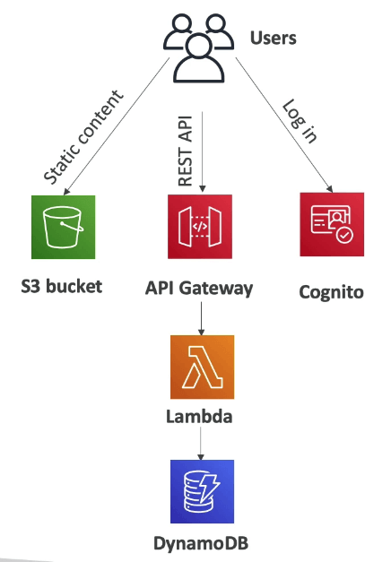

## 왜 람다를 사용하는가?

- EC2의 특성으로
  - 클라우드상 가상 서버
  - 램과 CPU가 제한되어 있음
  - 계속해서 실행됨
  - 스케일링은 서버를 추가하거나 삭제하는것을 의미함
- 람다는
  - 가상 펑션 - 서버를 제어할 필요가 없음
  - 시간에 의해 제한됨 - 짧은 실행시간 (~15m)
  - 필요한 타이밍에 실행
  - 스케일링이 자동으로 실행됨

## 람다의 이점

- 쉬운 요금제
  - 사용한 컴퓨터 시간만큼 지불
  - 프리티어에서 백만 요청과 40만 기가바이트의 실행시간을 제공
- 모든 AWS 서비스와 통합 가능
- 다양한 프로그래밍 언어를 사용 가능
- AWS 클라우드워치를 통한 모니터링
- 펑션 당 리소스를 증가시키는것이 간단함 (10기가 램까지 증가 가능)
- 램을 증가시키면 CPU와 네트워크의 사용량또한 증가한다

## 람다에서 제공하는 언어

- 자바스크립트
- 파이썬
- 자바
- C#
- 고랭
- C# 파워쉘
- 루비
- 커스텀 런타임 API를 이용한 다른 언어들 (러스트 등)
- 람다컨테이너이미지
  - 람다 런타임 API를 사용한 컨테이너 이미지
  - ECS 파이게이트 등을 통한 도커 컨테이너 이미지등을 통해 실행

## 람다와 통합된 기존 AWS서비스

- API 게이트웨이
- 키네시스
- 다이나모디비
- S3
- 클라우드프론트
- 클라우드 이벤트 브리지
- 클라우드 워치 로그
- SNS
- SQS
- Cognito

## 예: 서버리스 썸네일 생성

- 새로운 이미지가 S3로 업로드 됨
- 업로드를 트리거로 람다펑션 (썸네일 생선)이 실행됨
  - 썸네일을 S3에 저장
  - 동시에 메타데이터를 다이나모DB에 저장

## 예: 서버리스 크론 작업

- 클라우드워치 이벤트 룰 혹은 이벤트브리지를 이용해서 1시간단위로 트리거
- 람다를 실행해서 작업을 처리

## 람다의 요금제

- 첫번째 100만 리퀘스트는 무료
- 그 이후에는 100만당 0.2달러
- 실행시간에 따른 과금
  - 40만 GB 세컨드는 무료
  - 이는 1GB램 할당을 40만초 실행한것과 같음
  - 그 이후에는 60만 기가 세컨드당 $0.6

## 람다 동기화 메소드 호출

- 동기화 : CLI SDK API게이트웨이 ALB
  - 결과가 바로 돌아옴
  - 클라이언트 측에서 에러 핸들링이 반드시 있어야 함 (재시도, 지수화 백오프 등등)
    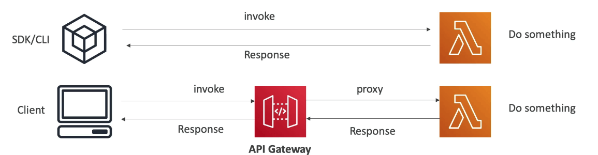
- 유저 인보킹
  - ELB (ALB)
  - API Gateway
  - Amazon CloudFront
  - Amazon S3 Batch
- 서비스 인보크
  - Amazon Cognito
  - 스텝 펑션
- 다른 서비스들
  - 렉스
  - 알렉사
  - 키네시스 데이터 파이어호스

## 람다와 ALB

- 람다 펑션을 HTTPS 엔드포인트에 노출시키고 싶을때
- ALB 혹은 API 게이트웨이를 이용
- 람다 펑션은 타겟그룹으로 지정이 가능함

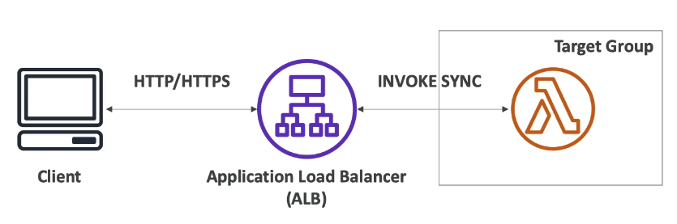

## ALB에서 멀티 헤더 값을 설정하는 방법

- ALB는 멀티 헤더 값을 지원한다. (ALB 셋팅으로)
- 멀티 헤더 밸류를 활성화 하면, HTTP헤더에 동일한 키의 패러미터에 값이 다르게 들어올 경우에 이를 자동으로 어레이화해서 전달해준다.

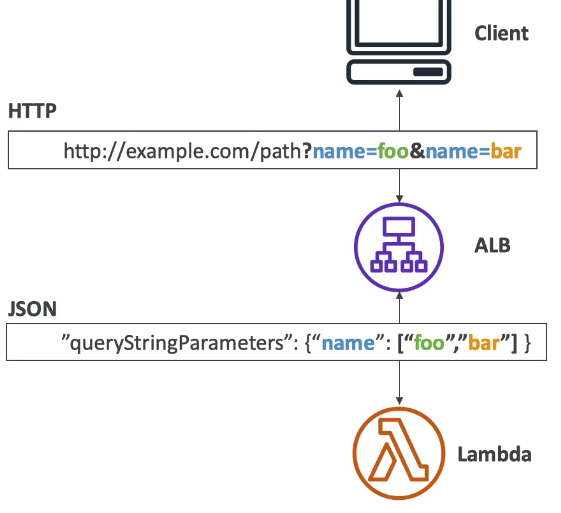

## 람다@엣지

- 람다에서 활용할수 있는 요청과 응답은 총 4가지가 있다.
  - 클라우드프론트가 뷰어의 요청을 받았을때 (뷰어 리퀘스트)
  - 클라우드프론트가 요청을 오리진으로 전달할때 (오리진 리퀘스트)
  - 클라우드프론트가 오리진으로부터 응답을 받았을때 (오리진 리스폰스)
  - 클라우드프론트가 응답을 뷰어로 전달할때 (뷰어 리스폰스)
    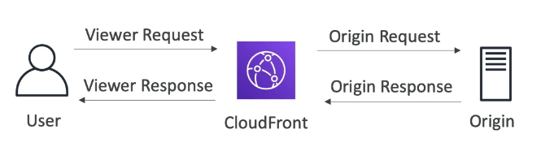
- 오리진으로 요청을 보내지 않고 뷰어에게 응답을 줄 수 있다.
- 람다를 엣지로케이션에 배포하는 이유는
  - 웹사이트의 보안 및 프라이버시
  - 엣지로케이션에서 다이나믹 웹 어플리케이션을 제공
  - SEO 최적화
  - 지능적으로 오리진과 데이터센터에 접근하기 위해
  - 봇 컨트롤
  - 실시간 이미지 전송
  - AB테스팅
  - 유저 인증과 승인
  - 기타 등등 유저 추적 분석 등

## 람다 - 비동기기식 메소드 호출

- S3, SNS, 클라우드워치 이벤트 등
- 이벤트 들은 이벤트큐에 위치한다
- 람다는 에러가 발생시 재시도 한다
  - 3번까지
  - 첫번째 실패 후 1분 후, 그 다음 2분 후
- 작업은 멱등성을 지녀야 한다 (재시도시에 동일한 결과가 계속해서 나오는것 → 문제가 있음)
- 만약 펑션이 재시도 될 경우에는 같은 로그가 반복해서 클라우드워치에 기록된다.
- 이럴 경우에는 실패한 작업에 대해서 데드 레터 큐를 작성한다 (SNS or SQS를 이용) IAM 허용 정책이 필요
- 비동기식 메소드 호출은 결과를 기다릴 필요가 없기 때문에 보다 빠른 처리를 보장한다. (결과를 기다리지 않고 바로 다음 루틴으로 넘어갈수 있음)

## 어떤 서비스가 비동기식 메소드를 지원하는가

- S3
- SNS
- 이벤트 브릿지
- 코드 커밋 (코드 커밋 트리거: 새로운 브랜치를 작성, 새로운 택깅, 새로운 푸시 이벤트)
- 코드 파이프라인 (코드 파이프라인의 중간에 람다 펑션을 실행, 람다는 반드시 콜백을 넣어야 함)
- 클라우드워치 로그 (로그 작업)
- SES
- 클라우드포메이션
- AWS 컨픽
- IoT
- IoT이벤트

## S3 이벤트 알림

- S3:ObjectCreated, S3:ObjectRemoved,
- S3:ObjectRestore, S3:Replication...
- 오브젝트 이름으로 필터링 가능 (\*.jpg)
- 유스케이스: 썸네일 자동 생성 등
- S3이벤트 알림은 일반적으로 초단위 알림이지만 경우에 따라 몇분까지 길어질 수 있다
- 두번의 쓰기가 동시에 호출될 경우 알림이 한번만 올 수도 있다
- 만약 해당 경우에도 정확한 알림을 받고 싶다면 버킷 버저닝을 활성화 하면 된다

## 람다 이벤트 소스 맵핑

- 키네시스 데이터 스트림
- SQS SQS FIFO
- 다이나모디비 스트림
- 공통 분모 : 레코드가 폴링되어야 하는 서비스들
- 람다 펑션은 동기식으로 호출된다

## 스트림과 람다 (키네시스 & 다이나모디비)

- 이벤트 소스 맵핑은 각각의 샤드에 대한 이터레이터 (포인터) 를 만들고 아이템을 순서에 따라 처리한다
- 새로운 아이템부터 시작해서 순서에 따라 혹은 시간에 따라 처리한다
- 처리된 아이템은 스트림으로부터 없어지지 않는다 (다른 소비자들도 읽을 수 있다)
- 낮은 트래픽에서 : 처리 전 레코드를 쌓아둔다
- 병렬처리를 위해 여러개의 처리기를 둘 수 있음
  - 샤드당 10개의 배치 허용
  - 파티션키별 순서를 보장받음

## 스트림에서 에러 처리하는 방법

- 기본적으로 펑션이 에러를 발생시키면 성공할때까지 혹은 배치 아이템이 만료될때까지 전체 배치가 재처리된다

## 람다와 큐

- 렉쳐로 복습합시다

## 람다 데스티네이션

- 비동기식 호출에 대해서, 결과값 (성공, 실패) 을 특정 목적지로 전송하는 기능
  - SQS
  - SNS
  - 또 다른 람다
  - 이벤트브릿지 버스
- DLQ대신에 데스티네이션을 사용할것을 권고
- 이벤트 소스 맵핑 : 실패한 비동기식 호출에 대한 데스티네이션
  - SQS (큐, 추후 처리)
  - SNS (알림)
- SQS에서 DLQ로 직접 메시지를 보낼 수도 있음

## 람다 IAM 롤

- 람다함수에게 권한을 주기 위함
- 샘플 관리형 권한
  - AWSLambdaBasicExecutionRole: 클라우드워치에 로그를 업로드
  - AWSLambdaKinesisExecutionRole: 키네시스로부터 데이터를 읽기
  - AWSLambdaDynamoDBExecutionRole: 다이나모디비 스트림으로부터 데이터 읽기
  - AWSLambdaSQSQueueExecutionRole: SQS로부터 데이터 읽기
  - AWSLambdaVPCAccessExecutionRole: VPC에 람다 펑션을 배포
  - AWSXRayDaemonWriteAccess: XRay에 데이터를 업로드 가능
- 이벤트 소스 맵핑을 이용해서 펑션을 실행할때는 람다는 이벤트 데이터를 읽기 위해 실행역할을 필요로 한다
- 모범 사례 : 하나의 람다 펑션당 하나의 역할을 붙여주기

## 람다 리소스 기반 정책

- 다른 AWS 서비스나 계정에서 람다함수를 실행할때는 리소스 기반 정책을 사용해야 한다
- S3 버킷 정책과 비슷하다
- IAM 원칙이 람다에 엑세스 할 수 있는 principal로는
  - IAM 정책이 허용되어 있을때 (user access 등)
  - 리소스 기반 정책으로 허용될때 (service access)
- S3와 같은 다른 AWS 서비스가 람다를 실행하기 위해서는 리소스 기반의 정책을 설정해야 한다

## 람다의 환경 변수

- 환경 변수: 키 밸류 페어로 이루어진 문자열
- 코드를 업데이트 하지 않고 함수의 패턴을 변경할 수 있음
- 환경 변수는 코드에서 사용 가능함
- 람다 서비스는 고유 시스템 환경 변수 또한 추가되어 있음
- 암호화 저장이 가능하기 때문에 필요에 의해 유용하게 사용 가능
- 시크릿은 람다 서비스 키 또는 CMK로 암호화 가능

```jsx
import os
os.getenv("변수명")
```

## 람다 로깅 & 모니터링

- 클라우드워치 로그
  - AWS 람다 실행 로그들은 클라우드워치 로그에 저장된다
  - 람다 함수가 기본 실행 역할을 가지고 있어서, 클라우드워치에 로그를 남길 수 있는 권한이 있어야 한다
- 클라우드워치 지표
  - 람다의 지표들은 클라우드워치 지표상에서 확인이 가능하다
  - 호출, 지속시간, 동시 실행
  - 에러 수, 성공률, 쓰로틀
  - 비동기 실패수
  - iterator age (키네시스 & DynamoDB 스트림)

## 람다 트레이싱 XRay

- 람다 설정에서 활성화 할 수 있음 (Active Tracing)
- 엑스레이 데몬이 활성화됨
- 그 후에는 XRay SDK를 이용해 코드상에 구현하면 됨
- 람다 함수가 적절한 실행 역할을 가지고 있는지 확인할것
  - 관리형 정책 AWSXRayDaemonWriteAcces가 존재하므로 이걸 붙이면 됨
- 엑스레이와 커뮤니케이션을 위해 몇가지 환경 변수가 존재한다
  - _\*X_\*AMZN_TRACE_ID : 트레이싱 헤더를 포함
  - AWS_XRAY_CONTEXT_MISSING : 기본적으로 LOG_ERROR
  - AWS_XRAY_DAEMON_ADDRESS : 엑스레이 데몬의 아이피주소:포트

## 람다 기본

- 기본적으로 람다 함수는 AWS 고유의 VPC에 배포되므로 내가 소유한 VPC에서 운영하는것이 아니다
- 이로 인해 프라이빗 서브넷등에 배포된 고유 AWS 서비스에 접근하지 못하는 문제점이 있다 (RDS, ElastiCache, Internal ELB 등등)
- 이를 위해서는 VPC ID를 지정해서 서브넷과 SG를 설정해야 한다.
  - 람다는 ENI를 서브넷에 만들어 그것을 통해서 소통한다
- AWSLambdaVPCAccessExecution 실행역할이 필요함
- 람다를 VPC에 배포한다고 해서 인터넷이 되는것은 아니다.
  - 심지어 람다를 퍼블릭 서브넷에 배포하더라도, 퍼블릭 아이피를 부여받지 못하기 때문에 인터넷에 접속할 수는 없다.
  - 이를 해결하기 위해서는 람다를 프라이빗 서브넷에 배포하되, NAT 게이트웨이를 이용하는 라우팅을 설정해서 인터넷에 접속 가능하다
    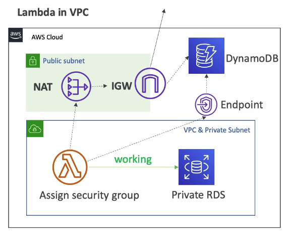

## 람다 함수 설정

- 램
  - 128MB에서 10,240MB를 64MB씩 증가하는 수치로 설정 가능
  - 램을 많이 할당할수록, vCPU 크레딧 또한 많이 얻을 수 있다
  - 1,792MB를 할당하면 vCPU를 최대로 할당받음
  - 1,792MB보다 더 많이 할당하면 CPU를 복수로 할당받게 되므로 멀티 쓰레딩을 이용할 수 있다.
- 그렇기 때문에 CPU 바운드가 발생할 경우에는 역으로 램을 늘려라
- 타임아웃: 기본은 3초이지만 최대 15분까지 늘릴 수 있음 (900초)

## 람다 실행 컨텍스트

- 람다의 실행 컨텍스트는 실행되는 람다 코드가 의존하는 것들 (DB커넥션, HTTP Client 등등)을 임시로 실행하는 환경을 말한다.
- 람다는 초기화, 호출 및 실행, 종료처리의 단계가 있는데 이 중 호출 및 실행은 중복이 가능한 구조이다.
- 따라서 람다가 중복 실행시 공유해야할 변수나 함수가 있다면 초기코드에 정의하는것이 효율적이다.
- 초기코드를 위한 메모리는 /tmp 디렉토리에 512MB가 제공된다.

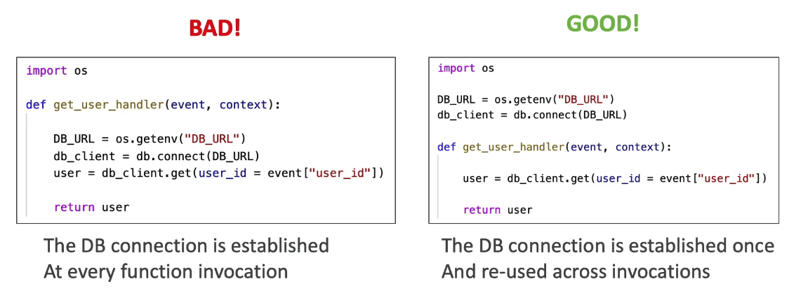

## 람다 동시실행

- 람다는 1000개의 동시실행이 가능하다.
- 예약된 동시 실행수를 함수별로 설정할 수 있으며 이는 해당 함수의 제한 숫자가 된다.
- 설정된 동시 실행수를 넘는 요청이 들어오면 쓰로틀을 발생시킨다.
- 쓰로틀은
  - 동기 호출에서는 쓰로틀 에러 429 발생
  - 비동기 호출에서는 자동적으로 재시도 후 DLQ로 이동
- 더 높은 제한 숫자를 설정하려면 티켓으로 요청해야 한다
- 람다의 동시실행성 제한숫자는 전체 람다 함수에 대한 부분이기 때문에, 몰리는 경우 다른 어플리케이션이 영향을 받을 수 있다.
- 비동기식 람다에서는 쓰로틀이 발생하면 최대 6시간까지 재시도를 하면서 기다린다.
- 재시도시에는 1초에서 최대 5분까지 지수 백오프를 이용한다.

## 콜드 스타드 프리비전 동시실행

- 콜드스타트
  - 새로운 인스턴스일 경우 코드가 로딩되는데 시간이 걸림 (이니셜 코드 런)
  - 이는 첫번째 실행에 한해서는 대단히 느린 로딩시간을 가지게 됨
- 동시실행성을 보장하기 위해서는 프로비전을 예약해야 하는데
  - 이는 람다 설정에서 concurrency를 보면 된다

## 람다 함수 종속성

- 외부 라이브러리를 참조하는 람다 함수의 경우에는 (데이터베이스 클라이언트, XRay SDK, 기타 등등)
- 코드와 같이 종속성 패키지를 같이 압축해야 한다
  - node js에서는 npm과 node_module 디렉토리를 같이
  - 파이썬에서는 pip과 —target 옵션을 함께
  - 자바에서는 jar 파일들을 같이
- zip파일을 직접 업로드할 수도 있고 (50MB이하일 경우) S3에 업로드 하고 나서 참조할 수도 있다
- 네이티브 라이브러리는 아마존 리눅스에서 컴파일 하면 사용 할 수 있다
- AWS SDK는 모든 람다 함수에서 기본적으로 사용할 수 있다.

## 람다와 클라우드포메이션

- 람다를 직접 클라우드포메이션에 정의할수 있음
  - 인라인 펑션은 매우 심플하다
  - Code.ZipFile 형식
  - 다만 함수 종속성 파일들은 인라인에 표현할 수 없음
- S3를 통해서 업로드 하기
  - 람다 zip파일을 s3에 저장
  - 클라우드포메이션에서 해당 경로를 지정
    - S3Bucket
    - S3Key: zip파일이 있는 전체 경로
    - S3ObjectVersion: 버저닝된 버킷이라면
  - S3에 업데이트 된 코드를 업로드 하고 S3Bucket이나 S3Key 혹은 S3ObjectVersion을 업데이트 하지 않으면 클라우드포메이션은 함수를 업데이트 하지 않을것

## 복수 계정에서 사용하는 방법

- S3버킷을 두고 있는 계정의 버킷 정책으로 다른 계정의 역할을 허용
- Account2에 있는 클라우드포메이션에 실행 역할이 있고 역할에 권한을 부여해서 버킷의 리스팅, 오브젝트 읽기 권한을 부여

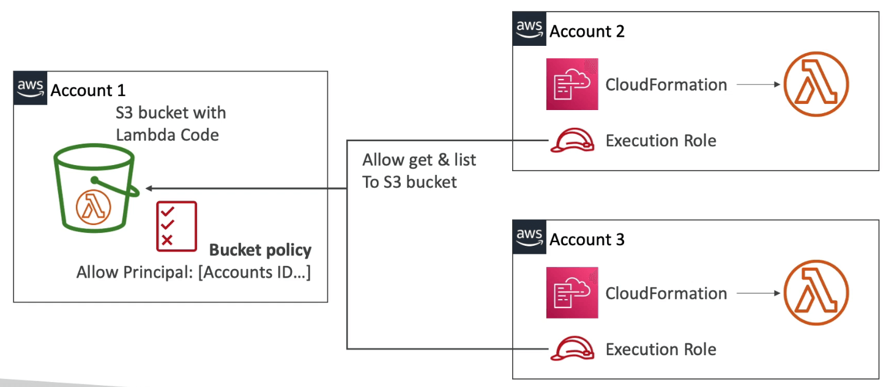

## 람다 레이어

- 커스텀 런타임
  - C++
  - Rust
- 외부화 종속성을 실현해서 재사용
- 뭔말인고 하니
  - 실제로 동작하는 코드의 크기는 매우 작고, 거기에 필요한 정적 파일들이 많다면
  - 정적 파일들을 하나의 레이어로 묶어서 코드는 빠르게 업로드, 실행하고
  - 참조되는 것들은 레이어를 두고 거기서 참조할 수 있고
  - 다른 함수들도 사용할수 있도록 하는 방법
    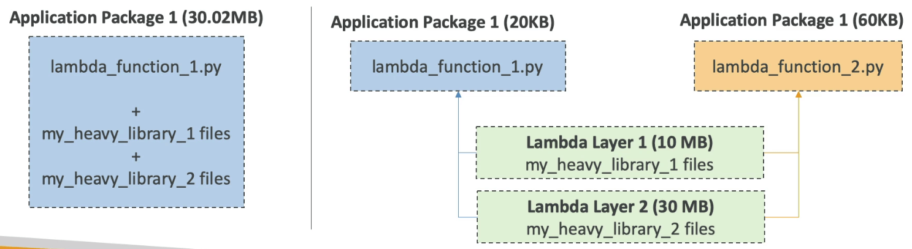

## 람다 이미지 컨테이너

- ECR로부터 10GB까지 람다 함수를 컨테이너 이미지로 배포 가능
- 컨테이너에 복잡한 종속성 패키지나 용량이 큰 것들을 패킹할 수 있음
- 기본 이미지는 파이썬, 노드js, 자바, 닷넷, 고, 루비 등을 이용할 수 있다
- 람다 런타임 API를 이용하면, 자신만의 이미지도 만들 수 있다
- 람다 런타임 인터페이스 에뮬레이터를 이용하면 로컬 환경에서 컨테이너를 테스트 해 볼수 있다
- 앱을 빌드하기 위한 통합 워크플로우를 지원한다

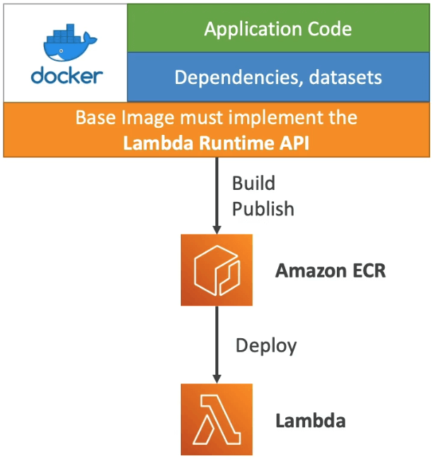

## 람다 컨테이너 이미지의 샘플

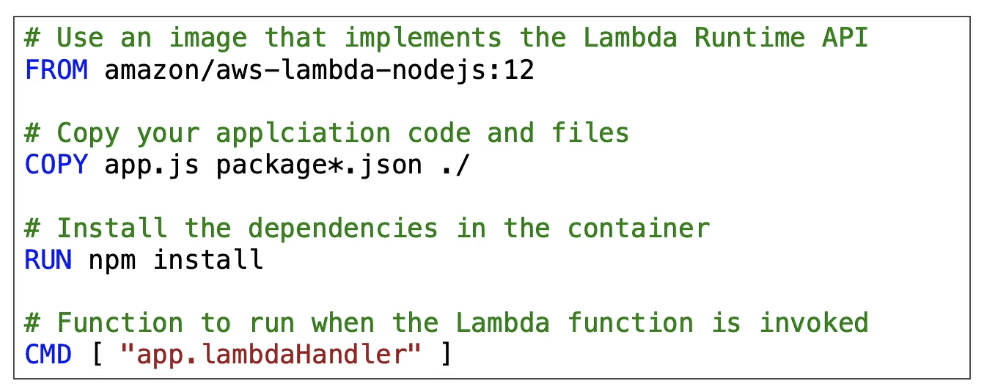

## AWS 람다 버전

- 람다 함수로 작업을 진행할때는 $LATEST 버전으로 작업하게 된다
- 람다 함수를 배포할 준비가 되면, 버전을 만들게 된다
- 버전은 변경 불가능하다 (해당 버전이 일단 배포되게 되면, 그 이후에 소스코드 수정등은 불가능함)
- 버전은 숫자로서 배포할때마다 1씩 증가한다
- 람다 버전은 각각 고유한 ARN을 부여받는다 (Amazon Resource Name)
- 버전 = 코드 + 환경설정 (어떤것도 변경할 수 없다)
- 각각의 버전에 접근 가능하다

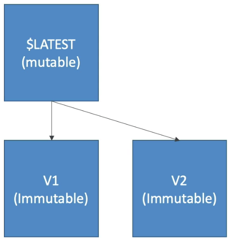

## AWS 람다 별칭

- 별칭은 람다 함수 버전에 대한 포인터로서 동작한다
- dev, test, prod같은 별칭을 만들고 각각 다른 람다 버전을 가리키도록 할 수 있다
- 별칭은 변경 가능하다
- 별칭은 블루그린 배포 전략에 하나로서, 각각 다른 람다 함수로의 가중치 분산이 가능하다
- 이것을 이용하면 유저 사이드에서 고정된 별칭을 이용하여 안정적으로 이벤트 트리거링이 가능하다 (내부에서는 어떤 함수를 가리키던 자유이고 유저 입장에서는 하나의 고정된 소스로 접근하기 때문)
- 별칭은 각각 고유한 ARN을 부여받는다
- **별칭은 다른 별칭을 가리킬 수 없다**

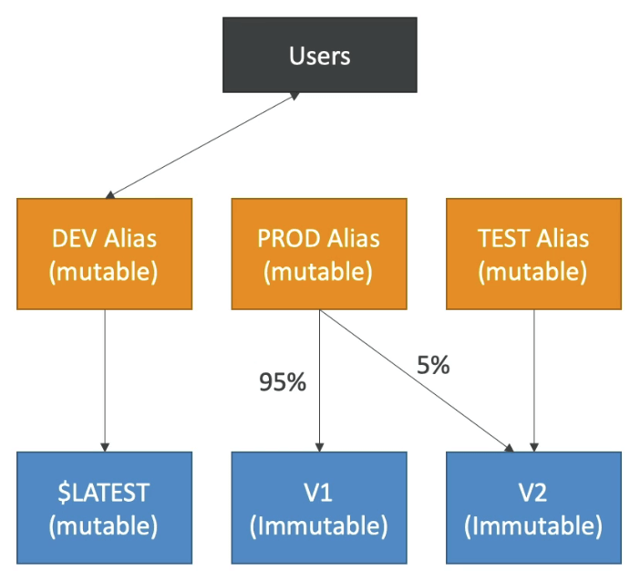

## 람다 & 코드 디플로이

- 코드 디플로이는 람다 별칭의 포인터를 자동으로 이동시켜주는 기능을 가지고 있음
- SAM 프레임워크에 이 기능이 통합되어 있다

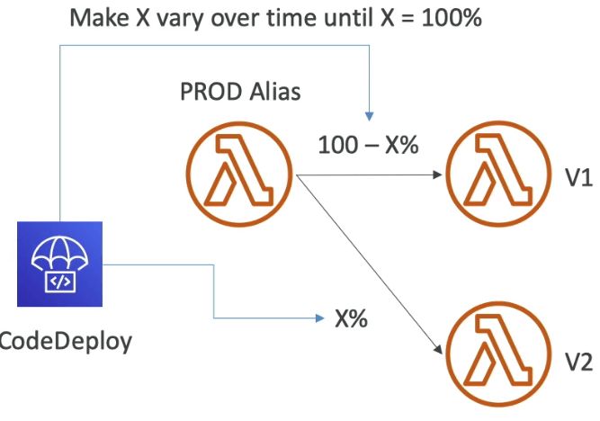

- 3가지 옵션에 대해서
  - Linear : 매 X 분마다 트래픽을 증가시킨다
    - 리니어 10% 매 3분마다
    - 리니어 10% 매 10분마다
  - 캐너리 : 먼저 X%를 테스트해 본 뒤 100%로 이동
    - 캐너리 10% 5분
    - 캐너리 10% 30분
  - 한번에 전부 이동
- pre post 트래픽 훅을 만들어서 람다 함수의 헬스체크 가능, 실패시 롤백 또한 가능

## 람다 제한 (리전당 제한)

- 실행
  - 메모리 제한 : 128MB ~ 10240MB (64MB씩 증가)
  - 최대 연속 실행시간 : 900초 (15분)
  - 환경변수 (4kb)
  - 함수 컨테이너의 디스크 용량 (in /tmp) : 512MB
  - 동시 실행수: 1000 (티켓으로 증가시킬 수 있음)
- 배포
  - 람다함수의 배포 용량 (압축 후): 50MB
  - 압축되지 않은 배포 (코드 + 종속성): 250MB
  - 다른 파일들을 로딩하기 위한 공간으로는 /tmp 가 제공됨
  - 환경변수의 총 사이즈 4KB

## 람다의 모범 사례

- 많은 로드가 들어가는 작업은 함수의 핸들러 밖에서 실행할것
  - 데이터베이스 접속은 핸들러 밖에서
  - AWS SDK의 초기화 작업은 핸들러 밖에서
  - 종속성 관련 초기화나 데이터셋 관련 작업은 핸들러 밖에서
- 환경 변수를 적절하게 잘 사용하자
  - 데이터베이스 커넥션 스트링, s3 버킷이름 기타 등등은 하드 코딩하지 말고 환경변수를 쓰자
  - 비밀번호같은 민감함 정보는 KMS를 이용해서 암호화 시키도록 하자
- 배포 패키지 사이즈를 최소화 하고 런타임에는 필요한 코드만 기재한다
  - 함수를 최대한 나눌수 있다면 나누자
  - 람다의 리전별 제한사항을 항상 기억하자
  - 람다 레이어를 이용해서 코드의 중복, 종속성의 중복을 제거하자
- 재귀적 함수호출은 람다에서는 치명적일 수 있다. 자신을 다시 부르는 것은 지양하자 (비용이 과도해질수 있음)
