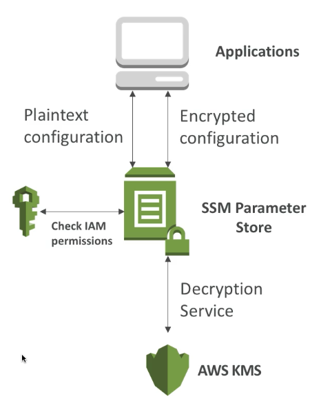
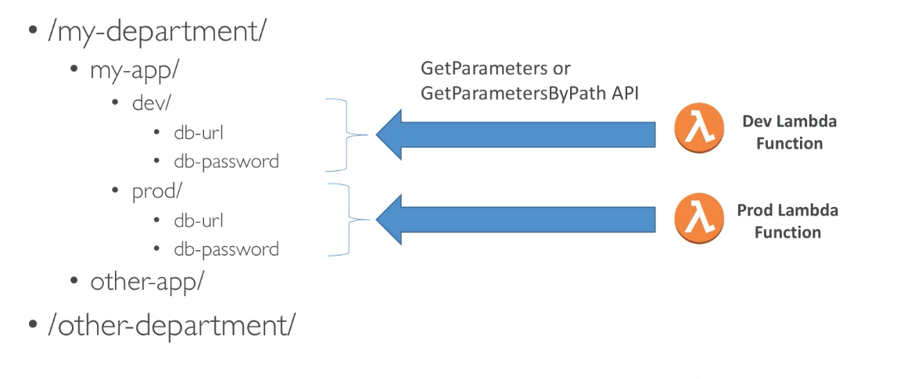

# Parameter Store

- 각종 설정파일과 시크릿 키를 안전하게 저장할 수 있다.
- 설정파일은 다양한 어플리케이션에서 값이 아닌 변수명 참조로 이용이 가능하다.

1. EC2 Run Command
2. Lambda
3. RDS
4. CLI
5. 로컬 컴퓨터 등등

- KMS 연동을 이용한 암호화를 지원한다.
- 값의 버전 컨트롤 기능을 지원한다.
- AWS CloudWatch Events와 연동하여 알람을 보내줄 수 있다.
- CloudFormation과의 연동을 지원한다. (!Ref 를 이용한 참조)

## Parameter Store의 도식도



- 평문을 요청했을 경우에는 IAM 권한에서 PameterStore의 읽기 권한을 확인한다.
- 암호문을 요청하면 IAM 권한에서 ParameterStore의 권한을 확인해서 KMS에서 복호화 해서 전달해준다.

## Parameter Store의 계층적 구조



```jsx
/* 변수명으로 불러오기 */
aws ssm get-parameters --name /my-department/my-app/dev/db-url /my-department/my-app/dev/db-password
aws ssm get-parameters --name /my-department/my-app/dev/db-url /my-department/my-app/dev/db-password --with-decryption
// 복호화 명령을 하면 해당 매개변수가 참조하고 있는 KMS 키에 대한 권한까지 확인한뒤, 적절한 권한이 있는 경우에는 복호화 된 결과값을 가져다줌

/* 계층적 구조로 가져오기 */
aws ssm get-parameters-by-path --path /my-department/my-app/dev/ --recursive // 전부 가져오기
```
