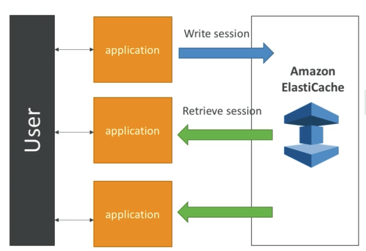

# RDS 101

## 암호화

- PostgreSQL : rds.force_ssl = 1
- MySQL = Grant Usage On _._ to 'mysqluser'@'%' REQUIRE SSL;

## RDS MultiAZ

- 멀티AZ는 읽기부하에 대비하기 위한 것이 아니다.
- failover는 다음과 같은 상황에 일어난다.
  - primary db 인스턴스가 실패했을때
  - AZ에 문제가 생겼을때
  - instance type이 변경되었을때
  - db instance의 os 혹은 소프트웨어가 패치되었을때
  - reboot시에 강제로 failover를 체크했을때
- 슬로우쿼리나 데드락, 데이터베이스 커럽션 에러등은 failover를 발생시키지 않는다
- endpoint는 항상 같다
- 멀티AZ는 다음과 같은 추가적인 이점이 있다
  - maintenance 영향을 최소화 한다. (스탠바이부터 패치)
  - backup의 영향을 최소화 한다. (스탠바이에서 백업한다)
- multi az는 리전에 종속적이기 때문에 리전규모의 장애가 발생할경우 영향을 피할 수는 없다.

## RDS Read Replicas

- Read Replica로의 복제는 async복제이다. (언젠간 되겠지만 언제인지는 모름. 하지만 기본적으로는 곧)
- RR은 읽기 트래픽을 분산한다
- RR은 스탠드얼론 마스터로 승격 가능하다 (수동)
- RR은 같은 AZ AZ간 이동, 리전간 이동도 가능하다
- 각각의 RR은 고유한 DNS 엔드포인트를 가진다
- RR의 RR을 만들수 있다
- RR은 MULTI-AZ화 할수있다
- RR은 DR(disaster Recovery)로서 다른 리전 RR을 둘 수 있다
- 오라클을 서포트 하지 않음
- RR은 BI 혹은 분석 리포트로서 활용될 수 있다. (메인서버에 영향 없이)

## DB Parameter Group

- DB엔진을 위한 패러미터 그룹을 만들 수 있다
- 다이나믹 패러미터는 바로 적용 가능하며
- 스태틱 패러미터는 리부트 전에는 적용되지 않는다
- 또한 DB에 적용된 패러미터 그룹 자체를 변경 가능하며 리붓 후에 적용된다
- 반드시 알아야 하는 패러미터가 존재하며, SSL을 강제하는 패러미터이다
  - PostgreSQL → rds.force_ssl=1
  - MySQL / MariaDB → GRANT SELECT ON mydatabase.\* TO 'myuser'@'%' IDENTIFIED BY '...' REQUIRE SSL;

## RDS Backup vs Snapshot

- 백업
  - 백업은 지속적인 백업이며, 원하는 시간 어느때든 복구가 가능하다
  - 백업은 유지보수 윈도우에서 진행된다
  - DB 인스턴스를 삭제하면 자동 백업을 남길수는 있으나
  - 백업은 0~35일간의 시간지정이 있기 때문에 자연스럽게 소실된다
- 스냅샷
  - 스냅샷은 IO 작업을 소진하기 때문에 퍼포먼스에 영향이 있다
  - MultiAZ를 사용할 경우 스탠바이에서 스냅샷을 뜨기 때문에 메인 서버에 영향이 없다
  - 스냅샷은 처음에는 전체를 복사하지만, 그 이후에는 증분형식이다
  - 스냅샷은 복사하거나 공유할 수 있다
  - 수동으로 스냅샷을 복사하면 만료되지 않는다
  - DB를 삭제할때 최후본을 스냅샷으로 남겨놓을 수 있다

## RDS 보안

- 저장된 데이터의 암호화에 대해서
  - DB인스턴스를 최초 작성할때 한해서 설정이 가능하므로, 비암호화를 선택했을 경우에 나중에 옵션으로 추가할수는 없다
  - 대신, 암호화 되지 않은 스냅샷을 작성한 뒤, 스냅샷을 암호화 된 상태로 복사하고, 암호화된 스냅샷으로부터 데이터베이스를 작성해서 암호화를 달성 할 수 있다.
- RDS 유지관리 책임에 대해서
  - 포트, IP, 보안 그룹등을 적절하게 설정할 것
  - DB내 유저, 암호, 권한등을 적절하게 설정할 것
  - 퍼블릭 엑세스 허용여부를 적절하게 설정할 것
  - 패러미터 그룹, DB설정 및 SSL 강제 여부 등 DB설정을 관리할 것
- AWS측의 책임에 대해서
  - SSH가 허용되지 않음
  - DB 소프트웨어를 적절하게 패치할것
  - OS를 적절하게 패치할것
  - RDS가 운용되는 인스턴스에 대한 감사 및 시스템 체크를 적절하게 수행할 것

## RDS API

- DescribeDBInstance API
  - 전체 DB 인스턴스를 리스팅화 함 (RR 포함)
  - DB의 버전도 확인 가능
  - aws rds describe-db-instances
    - DB엔진
    - 보안그룹
    - 패러미터그룹
    - 멀티AZ여부
    - RR아이텐디파이어
    - 엔진버전
    - 기타 등등
- CreateDBSnapshot API - DB 스냅샷 만들기
- DescribeEvents API - DB인스턴스와 관련된 이벤트들
- RebootDBInstance API - 강제 failover 리부팅에 대한 것들

## RDS 클라우드워치 연동 (지표들)

- 클라우드워치는 다음의 지표들과 연동된다 (일반적인 것들, 하이퍼바이저를 통해 얻을 수 있는 지표들임)
  - DatabaseConnections
  - SwapUsage
  - ReadIOPS / WriteIOPS
  - ReadLatency / WriteLatency
  - ReadThroughput / WriteThrouPut
  - DiskQueueDepth
  - FreeStorageSpace
- Enhanced Monitoring (DB인스턴스에 설치된 에이전트로부터 직접 취득됨)
  - 다른 유저들의 mysqld를 모니터링 할 수 있음 (현재 인스턴스에 다른 어떤 영향이 있는지 조사 가능)
  - CPU 메모리 파일시스템 disk IO 메트릭등 새로운 50가지 지표들에 접근 가능

## RDS 퍼포먼스 인사이트

- 현재 데이터베이스에 미치고 있는 영향들을 시각화하는 툴
- 다음과 같은 퍼포먼스 정보를 얻을 수 있다
  - By Waits → 어떤 작업이 병목을 발생시키고 있는지
  - By Sql statements → 어떤 SQL구문이 문제를 발생시키는지
  - by Hosts → 어떤 호스트의 작업이 문제가 있는지
  - By Users → 어떤 유저가 작업한 것들에 문제가 있는지

## Amazon Aurora

- 3AZ에 6개의 데이터 카피가 존재한다
  - 4 of 6 카피가 writes 기능에 필요
  - 3 of 6 카피가 reads 기능에 필요
  - peer-to-peer 레플리케이션을 통해 자동 힐링
  - 스토리지는 100개가 넘는 볼륨의 스트라이프로 이루어져 있음
- 1 오로라 인스턴스가 마스터가 된다
- 30초안에 마스터 교체가 이루어진다
- 마스터와 15개의 RR로 구성할 수 있다
- 크로스 리전 레플리케이션을 지원한다

## 오로라 DB 클러스터

- 라이터 엔드포인트 : 쓰기 서버에 접속
- 리더 엔드포인트 : 접속단위로 RR에 로드밸런싱 접속

## 오로라 기능

- 자동 failover
- 백업 리커버리
- 독립적, 보안 중시
- 업계 컴플라이언스 적용
- 푸시 버튼 스케일링
- 다운타임 없이 자동 패치
- 강화된 모니터링
- 백트랙 : 백업 없이 언제 어느때건 돌아갈 수 있음

## 오로라 보안

- KMS를 통한 저장된 데이터 암호화
- 자동 백업, 스냅샷 또한 암호화
- SSL 암호화 지원 (mysql or postgres와 동일)
- IAM을 통한 인증
- 보안그룹을 통한 통제
- SSH불가능

## 오로라 서버리스

- 인스턴스 사이즈를 자동으로 설정
- MySQL 5.6 또는 Postgres (beta)
- 워크로드를 측정할 필요 없음
- DB클러스터 시작 셧다운 자동으로 CPU 커넥션 비율에 따라 조정
- 오로라 클러스터에서 서버리스를 왔다갔다 자유자재로 가능
- 서버리스의 사용량은 ACU (aurora capacity units)로 측정됨
- ACU 5분단위로 과금됨

## ElastiCache

- RDS와 같은 방식으로 관리형 RDB
- 엘라스티캐시는 Redis 혹은 Memcached
- 캐시는 메모리 데이터베이스로 매우 높은 성능과 매우 낮은 지연성이 있다
- 읽기 크리티컬한 워크로드에 적합하다
- 어플리케이션이 상태 비지향적이 되도록 도와준다
  - 이를 구현하기 위한 방법은 다음과 같다.
  - 유저가 어플리케이션에 로그인하면
  - 어플리케이션은 유저 데이터를 세션화 시켜서 엘라스티캐시에 저장한다
  - 유저가 다른 인스턴스에 있는 어플리케이션에 접속했을때
  - 엘라스티캐시에서 세션정보를 읽어들어온다 DB세션관리
    
- 샤딩을 이용해서 쓰기 스케일링
- 리드 레플리카를 이용한 읽기 스케일링
- MultiAZ와 failover를 지원
- AWS에서 OS, 패치 등 관리해줌

## Redis vs Memcached

- Redis
  - Multi AZ with Auto Failover
  - RR to scale reads and have high availibility
  - Data Durability using AOF persistence
  - Backup and restore features
  - RDS를 상상하면 됨
- Memcached
  - 멀티 노트 파티션 데이터 (샤딩)
  - Non persistent (유지되지 않음)
  - 백업과 복원이 없음
  - 멀티 쓰레드 아키텍쳐

## ElastiCache Replication: Cluster Mode Disabled

- 하나의 프라이머리 노드와 5개까지 늘어나는 레플리케이션으로 구성
- 비동기식 복제
- 프라이머리 노드는 읽기 및 쓰기로 사용 가능
- 복제 노드는 읽기 전용
- 하나의 샤딩 (모든 노드가 같은 데이터를 가짐)
- 노드 실패시 데이터 손실을 방지하기 위함
- 실패 방지를 위해 멀티AZ가 기본적으로 활성화 된다

## Cluster Mode Enabled

- 데이터가 각각의 샤드를 통해 분할됨 (쓰기의 스케일링에 도움 됨)
- 각각의 샤드는 프라이머리 노드를 가지며 5개까지 늘어나는 복제 노드로 구성할 수 있음 (컨셉은 똑같음)
- 멀티AZ가 허용됨
- 클러스터당 500개의 노드가 제한임
  - 예를 들어 1개의 마스터만 가지는 구성을 할 경우 500개까지의 샤드를 만들 수 있음
  - 1개의 마스터와 1개의 복제 노드를 가지면 최대 250개의 샤드
  - 1개의 마스터와 2개의 복제 노드를 가지면 최대 166개의 샤드
  - 기타 등등
