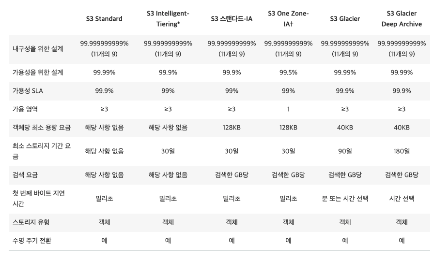

# S3

- S3는 오브젝트(파일)를 저장할수있는 버킷(디렉토리)이다
- 버킷의 이름은 글로벌하게 유니크하다
- 버킷은 리전 레벨로 정의된다
- 이름 규칙
  - 소문자만
  - 언더스코어 금지
  - 3~63글자
  - 아이피는 불가능
  - 시작은 소문자 글자 혹은 숫자로만

## S3 오브젝트

- 오브젝트는 키를 가진다
- 키는 FULL 경로를 의미한다.
  - s3://my-bucket/my_file.txt
  - s3://my-bucket/my_folder/another_folder/my_file.txt
- 키는 프리픽스와 오브젝트 이름으로 구성됨
  - s3://my-bucket/my_folder/another_folder/my_file.txt
- 디렉토리 개념은 버킷에는 존재하지 않는다. (UI의 구성상 디렉토리가 있는 것처럼 보이긴 하지만)
- 즉, 키는 단순히 슬래시가 포함된 긴 문자열일 뿐이다.
- 오브젝트의 밸류는 컨텐츠를 의미함
  - 최대 크기는 5TB
  - 5기가보다 큰 파일을 업로드하려면 멀티파트 업로드를 이용
- 메타데이터 (텍스트 키 밸류 키페어 - 시스템 또는 유저 메터데이터)
- 태그 (유니코드 키 밸류 페어, 10개까지) - 보안과 라이프사이클에 유용함
- 버전아이디 (버저닝을 켰을 경우에 유효)

## S3 버저닝

- S3에 저장하는 파일을 버저닝 할 수 있다
- 이 기능은 버킷 레벨로 활성화 해야 활용 가능하다
- 같은 키로 버전이 1,2,3 의 형태로 늘어난다 (버전 아이디는 랜덤 스트링으로 부여 됨)
- 버저닝의 모범 사례
  - 의도하지 않은 삭제를 보호
  - 전 버전으로 쉽게 돌아갈 수 있음
- 노트
  - 버저닝을 활성화 하지 않았을때의 버전은 null
  - 버저닝을 비활성화 한다고 전 버전들이 삭제되는건 아님

## S3 암호화

- 4가지 암호화 대책을 활용할 수 있다
  - SSE-S3 : S3오브젝트를 AWS에서 관리되는 키로 암호화 한다
  - SS3-KMS : AWS KMS를 이용하여 암호화 한다
  - SSE-C : 클라이언트가 보유한 키로 암호화 한다.
  - Client Side Encryption
- 어떤 시나리오에서 어떤 방식으로 암호화 하는지 아는것이 중요함.

## SSE-S3

- SS3-S3 : AWS에서 관리하는 키로 암호화 한다.
  
- SSE는 서버사이드 인크립션의 약어이다.
- AES256이 암호화 형태이며
- 업로드시 헤더 정보에 : x-amz-server-side-encryption: AES256 을 사용해야 한다.

## SSE-KMS

- SSE-KMS : KMS에서 발행된 키로 암호화 한다.
  
- KMS의 이점 : 유저 컨트롤 + 사용 이력 등 감사 가능
- 서버 사이드에서 암호화 된다.
- 업로드시 헤더 정보에 : x-amz-server-side-encryption: aws:kms 를 사용해야 한다.

## SSE-C

- SSE-C : 클라이언트가 제공한 키를 이용해서 서버사이드 인크립션을 수행한다.
  
- AWS측은 제공된 키를 저장하지 않고 바로 파기한다.
- HTTPS가 필수가 된다.
- 모든 HTTP 요청에 키를 제공해야 한다.

## Client Side Encyption

- 클라이언트가 암호화를 수행한 뒤 암호화된 파일을 S3에 업로드한다.
  

## 전송시 암호화 (SSL/TLS)

- AWS S3 Exposes
  - HTTP 엔드포인트 : 암호화 되지 않음
  - HTTPS 엔드포인트 : 전송중에 암호화 됨
- 어떤 것을 사용할지는 원하는 대로 해도 되지만 HTTPS를 사용하는것이 추천됨
- 대부분의 클라이언트들은 기본적으로 HTTPS를 이용한다
- SSE-C의 경우에는 필수가 된다.

## S3 보안

- 유저 기반
  - IAM 정책 - IAM에서 특정 유저를 위해 어떤 API 콜을 허용할 것인가
- 리소스 기반
  - 버킷 정책 - S3 콘솔에서 버킷 전체에 적용되는 룰 : 다른 계정에도 적용 가능
  - 오브젝트 엑세스 컨트롤 : 오브젝트 단위로 적용되는 정책
  - 버킷 엑세스 컨트롤 : 버킷단위 엑세스 컨트롤
- IAM S3오브젝트에 적용할때
  - 유저 IAM 퍼미션이 허용되거나 리소스 기반으로 허용하거나 둘중 하나만 있으면 안됨 (둘다 허용해야 될 필요성이 있음)
  - 정책 중 하나라도 거부가 있다면 그건 거부가 됨

## S3 버킷 정책

- JSON 기반 정책
  
  - 리소스 : 버킷과 오브젝트
  - 액션 : API 허용 또는 거부
  - 영향 : 허용 또는 거부
  - 원리 : 계정이나 다른 유저에 적용 대상을 정의
- 버킷 정책을 사용할때는
  - 버킷에 퍼블릭 접근권한을 설정
  - 업로드시에 오브젝트를 암호화 하도록 강제
  - 다른 계정에 권한을 허용

## S3 보안 - 기타

- 네트워킹
  - VPC 엔드포인트를 제공함 (인스턴스들이 www 인터넷을 거치지 않고 직접 접속)
- 로깅과 감사
  - S3 엑세스 로그는 다른 s3 버킷에 저장될 수 있음
  - API 요청은 전부 AWS CloudTrail을 통해 기록됨
- 유저 보안
  - MFA Delete (멀티 팩터 인증)을 통해 버저닝 된 버킷의 요소를 삭제할때 요구할 수 있음
  - pre signed URL : 일정 시간만 허용할 수 있는 URL (예를 들면: 로그인 한 유저를 위한 프리미엄 비디오)

## S3 웹사이트

- S3에서 스태틱 웹사이트를 호스팅 할수 있으며, 웹을 통해 엑세스 할 수 있다.
- 웹사이트의 URL은 다음과 같다.
  - bucket-name.s3-website-<AWS-Region>.amazonaws.com
  - bucket-name.s3-website.<AWS-Region>.amazonaws.com
- 만약 접속시 403 에러가 발생한다면, 버킷 정책을 퍼블릭에서 허용하고 있는지 확인한다.

## S3 CORS

- Origin은 스킴 (프로토콜) 을 의미하며, 호스트 (도메인) 과 포트이다.
- CORS는 Cross-Origin Resource Sharing의 약어이다.
- 웹브라우저는 다른 오리진에서의 요청을 기본적으로는 가능한 형태로 구성되어 있다.
- 같은 오리진이란 : [http://example.com/app1](http://example.com/app1) → [http://example.com/app2](http://example.com/app2) 등을 이야기한다.
- 다른 오리진은 : [http://www.example.com](http://www.example.com) & [http://other.example.com](http://other.example.com) 등을 이야기함
- 요청은 다른 오리진에서는 적절한 CORS 헤더가 있지 않는 한 유효하지 않다.

- 만약 클라이언트가 S3 버킷 사이의 크로스 오리진을 요청한다면 CORS 헤더를 지정해야 한다.
- CORS는 전체 도메인에 대해 허용 가능 \* (all origin)

## S3 컨시스턴시 모델

- 2020년 12월에 strong consistency가 됨
- After a
  - 새로 오브젝트를 작성하거나
  - 덮어쓰거나, 삭제하게 되면
- ...any:
  - 바로 읽는 다음 오브젝트는 최신 버전임을 보증함
  - 리스트 요청을 하면 방금전 요청이 반영된것이 보증됨
- 추가 요금은 없으며 어떤 성능적인 영향도 없음

## S3 버저닝

- S3버저닝은 파일을 변경할 경우 새로운 버전으로 파일을 만들게 된다.
- 암호화할때조차 새로운 파일이 만들어진다.
- 따라서 해킹당한 뒤 해커에 의해 암호화 된 경우에도 원래 버전과는 다르기 때문에, 전 버전으로 돌릴 수 있다.
- 파일을 삭제하면 삭제 마커를 태깅하게 된다. (이조차도 새로운 파일 취급이 된다. 빈 파일에 태깅)
- 버킷을 삭제하기 위해서는 모든 버전의 파일을 전부 삭제해야 한다.

## MFA Delete

- MFA는 유저측 디바이스에서 원타임 패스워드를 통해서 S3에 명령을 내릴 수 있도록 한다.
- MFA삭제를 이용하면 다음 상황에서 코드를 요구받는다.
  - 오브젝트의 버전을 완전 삭제
  - 버킷으로부터 버저닝을 비활성화
- MFA는 다음의 기능에는 요구되지 않는다.
  - 버저닝을 활성화
  - 삭제된 버전의 리스팅
- 버킷의 소유자 (루트 계정) 만이 MFA 삭제를 활성화 / 비활성화 할 수 있다.
- MFA 삭제는 현재 CLI 상에서만 설정이 가능하다.

## S3 Default 암호화

- 오래된 방식으로, 기본 암호화를 활성화 하려면 버킷 정책으로 특정 헤더가 없을 경우에는 업로드를 거부하는 방식이 있었다.
- 새로운 방식으로 버킷 속성에서 기본 암호화를 설정하는 방식으로 기본 암호화를 설정할 수 있다.

## S3 엑세스 로그

- 감사 목적으로 모든 S3 버킷에 대한 로그를 남길 수 있다.
- 어떤 계정이든 어떤 요청이든 그것이 허가되었건 비허가 되었건 모든 로그는 S3 버킷에 남게 된다.
- 데이터 분석 툴을 통해 분석 가능하다.
- 또는 아마존 아테나를 통해서 나중에 분석이 가능하다.
- 절대로! 모니터링하는 버킷에 로그를 설정하지 말아라
  - 이것은 로깅 루프를 발생시켜, 로그 파일의 무한 증식이 가능하다.

## S3 레플리케이션 (CRR & SRR)

- 크로스 리전 레플리케이션, same region replication
- 반드시 버저닝을 활성화 해야 한다. (소스, 데스티네이션 둘 다 )
- 버킷은 다른 계정이어도 상관없다.
- 동기화된 복사가 일어난다.
- S3에게 적절한 IAM 권한을 주어야 한다.
- CRR 유스케이스 : 컴플라이언스, 혹은 낮은 지연시간 문제
- SRR 유스케이스 : 로그 어그리게이션, 라이브 복제 (프로덕션과 테스트 사이에서)
- 노트
  - 활성화 한 뒤에는 새로운 오브젝트에 한해서 일어난다.
  - 삭제를 할 경우에는
    - 버전 아이디를 지정하지 않고 삭제하면 딜리트마커를 붙이고 복제되지 않음
    - 버전 아이디를 지정하면서 삭제하면 소스에서 삭제되고 복제되지 않는다.
  - 체인 복제는 없다
    - 만약 버킷 1이 버킷 2로 복제되고 버킷2가 버킷3으로 복제된다고 가정하면
    - 버킷 1에서 생성한 오브젝트는 버킷3으로 복제되지 않는다. 즉, 복제는 복제하지 않는다.

## S3 Pre-Signed URL

- SDK나 CLI를 이용해서 Pre signed URL을 발행할 수 있다.
  - 다운로드 CLI 이용
  - 업로드 조금 복잡하긴 한데 SDK
- 기본 시간은 1시간으로 허용되며 이 값은 —expires-in [seconds] 로 조절 가능하다.
- 유저는 URL을 만든 사람의 권한을 상속받게 된다.
- 예를 들어
  - 로그인 한 유저에게 프리미엄 비디오를 다운로드 가능하게 만들어줌
  - URL을 계속해서 변경하여 알 수 없게 만듬
  - 버킷에 직접 업로드하기 위한 주소를 발행함

## S3 Inventory

- 아마존 S3 인벤토리는 스토리지 관리에 도움을 줌
- 오브젝트의 복제와 암호화 상태에 대한 레포트와 감사자료를 제공
- 유스케이스
  - 비지니스
  - 컴플라이언스
  - 규제 준수 등등
- 아마존 아테나를 통한 데이터 쿼리, 레드쉬프트, 프레스토, 하이브, 스파크 등등
- 복수의 인벤토리를 만들 수 있음
- 데이터는 소스 버킷에서 타겟 버킷으로 이동 (버킷정책 설정 필요)

## S3 스토리지 클래스

- Amazon S3 Standard - General Purpose
  - 내구성 11.9 룰 멀티플 AZ
  - 이것은 10,000,000개의 오브젝트가 S3에 보존되어 있을때 평균 10,000 년에 하나의 오브젝트가 소실될 가능성을 의미
  - 99.99% 가용성 연당
  - 동시에 2개의 시설이 망가지더라도 여전히 서비스 가능
  - 어떤 워크로드에도 사용 가능
- Amazon S3 Standard-Infrequent Access
  - 엑세스가 자주 일어나지 않는 경우에 활용 가능
  - 내구성은 11.9 룰 멀티플 AZ
  - 가용성 99.9%
  - 스탠다드랑 비교해서 살짝 저렴
  - 재해 복구용 데이터, 백업 등등
- S3 OneZOne IA
  - 상기와 비슷하지만 하나의 AZ에서 관리
  - 내구성은 여전히 11.9
  - 99.5% 가용성
  - 지연시간이 작고 여전히 퍼포먼스는 높다
  - IA보다 20% 저렴
  - 소실 위험이 있기 때문에 재생성 가능한 데이터에 경우 활용 가능
- Amazon S3 Inteligent Tiering
  - 스탠다드와 같은 지연시간과 처리량
  - 소량의 모니터링 요금이 소요됨
  - 자동적으로 사용 패턴에 따라 엑세스 티어를 조정한다
  - 11.9 내구성으로 설계되었으면 멀티플 AZ를 지원한다.
  - 99.9%의 가용성으로 설계되었음
- Amazon Glacier
  - 아카이빙 혹은 백업에 활용되는 낮은 요금의 오브젝트 스토리지
  - 오랜 기간동안 데이터를 보존 가능함 (10년 그 이상도)
  - 온프레미스의 마그네틱 테이프에 비교할 만 함
  - 내구성은 11.9
  - 월별 요금은 GiB당 $0.004로 매우 저렴, 하지만 데이터를 읽어오는데 추가요금이 들어감
  - 글래시어의 아이템은 아카이브라고 불리며 (40TiB)
  - 아카이브는 볼트 라고 불리는 곳에 저장됨
- Amazon Glacier Deep Archive
  - 글래시어의 3가지 옵션
    - Expedited (1 to 5 minutes)
    - Standard ( 3 to 5 hours)
    - Bulk (5 to 12 hours)
    - 최소 보존 기간은 90일
  - 딥 아카이브는 더 싸고 오랜기간 저장하기 위한 곳이다
    - Standard (12 gours)
    - Bulk (48 hours)
    - 최소 180일간 저장해야 함
- Amazon S3 Reduced Redundancy Storage (곧 사라질 예정)

## S3 베이스라인 퍼포먼스

- S3는 자동적으로 높은 요청 비율에 대한 스케일링을 가지고 있다. 응답시간은 100~200ms
- 어플리케이션으로부터의 요청은 3,500 PUT/COPY/POST/DELETE 그리고 5,500 GET/HEAD 요청을 프리픽스 단위로 가능하다.
- 요청할 수 있는 프리픽스 및 제한은 없다.
- 동시에 여러개의 다른 프리픽스를 요청하면 각각 요청단위에서 동시에 제한숫자만큼의 요청을 커버할 수 있음

## S3 KMS 제한

- SSE-KMS를 이용할 때 KMS 제한에 영향을 받는다.
- 업로드시에 GenerateDataKey KMS API를 요청한다.
- 다운로드시에는 Decrypt KMS API를 요청한다.
- 초당KMS 쿼터는 리전별로 5500, 10000, 30000 등으로 제한이 되어 있다
- 아직까지는 해당 쿼터를 증가시키는 방법은 없음

## S3 퍼포먼스

- 멀티파트 업로드
  - 100MB보다 크다면 추천됨
  - 5GB이상일 경우 필수
  - 병렬 업로드를 지원함 (청크로 나눠서 업로드)
- S3 트랜스퍼 엑셀러레이션 (업로드)
  - 가까운 엣지로케이션으로 업로드를 함으로써 업로드 속도를 부스팅
  - 멀티파트 업로드를 지원함

## S3 퍼포먼스 - S3 바이트-범위 패치

- 특정 바이트 범위를 병렬로 GET 해온다
- 실패에 대해서 좀 더 유연해짐
- 하나의 파일을 다양한 파트로 나누어서 다운로드 받는 방법
- 또한 이는 병렬로 속도 증가를 노릴 수 있음

## S3 셀렉트 & 글래시어 셀렉트

- 서버 사이드 필터링으로 SQL을 사용해서 데이터를 받아옴
- row & columns으로 간단한 SQL 문을 돌릴 수 있음
- 적은 네트워크 트랜스퍼, 적은 cpu 사용량
- 원리
  - 데이터를 한번에 다 받아와서 필터링을 하는것이 아닌
  - 데이터를 서버측에서 정제해서 필요한 것만 가져옴
- 복잡한 쿼리를 돌리려면 아테나를 활용

## S3 이벤트 알림

- S3에서 오브젝트에 특정한 이벤트가 발생했을때, 처리를 정의할 수 있음
- 오브젝트의 이름 등을 이용해서 필터링이 가능하다
- 유스케이스
  - S3에 사진을 업로드하면 썸네일을 자동으로 만들고
  - SNS에 알림을 보내거나
  - SQS로 처리를 예약하거나
  - 람다로 처리를 돌리거나
- S3이벤트는 일반적으로는 몇 초 안에 처리가 되나 늦게는 몇분까지 걸릴 수 있음

## S3 분석 - 스토리지 클래스 분석

- 분석 기능을 활성화하여 언제 스탠다드에서 IA로 이동할지 결정하는데 도움을 받을 수 있다
- ONEZONE_IA나 GLACIER 오브젝트에서는 제공하지 않는다
- 보고서는 매일 업데이트 된다.
- 처음 기능을 활성화하면 24~48시간정도 소요된다.

## 글래시어

- 매우 저렴한 스토리지로 백업이나 아카이빙에 활용
- 데이터는 매우 긴 시간동안 보존될 목적으로 보관됨
- 마그네틱 테이프에 비교 가능
- 내구성은 11.9 룰을 따르고 있으며
- 매우 저렴하다 $0.004 기가당, 대신 읽기에 비용이 들어감
- 글래시어의 3가지 동작
  - 업로드 : 멀티파트 업로드 하나당 한번
  - 다운로드 :
  - 삭제 : 특정 아카이브 ID를 API로 삭제
- 3가지 불러들이는 옵션
  - Expedited (1 ~ 5분 이내) - 0.03 per gb 그리고 0.01 per req
  - Standard (3 ~ 5시간) - $0.01 per GB 그리고 $0.05 per 1000 requests
  - Bulk (5 ~ 12시간) - $0.0025 per GB 그리고 $0.025 per 1000 requests

## 글래시어 - 볼트 정책 & 볼트 락

- 볼트는 아카이브들의 집합이다
- 각각의 볼트는
  - 하나의 볼트 엑세스 정책
  - 하나의 볼트 잠금 정책이 존재한다.
- 볼트 정책은 JSON으로 작성된다.
- 볼트 엑세스 정책은 버킷 정책과 비슷하다 (유저 제한, 권한 설정 등)
- 볼트 잠금 정책은, 한번 잠금이 픽스되면 더이상 수정이 불가능한 불가결한 정책이다.
  - 이는 규제, 컴플라이언스를 충족하기 위해 설정하며
  - WORM ( 한번 쓰고 여러번 읽기 ) 정책을 위해서 설정하기도 함

## 스노우볼을 글래시어에

- 스노우볼은 직접 글래시어로 옮길수는 없다.
- S3에 먼저 저장 이후 에 lifecycle policy를 이용

## S3 스토리지 게이트웨이

- 스토리지 게이트웨이는 온프레미스와 클라우드(S3) 스토리지간의 연동을 위해 탄생
- 스토리지 게이트웨이의 3가지 타입
  - 파일 게이트웨이
    - 온프레미스에 S3 버킷을 NFS또는 SMB를 이용해서 직접 붙여놓는것을 이야기함
    - 파일게이트웨이는 최근 읽어들인 파일을 로컬에 캐시해둠
    - NFS 스타일은 여러대의 PC에 마운팅 가능함
    - 버킷에는 파일게이트웨이로부터의 요청을 허락할 수 있는 적절한 IAM 권한이 셋팅되어야 함
  - 볼륨 게이트웨이
    - 블록스토리지로 iSCSI 아이스카시 를 사용하는 뒷단은 S3인 스토리지이다.
    - 로컬에서의 저지연시간을 목적으로 기본 자료는 로컬에 저장하고, 정기적으로 S3에 백업을 뜬 뒤에 EBS 스냅샷으로 저장한다고 생각하면 됨
      - 캐시 볼륨 : 최근 데이터들을 전부 캐싱
      - 스토어 볼륨 : 정기적으로 S3에 백업
  - 테이프 게이트웨이
    - 테이프를 사용해서 백업을 하는 회사에서는, 이를 연동해서 클라우드에 저장할 수 있도록 해준다.
    - 마그네틱 드라이브로 테이프를 읽고 난 뒤에 S3 (혹은 글래시어)에 저장하게 됨

## 아테나

- 서버리스 서비스로 S3파일을 직접 분석할 수 있는 툴
- SQL 언어를 이용해서 질의하게 됨
- JDBC or ODBC 드라이버를 보유하고 있음
- 쿼리에 대한 과금
- CSV JSON ORC Avro Parquet
- 비즈니스 인텔리전스 or 분석 or 레포팅, 분석 쿼리 등등
- S3에 들어있는 데이터를 직접 분석하기 위함 → 아테나를 활용
