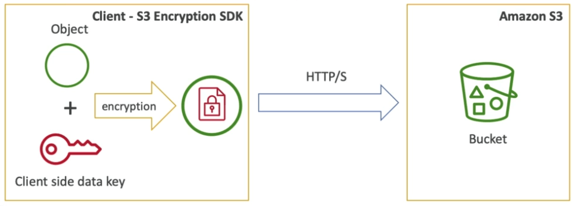

# S3

- S3는 오브젝트(파일)를 저장할수있는 버킷(디렉토리)이다
- 버킷의 이름은 글로벌하게 유니크하다
- 버킷은 리전 레벨로 정의된다
- 이름 규칙
  - 소문자만
  - 언더스코어 금지
  - 3~63글자
  - 아이피는 불가능
  - 시작은 소문자 글자 혹은 숫자로만

## S3 오브젝트

- 오브젝트는 키를 가진다
- 키는 FULL 경로를 의미한다.
  - s3://my-bucket/my_file.txt
  - s3://my-bucket/my_folder/another_folder/my_file.txt
- 키는 프리픽스와 오브젝트 이름으로 구성됨
  - s3://my-bucket/my_folder/another_folder/my_file.txt
- 디렉토리 개념은 버킷에는 존재하지 않는다. (UI의 구성상 디렉토리가 있는 것처럼 보이긴 하지만)
- 즉, 키는 단순히 슬래시가 포함된 긴 문자열일 뿐이다.
- 오브젝트의 밸류는 컨텐츠를 의미함
  - 최대 크기는 5TB
  - 5기가보다 큰 파일을 업로드하려면 멀티파트 업로드를 이용
- 메타데이터 (텍스트 키 밸류 키페어 - 시스템 또는 유저 메터데이터)
- 태그 (유니코드 키 밸류 페어, 10개까지) - 보안과 라이프사이클에 유용함
- 버전아이디 (버저닝을 켰을 경우에 유효)

## S3 버저닝

- S3에 저장하는 파일을 버저닝 할 수 있다
- 이 기능은 버킷 레벨로 활성화 해야 활용 가능하다
- 같은 키로 버전이 1,2,3 의 형태로 늘어난다 (버전 아이디는 랜덤 스트링으로 부여 됨)
- 버저닝의 모범 사례
  - 의도하지 않은 삭제를 보호
  - 전 버전으로 쉽게 돌아갈 수 있음
- 노트
  - 버저닝을 활성화 하지 않았을때의 버전은 null
  - 버저닝을 비활성화 한다고 전 버전들이 삭제되는건 아님

## S3 암호화

- 4가지 암호화 대책을 활용할 수 있다
  - SSE-S3 : S3오브젝트를 AWS에서 관리되는 키로 암호화 한다
  - SS3-KMS : AWS KMS를 이용하여 암호화 한다
  - SSE-C : 클라이언트가 보유한 키로 암호화 한다.
  - Client Side Encryption
- 어떤 시나리오에서 어떤 방식으로 암호화 하는지 아는것이 중요함.

## SSE-S3

- SS3-S3 : AWS에서 관리하는 키로 암호화 한다.
  
- SSE는 서버사이드 인크립션의 약어이다.
- AES256이 암호화 형태이며
- 업로드시 헤더 정보에 : x-amz-server-side-encryption: AES256 을 사용해야 한다.

## SSE-KMS

- SSE-KMS : KMS에서 발행된 키로 암호화 한다.
  
- KMS의 이점 : 유저 컨트롤 + 사용 이력 등 감사 가능
- 서버 사이드에서 암호화 된다.
- 업로드시 헤더 정보에 : x-amz-server-side-encryption: aws:kms 를 사용해야 한다.

## SSE-C

- SSE-C : 클라이언트가 제공한 키를 이용해서 서버사이드 인크립션을 수행한다.
  
- AWS측은 제공된 키를 저장하지 않고 바로 파기한다.
- HTTPS가 필수가 된다.
- 모든 HTTP 요청에 키를 제공해야 한다.

## Client Side Encyption

- 클라이언트가 암호화를 수행한 뒤 암호화된 파일을 S3에 업로드한다.
  

## 전송시 암호화 (SSL/TLS)

- AWS S3 Exposes
  - HTTP 엔드포인트 : 암호화 되지 않음
  - HTTPS 엔드포인트 : 전송중에 암호화 됨
- 어떤 것을 사용할지는 원하는 대로 해도 되지만 HTTPS를 사용하는것이 추천됨
- 대부분의 클라이언트들은 기본적으로 HTTPS를 이용한다
- SSE-C의 경우에는 필수가 된다.

## S3 보안

- 유저 기반
  - IAM 정책 - IAM에서 특정 유저를 위해 어떤 API 콜을 허용할 것인가
- 리소스 기반
  - 버킷 정책 - S3 콘솔에서 버킷 전체에 적용되는 룰 : 다른 계정에도 적용 가능
  - 오브젝트 엑세스 컨트롤 : 오브젝트 단위로 적용되는 정책
  - 버킷 엑세스 컨트롤 : 버킷단위 엑세스 컨트롤
- IAM S3오브젝트에 적용할때
  - 유저 IAM 퍼미션이 허용되거나 리소스 기반으로 허용하거나 둘중 하나만 있으면 안됨 (둘다 허용해야 될 필요성이 있음)
  - 정책 중 하나라도 거부가 있다면 그건 거부가 됨

## S3 버킷 정책

- JSON 기반 정책
  
  - 리소스 : 버킷과 오브젝트
  - 액션 : API 허용 또는 거부
  - 영향 : 허용 또는 거부
  - 원리 : 계정이나 다른 유저에 적용 대상을 정의
- 버킷 정책을 사용할때는
  - 버킷에 퍼블릭 접근권한을 설정
  - 업로드시에 오브젝트를 암호화 하도록 강제
  - 다른 계정에 권한을 허용

## S3 보안 - 기타

- 네트워킹
  - VPC 엔드포인트를 제공함 (인스턴스들이 www 인터넷을 거치지 않고 직접 접속)
- 로깅과 감사
  - S3 엑세스 로그는 다른 s3 버킷에 저장될 수 있음
  - API 요청은 전부 AWS CloudTrail을 통해 기록됨
- 유저 보안
  - MFA Delete (멀티 팩터 인증)을 통해 버저닝 된 버킷의 요소를 삭제할때 요구할 수 있음
  - pre signed URL : 일정 시간만 허용할 수 있는 URL (예를 들면: 로그인 한 유저를 위한 프리미엄 비디오)

## S3 웹사이트

- S3에서 스태틱 웹사이트를 호스팅 할수 있으며, 웹을 통해 엑세스 할 수 있다.
- 웹사이트의 URL은 다음과 같다.
  - bucket-name.s3-website-<AWS-Region>.amazonaws.com
  - bucket-name.s3-website.<AWS-Region>.amazonaws.com
- 만약 접속시 403 에러가 발생한다면, 버킷 정책을 퍼블릭에서 허용하고 있는지 확인한다.

## S3 CORS

- Origin은 스킴 (프로토콜) 을 의미하며, 호스트 (도메인) 과 포트이다.
- CORS는 Cross-Origin Resource Sharing의 약어이다.
- 웹브라우저는 다른 오리진에서의 요청을 기본적으로는 가능한 형태로 구성되어 있다.
- 같은 오리진이란 : [http://example.com/app1](http://example.com/app1) → [http://example.com/app2](http://example.com/app2) 등을 이야기한다.
- 다른 오리진은 : [http://www.example.com](http://www.example.com) & [http://other.example.com](http://other.example.com) 등을 이야기함
- 요청은 다른 오리진에서는 적절한 CORS 헤더가 있지 않는 한 유효하지 않다.

- 만약 클라이언트가 S3 버킷 사이의 크로스 오리진을 요청한다면 CORS 헤더를 지정해야 한다.
- CORS는 전체 도메인에 대해 허용 가능 \* (all origin)

## S3 컨시스턴시 모델

- 2020년 12월에 strong consistency가 됨
- After a
  - 새로 오브젝트를 작성하거나
  - 덮어쓰거나, 삭제하게 되면
- ...any:
  - 바로 읽는 다음 오브젝트는 최신 버전임을 보증함
  - 리스트 요청을 하면 방금전 요청이 반영된것이 보증됨
- 추가 요금은 없으며 어떤 성능적인 영향도 없음
