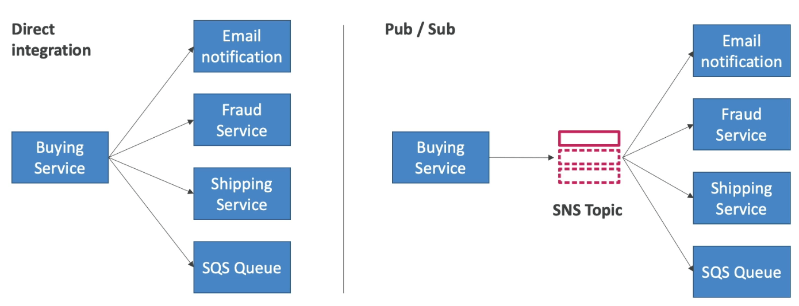
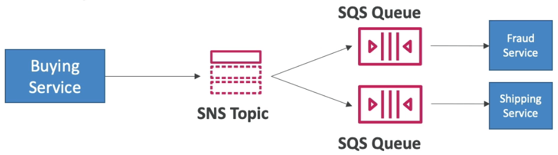
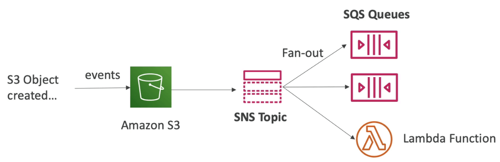
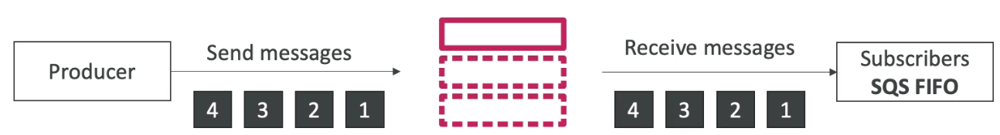
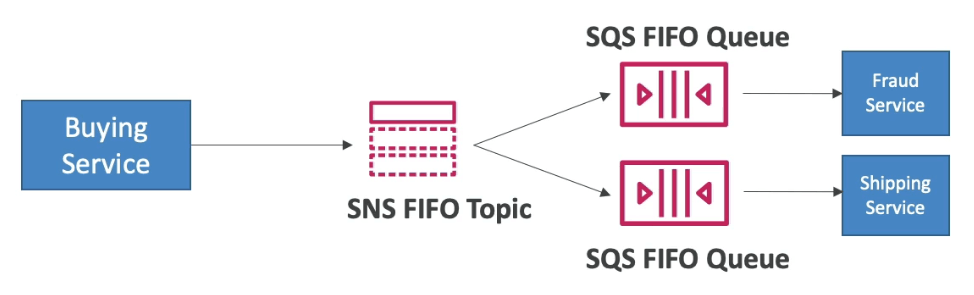
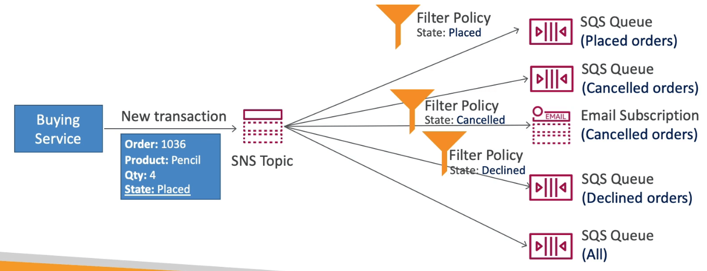

# Simple Notification Service

- 종래의 시스템에서는 직접 통합을 위해서는 하나의 서비스에서 리시버들을 위해 전부 포맷화 시켜서 메시지를 만들어야 했음
- 너무 많은 서비스가 연계됐을때는 어떻게 대응해야 할까?
- Pub / Sub 패턴을 이용하자
  - 메시지 프로바이더는 SNS 토픽에 메시지를 게재하고
  - Sub (Subscriber) 들은 게재된 메시지를 기반으로 자신들의 포맷에 맞게 고쳐가져오기
    
- SNS에서 이벤트 공급자는 하나의 메시지를 토픽에 게재한다.
- 많은 이벤트 구독자들이 SNS 토픽의 알림을 대기한다.
- 각각의 구독자들은 토픽에서 메시지를 가져온다. (메시지를 필터링하는 기능이 포함됨)
- 토픽당 10,000,000개의 구독자를 만들 수 있다.
- 토픽은 최대 100,000개를 만들 수 있다.
- 구독자들은 다음과 같은 서비스들이 될 수 있다.
  - SQS
  - HTTP / HTTPS (메시지 전송 재시도)
  - 람다
  - 이메일
  - SMS 메시지
  - 모바일 노티

## SNS 보안

- 암호화
  - 전송중 암호화는 HTTPS API를 이용해 구현
  - 보관중인 메시지는 KMS 키를 이용해 암호화
  - 클라이언트측 암호화는 클라이언트가 직접 암호화 복호화를 수행할 수 있음
- 접근 제어
  - IAM 접근정책을 이용해서 SNS API 접근제어 수행
- SNS 접근 정책 (S3 정책과 비슷)
  - 다른 계정이 SNS에 접근할수 있도록 허가
  - 다른 AWS 서비스가 SNS에 접근할 수 있도록 허가

## SNS + SQS: 팬아웃

- SNS에서는 이벤트 발생 시 바로 푸시를 해오므로, 어플리케이션에서 바로 처리를 해주어야 하지만 그럴수가 없는 경우 데이터 로스가 발생할 수 있음
- 따라서, SNS의 내용을 SQS가 구독자가 되어 받아두었다가, 어플리케이션에서 여유가 될 때 처리하면 데이터 손실도 방지되고 완전한 디커플링이 성립함
- 한번의 SNS 푸시 내용을 복수의 SQS가 구독 가능하기 때문에, 메시지의 병렬화도 가능함 (각각의 어플리케이션을 전부 디커플링)
- SQS큐가 SNS로부터의 접근 정책을 허용해야 함
- 예) S3이벤트를 복수의 큐로
  - 같은 연계 패턴으로는 이벤트가 발생했을때, 하나의 s3 이벤트 룰만 작성해두면 된다.
  - 해당 이벤트를 복수의 큐에 입력하고 싶다면, 이때 팬아웃을 이용하면 된다.
    

## SNS FIFO Topic

- SQS FIFO와 비슷하게
  - SQS FIFO만 구독가능
  - 메시지 그룹 아이디별 순서가 지켜진다.
  - 중복 제거 아이디 혹은 컨텐츠 기반 중복제거 (해시) 를 이용해서 중복을 제거 할 수 있다.
  - 하지만 SQS 처리량의 제한이 있기 때문에 그것에 영향을 받는다.

## SNS FIFO와 SQS FIFO를 통합한 팬아웃

- 구매 서비스에서 요청이 들어오면 SNS FIFO를 이용해서 순서있게 SQS를 이용해서 복수처리를 구현

## SNS 메시지 필터링

- SNS에 필터링을 설정해두면 특정 상황에서 구독자들이 데이터를 가져가게 할 수 있음
- 필터 정책이 없으면 전부 메시지를 받게 되지만, 정책을 설정하면 특정 상황에서만 가져옴

