# SQS (Simple Queue Service)

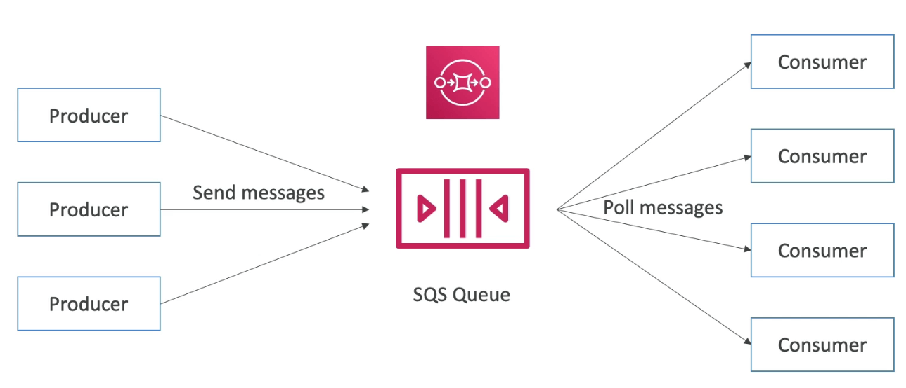

- AWS에서 가장 오래된 서비스 중 하나 (10년 이상)
- 완전 관리형 서비스이며, 어플리케이션의 디커플링에 이용된다.
- 속성
  - 처리량이 무제한이며, 큐에 들어오는 메시지의 숫자 또한 무제한이다.
  - 메시지의 보존기간이 제한되어 있으며, 4일~최대 14일까지 체류 가능하다.
  - 지연시간이 낮다. (퍼블리싱과 리시빙에 <10ms 정도의 시간이 소요됨)
  - 메시지당 256KB의 제한이 있다.
- 중복된 메시지를 허용한다. (최소한 한번은 전달된다. 때때로)
- 순서에 상관없는 메시지를 허용한다. (그렇지만 최대한 순서를 맞추려고 노력하는 모델)

## 메시지 제공자

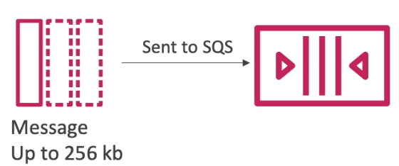

- SenMessage API를 이용해서 SQS에 정보를 제공
- 소비자가 삭제하기 전까지 메시지는 계속 존재한다.
- 메시지 보존기간: 4일에서 14일까지
- 예를 들어: 주문 처리 메시지라면
  - Order id
  - Customer id
  - 추가로 어떤 정보도 가능
- SQS 스탠다드: 무제한 처리량을 지원

## 메시지 소비자

- 소비자란: EC2 인스턴스에서 돌아가는 서비스, 온프레미스, 람다 등등
- SQS에서 메시지를 가져온다. (한번에 10개의 메시지까지 가져올 수 있음)

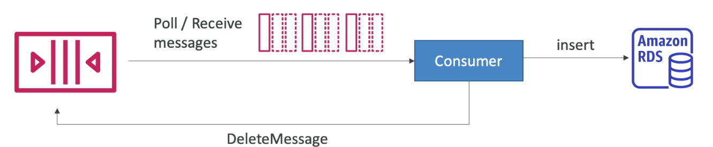

- 메시지를 처리한다. (예를 들면, RDS 데이터베이스에 해당 메시지를 저장한다거나)
- 메시지가 처리되면 다른 소비자가 보지 못하도록 메시지를 큐에서 삭제한다. (DeleteMessage API)

## 동시 소비자 개념

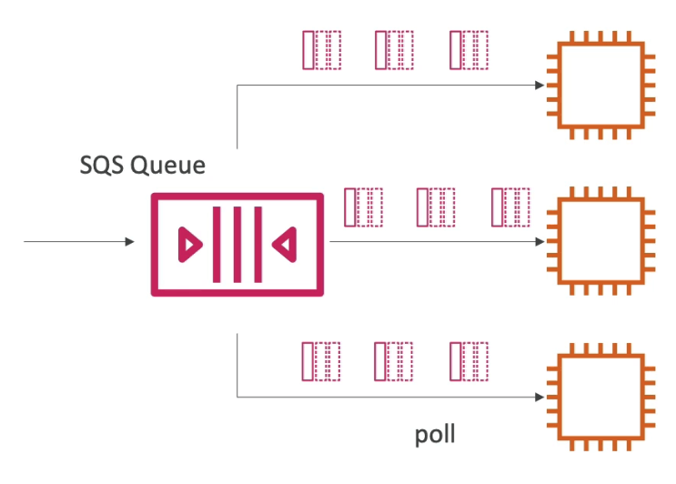

- 소비자는 메시지를 병렬로 받고, 처리한다.
- 최소한 1번은 메시지를 받는다. (중복 메시지 수신의 가능성이 있음)
- 메시지 순서는 폴링 순서에 따라 최대한 지켜진다. (중복 메시지 수신의 가능성 때문에 Best Effort)
- 소비자는 메시지를 처리한 뒤에 삭제한다.
- 소비자를 병렬로 스케일링 해서 처리량을 극대화 할 수 있다.
- ASG를 이용한 SQS
  - ASG를 SQS와 연계하여
  - Queue Lenth가 증가할 경우, 클라우드워치 알람을 통해 ASG의 인스턴스를 늘리는것이 가능함
    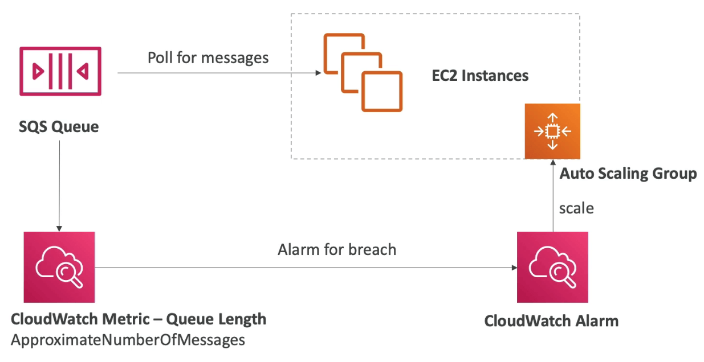

## 어플리케이션 티어를 디커플링하기

- 프론트엔드의 웹앱이 규모가 클 경우, 백엔드의 비디오 프로세싱 앱에 한번에 과도한 메시지가 몰릴 수 있다
- 병목현상을 해결하기 위해 두 앱 사이에 SQS를 두고 폴링처리를 이용해서 비디오 프로세싱이 처리할 수 있는 최대치를 견딜 수 있도록 완충작용을 할 수 있다

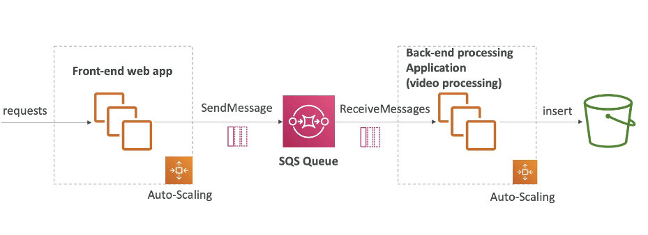

## SQS의 보안

- 암호화
  - 전송시 암호화 구현: HTTPS API를 이용
  - 보존자료 암호화 구현: KMS 키를 이용한 암호화
  - 클라이언트측 암호화: 클라이언트에서 암호화 및 복호화를 직접 처리 가능
- 접근 제어: IAM 권한을 이용해서 SQS API의 접근제어 가능
- SQS Access 정책 (S3의 버킷 정책과 비슷)
  - 크로스 어카운트 접근시 유용하게 활용 가능
  - 다른 서비스들이 SQS에 접근하기 위한 정책으로 제어 가능

## SQS 설정시 옵션

- FIFO, Standard
- 메시지 사이즈
- 메시지 보존 기간
- 엑세스 정책
  - 다른 AWS 계정
- 암호화
  - 전송시 암호화는 기본 ON
  - CMK (customer master key from KMS)

## SQS 메시지 전송 및 폴링

- 메시지 전송은 아무때나 원하는만큼 가능
- 폴링시에는 정해진 폴링시간동안 메시지를 가져오고, 제한시간내에 메시지를 처리하지 못하면 다시 메시지가 보내진다.
- 메시지 큐를 퍼징할수 있음 (전부 삭제)

## SQS 큐 엑세스 정책

- 유스케이스 2가지
- 다른 AWS 계정에서 접근
  - SQS 큐는 접근제한 정책을 설정함으로써 다른 AWS 계정에서 접근하는것을 허용할 수 있다.
    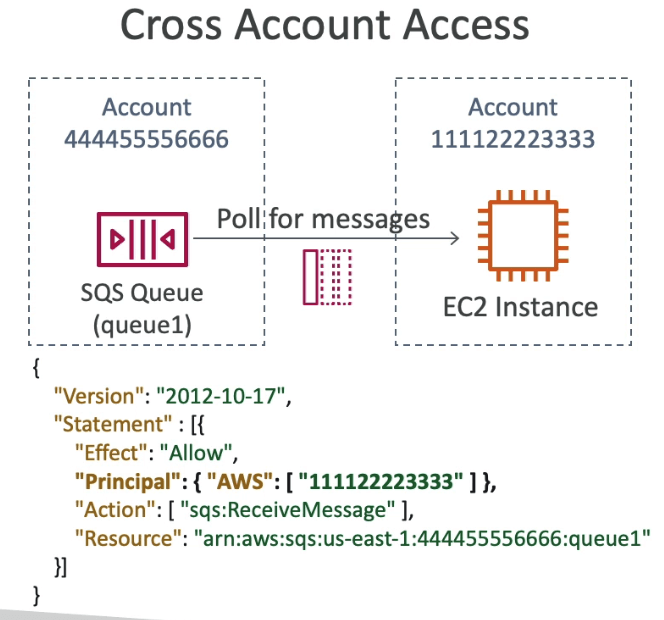
- S3 이벤트 알림을 통해 SQS 큐에 저장하기
  - S3에게 SQS 접근권한을 줌으로써, S3가 직접 SQS에 메시지를 전송할 수 있도록 한다.
    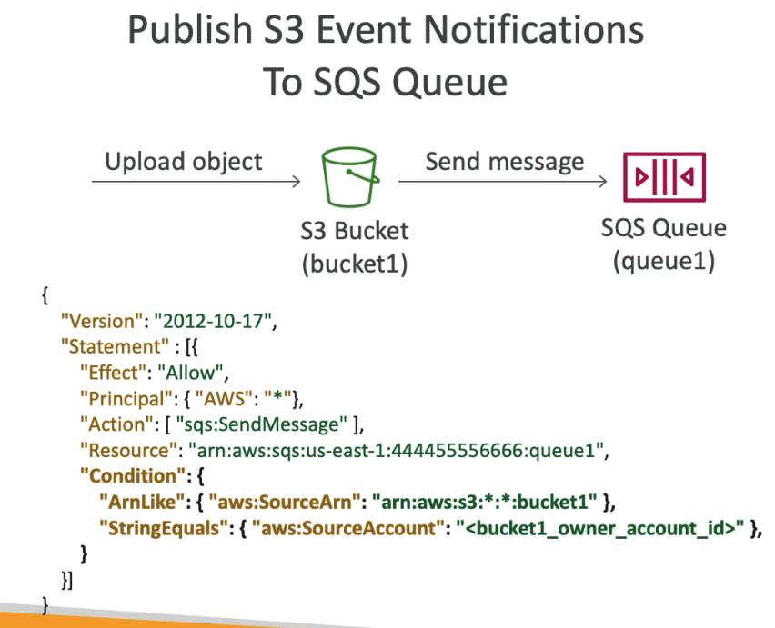
- send message와 recieve메시지 양쪽에 독립적인 권한 설정 가능
- S3 설정 예
  - S3에서 Event 설정 후 put object 이벤트를 걸어둠
  - SQS큐를 목적지로 설정하고 저장할때 그냥 저장하면 에러가 남
  - SQS큐에서 미리 S3 ARN을 허용해놓고 설정해야 함

## SQS 메시지 가시성 개념 (visibility timeout)

- 소비자에 의해 메시지가 폴링되면, 해당 메시지는 다른 소비자에게 보이지 않는 상태가 된다.
- 기본 설정으로 이 시간은 30초가 된다.
- 이 시간안에 메시지는 처리되어야 한다.
- 이 시간안에 다른 소비자가 폴링을 하게 되면 메시지는 보이지 않는다.
- 이 시간이 지나고 난 뒤에 실행되는 폴링에서 처리되지 않았다면 다시 메시지를 폴링하게 된다.

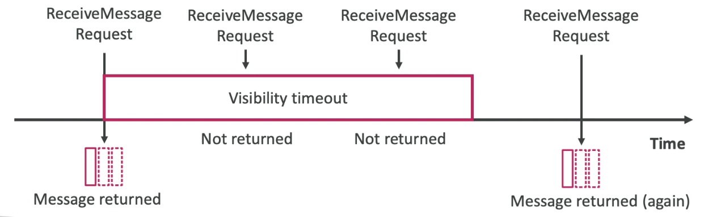

- 메시지가 타임아웃 안에 처리되지 않는다면, 메시지는 여러번 처리될 수도 있다.
- 소비자는 **ChangeMessageVisibility** API를 이용해서 더 많은 시간을 설정할 수도 있다. (메시지 별로)
- 메시지 타임아웃이 높고 (몇시간 등) 소비자가 처리못하고 다운됐을 경우에, 시간이 지난 뒤에야 다시 처리 할 수 있다.
- 메시지 타임아웃이 너무 낮으면 (초단위 등), 해당 시간안에 메시지를 처리 못하면 메시지가 중복으로 보여지게 되어 여러번 처리될 수도 있다.

## SQS DLQ(Dead Letter Queue)

- 만약 소비자가 제한시간 내에 메시지 처리에 실패한다면 메시지는 다시 큐로 돌아가게 된다.
- 큐로 돌아오는 횟수의 상한을 걸 수 있다.
- MaximumRecives가 넘어가게 되면, 메시지는 DLQ(Dead Letter Queue)에 들어가게 할 수 있다.

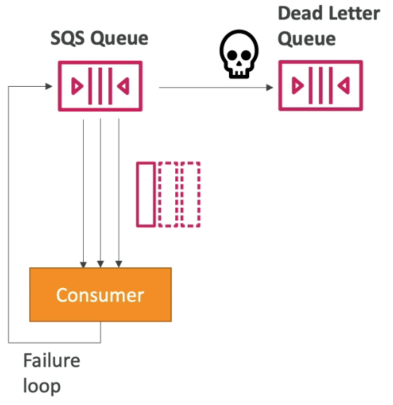

- 이는 디버깅에 유용하게 활용할 수 있음 (왜 문제가 되었는지 나중에 분석)
- DLQ에서 메시지가 만료되기 전에 처리하는것이 좋다. (따라서 DLQ는 14일로 설정하는것이 좋음)

## SQS 딜레이 메시지

- 소비자에게 바로 보이지 않도록 메시지의 딜레이를 조정할 수 있다. (최대 15분)
- 기본적으로 0초의 딜레이를 가지고 있음 (메시지가 바로 보임)
- 디폴트 딜레이로 큐 레벨에서 설정 가능
- 메시지마다 DelaySeconds라는 패러미터를 이용해서 시간 조절이 가능함

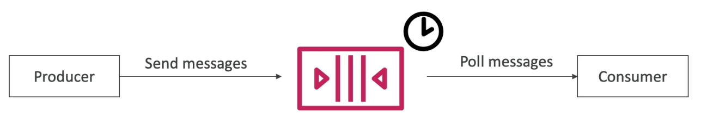

## SQS 개념

- 롱 폴링
  - 폴링시에 메시지가 없을 경우, 정해진 시간동안 기다리게 할 수 있음 (지속 폴링)
    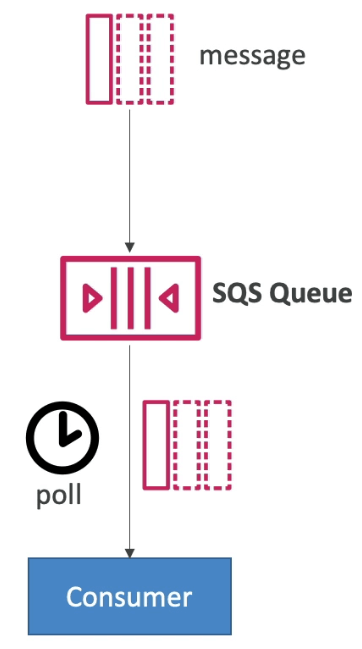
  - 왜 롱 폴링을 할까?
    - 메시지 콜 수를 줄이기 위함이 가장 큰 목적 (효율화)
    - 지연시간을 줄이는 효과가 있음
  - 1~20초로 설정할 수 있음 (20초가 선호됨)
  - WaitTimeSeconds API를 이용해서 시간을 설정할 수 있음 (폴링 단위로)
- SQS Extended Client
  - 만약 256KB의 제한 길이가 있음으로, 만약 메시지가 1GB등 클 경우에는 어떻게 해야 할까?
  - 이때 자바 라이브러리인 SQS Extended Client를 사용 가능
    1. 생산자는 실제 큰 데이터는 S3에 업로드 하고, 실제로 큐에는 작은 메타데이터 메시지를 송신한다.
    2. 소비자는 큐에서 메타데이터를 폴링하여, 실제 메시지가 저장되어 있는 S3을 참조하여 메시지를 처리한다.
    - 비디오 파일 처리 등과 같은 경우가 이 유스케이스에 포함됨 (실제 비디오 데이터는 S3에 저장, 처리용 메타데이터를 큐에 저장)
      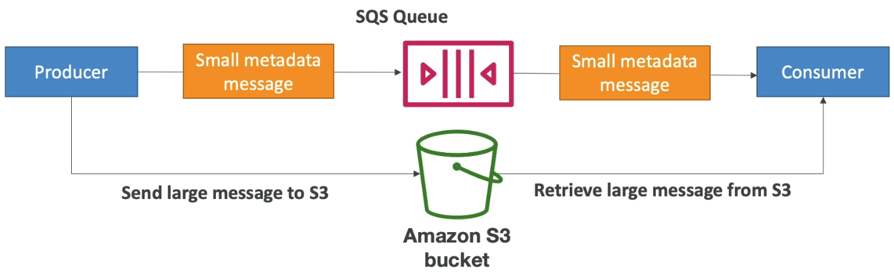

## SQS에서 반드시 알아야 하는 API

- CreateQueue (MessageRetentionPeriod), DeleteQueue
- PurgeQueue: 모든 메시지를 삭제
- SendMesssage (DelaySeconds), RecieveMessage, DeleteMessage
- MaxNumerOfMessages: default 1, max 10 (for RecieveMessage API) 한번에 가져올 메시지의 갯수
- RecieveMessageWaitTimeSeconds: 롱 폴링
- ChangeMessageVisibility: 메시지의 가시성 타임아웃을 조정
- 배치 API를 이용하여 SendMessage, DeleteMessage, ChangeMessageVisibility
  - 코스트를 절감할 수 있음

## SQS FIFO 큐

- FIFO = First In First Out (큐 안에서 메시지 순서가 있는 것)

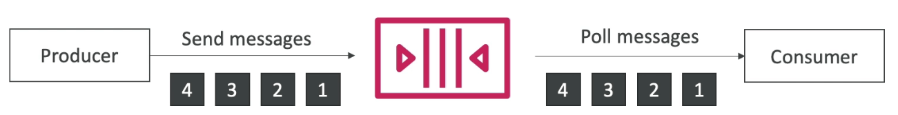

- 제한된 처리량: 초당 300메시지, 배치를 포함할 경우 초당 3000메시지 (배치처리란? 한번에 처리하는 메시지의 숫자를 늘리는것. 최대 10개까지라서 3000개라는것임)
- 반드시 1번만 처리되는것을 보증 (중복메시지를 제거한다는 전제 하에)
- 소비자에 의해 메시지가 순서대로 처리됨
- 중복 제거: 5분 (5분동안은 동일한 메시지가 수신되지 않는다는 이야기)
- 2개의 방식이 있음
  - Content-based: 메시지의 바디를 SHA 256 해시화해서 동일한 메시지의 해시값이 발견되면 두번째 메시지는 거부함 (설정해야 적용)
  - 중복제거 ID를 명시: 동일한 ID의 메시지가 올 경우 거부 (기본)
    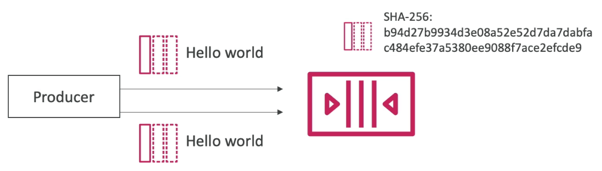

## SQS FIFO 큐 메시지 그룹화

- 메시지그룹 ID에 동일한 것을 할당할 경우, 메시지 그룹 ID를 명시한 처리에서는 반드시 엄격한 순서로 하나씩 처리됨. 다른 메시지 그룹에 속하는 메시지는 또한 순서대로 처리됨
- 각각의 메시지 그룹ID를 다른 소비자가 처리하게 함으로써 병렬처리를 구현할 수 있다
- 다른 그룹간의 순서는 보증되지 않는다
  - 즉 B1보다 A1을 먼저 보냈다고 해서 B1이 항상 A1보다 빠르게 처리된다고 보장하지 않음 (그룹이 다르기 때문에)

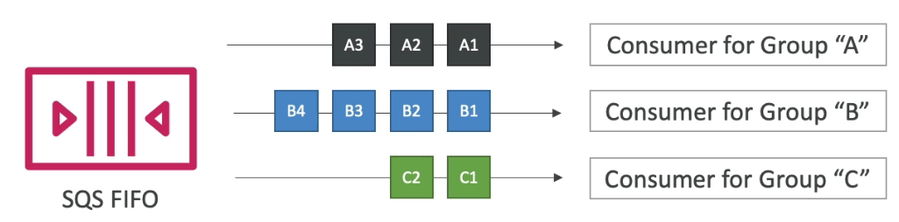
