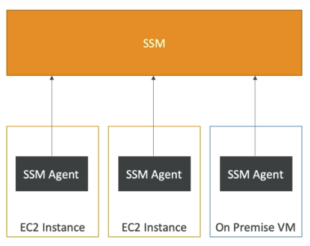

# AWS Systems Manager

- EC2와 온프레미스 시스템을 관리하는 서비스
- 인프라의 현재 상태를 살펴보는데 있어서 인사이트를 제공해줌
- 문제를 파악하기 쉽게해줌ss
- 강화된 컴플라이언스를 위해 패치를 자동화
- 윈도우즈와 리눅스OS 둘 다 작동
- 클라우드워치 지표와 대시보드에 통합됨
- AWS 컨픽과 통합됨
- 무료 서비스

## Systems Manager 기능

- 리소스 그룹
- 인사이트
  - 대시보드 인사이트
  - 인벤토리
    - 감사와 소프트웨어 인스톨 현황
- 패리미터 스토어
- 액션
  - 오토메이션 (EC2 종료, AMI 작성)
  - Run Command
  - 세션 관리자
  - 패치 관리자
  - 유지보수 윈도우 (시간)
  - 스테이트 매니저
    - OS와 어플리케이션의 유지보수와 설정 관리 정의

## Systems Manager의 작동방식

- SSM에이전트를 시스템에 설치해야 할 필요가 있음
- Amazon Linux AMI와 Ubuntu에 기본적으로 설치되어 있음
- SSM에서 인스턴스를 컨트롤 불가능하다면 SSM에이전트에 무언가 문제가 있을 가능성이 있음
- EC2 인스턴스에 적절한 IAM 역할이 부여되어 있어야 함
  
