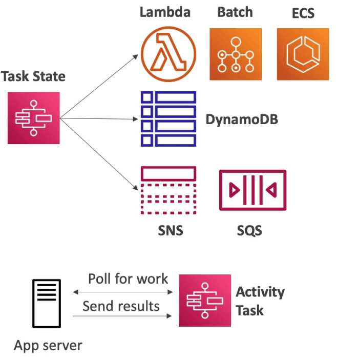

# Step Function

- 스텝펑션은 하나의 상태 머신으로 워크플로우를 수행한다
  - 풀필먼트 주문, 데이터 처리
  - 웹 어플리케이션, 하지만 어떤 워크플로우도 가능
- JSON으로 작성
- 워크플로우를 비주얼하게 볼 수 있고, 실행도 가능하며, 이력도 남긴다
- SDK API 요청으로 워크플로우를 수행할수도 있고, API 게이트웨이나 이벤트 브릿지, 콘솔상에서 실행 가능하다

## Task State

- 상태 머신에서 작업을 수행
- AWS 서비스를 호출
  - 람다 함수를 호출 가능
  - AWS Batch 작업을 수행 가능
  - ECS 작업이나 완료시까지 대기도 가능
  - DynamoDB에 데이터를 삽입
  - SNS나 SQS에 메시지를 발행
  - 다른 Step function을 부르거나 다른 워크플로우를 수행
- Activity Task
  - EC2, ECS, 온프레미스
  - 액티비티는 스텝펑션에서 작업을 폴링한다
  - 수행된 이후 결과를 스텝펑션에 반환
    

## 스텝펑션의 상태

- Choice State : 조건을 검사하고 브랜치로 보냄 (혹은 기본 브랜치로)
- Fail or Succeed State : 수행을 종료하고 상태를 반환 (fail or succeed)
- Pass State : 인풋과 아웃풋에 관계없이 스킵 또는 정해진 데이터를 작업없이 주입한다
- Wait State : 딜레이를 제공하여 어떠한 시간이나 날짜까지 기다린다
- Map State : 각 단계를 증감치에 의해 동적으로 변화시킨다
- **Parallel State : 브랜치를 동시에 수행한다**

## 비주얼 스텝펑션

- 상태도를 이용하면 어디서 성공하고 실패했는지 명확하게 알 수 있다

## 스텝펑션 에러 핸들링

- 스텝펑선의 장점은 비주얼하게 보이는 전체도와 에러를 컨트롤하는 능력
- 어떤 상태에서도 다양한 이유에 의해 런타임 에러에 직면할 수 있다
  - 상태 머신 정의 문제 (예를들어 Choice State에서 맞는 룰이 없다거나)
  - 작업 실패 (람다 함수에서의 예외 발생)
  - 과도발생 문제 (네트워크 파티션 이벤트 등)
- 이때, 재시도 (실패한 상태를 다시 실행)와 캐치(실패경로로 이동)이 일반적으로 상태머신에서의 에러 처리 방식이며, 어플리케이션의 코드로 처리하는 방식과는 다르다
- 에러를 미리 정의하는 방법
  - State.ALL : 모든 에러 이름에 매칭됨
  - States.Timeout : 작업이 더 이상 작동하지 못하는 상태 (TimeoutSeconds 이상 실행)거나 리스폰스를 받을 수 없는 경우
  - States.TaskFailed : 람다 함수의 에러 등 작업 자체가 실패한 경우
  - States.Permissions : 코드를 실행하는데 권한이 부족한 경우
- 상태는 고유한 에러 메시지를 보고할 수 있다 → 별도로 캐치업을 해줘야 할지도

## 스텝펑션 - 재시도

- 상태는 위에서 아래로 가면서 평가된다
- ErrorEquals: 해당 에러가 발생했을때 캐치된다
- IntervalSeconds: 재시도 하기 전 딜레이
- BackoffRate: 각각의 재시도 전에 재시도가 발생했을 경우 해당 딜레이에 곱하는 시간
- MaxAttemps: 기본은 3이지만 0으로 설정할 경우 재시도 하지 않는다
- 최대 재시도 횟수에 도달할 경우 그 이후의 실패는 자동으로 캐치가 된다 → 실패했을 때의 루트로 진행

## 스텝펑션 - 캐치의 흐름

- 상태는 위에서 아래로 평가된다
- ErrorEquals: 해당 에러가 발생했을때 캐치된다
- Next: 다음 상태명
- ResultPath: 전 단계에서 어떤 인풋이 들어왔느냐에 따라 정해지는 다음 경로

## 스텝펑션 - 결과경로

- 결과경로는 다음 스텝으로 넘어갔을때 사용되는 인풋변수로서 작동한다

## AWS AppSync

- 앱싱크는 GraphQL의 관리형 서비스이다
- GraphQL은 어플리케이션에서 정확하게 원하는 데이터만 추출해낼 수 있는 기술
- 하나 혹은 복수의 리소스로부터 데이터를 조합할 수 있다
  - NoSQL데이터, RDB데이터, HTTP API등
  - DynamoDB, Aurora, Elasticsearch 등등
  - 람다에 의한 커스텀 리소스도 가능
- 얻어온 데이터는 실시간 웹소켓 MQTT on 웹소켓 등에서 활용 가능
- 모바일 앱을 위한 기능으로 오프라인 데이터 동기화 등 지원 → 코그니토 싱크의 대체
- GraphQL 스키마를 업로드하면 시작할 수 있다

## 앱싱크 보안

- 4개의 보안 인증을 구현할수 있는 방식이 있음
  - API_KEY
  - AWS_IAM : IAM Users / Roles / Cross-account Access
  - OPENID_CONNECT : 오픈아이디 커넥트 프로바이더 / JWT
  - AMAZON_COGNITO_USER_POOLS
- 커스텀 도메인 & HTTPS 클라우드프론트를 앱싱크 앞에 둘 수도 있음
