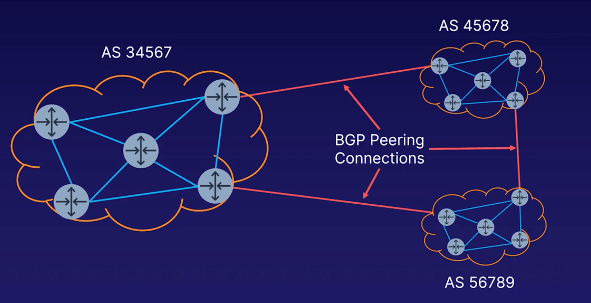

# Virtual Private Gateway

- AWS 관리형 서비스로서 AWS가 관리하는 라우터의 집합
- AWS에서 관리하지 않는 온프레미스와 VPC사이의 라우터로 작동함
- 복수의 외부 접속에 연결할수는 있으나, 한번에 하나의 VPC에만 붙일 수 있다.
- 한번 VPG를 만들고 나면, 설정을 변경할 수 없다.

## VGW로 뭘 할수 있을까?

- Site to Site VPN
- Direct Connect

## ASN이란?

- 네트워크의 전체도를 정의하는 하나의 관리번호로 이해
- 퍼블릭 ASN의 경우 IANA라는 특별 관리기구에서 번호를 정의해서 관리하고 있으며, 도메인 관리와 비슷하다고 생각하면 됨
- 구성요소
  - 16-bit and 32-bit
  - 0-65535
  - 65535-4,294,967,295
- 퍼블릭 혹은 프라이빗 ASNs
  - 퍼블릭 ASN은 IANA에 의해 관리된다.
  - 16-bit 프라이빗 주소 범위: 64512-65534
  - 32-bit 프라이빗 주소 범위: 4200000000+
- VGW 설정에서는 프라이빗 ASN만을 사용한다.
  - AWS는 기본적으로 64512를 모든 리전에서 사용한다.
  - 7224가 2018년 6월 30일경에 대부분의 리전에서 사용되었었다.
