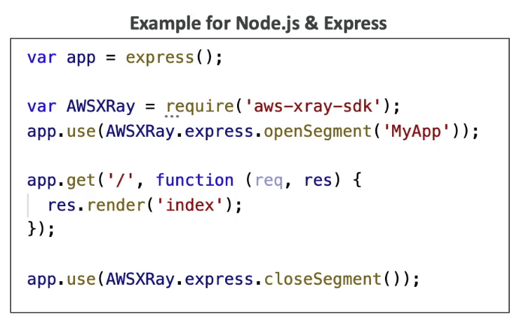
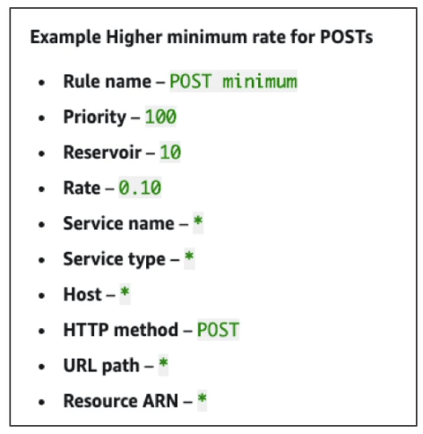
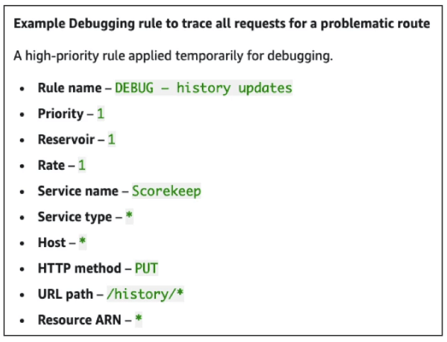

# AWS X-Ray

- 프로덕션 환경에서의 디버깅으로 유용한것은
  - 로컬 테스트
  - 로깅 문구를 각 스텝별로 달아두기
  - 프로덕션환경을 다시 배포하기 등등
- 클라우드워치를 사용하면서 로그 포맷의 다양함은 분석에 애를 먹게 한다
- 디버깅은 모놀리식 서비스에서는 그나마 낫지만, 분산 환경에서는 어렵다
- 전체 아키텍쳐를 한눈에 볼수 있는 일반적인 솔루션이 없다

## X-Ray에서 보이는 비주얼 분석의 유용함

- 엑스레이는 각 서비스들을 시각화된 방식으로 투영할 수 있다
- 퍼포먼스를 개선할 수 있다 (보틀넥 감지)
- 마이크로서비스 아키텍쳐에서의 종속성을 이해 할 수 있음
- 핀포인트로 서비스 이슈를 캐치업 가능
- 현재 요청을 리뷰 가능
- 에러와 예외를 발견
- SLA의 준수 여부
- 어디에서 쓰로틀이 발생중인지 확인
- 유저들이 실제로 겪고 있는 영향치에 대한 식별

## 어떤 서비스들이 X-Ray를 지원하는가

- 람다
- 빈스토크
- ECS
- ELB
- API GateWay
- EC2 인스턴스 혹은 어떤 어플리케이션 서버라도 (온프레미스 포함)

## AWS X-Ray를 활용하면

- 트레이싱이란 요청을 따라가는 기술이다
- 각각의 요청을 처리하는 컴포넌트들은 고유한 트레이스(족적)을 남기게 된다
- 트레이싱은 세그먼트를 만든다 (또 그 하위 세그먼트)
- 에노테이션이 추가될수 있으며 이는 추가정보를 제공한다
- 트레이스의 기능
  - 모든 요청
  - 샘플 요청 (분당 비율 혹은 %)
- X-Ray의 보안
  - IAM 인증
  - 저장된 데이터에 대한 KMS 암호화

## X-Ray를 활성화 하는 방법

- 코드에 AWS X-Ray SDK를 심기
  - 최소한의 코드 수정
  - SDK는 다음과 같은 정보를 수집
    - AWS 서비스 요청
    - HTTPS HTTP 요청
    - 데이터베이스 요청 (MySQL, PostgreSQL, DynamoDB)
    - 큐 요청 (SQS)
- X-Ray데몬을 설치 혹은 X-Ray AWS 통합을 활성화
  - X-Ray 데몬은 저계층의 UDP 인터셉터로 동작 (Linux Windows Mac...)
  - AWS 람다 혹은 다른 AWS 서비스는 이미 X-Ray 데몬을 돌리고 있음
  - 각각의 어플리케이션은 올바른 IAM 권한이 활성화 되어 있어야 함 (X-Ray 전용 권한)

## X-Ray 문제해결

- x-ray가 동작하지 않을때 (EC2)
  - EC2 IAM 역할에 권한부여가 제대로 되어 있는지
  - EC2 인스턴스에 X-Ray 데몬이 설치되어 있는지
- 람다에서 활성화 방법
  - IAM 실행 권한이 붙어있어야 함 (AWSX-RayWriteOnlyAccess)
  - X-Ray SDK 코드가 포함되어 있는지

## 코드에 X-Ray를 삽입해서 계측

- 계측은 프로덕트의 퍼포먼스를 측정하고, 에러를 분석하고 족적정보를 남긴다
- 어플리케이션을 계측하기 위해서는 X-Ray SDK를 이용하여 코드를 심어두어야 한다.

- 코드상에서 설정을 통해 X-Ray의 수집방식등 변경이 가능하다.

## X-Ray Concepts (개념)

- Segments: 어플리케이션 로직을 실행하는 리소스에서 보내는 정보로서 HTTP 요청이 어플리케이션에 도달하면 다음의 데이터들을 기록 (호스트, 응답, 완료된 작업, 발생하는 문제 등)
- Subsegment: 세그먼트에 대한 좀 더 자세한 정보를 확인하고 싶을때
- Trace: 트레이스의 종단간에 데이터들을 모은 세그먼트들의 집합
- Sampling: xray상의 모든 리퀘스트가 아닌, 일정 비율에 따라 집계되는 양을 줄여서 비용을 절감하는 방법
- Annotations: 키 밸류 페어로 이루어진 인덱스된 트레이스들로서 필터링에 사용됨
- Metadata: 키 밸류 페어로 이루어진 인덱스 되지 않은 데이터 집합으로 검색에 사용되지 않는 것들
- Xray데몬과 에이전트에서 수집된 에티러를 다른 계정으로 보내도록 설정할때 주의점
  - IAM 권한을 정확하게 설정할것. agent에 asumerole을 설정할것
  - 이렇게 설정하면 중앙집중식 계정을 두고 그곳에 모든 트레이싱을 집계할 수 있게 된다

## X-Ray Sampling Rules

- 샘플링 룰을 설정해서 얼만큼의 데이터를 분석할지 정할 수 있음
- 코드를 변경해서 샘플링 룰을 설정할 수 있다.
- 기본적으로 X-Ray SDK에서는 레코드를 초당 첫번째 요청에 대해서 보내며, 추가적인 요청의 경우 5%룰을 가지고 있음
- 초당 첫번째라는것은, 최소한 초당 1개의 요청은 받는다는 것
- 5퍼센트라는것은 추가적인 요청에 대한 해석 비율을 말함
- 이는 reservoir와 rate로 설정이 가능한데
  - Reservoir가 10일 경우 초당 10개의 요청은 반드시 해석
  - rate가 1일 경우 전부 해석 0.05이면 5%만 해석
    
    

## X-Ray Write APIs (엑스레이 데몬에서 사용)

- PutTraceSegments: 엑스레이로 세그먼트 데이터를 업로드 가능
- PutTelemetryRecords: 엑스레이 데몬이 세그먼트 정보들을 관리하고 업로드 하는데 필요함 (얼마나 많은 세그먼트를 받았는지, 에러가 났는지, 거부됐는지 등등)
- GetSamplingRules: 엑스레이 데몬이 샘플링 룰을 읽어들이는데 필요 그때 검증용으로 활용
- GetSamplingTargets: 상기와 비슷하게 타겟을 식별하는 인증
- GetSamplingStatisticsSummaries

## X-Ray Read APIs (데몬에서)

- GetServiceGraph: 메인 그래프
- BatchGetTraces: 아이디로 특정되는 트레이스들의 리스트를 받아오기 위함. 각각의 트레이스는 세그먼트 도큐멘트의 집합이며 하나의 요청으로부터 작성된것이다
- GetTraceSummaries: 타임프레임에서 특정 필터와 어노테이션을 받아오기 위해 필요. full trace를 받아오기 위해서는 BatchGetTrace에 ID를 통과시켜야 함
- GetTraceGraph: 하나이상의 서비스 그래프를 받아올때 필요
