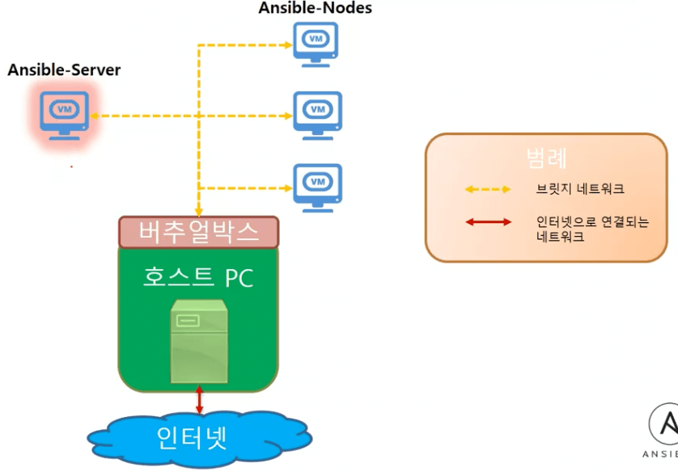

# 처음부터 설치하며 배우는 앤서블 (Ansible)

## 데브옵스란?

- 기존 방식 (데브옵스 적용 전)
  - Code
  - Build
  - Test
  - Release
  - Operate
  - 사용자에게 프로덕트가 전달되기까지 개발 및 운영팀 내부에서 오랜 기간 코드가 체류함
- 데브옵스 방식
  
  - 배포에 필요한 모든 중간과정에 있는 오퍼레이션에 도움을 주는 다양한 자동화 툴이 존재
  - git jira
  - gradle
  - JUnit
  - Jenkins
  - **Ansible ← 공부 대상**
  - Nagios

## 앤서블

- 앤서블의 설치 및 구성
- 앤서블의 구성요소
- 앤서블을 통해 대규모 배포 실습

## 앤서블과 다른 툴과의 차이점 (why ansible?)

- puppet, chef, salt

|                            | Puppet              | Chef                           | Salt                         | Ansible      |
| -------------------------- | ------------------- | ------------------------------ | ---------------------------- | ------------ |
| 개발사                     | Puppet Labs         | Opscode                        | SaltStack                    | AnsibleWorks |
| 등장                       | 2005. 08            | 2009. 01                       | 2011. 03                     | 2012. 03     |
| 개발언어                   | Ruby                | Ruby (client), Erlang (server) | Python                       | Python       |
| 도입고객                   | Google, Ebay        | Facebook, Ancetry.com          | Linkedin, HP                 | Evernote, …  |
| 정보량                     | ◎                   | ◎                              | △                            | ○            |
| 사용률                     | ◎                   | ◎                              | △                            | ◎            |
| 코드 베이스                | ◎                   | ◎                              | △                            | ○            |
| Web UI                     | ◎                   | ◎                              | ○                            | ○            |
| 정의파일                   | 독자DSL (내장 Ruby) | 독자DSL (Ruby베이스)           | YAML 독자DSL (Python 베이스) | YAML         |
| Agent 설치                 | 필요                | 필요                           | 필요 or 불필요 (선택)        | 불필요       |
| 간편도 (학습, 운용 코스트) | △                   | △                              | △                            | ◎            |

- Ansible의 가장 특징적인 면을 꼽으면 Agent 설치가 불필요하다는 점으로서, 관리받고자 하는 대상에 어떠한 소프트웨어의 설치도 필요 없음을 의미하며 기술적인 복잡도를 내리는데 큰 역할을 함
- 개발 언어가 Python인것 또한 Python 커뮤니티로부터 다양한 정보를 얻을 수 있다는 점이 입문 장벽을 허무는데 좋은 촉진제 역할을 한 것으로 보임
- 정의파일 설정시 YAML을 사용하는데 JSON과 같이 데이터 정의 언어로서 독자적인 DSL을 사용하는 다른 툴보다 더 편리하다는 점을 체감할 수 있음

## 앤서블 실습 환경 구축

## 지원 운영체제들

- 기본적으로는 유닉스 기반의 운영체제
  - MacOS
  - Linux 배포판
  - FreeBSD
