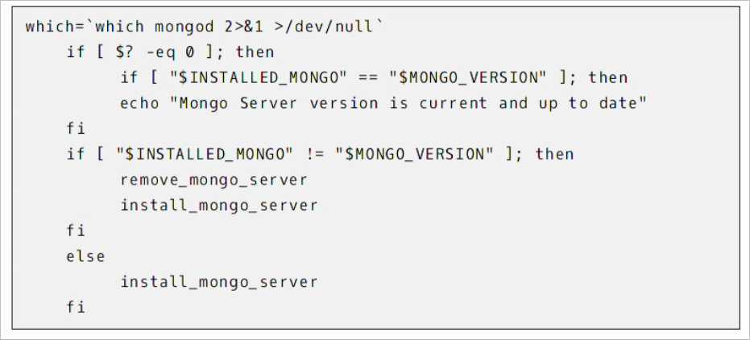
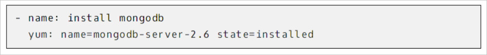

# 앤서블 소개

## 개요

### 앤서블 공식 문서

[Ansible Documentation — Ansible Documentation](https://docs.ansible.com/ansible/latest/)

## 서버 형상 관리는 무엇인가

### 형상 관리 (Configuration Management)

- 서버 운영체제 상에 필요한 소프트웨어를 설치하고 원하는 설정으로 관리하는 것
- Configuration as Code 라고도 불림
- 대표적인 형상 관리 도구로 Ansible, Puppet, Chef, Salt Stack 등이 있음

### Ansible

- 파이썬으로 개발되었고, 에이전트 없이 구동 가능
- 관리 노드에 앤서블을 설치하면 에이전트 없이 관리 대상 노드를 설정 가능
- SSH를 통해서 원격으로 접속해서 관리하는 구조이기 때문임

## 앤서블의 유즈케이스

- ⭐️Configuration Management
- ⭐️Security Compliance
- Provisioning
- Application Deployment
- Continuous Delivery

## 왜 앤서블을 사용해야 할까?

- Shell Script

  

    - 여러번 실행하더라도 동일한 결과(멱등성)을 내기 위해 여러가지 조건문을 이용해서 코드를 짜기
- Ansible

  

    - 간단한 YAML 문법을 사용
    - 대부분의 모듈이 멱등성을 보장하여 여러번 실행해도 같은 결과
    - ssh / win_rm 기반으로 통신 → 대상 서버에 에이전트 설치가 필요하지 않음
    - 여러 서버를 대상으로 동시 실행
    - 특정 서버들을 타겟팅할 수 있음
    - 버전관리하기에 용이함 → GitOps 수행 가능
