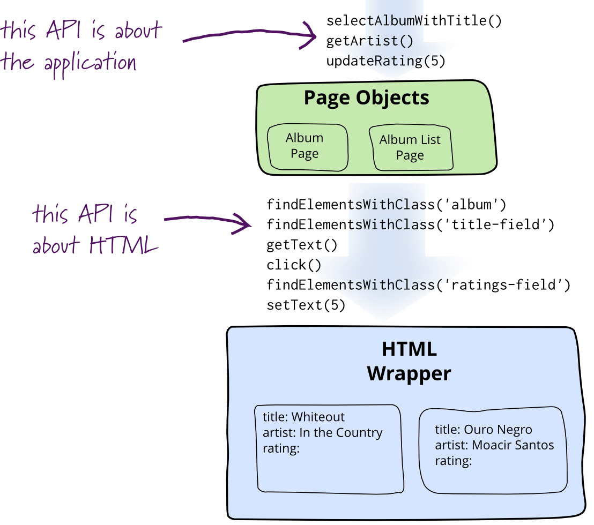

# Page Object Model

## 마틴 파울러의 POM

[bliki: PageObject](https://martinfowler.com/bliki/PageObject.html)

### 왜 페이지 오브젝트 모델을 사용하는가?

- 웹 페이지를 테스트하기 위해서는 클릭과 표시되는 내용들을 결정하려면 웹 페이지 내의 요소 참조가 필요
- HTML 요소를 직접 조작하는 방식을 채택하면 UI가 변경될 경우 무용지물이 되어버림
- 페이지 오브젝트는 프로그램별 API로 HTML 페이지를 추상화하여 HTML을 직접 탐색할 필요가 없게 함



## 페이지 오브젝트에 대한 원칙

### 테스트 클라이언트 소프트웨어에게 권한제공

- 테스트 클라이언트에게 인간이 할 수 있는 모든 작업을 할 수 있으며, 볼 수 있게 해야함
- 화면안에 있는 위젯을 숨길수 있도록 프로그래밍 하기 쉬운 인터페이스를 제공해야 함

> 예를 들면 텍스트 필드에는 문자열을 받아 반환하는 메서드가 있어야 하고, 확인 란에는 부울을 사용할수 있어야 하며, 버튼은 작업 지향적인 메서드명으로 설정되어야 함

### 페이지 오브젝트의 특성

- PO는 GUI 컨트롤 그 자체에서 데이터를 찾고 조작하는데 필요한 메카니즘을 캡슐화해야 함
- PO를 변경하지 않고도 그 안에 있는 데이터를 조작할 수 있어야 함
  ```java
  const po = new PageObject();
  po.setTextToIdInput("id"); // 아이디를 입력
  po.setTextToPasswordInput("password"); // 비밀번호를 입력
  po.clickLogin(); // 로그인 버튼을 클릭
  ```
- “페이지 오브젝트"라는 용어를 사용하지만 객체는 각 페이지마다 하나씩 만들어야 하는 것이 아님
  - 그것이 아니라 페이지의 “중요한 요소"에 의해 만들어져야 함
  - 예를 들면 앨범을 표시하는 페이지에는 여러 앨범PO를 표시하는 앨범 리스트 PO가 있을수 있음
  - 복잡한 UI의 계층을 그대로 상속하는것이 아니라, 사용자가 이해할 수 있도록 모델링하는것이 중요함
