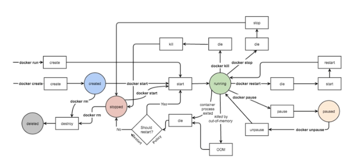

# Docker Container Lifecycle

## 컨테이너 라이프사이클


- Docker가 실행상태로 갈 수 있는 방법
  - Docker Run 명령
  - 작성된 컨테이너를 Start
- 컨테이너를 중지한다고 삭제되는건 아니며, 중지된 컨테이너는 start 명령어로 다시 실행 가능

### 실제 Docker 라이프 사이클



## 컨테이너 시작

- 도커 create / run 명령어 모두 이미지가 없을 경우 자동으로 pull을 먼저 수행하여 이미지를 다운로드 받음

```bash
$ docker create [image] # 컨테이너 생성
$ docker run [image] # 컨테이너 생성 및 시작 (일반적으로 가장 많이 활용됨)
$ docker start [container] # 중지된 컨테이너 시작
```

### 컨테이너 시작 주요 옵션

```bash
$ docker run \
 -i \        # 호스트의 표준 입력을 컨테이너와 연결 (interactive)
 -t \        # TTY 할당 (셸을 실행할때 주로 사용됨 -it)
 --rm \      # 컨테이너 실행 종료 후 자동 삭제
 -d \        # 백그라운드 모드로 실행 (detached) 디폴트는 포어그라운드
 --name hello-world \    # 컨테이너 이름 지정 이름을 지정하지 않으면 랜덤한 이름이 부여됨
 -p 80:80 \    # 호스트:컨테이너 간 포트 바인딩
 -v /opt/example:/example \    # 호스트:컨테이너 간 볼륨 바인딩
 repo/hello-world:latest \    # 실행할 이미지
 my-command    # 컨테이너 내에서 실행할 명령 (이미지 명령 대신에 이것을 수행)
```

### 컨테이너 상태 확인

```bash
$ docker ps    # 실행중인 컨테이너 상태 확인
$ docker ps -a    # 전체 컨테이너 상태 확인
$ docker inspect [container]    # 컨테이너 상세 정보 확인
```

### 컨테이너 일시중지 및 재개

```bash
$ docker pause
$ docker unpause
```

### 컨테이너 종료

```bash
$ docker stop [container]    # 컨테이너 종료 (SIGTERM 시그널 전달)
$ docker kill [container]    # 컨테이너 종료 (SIGKILL 시그널 전달)
$ docker stop $(docker ps -a -q)    # 모든 컨테이너 종료
```

### 컨테이너 삭제

```bash
$ docker rm [container]    # 컨테이너 삭제 (실행중인 컨테이너 불가)
$ docker rm -f [container]    # 컨테이너 강제 종료 후 삭제 (SIGKILL 시그널 전달)
$ docker run --rm ...    # 컨테이너 실행 종료 후 자동 삭제
$ docker container prune    # 중지된 모든 컨테이너 삭제
```
