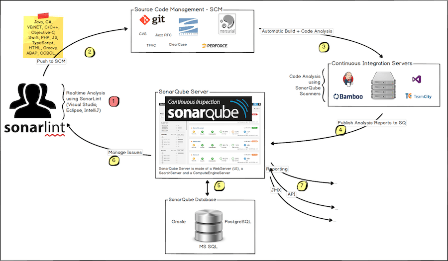

# Docker 개발 관리

## Docker 개발에 유용한 도구들

- `Nexus`를 활용한 `Artifact` 관리
- 코드 빌드시 `Artifact` 적용 방법
- `Sonarqube`를 활용한 코드 품질 관리
- 코드 빌드시 `Sonarqube` 적용 및 스캔 방법
- `Clair`를 `AWS ECR`을 활용한 컨테이너 보안 스캔 수행
- `Docker` 컨테이너 보안 스캔 이후 취약점 조치 방법

### Nexus Artifact Repository

- 넥서스 리포지토리란 그레이들과 같은 패키지 매니저에서 활용할 수 있는 아티팩트 저장소
- 넥서스 리포지토리의 장점으로는 넥서스 프라이빗 리포지토리를 활용하여 디펜던시 아티팩트들을 캐싱할 수 있어서 빠르게 당겨 올 수 있다는 점
- 개발팀에서 사용하는 공통 디펜던시를 하나의 묶음으로 만들어서 공통 라이브러리 처럼 활용할 수 있음
- 내부 환경이나 보안 컴플라이언스 등으로 외부 환경에 접근하기 어려운 경우, 프록시 역할을 해 빠르게 아티팩트나 도커 이미지를 받아오거나 특정 라이브러리에 의존하는 서드파티 아티팩트들을 관리할 수 있다는것이 장점임

### Sonarqube

- 지속적 코드 품질 향상 도구로서 수천개의 자동화된 정적 코드 품질 테스트를 기반으로 개발자가 찾기 어려운 버그나 문제점들을 찾아냄
- 다양한 개발 언어를 지원하고 CICD 도구와 통합 가능
- 개발자 통합 개발환경에서 코드를 작성 Sonarlint를 활용해서 로컬분석을 진행
- 젠킨스와 같은 툴에서 자동 빌드가 진행되면 소나 스캐너를 이용해 스캔을 진행
- 분석된 레포트는 소나큐브에 전송되어 처리됨
- 소나큐브는 분석 레포트를 개발자에게 URL을 이용해서 전달함
